# 02 — Architecture

**Project:** SyntaxLab
**Status:** Draft for human review
**Last updated:** 2026-08-17

---

> **Scope note (Phase 1.5).** This document describes the full architecture. **V1.0 implements Regex + JSON**; the cron domain is **V1.1** and is marked as such wherever it appears. Share URLs are **deferred to V1.1+** and their design is retained as a specification, not a V1 deliverable. See `01_PRD.md` §3.

## 1. Architectural summary

SyntaxLab is a **static, client-only, offline-capable single-page application**. There is no backend, no API, and no database server. User content is processed in the browser and is not transmitted by the application.

The architecture is a four-layer clean-architecture arrangement with dependencies pointing strictly inward-to-downward, plus one hard isolation boundary: expensive and untrusted computation runs in Web Workers, never on the main thread.

```
Presentation (React)  ──▶ Application (use-cases) ──▶ Domain (pure TS)
                                    │
                                    └──────────────▶ Infrastructure (browser APIs)
```

The single non-obvious structural decision is that **the domain layer executes inside workers, not on the main thread**. The application layer therefore talks to the domain through an async, message-passing façade rather than direct function calls. Everything else follows from that.

---

## 2. System context

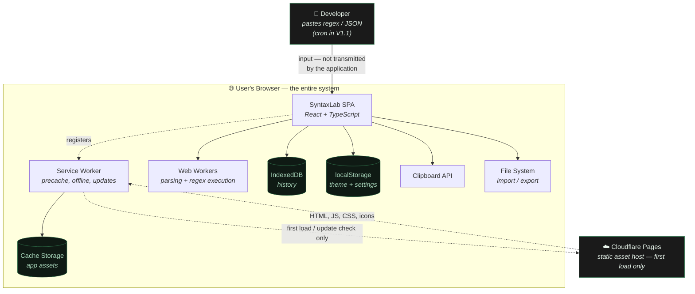

**Read this diagram for what it does *not* show:** there is no application server, no analytics endpoint, no font CDN, no error-reporting service, and no AI API. The only external party is the static host, and it is contacted only to fetch the app itself.

### External dependencies at runtime

| Party | When contacted | What is sent | Mitigation if unavailable |
|---|---|---|---|
| Cloudflare Pages | First load; subsequent SW update checks | Standard HTTP request metadata only. **The application sends no user content.** | App runs from cache indefinitely |
| Nothing else | — | — | — |

**Note on the update check.** Contacting the host to check for a new version is the *only* network activity after first load, and it is explicitly **not part of the offline guarantee** — it fails silently when offline and the app continues to work. See `07_PWA_OFFLINE.md` §1.

---

## 3. High-level architecture

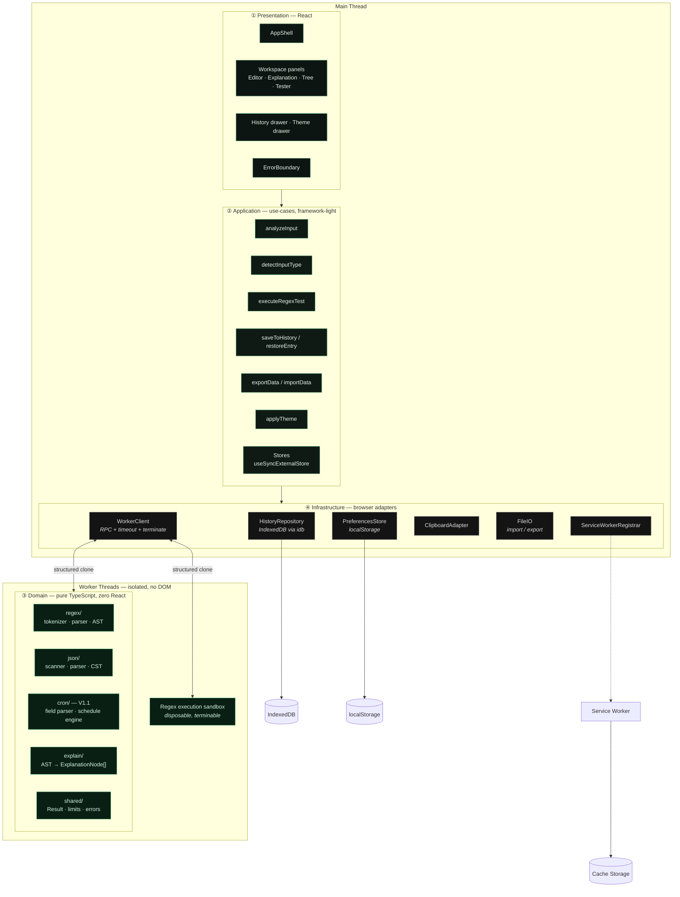

> **Diagram status.** This is the **target** architecture for V1.0. As of M5
> every layer in the diagram exists and is connected end to end: the regex
> feature drives both workers through the application layer, and no arrow in
> the diagram is hypothetical any more. The JSON domain and its
> `analysis.json` operation exist; the JSON *feature* is M6. Still to come:
> `features/json/` (M6), `cron/` (V1.1), and the storage adapters (M7). Nothing in the diagram has been
> invalidated by implementation; see §9.1 for what physically exists today.

### Layer contract

| Layer | May import from | May **not** import from | Enforced by |
|---|---|---|---|
| ① Presentation | Application, shared types | Domain internals, Infrastructure directly | `eslint-plugin-boundaries` |
| ② Application | Domain types, Infrastructure interfaces | React, DOM | lint rule banning `react` in `src/application/**` |
| ③ Domain | Its own `shared/` only | Everything else. No React, no DOM, no `window`, no browser globals | lint + the fact that it must run in a worker and under Node in tests |
| ④ Infrastructure | Domain types, browser APIs | Presentation, Application | lint |

**Why the domain is DOM-free is not stylistic.** It must run in a `Worker` scope (no `document`, no `window`) and under Node during unit tests. Any accidental DOM reference is caught the first time a test runs, which is the cheapest possible enforcement.

---

## 4. The worker boundary — the central design decision

### 4.1 The problem

Two of the three domains can be weaponised by a user's own input:

1. **Regex execution** — a catastrophically backtracking pattern (`(a+)+$`) against a modest string can occupy a CPU core for minutes. **JavaScript regex execution cannot be interrupted.** There is no timeout parameter, no step limit, no abort signal. Once `RegExp.prototype.exec` starts, the only way to stop it is to destroy the thread running it.
2. **Large-document parsing** — a 10 MB JSON document takes long enough to parse and build a tree that a main-thread parse would drop frames.

### 4.2 The solution

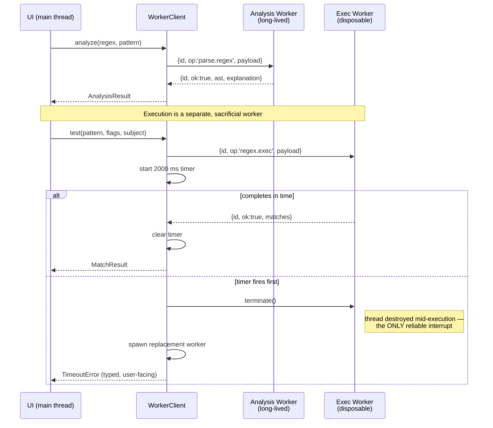

### 4.3 Worker architecture

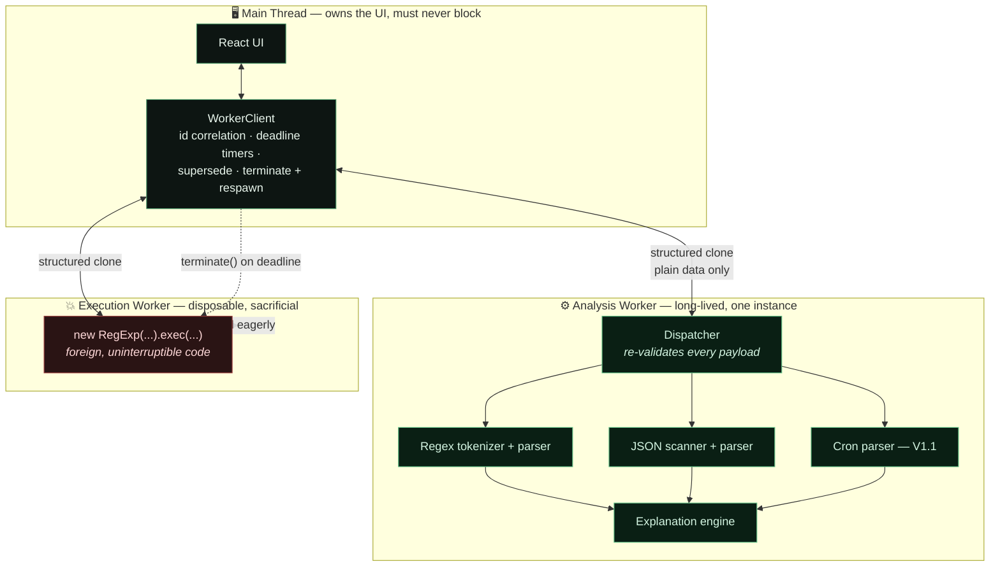

**Invariant (security and performance).** A regex execution timeout must never destroy unrelated parser state. This is why the two workers are separate rather than one, and it is a hard architectural rule, not a convenience: terminating a combined worker would discard warm module state and any in-flight unrelated parse, turning a contained ReDoS event into a broader failure.

> ✅ **Implemented and verified at M2.** The invariant is asserted directly: an
> execution worker is pinned by a busy loop, timed out, terminated, and
> respawned, after which the analysis worker still reports `ready` and serves a
> request correctly. Verified on **Chromium, Firefox, and WebKit**
> (`tests/e2e/workers.spec.ts`).

**Corollary:** regex execution never runs on the main thread. If workers are unavailable, the tester is disabled rather than relocated (§4.4).

### 4.3.1 Request lifecycle — the four paths

Four diagrams rather than one, because these are four different questions and
a combined diagram answers none of them clearly.

**① Normal request.** The common case: correlate by id, settle, clear the timer.

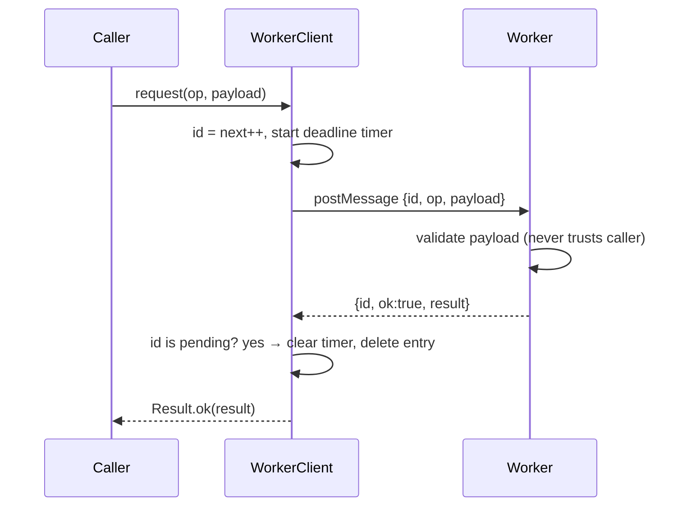

**② Supersession.** A newer request for the same key retires the older one, so
a slow earlier response can never overwrite a newer result.

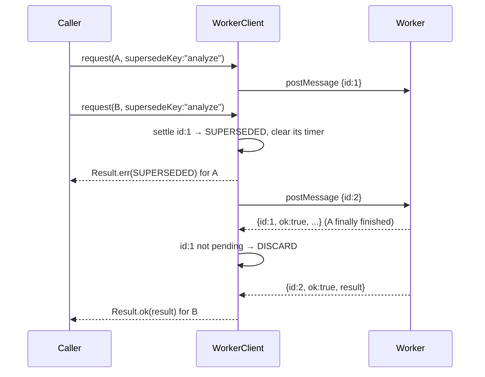

**③ Timeout, termination, respawn.** The disposable policy. The worker cannot
be asked to stop, so the thread is destroyed.

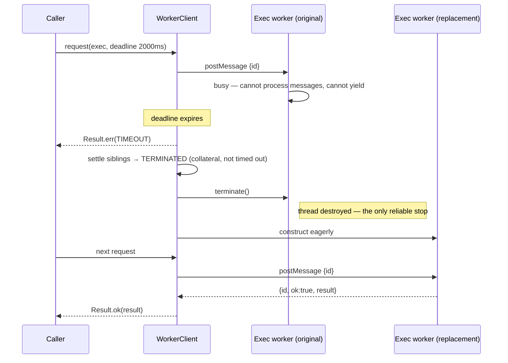

**④ Stale and malformed responses.** Neither can reach application state.

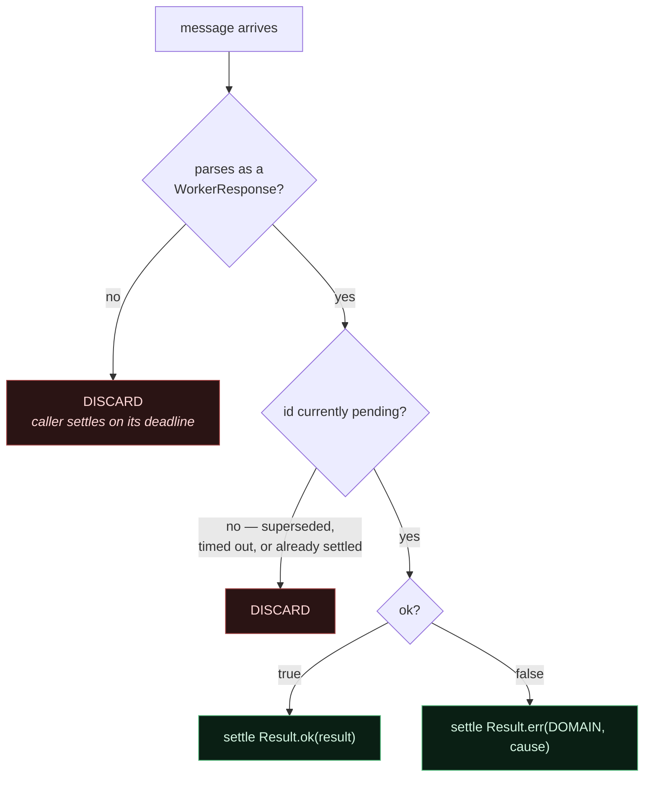

### 4.4 Two workers, not one — and why

| Worker | Lifetime | Purpose | Rationale |
|---|---|---|---|
| **Analysis worker** | Long-lived, one instance | Tokenise/parse regex, parse JSON→CST, parse cron, compute schedules, generate explanations | All of this is *our* code, provably terminating, bounded by input limits. Killing and respawning it on every call would waste startup cost. |
| **Execution worker** | Disposable, replaced on timeout | Runs `RegExp.exec` against user test strings — the only place foreign, uninterruptible code runs | Must be destroyable without losing parser state or a warm module cache. Mixing it with the analysis worker would mean a ReDoS timeout also destroys unrelated parse state and forces a cold re-import. |

> **ponytail note:** the obvious lazy version is one worker. It does not survive the first ReDoS test, because terminating it also kills the parse cache and any in-flight unrelated request. Two is the minimum that is actually correct. We do not add a third or a pool — concurrency is one user typing, and a pool solves a problem we do not have.

### 4.5 Worker fallback

If `Worker` construction fails (blocked by an exotic CSP, an extension, or a hostile embedding context), the app degrades explicitly:

- Parsing falls back to the main thread **with a hard input-size limit of 64 KB** and a visible "reduced-safety mode" indicator.
- **Regex execution against test strings is disabled entirely.** We will not run uninterruptible foreign code on the thread that owns the user's UI. The tester panel shows an explanatory disabled state.

This is a deliberate trade: correctness of the safety guarantee over feature availability.

---

## 5. Data flow

### 5.1 Analysis flow

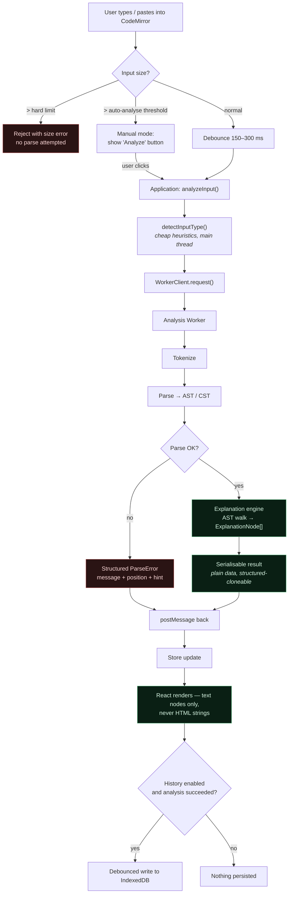

### 5.2 Trust-boundary crossings in this flow

Every arrow that crosses a boundary is a validation point. **V1.0 has five**, one fewer than the Phase 1 design, because deferring share URLs removes an entire untrusted input path:

| # | Boundary | Validation applied | Release |
|---|---|---|---|
| 1 | Editor → application | Size limits, type coercion, encoding normalisation | V1.0 |
| 2 | Main thread → worker | Payload shape validated on the worker side; workers never trust their caller | V1.0 |
| 3 | Worker → main thread | Response validated against expected shape and request `id`; unknown ops discarded | V1.0 |
| 4 | Browser storage → domain | Every record validated on read; failures quarantine the record rather than crash | V1.0 |
| 5 | Imported file → application | Type, size, schema, version, and prototype-pollution checks | V1.0 |
| 6 | ~~URL fragment → application~~ | Deferred with the share feature (ADR-008) | V1.1+ |

These are specified in detail in `14_THREAT_MODEL.md`.

---

## 6. State management overview

Full detail in `11_STATE_MANAGEMENT.md`. Architecturally:

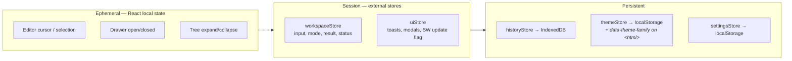

**No Redux, no Zustand, no Jotai, no TanStack Query.** There is no server state to cache, no time-travel requirement, and no cross-cutting async orchestration beyond a single worker RPC. React's `useSyncExternalStore` over a ~30-line store factory covers all of it. This is ADR-004.

---

## 7. Storage architecture

| Store | Contents | Size | Why this store |
|---|---|---|---|
| **IndexedDB** (`syntaxlab` db) | History entries | Up to a self-imposed 50 MB budget | Structured, indexable, async, large-capacity. The only correct choice for a searchable record list. |
| **localStorage** | Theme tokens, settings, schema version marker | < 8 KB | **Synchronous**, which is the point: theme must apply before first paint to avoid a flash. An async read cannot do that. |
| **Cache Storage** | App shell, JS, CSS, fonts, icons | ~1–2 MB | Service-worker-managed precache. |
| **sessionStorage** | Not used | — | No requirement. |
| **Cookies** | Not used | — | No server, so no cookies. Documented so nobody adds one. |

See `06_DATA_STORAGE.md` for schemas, indices, migrations, and quota behaviour.

---

## 8. PWA architecture

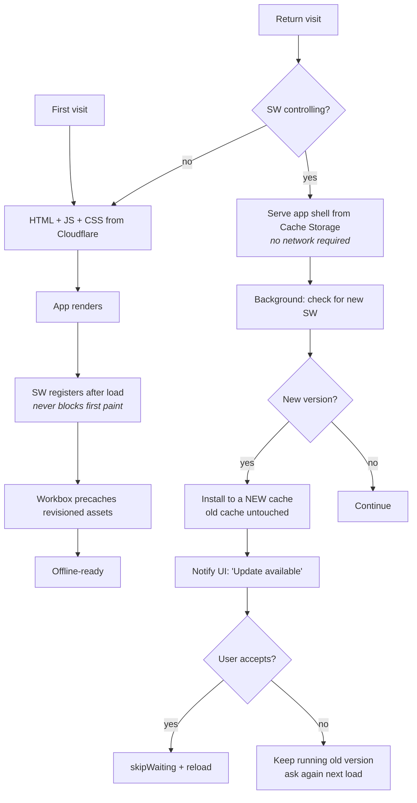

Key decisions: precache-only (there is nothing to runtime-cache), **no `skipWaiting` by default** (an unrequested reload mid-edit is data loss), and a new cache name per build so a failed update never corrupts the working version. Detail in `07_PWA_OFFLINE.md`.

---

## 9. Proposed codebase structure

```
syntaxlab/
├── docs/                          # This documentation package
├── public/
│   ├── icons/                     # PWA icons (generated, checked in)
│   ├── manifest.webmanifest
│   └── _headers                   # Cloudflare: CSP + security headers
├── src/
│   ├── main.tsx                   # Entry: theme bootstrap, render, SW register
│   ├── App.tsx
│   │
│   ├── app/                       # Shell, providers, error boundary, routing-free layout
│   │   ├── AppShell.tsx
│   │   ├── ErrorBoundary.tsx
│   │   ├── providers/
│   │   └── keyboard/              # Global shortcut registry
│   │
│   ├── features/                  # Vertical slices — UI + local wiring per feature
│   │   ├── regex/
│   │   ├── json/
│   │   ├── history/
│   │   ├── theme/
│   │   └── cron/                  # V1.1 — not created in V1.0
│   │
│   ├── components/                # Shared, feature-agnostic primitives
│   │   ├── Button.tsx  Drawer.tsx  Tabs.tsx  Toast.tsx
│   │   ├── CodeEditor.tsx         # Single CodeMirror wrapper for all modes
│   │   └── TreeView.tsx           # Shared by JSON tree and regex AST tree
│   │
│   ├── application/               # Use-cases + stores. No React, no DOM.
│   │   ├── usecases/
│   │   └── stores/
│   │
│   ├── domain/                    # Pure TypeScript. Runs in workers and in Node.
│   │   ├── regex/    { tokenizer.ts, parser.ts, ast.ts, explain.ts }
│   │   ├── json/     { scanner.ts, parser.ts, cst.ts, explain.ts, format.ts }
│   │   ├── cron/     { parser.ts, model.ts, schedule.ts, explain.ts }   # V1.1
│   │   ├── detect/   { detectType.ts }
│   │   └── shared/   { result.ts, limits.ts, errors.ts, explanation.ts }
│   │
│   ├── infrastructure/
│   │   ├── storage/  { db.ts, historyRepository.ts }
│   │   ├── workers/  { workerClient.ts, protocol.ts }
│   │   ├── pwa/      { registerSW.ts }
│   │   └── browser/  { clipboard.ts, fileIO.ts }
│   │
│   ├── workers/                   # Worker entry points only — thin dispatchers
│   │   ├── analysis.worker.ts
│   │   └── exec.worker.ts
│   │
│   └── styles/
│       ├── tokens.css             # The design-token source of truth
│       ├── reset.css
│       └── global.css
│
├── tests/
│   ├── unit/        integration/  e2e/  fixtures/  property/  security/
├── index.html
├── vite.config.ts
├── tsconfig.json
├── package.json
└── package-lock.json              # committed, exact pins
```

### 9.1 Implemented at M1

The structure below exists in the repository today. Directories are created by
the milestone that needs them, not up front — an empty `features/regex/` at M1
would be scaffolding for its own sake.

```
src/
├── app/            ✅ M1   AppShell, Header, ModeSelector, StatusBar,
│                          ErrorBoundary, WorkspacePlaceholder
├── application/    ✅ M1   stores/ (createStore, workspaceStore)
├── components/     ✅ M1   hooks/useStore
├── domain/         ✅ M1   shared/ (result, limits, explanation)
│                  ✅ M3   regex/ (tokenizer, ast, parser, explain,
│                          warnings, analyze, validate)
│                  ✅ M4   regex/execute (the only `new RegExp` on user input)
│                  ✅ M5   json/ (tokenizer, parser, ast, path, numbers,
│                          plain, analyze, explain, validate)
│                  ✅ M7   history/ (entry, validate, title, query, transfer)
├── features/       ✅ M4   regex/ (workspace, panels, tester, view models)
│                  ✅ M6   json/ (workspace, tree, panels, view model)
│                  ✅ M7   history/ (drawer, controls, transfer, view model)
├── infrastructure/ ✅ M2   workers/ (protocol, workerClient, workers)
│                          browser/ (capabilities)
│                  ✅ M7   storage/ (db, historyRepository)
├── workers/        ✅ M2   analysis.worker.ts, exec.worker.ts
├── styles/         ✅ M1   tokens.css, reset.css, global.css
├── App.tsx         ✅ M1
└── main.tsx        ✅ M1

```

**Two files in the sketch were never created, and should not be.**
`preferences.ts` would be a second home for settings that already live in
`application/stores/settingsStore.ts` — settings are read synchronously during
first render, which makes them application state with a localStorage write-
through, not an infrastructure concern. `migrations.ts` would separate the
migration table from the validator that is the only thing that runs it; they
are twenty lines apart in `domain/history/validate.ts` and a reader needs both
at once.

### Why this structure, given the brief warned against elaborate hierarchies

The brief's suggested layout is followed with two deliberate deviations:

1. **`features/` holds only UI + wiring; all logic lives in `domain/` and `application/`.** A `features/regex/` that contained parsing logic would make the "domain is framework-free and worker-runnable" rule unenforceable. The split is not decorative — it is what lets the parsers be tested under Node and executed in a worker.
2. **No `src/lib/` or `src/utils/` catch-all.** Those directories always become landfill. Anything shared has a home: `domain/shared/` for pure logic, `components/` for UI, `infrastructure/browser/` for platform adapters.

The depth is three levels at most (`src/domain/regex/parser.ts`). That is navigable.

---

## 10. Architectural decision records

### ADR-001 — No backend

**Decision:** The application is 100% static.
**Context:** Every V1 feature — parsing, explanation, testing, history, theming, export — is computable client-side.
**Consequences:** Free/near-free hosting, trivial scaling, no server security surface, the privacy promise becomes structurally true rather than a policy. Cost: no cross-device sync, no server-side rendering, no non-ECMAScript regex execution.
**Alternatives rejected:** Serverless functions for "future flexibility" — YAGNI, and it would immediately weaken the privacy claim.
**Revisit if:** cross-device sync or non-JS regex flavours become hard requirements. See `23_RISK_REGISTER.md` R-15.

---

### ADR-002 — Custom parsers instead of libraries

**Decision:** Hand-write the regex tokenizer/parser, the JSON CST parser, and the cron parser.
**Context:** We need three things off-the-shelf parsers rarely provide together: (a) **source positions on every node**, to link explanation text back to the input; (b) **error recovery**, to explain a partially-broken input instead of throwing; (c) **explanation-oriented AST shapes**. `JSON.parse` gives no positions and no duplicate-key info. Regex parsers like `regexpp` are excellent but add weight and still need a full explanation layer on top.
**Consequences:** More code to write and test, offset by zero parser dependencies, full control of error messages, exact position data, and a guaranteed-terminating implementation. Parsers are the highest-test-coverage area of the codebase (fuzz + property + golden files).
**Alternatives considered:** `regexpp` / `regjsparser` (regex), `jsonc-parser` (JSON), `cron-parser` (cron). All are reasonable; all are documented in `16_DEPENDENCIES.md` §6 as fallbacks if a custom parser proves unreliable in testing.
**Risk:** custom parser bugs. Mitigated by differential testing against the native engine (`new RegExp`, `JSON.parse`) — our parser must agree with the platform on validity for every fuzz input.

---

### ADR-003 — Two Web Workers

**Decision:** A long-lived analysis worker plus a disposable execution worker.
**Context:** JS regex execution is uninterruptible. `terminate()` is the only reliable stop.
**Consequences:** Correct ReDoS defence with no `RegExp` rewriting or engine substitution. Cost: async everywhere, structured-clone-only payloads, ~2 extra worker bundles.
**Alternatives rejected:** static ReDoS analysis only (incomplete — heuristics have false negatives, and a false negative here means a frozen tab); RE2 via WASM (300 KB+, and changes match semantics, so the tester would no longer reflect what the user's JS code does).

---

### ADR-004 — Hand-rolled stores over a state library

**Decision:** A small `createStore` factory consumed via `useSyncExternalStore`.
**Context:** Total app state is roughly: current input, current mode, current result, history list, theme, settings, UI flags. No server cache, no optimistic updates, no normalised entity graph.
**Consequences:** ~40 lines instead of a dependency; zero bundle cost; state is trivially usable from non-React code (the application layer). Cost: no devtools, no middleware ecosystem.
**Alternatives:** Zustand (~1 KB, genuinely good — the honest answer is it would also be fine and we would not argue if a reviewer preferred it), Redux Toolkit (far too much for this), Context-only (re-render problems with a rapidly-updating editor value).

---

### ADR-005 — Plain CSS with custom properties; no CSS framework

**Decision:** Hand-written CSS modules over a token layer. No Tailwind, no CSS-in-JS.
**Context:** The requirement is *runtime user theming* — the user changes gradient colours and the UI updates live. CSS custom properties do this natively by assigning to `document.documentElement.style`. Tailwind's compile-time utilities cannot express user-chosen values without arbitrary-value escape hatches or inline styles. CSS-in-JS adds runtime cost against a tight performance budget.
**Consequences:** Theme customisation is ~10 lines of `setProperty` calls. Zero styling runtime. Cost: more hand-written CSS, and we must maintain spacing/naming discipline ourselves — enforced by `stylelint` and the token rules in `09_DESIGN_SYSTEM.md`.

---

### ADR-006 — CodeMirror 6 as the only editor

**Decision:** CM6 for all three input surfaces and the test-string input.
**Context:** We need syntax highlighting, error markers, large-document performance, and real accessibility. A `<textarea>` gives none of the first three; Monaco is ~2 MB.
**Consequences:** ~150 KB gz for `@codemirror/*` — the single largest dependency, roughly half the entire budget. Justified because it is the product's primary interaction surface. Lazy-loading language modes keeps the initial chunk down.
**Trade-off accepted:** CM6 injects `<style>` at runtime via `style-mod`, which forces `style-src 'unsafe-inline'` in the CSP. This is a real weakening, documented honestly in `05_SECURITY.md` §4.3 rather than hidden.

---

### ADR-007 — Theme in localStorage, history in IndexedDB

**Decision:** Split persistence by access pattern, not by convenience.
**Context:** Theme must be readable **synchronously before first paint**; IndexedDB is async, so an IDB-backed theme guarantees a flash of default theme on every load. History is large, searchable, and unsuited to a 5 MB string store.
**Consequences:** Two persistence mechanisms to maintain and to include in export. Correct behaviour on both axes.

---

### ADR-008 — V1.0 ships clipboard sharing; URL share state is deferred *(revised in Phase 1.5)*

**Decision:** **V1.0 has no share-URL feature.** Sharing is done by copying input, output, or explanation to the clipboard. If URL sharing is added in V1.1+, it uses the hash fragment (`#s=<version>.<encoded>`), never the query string.

**Context.** Share URLs are the largest additional attack surface in the product: an attacker-controlled input path arriving via a click rather than a deliberate paste, requiring a decoder, a decompressor, a decompression-bomb guard, a version negotiator, and a validation layer over third-party data. It was a "should" priority. Spending the project's largest security budget on a nice-to-have in a first release is a poor trade.

**Consequences.** Removes the share codec, compression path, share dialog, URL read pipeline, and the hostile-share-URL test suite from V1.0. Clipboard sharing covers the actual need ("send this to a colleague") through a channel the user already controls. Cost: no one-click link sharing in V1.0.

**If revisited (V1.1+),** the fragment choice stands, for a precisely stated reason:

- **The fragment is not included in the HTTP request.** A browser requesting `https://example.com/page#state` sends `GET /page`; the fragment stays client-side. It therefore does not appear in server, CDN, or proxy access logs. A query string does.
- **This is a property of fragment handling itself, not of `Referrer-Policy`.** The two are separate controls and were conflated in the Phase 1 draft. `Referrer-Policy: no-referrer` governs what this page sends *as the referrer when navigating away* — it is a worthwhile defence-in-depth header (and we set it), but it is not what keeps the fragment out of the request.
- **The fragment still leaks by other routes:** browser history, session restore, the URL bar during screen sharing, and any chat/mail client that expands link previews. Fragment placement narrows the exposure; it does not eliminate it.

Retained specification: `05_SECURITY.md` §11.

---

### ADR-009 — No client-side router

**Decision:** One page. Mode is state, not a route.
**Context:** There is one screen. Drawers are overlays, not destinations.
**Consequences:** Zero router bytes, simpler SW navigation handling. Cost: mode is not deep-linkable. Accepted — there is no evidence anyone wants to link to "the JSON tab, empty", and the only linking that would matter (an analysis with its input) is the deferred share feature (ADR-008).
**One exception:** the PWA manifest's shortcuts use `/?mode=<enum>`, read once at startup and validated against a three-value enum (`07_PWA_OFFLINE.md` §6). That is a parameter read, not a router.

---

### ADR-010 — `idb` wrapper over raw IndexedDB

**Decision:** Use `idb` (~1.2 KB gz).
**Context:** Raw IndexedDB is a callback/event API that is genuinely error-prone around transaction lifetimes; a hand-rolled promise wrapper is roughly the same size as `idb` and less well tested.
**Consequences:** Readable async/await storage code. This is the one place where "use the tiny well-maintained dependency" beats "write it yourself" — the DIY version is not smaller, just buggier.

---

### ADR-011 — Explanations are structured data, never HTML strings

**Decision:** The explanation engine returns `ExplanationNode[]` — a discriminated union of typed segments (`text`, `code`, `emphasis`, `ref`) — which React renders as elements.
**Context:** The tempting design is to return a markdown/HTML string and render it. That single decision would create an XSS vector wherever user input is interpolated into the explanation (which is everywhere — explanations quote the user's tokens).
**Consequences:** the architecture **avoids the application's primary analysis-output HTML-injection sink** by rendering structured data through React's normal escaping model. User content reaches the DOM as a text node, not as markup. No sanitiser dependency is needed, because there is no HTML-string rendering path to sanitise. Cost: slightly more verbose explanation construction.

**What this does not claim.** It removes *this* sink; it does not make XSS impossible in general. Residual routes remain and are tracked in `05_SECURITY.md` §2.4: a future feature that renders HTML, a third-party component that writes markup internally, an unsafe DOM API used elsewhere, an accidental `dangerouslySetInnerHTML`, or the browser/extension environment. The accompanying hard rule — **no `dangerouslySetInnerHTML` without explicit review and written justification**, enforced by lint and CI — is what keeps the property true over time.

**This is the highest-leverage security decision in the architecture**, because it eliminates a sink that would otherwise be exercised on every single analysis.

---

## 11. Deployment architecture

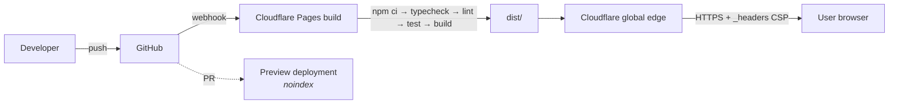

Static output, no build secrets in V1, no environment variables required at runtime. `_headers` carries the CSP and security headers. Detail in `17_DEPLOYMENT.md`.

---

## 12. Cross-cutting concerns

| Concern | Approach | Doc |
|---|---|---|
| Error handling | Typed `Result<T, E>` in the domain; exceptions only at boundaries; React error boundaries per panel; stable error codes | `18_CODING_STANDARDS.md` §7 |
| Logging | Dev-only structured console logging; **production logs never include user content** | `05_SECURITY.md` §11 |
| Accessibility | Semantic HTML, live regions for results, focus management in drawers, axe in CI | `08_UI_UX_SPEC.md` §12 |
| Performance | Budgets, debouncing, worker offload, lazy chunks, virtualised trees | `12_PERFORMANCE.md` |
| Input limits | Enforced at three points: editor, application, worker. A limit checked in only one place is a limit that will be bypassed. | `05_SECURITY.md` §6 |
| Versioning | Independent version numbers for storage schema, share-URL format, and export format | `03_DOMAIN_MODEL.md` §8 |

---

## 13. Known architectural tensions

Recorded rather than smoothed over.

| # | Tension | Resolution |
|---|---|---|
| T1 | Strict CSP vs CodeMirror runtime style injection | Accept `style-src 'unsafe-inline'`; compensate by making `script-src` strict and by having no HTML-string rendering path. Documented as residual risk RR-02. |
| T2 | "Offline-first" vs "check for updates" | Update checks are the only network activity after load and are **excluded from the offline guarantee**. They fail silently offline. |
| T3 | "Remember my analyses" vs "never persist secrets" | **Resolved in Phase 1.5:** auto-capture ON by default, with a first-run notice, a prominent pause control, no result storage, no test-string storage, and clear-all. Residual risk accepted and disclosed (RR-08). |
| T4 | Input detection vs "never auto-run expensive parsing" | Detection uses only cheap, bounded heuristics (1 KB sample, character-class checks, no parsing). Full parse happens only after mode is settled. |
| T5 | Custom parsers vs the 3–4 day playbook estimate | **Resolved in Phase 1.5:** the project is staged (V1.0 = Regex + JSON, V1.1 = Cron) rather than lowering the quality bar or pretending the scope fits the estimate. `01_PRD.md` §3. |
| T6 | SEO/discoverability vs a pure client-side app | Static prerendered `index.html` with real content in the initial HTML, semantic headings, and metadata. No SSR framework. |
| T7 | Doc 11 in the brief mentions "server/cache state" boundaries | There is no server. `11_STATE_MANAGEMENT.md` documents this explicitly and defines the boundary as worker-result cache vs persistent local state instead. |


---

## M8 — where the theme lives

```
src/domain/theme/preferences.ts     the model, the presets, the validator,
                                    the contrast maths — no DOM, no storage
src/application/theme/themeStore.ts the store, applyTheme, persistence
src/features/theme/                 the drawer, the header control, styles
public/theme-bootstrap.js           pre-paint, outside the module graph
```

The layering is the usual one with one deliberate exception: **the pre-paint
bootstrap is not part of the module graph at all.** It cannot be — it runs
before the bundle, with no imports. That is why it restates the validation
rules, and why `09_DESIGN_SYSTEM.md` §11 and `06_DATA_STORAGE.md` §12.2 both
document how the two copies are kept in agreement.

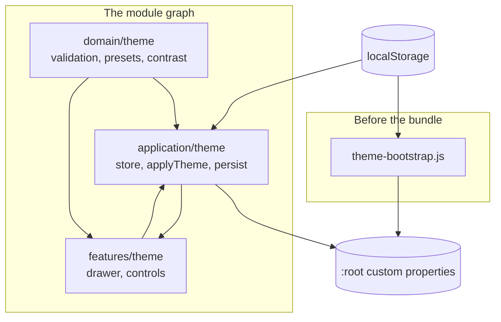

`features/theme` imports `domain` and `application`, never `infrastructure` —
the same boundary the ESLint policy enforces for every other feature.


---

## M9 — where the PWA lives

```
public/                        manifest and icons are build artefacts, emitted
                               by vite-plugin-pwa into dist/
src/infrastructure/pwa/        registerServiceWorker.ts — the platform API
src/application/pwa/           pwaStore.ts, startup.ts
src/features/pwa/              PwaStatus.tsx — chip, toast, banner
scripts/serve-production.mjs   dist/ with real headers, for the offline tests
```

The service worker itself is **generated**, not authored: it is build output,
and it is not part of the module graph. Like `theme-bootstrap.js`, it runs
outside the application — but unlike the bootstrap it is not hand-written, for
the reason `07_PWA_OFFLINE.md` §2.1 gives: a service-worker bug persists across
reloads and is the worst class of bug this app can ship.

`features/pwa` imports `application/pwa`, which imports `infrastructure/pwa` —
the same layering every other feature follows, enforced by the ESLint boundary
policy.
