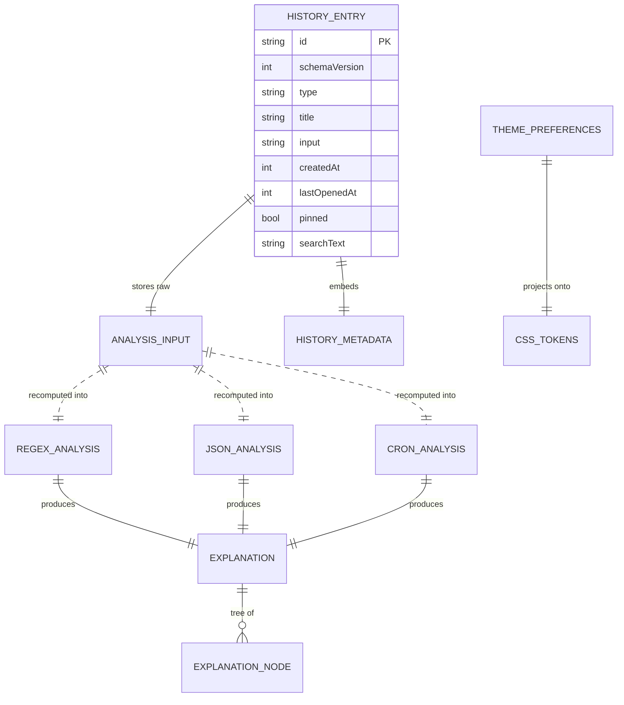

# 03 — Domain Model

**Project:** SyntaxLab
**Status:** Draft for human review
**Last updated:** 2026-08-17

---

> **Scope note (Phase 1.5).** V1.0 implements `RegexAnalysis`, `JsonAnalysis`, `HistoryEntry`, `ThemePreferences`, and `AppSettings`. **`CronAnalysis` (§5) is V1.1.** The `SHARE_URL_VERSION` in §8 applies only if share URLs ship in V1.1+.

## 1. Purpose and rules

This document defines the entities the application reasons about, their invariants, validation, serialisation, and versioning.

Three rules govern everything here:

1. **Storage records are not domain objects.** A row read from IndexedDB is untrusted input (the user can edit it in devtools, another tab can corrupt it, a migration can leave it half-formed). It is parsed and validated into a domain object at the repository boundary. The domain never sees a raw record.
2. **Domain types are plain, serialisable data.** No classes with methods, no `Date` objects in transferable payloads, no `Map`/`Set` across the worker boundary unless structured-clone-safe and deliberate. Everything crossing a worker boundary must survive `structuredClone`.
3. **Invalid states are unrepresentable where the type system can manage it.** Discriminated unions over optional-field soup.

---

## 2. Shared primitives

### 2.1 `Result<T, E>`

The domain never throws for expected failures. A malformed regex is not exceptional — it is the most common input.

```ts
type Result<T, E = DomainError> =
  | { readonly ok: true;  readonly value: T }
  | { readonly ok: false; readonly error: E };
```

Exceptions are reserved for programmer errors (a violated invariant) and are caught at the worker boundary and converted into `INTERNAL` errors so a bug never kills the worker silently.

### 2.2 `DomainError`

```ts
type DomainErrorCode =
  | 'SYNTAX'          // input violates the grammar
  | 'UNSUPPORTED'     // valid syntax we deliberately do not support
  | 'LIMIT_EXCEEDED'  // input or complexity limit hit
  | 'TIMEOUT'         // execution exceeded its budget
  | 'INTERNAL';       // our bug

interface DomainError {
  readonly code: DomainErrorCode;
  readonly message: string;      // user-facing, plain language, no stack traces
  readonly span?: SourceSpan;    // where in the input
  readonly hint?: string;        // "what you can do next"
  readonly detail?: string;      // dev-only, stripped in production builds
}
```

**Invariant:** `message` and `hint` are written for a user, contain no internal identifiers, and never echo more than 80 characters of user input (truncated with an ellipsis) — a long hostile string must not become a long hostile error message.

### 2.3 `SourceSpan`

Every node produced by every parser carries one. This is what makes explanation-to-input highlighting possible, and it is why we do not use `JSON.parse`.

```ts
interface SourceSpan {
  readonly start: number;  // UTF-16 code-unit offset, inclusive
  readonly end: number;    // exclusive
  readonly line: number;   // 1-based, for error display
  readonly column: number; // 1-based, UTF-16 code units
}
```

**Invariants:** `0 <= start <= end <= input.length`; `line >= 1`; `column >= 1`. Offsets are UTF-16 code units because that is what CodeMirror, `String.prototype.slice`, and `RegExp` indices all use. Mixing code points and code units here is a classic off-by-N bug with astral-plane characters (emoji), so the unit is stated once and never varied.

### 2.4 `ExplanationNode` — the type that removes the HTML sink

```ts
type ExplanationNode =
  | { kind: 'text';     value: string }
  | { kind: 'code';     value: string }                    // rendered in <code>, escaped by React
  | { kind: 'emphasis'; value: string }
  | { kind: 'ref';      value: string; span: SourceSpan }  // clickable, highlights input
  | { kind: 'list';     items: ExplanationNode[][] }
  | { kind: 'group';    label: string; children: ExplanationNode[] };

interface Explanation {
  readonly summary: ExplanationNode[];   // one-paragraph plain-English reading
  readonly details: ExplanationSection[];
}

interface ExplanationSection {
  readonly id: string;
  readonly title: string;
  readonly span?: SourceSpan;
  readonly body: ExplanationNode[];
  readonly severity?: 'info' | 'warning' | 'error';
}
```

**Why this shape.** The natural design is `explain(): string` returning markdown. Since explanations quote the user's own tokens (`the literal "…"`), that string would contain user input, and rendering it as HTML would create an injection opportunity on every single analysis. By making the output a tree of typed segments rendered as React children, **user content reaches the DOM as a text node rather than as markup**, and the analysis-output path has no HTML sink at all. This closes the highest-frequency injection route in the product; it is not a claim that XSS is impossible elsewhere — residual routes are tracked in `05_SECURITY.md` §2.3. See `02_ARCHITECTURE.md` ADR-011.

### 2.5 Limits

Defined once, in `domain/shared/limits.ts`, imported by editor, application, and worker so all three enforce identical numbers.

```ts
const LIMITS = {
  regex:      { pattern: 10_000,    testSubject: 1_000_000, execMs: 2_000, maxMatches: 10_000 },
  json:       { input: 5_000_000,   maxDepth: 500,          maxNodes: 500_000 },
  cron:       { input: 1_000,       fields: 5,              previewCount: 25, searchYears: 5 },  // V1.1
  share:      { encoded: 8_192 },                                                                  // V1.1+ only
  importFile: { bytes: 20_000_000,  entries: 10_000 },
  history:    { maxEntries: 500,    maxInputChars: 100_000, softQuotaBytes: 50_000_000 },
} as const;
```

Rationale for the non-obvious ones is in `05_SECURITY.md` §6.

---

## 3. `RegexAnalysis`

```ts
interface RegexAnalysis {
  readonly kind: 'regex';
  readonly source: string;              // the pattern, without delimiters
  readonly flags: RegexFlags;
  readonly ast: RegexNode;              // root is always an Alternation
  readonly tokens: RegexToken[];        // flat, ordered, for the token list UI
  readonly groups: CaptureGroupInfo[];
  readonly explanation: Explanation;
  readonly warnings: AnalysisWarning[];
  readonly enginePresence: EngineCompatibility;
}

interface RegexFlags {
  global: boolean; ignoreCase: boolean; multiline: boolean;
  dotAll: boolean; unicode: boolean; sticky: boolean;
  hasIndices: boolean; unicodeSets: boolean;   // v flag; see compatibility notes
}
```

### 3.1 AST

```ts
type RegexNode =
  | { type: 'Alternation'; alternatives: RegexNode[]; span: SourceSpan }
  | { type: 'Sequence';    elements: RegexNode[];     span: SourceSpan }
  | { type: 'Literal';     value: string;             span: SourceSpan }
  | { type: 'CharClass';   negated: boolean; items: CharClassItem[]; span: SourceSpan }
  | { type: 'Dot';         span: SourceSpan }
  | { type: 'Anchor';      anchor: 'start'|'end'|'wordBoundary'|'nonWordBoundary'; span: SourceSpan }
  | { type: 'Group';       groupKind: GroupKind; number?: number; name?: string;
                           body: RegexNode; span: SourceSpan }
  | { type: 'Quantifier';  min: number; max: number | null; lazy: boolean;
                           body: RegexNode; span: SourceSpan }
  | { type: 'Backreference'; ref: number | string; span: SourceSpan }
  | { type: 'CharEscape';  escape: EscapeKind; raw: string; span: SourceSpan }
  | { type: 'UnicodeProperty'; property: string; value?: string; negated: boolean; span: SourceSpan };

type GroupKind =
  | 'capturing' | 'nonCapturing' | 'named'
  | 'lookahead' | 'negativeLookahead'
  | 'lookbehind' | 'negativeLookbehind'
  | 'modifier';   // (?i:…) — ES2025 modifier groups; parsed, flagged as newer syntax
```

**Added at M3: `errors: readonly DomainError[]`.** The parser recovers, so a
*successful* analysis can still carry syntax errors — one typo in a long
pattern yields an explanation for the rest, and the UI shows both. An analysis
fails outright only when nothing useful can be produced (over the length limit,
or unusable flags).

### 3.2 Invariants

| # | Invariant | Enforced |
|---|---|---|
| R-I1 | Root node is always `Alternation`, even for a single branch. Uniform tree walking beats special-casing. | Parser postcondition + unit test |
| R-I2 | `Quantifier.min <= Quantifier.max` when `max !== null`. `{3,1}` is a parse error, matching the JS engine. | Parser |
| R-I3 | `Quantifier.body` is never itself a `Quantifier`. `a**` is a syntax error; `(a*)*` nests via a `Group`. | Parser |
| R-I4 | Capture group numbers are assigned by opening-parenthesis order, starting at 1, contiguous. | Parser second pass |
| R-I5 | Group names are unique per alternative scope, matching ES2025 duplicate-named-group rules. | Parser validation |
| R-I6 | Every numeric backreference `\n` where `n` exceeds the group count is reinterpreted per ES rules (octal escape in non-unicode mode, error in unicode mode). | Parser |
| R-I7 | Spans of sibling nodes never overlap; a parent's span covers all children. | Property test over fuzzed inputs |
| R-I8 | Parsing terminates for every input. No unbounded loop; the tokenizer's cursor strictly advances. | Code review + property test with a step counter |

### 3.3 Warnings

Non-fatal observations surfaced in the UI. These make the tool genuinely useful rather than merely correct.

```ts
type RegexWarningCode =
  | 'NESTED_QUANTIFIER'        // (a+)+ — classic catastrophic backtracking shape
  | 'UNESCAPED_DOT_IN_CLASS'   // [.] means literal dot; user may expect otherwise
  | 'REDUNDANT_ESCAPE'         // \- outside a class
  | 'EMPTY_ALTERNATIVE'        // (a|) — matches empty; usually a typo
  | 'UNICODE_FLAG_ADVISED'     // \p{…} or astral literals without /u
  | 'CASE_INSENSITIVE_CLASS'   // [a-Z] with /i, a common misunderstanding
  | 'ANCHOR_IN_MIDDLE'         // a^b — can never match without /m
  | 'LARGE_BOUNDED_REPEAT'     // a{1,100000}
  | 'LOOKBEHIND_COMPATIBILITY';// unsupported in Safari < 16.4
```

`NESTED_QUANTIFIER` is a **heuristic**, not a proof. The UI wording must say "this shape can backtrack catastrophically", never "this regex is unsafe/safe". Absence of a warning is not a safety guarantee — that guarantee comes from worker termination, not from static analysis.

### 3.4 Engine compatibility

```ts
interface EngineCompatibility {
  readonly ecmascript: 'es2018' | 'es2022' | 'es2024' | 'es2025' | 'unsupported';
  readonly notes: CompatibilityNote[];   // e.g. lookbehind, \p{…}, v flag, modifier groups
}
```

We report the ECMAScript level a pattern requires. We do **not** claim PCRE/Python/Go compatibility (see `01_PRD.md` non-goals and Q-03).

---

## 4. `JsonAnalysis`

```ts
interface JsonAnalysis {
  readonly kind: 'json';
  readonly source: string;
  readonly cst: JsonNode | null;         // null only when parsing failed at the root
  readonly valid: boolean;
  readonly errors: DomainError[];        // multiple, via error recovery
  readonly stats: JsonStats;
  readonly duplicateKeys: DuplicateKeyReport[];
  readonly unsafeNumbers: UnsafeNumberReport[];
  readonly explanation: Explanation;
}
```

### 4.1 CST

A concrete syntax tree, not an abstract one: it retains positions and raw text so the tree view, path copying, and error carets all work.

```ts
type JsonNode =
  | { type: 'object'; members: JsonMember[]; span: SourceSpan; path: JsonPath }
  | { type: 'array';  elements: JsonNode[];  span: SourceSpan; path: JsonPath }
  | { type: 'string'; value: string; raw: string; span: SourceSpan; path: JsonPath }
  | { type: 'number'; value: number; raw: string; span: SourceSpan; path: JsonPath }
  | { type: 'boolean'; value: boolean;       span: SourceSpan; path: JsonPath }
  | { type: 'null';                          span: SourceSpan; path: JsonPath }
  | { type: 'error';  raw: string;           span: SourceSpan; path: JsonPath };  // recovery placeholder

interface JsonMember {
  readonly key: string;
  readonly keyRaw: string;
  readonly keySpan: SourceSpan;
  readonly value: JsonNode;
  readonly span: SourceSpan;
}

type JsonPathSegment = { kind: 'key'; key: string } | { kind: 'index'; index: number };
type JsonPath = readonly JsonPathSegment[];
```

### 4.2 The prototype-pollution decision

**Object members are stored in an ordered array, not in a JavaScript object.**

This is not a style preference. If the parser built `Record<string, JsonNode>`, then input containing `{"__proto__": {"polluted": true}}` or `{"constructor": …}` would place attacker-controlled keys onto a real object, and any subsequent merge, spread, or lookup becomes a pollution or confusion vector. An array of `{key, value}` pairs removes that vector at the data-structure level — attacker keys never become real object keys — and has the free side effect of preserving key order and exposing duplicates.

Where a plain JS value genuinely is needed (prettify, minify, and TS-interface generation if it ships in V1.2+), it is produced via `toPlainValue()` which builds objects with `Object.create(null)` and skips `__proto__` explicitly. Rule stated in `18_CODING_STANDARDS.md` §6 and tested in `13_TEST_PLAN.md` §7.

### 4.3 Stats and reports

```ts
interface JsonStats {
  readonly nodeCount: number; readonly maxDepth: number;
  readonly objectCount: number; readonly arrayCount: number;
  readonly stringCount: number; readonly numberCount: number;
  readonly booleanCount: number; readonly nullCount: number;
  readonly totalKeys: number; readonly byteLength: number;
}

interface DuplicateKeyReport { path: JsonPath; key: string; occurrences: SourceSpan[]; }

interface UnsafeNumberReport {
  path: JsonPath; raw: string; parsed: number; span: SourceSpan;
  reason: 'PRECISION_LOSS' | 'OVERFLOW' | 'NEGATIVE_ZERO';
}
```

`UnsafeNumberReport` earns its place: `{"id": 9007199254740993}` round-trips through `JSON.parse` as `9007199254740992`. Silently corrupted IDs are a real production bug that no other JSON viewer flags.

### 4.4 Invariants

| # | Invariant |
|---|---|
| J-I1 | Valid JSON per RFC 8259 parses without errors; **verified differentially against `JSON.parse` on every fuzz input**. If we disagree with the platform, we are wrong. |
| J-I2 | `path` on every node is the correct accessor chain from the root. |
| J-I3 | Depth is capped at `LIMITS.json.maxDepth`; exceeding it yields `LIMIT_EXCEEDED`, never a stack overflow. The parser is iterative with an explicit stack for exactly this reason. |
| J-I4 | Duplicate keys are reported, never silently collapsed. |
| J-I5 | `string.value` is the unescaped value; `raw` is the exact source text including quotes. Lone surrogates are preserved, not corrupted. |
| J-I6 | Error recovery produces an `error` node and continues; a single typo yields a usable partial tree, not a blank screen. |

### 4.5 Dialect

V1 accepts **strict RFC 8259 JSON only**. Comments, trailing commas, single quotes, unquoted keys, and `NaN`/`Infinity` are errors — but with a *specific* message ("trailing commas are not valid JSON; JSON5 allows them"), because recognising the near-miss is more useful than "unexpected token". JSONC/JSON5 modes are V1.2+ and undecided (Q-17).

---

## 5. `CronAnalysis` — **V1.1**

> Not implemented in V1.0. Specified here so the V1.1 scope is fixed. Dialect and timezone scope are locked in `04_PARSER_ARCHITECTURE.md` §4.1 and §4.5.

```ts
interface CronAnalysis {
  readonly kind: 'cron';
  readonly source: string;
  readonly dialect: 'standard5';   // the only supported dialect
  readonly fields: CronField[];
  readonly schedule: CronSchedule | null;
  readonly explanation: Explanation;
  readonly warnings: AnalysisWarning[];
  readonly timezone: TimezoneContext;
  readonly nextRuns: NextRun[];
}

// V1.1 supports exactly one dialect. This is a single-member union on purpose:
// it keeps the field present in stored records and leaves room to widen later,
// without implying support that does not exist.
type CronDialect = 'standard5';

type CronFieldName = 'minute' | 'hour' | 'dayOfMonth' | 'month' | 'dayOfWeek';

interface CronField {
  readonly name: CronFieldName;
  readonly raw: string;
  readonly span: SourceSpan;
  readonly terms: CronTerm[];
  readonly resolved: readonly number[];   // sorted, deduped, expanded values
  readonly isWildcard: boolean;
  readonly error?: DomainError;
}

type CronTerm =
  | { kind: 'all' }
  | { kind: 'value';  value: number }
  | { kind: 'range';  from: number; to: number }
  | { kind: 'step';   base: CronTerm; step: number }
  | { kind: 'list';   items: CronTerm[] };

// Quartz terms (L, LW, #, W, ?) and Jenkins H are NOT part of the model.
// The parser recognises them only in order to emit a specific
// "that is Quartz/Jenkins syntax, which SyntaxLab does not support" error.

```

### 5.1 Timezone model — explicit, never implicit

```ts
interface TimezoneContext {
  readonly mode: 'browserLocal' | 'utc';   // V1.1 supports these two only
  readonly ianaZone: string;               // resolved for display, e.g. "Europe/London"
  readonly resolvedFrom: 'browserResolvedOptions' | 'userSelection';
  readonly currentOffsetMinutes: number;
}

interface NextRun {
  readonly instant: string;              // ISO 8601 with offset — never a bare Date
  readonly localDisplay: string;
  readonly zoneDisplay: string;
  readonly dstAnomaly?: 'SKIPPED' | 'REPEATED' | 'OFFSET_CHANGE';
}
```

**Invariant C-I1:** no execution time is ever displayed without an accompanying timezone label. A cron time without a zone is worse than no answer — it is a confidently wrong answer, and this is the single most common way cron tools mislead people.

`instant` is an ISO string, not a `Date`, because `Date` loses zone identity and because the value crosses a worker boundary where only wall-clock-plus-offset is unambiguous.

### 5.2 Cron invariants

| # | Invariant |
|---|---|
| C-I2 | Every field value is within its dialect's legal range; `60` in minutes is an error. |
| C-I3 | `dayOfWeek` accepts both `0` and `7` for Sunday, and the explanation states which convention was applied. |
| C-I4 | **The DOM/DOW OR-rule is implemented per Vixie cron:** when both `dayOfMonth` and `dayOfWeek` are restricted (neither is `*`), a day matches if *either* matches. A warning is always emitted, because approximately everyone reads it as AND. |
| C-I5 | Next-run search is bounded by `LIMITS.cron.searchYears`; an impossible schedule (`0 0 30 2 *` — 30 February) terminates and reports "this schedule will never run" instead of spinning. |
| C-I6 | DST transitions are detected and labelled, never silently skipped or duplicated. |
| C-I7 | Field count determines dialect; ambiguous counts prompt the user rather than guessing. |

### 5.3 Documented dialect support

| Feature | standard5 | seconds6 | quartz |
|---|---|---|---|
| Fields | 5 | 6 (leading seconds) | 6–7 |
| `*` `,` `-` `/` | ✅ | ✅ | ✅ |
| Names (`JAN`, `MON`) | ✅ | ✅ | ✅ |
| `@hourly`, `@daily`, `@weekly`, `@monthly`, `@yearly`, `@reboot` | ✅ (`@reboot` explained as non-schedulable) | ✅ | ❌ |
| `L`, `W`, `#`, `?` | ❌ (error with a "this is Quartz syntax" hint) | ❌ | ✅ |
| Year field | ❌ | ❌ | ✅ optional |
| Step on a non-range base (`5/10`) | ⚠️ warning — behaviour differs between implementations | ⚠️ | ✅ |

We state the dialect in the UI at all times and never claim universal compatibility.

---

## 6. `HistoryEntry`

```ts
interface HistoryEntry {
  readonly id: string;                    // crypto.randomUUID()
  readonly schemaVersion: number;         // current: 1
  readonly type: 'regex' | 'json' | 'cron';
  readonly title: string;                 // auto-derived or user-set
  readonly isCustomTitle: boolean;
  readonly input: string;                 // truncated at LIMITS.history.maxInputChars
  readonly inputTruncated: boolean;
  readonly metadata: HistoryMetadata;
  readonly createdAt: number;             // epoch ms
  readonly lastOpenedAt: number;
  readonly openCount: number;
  readonly pinned: boolean;
  readonly tags: readonly string[];
  readonly searchText: string;            // lowercased, precomputed index field
}

type HistoryMetadata =
  | { type: 'regex'; flags: string; groupCount: number; hadErrors: boolean; nodeCount: number }
  | { type: 'json';  valid: boolean; nodeCount: number; maxDepth: number; byteLength: number }
  | { type: 'cron';  dialect: CronDialect; timezone: string; valid: boolean; nextRunIso?: string };
```

### 6.1 What is deliberately absent

| Not stored | Why |
|---|---|
| Analysis results (AST, explanation, matches) | Recomputable in milliseconds; storing them would multiply storage use and duplicate the sensitive content. |
| Test strings for regex | Most likely field to contain real production data. Excluded from V1 history by default — see Q-08. |
| Any theme/appearance data | Belongs to preferences, not to an analysis. |
| Timestamps at sub-second precision | Unnecessary; also a weak fingerprinting vector. |
| Anything resembling credentials | We cannot detect these reliably, hence the pause-history control and the disclosure in `05_SECURITY.md` §9. |

### 6.2 Invariants

| # | Invariant |
|---|---|
| H-I1 | `id` is a v4 UUID from `crypto.randomUUID()`. Never a timestamp or a counter — those collide across tabs. |
| H-I2 | `createdAt <= lastOpenedAt`. |
| H-I3 | `title` is non-empty; auto-derivation falls back to `"Untitled <type>"`. |
| H-I4 | `input.length <= LIMITS.history.maxInputChars`; over-limit inputs are stored truncated with `inputTruncated: true` and the UI says so on restore, rather than silently returning partial data. |
| H-I5 | Deduplication: an identical `(type, input)` written within 60 s updates the existing entry rather than creating a new one. Without this, history fills with near-identical entries from a user iterating on one pattern. |
| H-I6 | Pinned entries are exempt from automatic pruning. |
| H-I7 | Every record is validated on read; a record failing validation is quarantined (moved aside and reported), never fed to the UI and never silently deleted. |

### 6.3 Title derivation

Deterministic and pure, so it is unit-testable:

- **regex** → `/pattern/flags` truncated to 60 chars
- **json** → root shape: `Object · 12 keys` or `Array · 340 items`
- **cron** → the short human reading: `Every day at 03:00`
- Fallback → `Untitled <type>`

---

## 7. `ThemePreferences` and `AppSettings`

```ts
interface ThemePreferences {
  readonly schemaVersion: number;             // current: 1
  readonly preset: string;                    // preset id or 'custom'
  readonly gradient: {
    readonly from: HexColor;                  // validated /^#[0-9a-f]{6}$/i
    readonly to: HexColor;
    readonly angleDeg: number;                // 0–359, integer
    readonly intensity: number;               // 0–100
  };
  readonly accent: HexColor;
  readonly backgroundDarkness: number;        // 0–100
  readonly glowIntensity: number;             // 0–100
  readonly contrastMode: 'normal' | 'high';
  readonly reducedMotion: 'system' | 'always' | 'never';
  readonly fontScale: number;                 // 0.875 | 1 | 1.125 | 1.25
}

interface AppSettings {
  readonly schemaVersion: number;             // current: 1
  readonly historyEnabled: boolean;           // the "pause history" control
  readonly autoAnalyze: boolean;
  readonly autoDetectType: boolean;
  readonly defaultMode: 'regex' | 'json' | 'cron' | 'auto';
  readonly cron: { dialect: CronDialect; timezoneMode: 'browserLocal'|'named'|'utc'; namedZone?: string };
  readonly json: { indent: 2 | 4 | 'tab'; sortKeysOnFormat: boolean };
  readonly regex: { defaultFlags: string; execTimeoutMs: number };  // clamped to LIMITS
  readonly showWarnings: boolean;
  readonly hasSeenOnboarding: boolean;
}
```

### 7.1 Theme validation — a real security boundary

`localStorage` is fully attacker-writable by any script that runs in the origin, and directly by the user. Theme values are written into CSS custom properties, so an unvalidated value is a **CSS injection** vector.

Every field is validated on read:

| Field | Rule | On failure |
|---|---|---|
| `from`, `to`, `accent` | `/^#[0-9a-fA-F]{6}$/` — a strict allowlist, not a sanitiser | fall back to default |
| `angleDeg` | integer, clamped 0–359 | clamp |
| `intensity`, `glowIntensity`, `backgroundDarkness` | finite number, clamped 0–100 | clamp |
| `contrastMode`, `reducedMotion` | enum membership | default |
| `fontScale` | one of the four allowed values | 1 |
| Any unknown key | dropped | — |

A value like `red; background: url(https://evil/?x=` must never reach `style.setProperty`. The hex-only allowlist rejects it: validation is by **positive match against a strict pattern**, not by filtering out known-bad substrings, so anything not matching `/^#[0-9a-fA-F]{6}$/` is discarded and the default is used. Tested in `13_TEST_PLAN.md` §7.6.

---

## 8. Versioning strategy

Four independent version numbers, because they change for different reasons and coupling them forces pointless migrations.

| Version | Applies to | Current | Bump when |
|---|---|---|---|
| `DB_VERSION` | IndexedDB schema (stores, indices) | 1 | Adding/removing a store or index |
| `ENTRY_SCHEMA_VERSION` | `HistoryEntry` record shape | 1 | Changing entry fields |
| `EXPORT_FORMAT_VERSION` | Export/import file format | 1 | Changing the export envelope |
| `SHARE_URL_VERSION` *(V1.1+)* | Share fragment encoding | 1 | Changing encoding or payload shape. **Unused in V1.0.** |

### 8.1 Compatibility rules

- **Forward-compat on read:** an entry with a *lower* `schemaVersion` is migrated by a pure function chain (`migrate_1_to_2`, …) at read time.
- **Unknown-version handling:** an entry with a *higher* version than the running app understands is **preserved untouched and hidden from the list**, with a notice. Older code must never destroy data written by newer code — that is how users lose everything by opening the app in a stale tab.
- **Export files** always carry their version; import refuses unknown-major versions with an explanation rather than guessing.
- **Share URLs** *(V1.1+ only)* would carry a version prefix; unknown versions produce a clear "this link was made by a newer version" message rather than a decode crash. Not present in V1.0.

### 8.2 Migration properties

Migrations must be: **pure** (data in, data out — no I/O), **idempotent**, **total** (defined for every input, including corrupt ones), and **tested with real fixtures** captured from prior versions. A migration that throws on one bad record must not abort the whole upgrade — it quarantines that record and continues.

---

## 9. Entity relationships



The dotted relations matter: history stores **input**, and analyses are **recomputed** from it. Nothing derived is persisted. This keeps storage small, avoids stale-result bugs after a parser fix, and shrinks the sensitive-data footprint.

---

## 10. Serialisation rules

1. **Worker boundary:** structured-clone-safe plain data only. No functions, no class instances, no `Date`, no `RegExp` objects. Validated by a round-trip test through `structuredClone` for every response type.
2. **IndexedDB:** plain objects; the same constraint applies since IDB uses the structured-clone algorithm.
3. **localStorage:** `JSON.stringify` of a flat, validated object. Reads always go through the validator in §7.1.
4. **Share URL** *(V1.1+ only, not implemented in V1.0)*: versioned envelope → JSON → UTF-8 bytes → `CompressionStream('deflate-raw')` when available → base64url. Decode reverses with a size check *before* decompression to guard against a decompression bomb.
5. **Export file:** UTF-8 JSON with a versioned envelope, a `generatedAt`, an entry count, and the entries array. No binary formats.
