# 04 — Parser Architecture

**Project:** SyntaxLab
**Status:** Draft for human review
**Last updated:** 2026-08-17

---

> **Scope note (Phase 1.5).** **V1.0 implements the regex and JSON parsers only.** §5 (cron) is a **V1.1** specification and no cron code is written during V1.0. The three parsers are built in sequence, not in parallel — see `20_IMPLEMENTATION_PLAN.md`.

## 1. Shared design

All parsers follow the same shape, so a developer who learns one knows the others. **They are built in sequence — regex, then JSON, then (in V1.1) cron — never in parallel.** Building three parser stacks simultaneously would mean three unstable things at once and no working slice at any point.

```
input: string
   │
   ▼
┌──────────────┐   characters → tokens, each with a SourceSpan
│  Tokenizer   │   never throws; emits error tokens and continues
└──────┬───────┘
       ▼
┌──────────────┐   recursive descent (regex, cron) or explicit-stack
│    Parser    │   iteration (JSON); error recovery; Result<T, E>
└──────┬───────┘
       ▼
┌──────────────┐   AST / CST — plain, serialisable, positioned
│   Validate   │   post-parse invariant checks + warning generation
└──────┬───────┘
       ▼
┌──────────────┐   AST walk → ExplanationNode[]  (no string templating of user input)
│  Explainer   │
└──────────────┘
```

### 1.1 Non-negotiable properties

| # | Property | Why | How verified |
|---|---|---|---|
| P1 | **Total** — every string input produces a `Result`, never an uncaught throw | A crash in a worker means a blank panel and a lost analysis | 100k-case fuzz run in CI |
| P2 | **Terminating** — no input can cause an infinite loop | A spinning worker is indistinguishable from a hung app | Cursor-monotonicity assertion in dev builds; property test with step budget |
| P3 | **Bounded** — memory and node count are capped | A 5 MB deeply-nested document must not OOM the tab | Explicit `maxNodes` / `maxDepth` counters |
| P4 | **Positioned** — every node has a `SourceSpan` | Explanation↔input highlighting depends on it | Property test: spans nest correctly and stay in range |
| P5 | **Recovering** — one error does not abandon the parse | Partial understanding beats a blank screen | Golden-file tests with broken inputs |
| P6 | **Pure** — no I/O, no globals, no clock, no randomness | Testable under Node, runnable in a worker, deterministic | Lint boundary rules + deterministic golden tests |

### 1.2 Termination proof obligation

Each parser's main loop must satisfy: *every iteration either advances the cursor by ≥1, or exits*. This is asserted in development builds:

```ts
// dev-only guard compiled out of production
if (import.meta.env.DEV && cursor <= lastCursor) {
  throw new Error(`parser stalled at ${cursor}`);
}
```

This turns "we believe it terminates" into "a test fails loudly the moment it does not". It is the cheapest possible defence against the worst possible bug.

---

## 2. Regex parser

### 2.0 Flavour lock: ECMAScript only

**V1.0 parses, explains, and executes ECMAScript (JavaScript) regular expressions, and nothing else.** The tester runs the pattern through the browser's own `RegExp`, so any other claim would misrepresent what the user is seeing. Rationale and the user-visible surfacing are in `01_PRD.md` §7.

**Foreign-dialect detection.** The tokenizer recognises constructs that are valid in other engines but not in ECMAScript, and converts them into the most useful error in the product:

| Construct | Origin | Message |
|---|---|---|
| `(?P<name>…)` | Python | "`(?P<name>…)` is Python syntax. JavaScript uses `(?<name>…)`." |
| `(?P=name)` | Python | "Python back-reference syntax. JavaScript uses `\k<name>`." |
| `(?>…)` | PCRE, Java | "Atomic groups are not supported in JavaScript." |
| `a*+`, `a++`, `a?+` | PCRE, Java | "Possessive quantifiers are not supported in JavaScript." |
| `(?R)`, `(?1)` | PCRE | "Recursion is not supported in JavaScript." |
| `\A`, `\Z`, `\z` | PCRE, Python | "Use `^` and `$` (with the `m` flag if needed)." |
| `\h`, `\R`, `\K` | PCRE | "Not supported in JavaScript." |
| `(?#comment)` | PCRE | "Inline comments are not supported in JavaScript." |

This is a **recognition table, not a second parser.** It adds a small set of patterns to the existing error path; it does not introduce a dialect abstraction, a strategy interface, or any configuration surface. Building extensibility for a second flavour now would be speculative complexity — the AST and explainer simply do not *preclude* an explanation-only mode later (`01_PRD.md` §7.3).

### 2.1 Regex analysis flow

> ✅ **Implemented at M3.** Parsing and explanation only — no `RegExp` is
> constructed and nothing is executed. Execution is M4.

**The M3 pipeline, as built:**

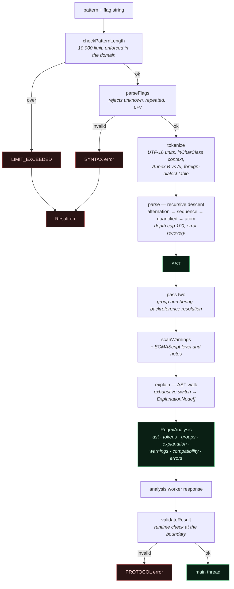

**Not in this diagram, deliberately:** `RegExp` execution. It runs in the
disposable worker and arrives at M4.

### 2.1.1 Conceptual flow

The same pipeline expressed as decision points rather than modules. Kept
because it answers a different question: *what happens to a given input*,
rather than *which module runs when*.

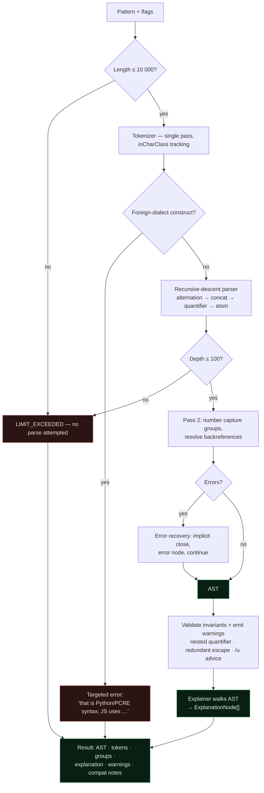

All of the above runs in the **analysis worker**. Execution against a test string is a separate path with a separate threat profile — §2.7.

### 2.2 Grammar (target: ECMAScript patterns)

```
Pattern      := Disjunction
Disjunction  := Alternative ("|" Alternative)*
Alternative  := Term*
Term         := Assertion | Atom Quantifier?
Assertion    := "^" | "$" | "\b" | "\B" | Lookaround
Lookaround   := "(?=" Disjunction ")" | "(?!" Disjunction ")"
              | "(?<=" Disjunction ")" | "(?<!" Disjunction ")"
Atom         := PatternCharacter | "." | AtomEscape | CharacterClass
              | "(" GroupSpecifier Disjunction ")" | "(?:" Disjunction ")"
Quantifier   := ("*" | "+" | "?" | "{" n ("," m?)? "}") "?"?
```

### 2.3 Tokenizer

Single left-to-right pass over UTF-16 code units, with surrogate-pair awareness when the `u`/`v` flag is set. Token kinds:

`Char` · `Dot` · `Anchor` · `GroupOpen` · `GroupClose` · `Alternate` · `ClassOpen` · `ClassClose` · `Quantifier` · `Escape` · `UnicodeProperty` · `Backreference` · `Invalid`

The tokenizer is **context-sensitive in exactly one place**: inside `[...]` most metacharacters lose their meaning. Rather than a full mode stack, the tokenizer tracks a boolean `inCharClass` — that is the entire complexity, and the JS grammar genuinely needs no more.

Ambiguities resolved per the ECMAScript spec, not per intuition:

| Input | Resolution |
|---|---|
| `{` not starting a valid quantifier | Literal `{` (Annex B web-compat), **except** under `/u` where it is a syntax error |
| `]` outside a class | Literal `]` (Annex B), error under `/u` |
| `\8` with fewer than 8 groups | Octal-ish legacy escape without `/u`; error with `/u` |
| `[a-\d]` | Error under `/u`; Annex B literal `-` otherwise |
| `\p{...}` without `/u` | Literal `p{...}` — and we emit `UNICODE_FLAG_ADVISED`, because this is a very common real bug |

**The rule:** where Annex B and strict-unicode disagree, we implement both and report which applies given the active flags. Explaining the pattern the user's engine will actually run is the whole point.

### 2.4 Parser

Recursive descent with explicit precedence: alternation (lowest) → concatenation → quantification → atom (highest).

Recursion depth is capped at **100 nested groups**. Beyond that we return `LIMIT_EXCEEDED` rather than risk a stack overflow — a thrown `RangeError` from a blown stack in a worker is much harder to present usefully than a deliberate limit.

**Two passes.** The first builds the tree. The second assigns capture-group numbers and resolves backreferences, because `\1(a)` is legal and forward references cannot be resolved in a single pass.

### 2.5 Error recovery

| Situation | Recovery |
|---|---|
| Unclosed group | Close implicitly at end-of-input, record error at the opening paren |
| Unclosed char class | Same; error at `[` |
| Quantifier with nothing to quantify (`*abc`) | Treat as literal under Annex B, error under `/u`, record the difference |
| Invalid escape | Emit `CharEscape` with `escape: 'invalid'`, keep parsing |
| Unbalanced `)` | Record error, skip the character, continue |

Recovery lets a user with one typo in a 200-character pattern still read the explanation for the other 199 characters.

### 2.6 Regex execution — separate from parsing

Parsing is safe (our code, provably terminating). **Execution is not** (the engine's code, uninterruptible). The exec worker is therefore deliberately minimal:

```ts
// exec.worker.ts — kept small on purpose: this thread will be killed regularly
self.onmessage = (e) => {
  const { id, pattern, flags, subject, maxMatches } = e.data;
  try {
    const re = new RegExp(pattern, flags);        // may throw SyntaxError — that's fine
    const matches = [];
    if (re.global || re.sticky) {
      let m, guard = 0;
      while ((m = re.exec(subject)) !== null) {
        matches.push(serialize(m));
        if (m[0] === '') re.lastIndex++;          // zero-length match: prevent infinite loop
        if (++guard >= maxMatches) break;
      }
    } else {
      const m = re.exec(subject);
      if (m) matches.push(serialize(m));
    }
    self.postMessage({ id, ok: true, matches, truncated: matches.length >= maxMatches });
  } catch (err) {
    self.postMessage({ id, ok: false, code: 'SYNTAX', message: String(err?.message ?? err) });
  }
};
```

Three details that are easy to get wrong and each cause a hang:

1. **Zero-length matches.** `/(?:)/g` against any string loops forever unless `lastIndex` is advanced manually. Guarded above.
2. **`lastIndex` statefulness.** A fresh `RegExp` is constructed per request; a reused object with `g` carries `lastIndex` between calls and returns wrong results.
3. **Match count cap.** `/a/g` against 1 M `a`s produces a million match objects. Capped, with `truncated: true` shown honestly in the UI.

**`new RegExp(userPattern)` is not `eval`.** The `RegExp` constructor compiles a pattern in the regex grammar; it cannot execute arbitrary JavaScript. This is stated explicitly here and in `05_SECURITY.md` §3 because it looks superficially similar to a dynamic-code sink and will otherwise be raised in every review.

### 2.7 Timeout mechanism and the execution security boundary

**The security boundary around regex execution**, which is the single most safety-critical flow in the product:

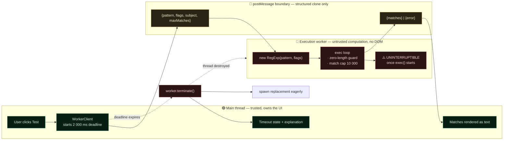

> ✅ **The boundary in this diagram was built and verified at M2**, before any
> parser was written against it. What M4 adds is the `RegExp` call inside the
> execution worker; the correlation, deadline, termination, and respawn
> machinery around it already exists and is tested on three engines.

**Invariants this diagram encodes:**

1. **User regex never executes on the main thread.** If workers are unavailable, the tester is disabled — not relocated (`02_ARCHITECTURE.md` §4.5).
2. **`terminate()` is the only interrupt.** There is no cooperative cancellation, because `RegExp.exec` yields to nothing.
3. **Termination must not damage unrelated state.** This is why the execution worker is separate from the analysis worker: killing a combined worker would also discard parser state and any in-flight unrelated request.
4. **The replacement is spawned eagerly**, so the next test does not pay startup latency on top of a two-second wait.


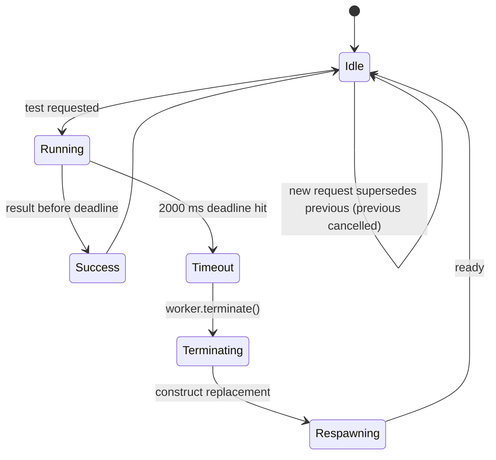

The replacement worker is spawned **eagerly** after a termination, not lazily on the next request, so the user's next test does not pay worker-startup latency on top of having just waited two seconds.

### 2.8 ReDoS: what we actually claim

| Claim | True? |
|---|---|
| "The UI never freezes due to user regex" | ✅ Yes — execution is off the main thread and terminable |
| "We detect all dangerous patterns" | ❌ No — the warning heuristic has false negatives |
| "The regex is stopped after 2 s" | ✅ Yes — by thread termination |
| "The CPU stops burning immediately" | ✅ Yes — `terminate()` kills the thread |
| "SyntaxLab is safe to use with any pattern" | ⚠️ For *this tab*, yes. We warn that the same pattern in a Node server has no such protection — which is the actually valuable message. |

---

### 2.9 Execution as built at M4

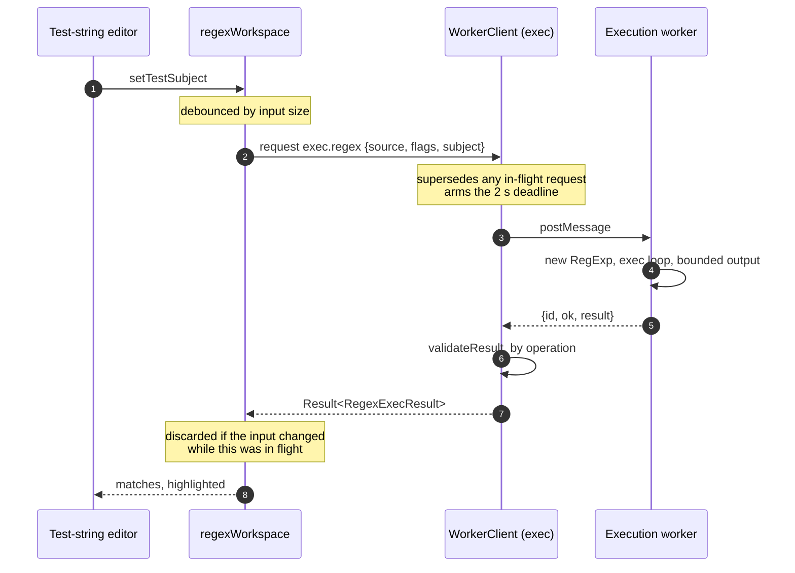

`domain/regex/execute.ts` is the only place in the application that constructs
a `RegExp` from user input, and it is imported by the execution worker and by
nothing else. There is no fallback that runs it on the main thread: when
workers are unavailable the tester is **disabled**, which is a security
invariant rather than a UX preference.

#### Bounding the output

The deadline bounds *time*. It does nothing about a pattern that finishes
quickly and returns an enormous result, so three independent caps bound the
output, and every one of them is named in the UI when it fires:

| Cap | Value | Why the other two do not cover it |
|---|---|---|
| `maxMatches` | 10 000 | Bounds the list length only |
| `maxMatchTextChars` | 2 000 per value | `.*` over a 1 MB subject is one match carrying the whole subject. The true length travels alongside the clipped value, so the UI reports the real size. |
| `maxOutputChars` | 2 000 000 total | 10 000 matches × 2 000 characters would be 20 MB even with both caps above |

**No match is ever dropped silently.** `truncated` carries the reason, and the
UI states which cap stopped the scan.

#### Faithfulness to the engine

Reported results are what the engine did, never a reconstruction:

- Matches come from `RegExp.exec` in a loop, with `lastIndex` advanced by the
  engine.
- A zero-length match advances by a whole code point under `u` and `v` and one
  code unit otherwise — the specification's AdvanceStringIndex. Stepping one
  code unit under `u` would report a match position inside a surrogate pair
  that the engine itself never produces.
- Capture offsets are reported **only** when the user set the `d` flag. Adding
  it silently would be running a different pattern from the one on screen.
- Named and numbered captures are reported as two separate views. The engine
  offers no mapping between `match[n]` and `match.groups.name`, and reuniting
  them by comparing values is ambiguous whenever two groups capture the same
  text.

Ten of the execution tests are differential against `String.matchAll`.

#### Engine divergence, measured at M4

**JavaScriptCore bounds its own backtracking.** `(a+)+$` takes a flat ~420 ms
there whether the subject is 28 characters or 40, and `^(a|a?)+$` a flat ~1.7 s
from 40 characters to 1 000 — where V8 and SpiderMonkey are exponential across
the same range. There is no input that makes WebKit run long enough for our
deadline to fire.

Consequences, stated rather than smoothed over:

1. A Safari user may get an answer where a Chrome user gets a timeout, for the
   same pattern. Neither is wrong; the engines differ.
2. The pattern-driven timeout E2E tests are **skipped on WebKit**, with this
   measurement as the reason. Termination itself is proven there at M2 against
   a busy loop that genuinely cannot yield — a stronger condition than any
   regex produces.
3. It reinforces §2.8: the warning is about the *shape* of a pattern, and what
   a given engine does with that shape is a separate question.

---

## 3. JSON parser

### 3.1 Why not `JSON.parse`

| Requirement | `JSON.parse` |
|---|---|
| Error line/column/caret | ❌ Message format is engine-specific and unstable across browsers |
| Multiple errors | ❌ Throws on the first |
| Source positions for tree↔editor linking | ❌ None |
| Duplicate-key detection | ❌ Silently keeps the last |
| Raw number text (precision-loss detection) | ❌ Already coerced to `number` |
| Key-order preservation with integer-like keys | ❌ V8 reorders `{"2":…,"1":…}` |
| Prototype-safe structure | ⚠️ Requires a reviver, easy to forget |

`JSON.parse` is used in exactly one place: as a **differential oracle in tests**. If our parser and `JSON.parse` disagree about validity, our parser is wrong.

### 3.2 JSON analysis flow

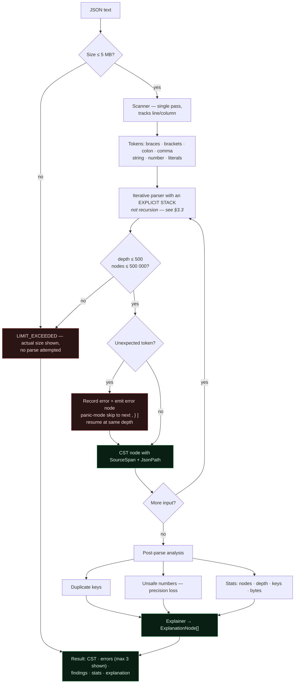

**Two design points visible in this flow.** The explicit stack (D) converts a stack-overflow crash into a clean `LIMIT_EXCEEDED`; and error recovery (G) means one missing comma still yields a usable tree for the rest of the document.

### 3.3 Scanner

Single pass, tracking line/column alongside the offset. Tokens: `{ } [ ] : ,` `String` `Number` `true` `false` `null` `EOF` `Invalid`.

String scanning handles: standard escapes, `\uXXXX` including surrogate pairs, **lone surrogates preserved rather than replaced**, and rejection of raw control characters below U+0020 (which RFC 8259 forbids and which almost every hand-built parser wrongly accepts).

Number scanning captures raw text and validates the grammar strictly: no leading `+`, no leading zeros (`01`), no bare `.5`, no trailing `5.`, no hex. Each rejection carries a message naming the specific rule.

### 3.4 Parser — iterative, not recursive

**This is the one place we deviate from recursive descent, and it is deliberate.** A 500-level-deep array (`[[[[...]]]]`) is 12 bytes of input per level; a recursive parser blows the stack at a few thousand levels, and a `RangeError` from stack exhaustion in a worker is unrecoverable-looking and impossible to attribute. An explicit stack makes depth a *number we control* and turns the failure into a clean `LIMIT_EXCEEDED` at exactly 500.

Counters enforced during parse: `depth <= 500`, `nodeCount <= 500_000`, input bytes `<= 5 MB`.

### 3.5 Error recovery

Panic-mode recovery: on an unexpected token, record the error, emit an `error` node, then skip forward to the next structurally meaningful token (`,` `}` `]`) at the current depth and resume. This yields the "one missing comma, everything else still explained" behaviour.

Errors are ranked and the first three are shown; a cascade of forty errors from one missing brace is noise.

### 3.6 Error messages

Generic parser messages are useless. Each error carries a specific, actionable hint:

| Input | Message | Hint |
|---|---|---|
| `{'a': 1}` | Strings must use double quotes | JSON does not allow single quotes. Replace `'` with `"`. |
| `{"a": 1,}` | Trailing comma before `}` | JSON forbids trailing commas (JSON5 and JavaScript allow them). |
| `{a: 1}` | Object keys must be quoted strings | Write `"a"` instead of `a`. |
| `// comment` | Comments are not valid JSON | Use JSONC/JSON5 if your tool supports it; strict JSON has no comments. |
| `{"a": undefined}` | `undefined` is not a JSON value | Use `null`. |
| `{"a": NaN}` | `NaN` and `Infinity` are not valid JSON | Use `null` or a string. |
| Unterminated string | String starting at line N is never closed | Check for a missing `"` or an unescaped `"` inside the value. |

### 3.7 Formatting

Prettify and minify operate **on the CST**, not by `JSON.stringify(JSON.parse(x))`. Round-tripping through JS values destroys raw number text (`1e5` → `100000`), reorders integer-like keys, and drops duplicates. Formatting from the CST is faithful and works on partially-invalid documents.

---

### 3.8 As built at M5

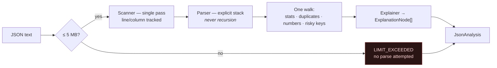

**The CST is the representation, and that is the security decision.** Object
members are an ordered array of `{key, value}` pairs, so a user key never
becomes a real object key anywhere in the product:

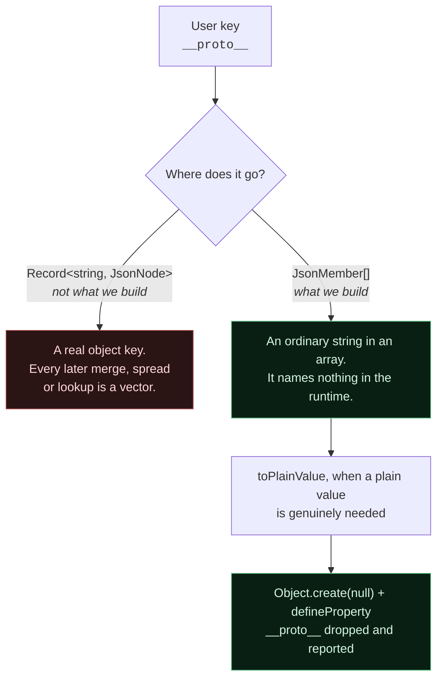

`__proto__` is *dropped* by `toPlainValue` rather than merely made an own
property. The null prototype and `defineProperty` already make the write safe
where it happens — but the value leaves there, and `Object.assign` onto an
ordinary object does use assignment, which consults the target's prototype
chain. Dropping at the boundary is what makes the guarantee survive its
consumers. A test drives exactly that path.

This is a strong structural defence, not a proof of impossibility. It removes
the vectors this parser creates and says nothing about code elsewhere that
builds objects some other way.

#### The number policy, stated exactly

Both representations are kept: `raw` is the text the user wrote, `value` is
the IEEE-754 double. Nothing here claims arbitrary precision, because the
runtime cannot provide it.

A number is reported as unsafe when it would **mislead a reader**, decided by
an exact comparison rather than a digit-count heuristic: the source text and
the double's own shortest representation are each reduced to a normalised
`digits × 10^exponent` form and compared.

| Input | Reported | Why |
|---|---|---|
| `9007199254740993` | `PRECISION_LOSS` | Reads back as `…9992`. The case that corrupts identifiers. |
| `1e400` | `OVERFLOW` | Becomes `Infinity`. |
| `-0` | `NEGATIVE_ZERO` | Compares equal to `0` and is written back as `0`. |
| `0.1` | **nothing** | Not exactly representable in binary, but round-trips to `0.1`. |
| `1e5` | **nothing** | A formatting difference, not a loss. |

Flagging the last two would put a warning on nearly every document and teach
users to ignore the one that matters.

#### The duplicate-key policy, stated exactly

Every occurrence is kept in the CST with its own span, and reported. Nothing
is collapsed (J-I4). `JSON.parse` keeps the last occurrence and tells nobody;
which one a consumer sees is genuinely ambiguous across languages — some take
the first, some reject the document — so the useful answer is "there are two,
here is where each one is." `toPlainValue` then applies the same last-wins
rule the platform does, so the plain value and `JSON.parse` agree.

#### JSON path

A **structural** path, not a query language: it names one node's position in
one document. No filtering, no wildcards, no recursive descent.

Two notations, because developers paste them into different places: `$.user.items[0]`
reads well, and `$["user"]["items"][0]` is always valid whatever the key
contains. Dot notation is used only for keys matching `[A-Za-z_$][A-Za-z0-9_$]*`;
everything else falls back to brackets. Keys are quoted character by character
rather than through `JSON.stringify`, so control characters and lone surrogates
are escaped explicitly — the same reason the parser does not use `JSON.parse`.

#### What differential testing against `JSON.parse` proves

| Claim | Established? |
|---|---|
| Our validity verdict matches the platform | ✅ Corpus × 2, plus 4 000 generated and mutated documents |
| Our values match after unescaping and conversion | ✅ Same corpus, compared structurally |
| Our positions are correct | ❌ The oracle has none. Covered by unit and property tests. |
| Our error messages are right | ❌ Engine-specific and unstable in the platform. We report more, and more specifically, by design. |
| Our duplicate-key handling matches | ❌ We differ deliberately — only the last-wins plain value is compared. |

If the verdicts disagree, we are wrong. That is the rule (J-I1).

---

## 4. Cron parser — **V1.1**, standard 5-field only

> **Built at M14, in part.** The dialect lock, the refusal path, field parsing, the timezone representation and the explanation engine are code (`src/domain/cron/`). Next-run computation (§4.4) and per-schedule DST anomaly detection (§4.6) are **not built** — M14 was scoped to the domain representation those need, and they belong to M16. Every subsection below is marked with which it is.

### 4.1 Dialect lock *(decided in Phase 1.5)*

**SyntaxLab supports exactly one cron dialect: standard 5-field cron.**

| Position | Field | Range | Names |
|---|---|---|---|
| 1 | minute | 0–59 | — |
| 2 | hour | 0–23 | — |
| 3 | day-of-month | 1–31 | — |
| 4 | month | 1–12 | `JAN`–`DEC` |
| 5 | day-of-week | 0–7 (0 and 7 both Sunday) | `SUN`–`SAT` |

Supported syntax within a field: `*`, a value, a range `a-b`, a list `a,b,c`, and a step `*/n` or `a-b/n`. Supported macros: `@yearly`, `@annually`, `@monthly`, `@weekly`, `@daily`, `@midnight`, `@hourly`. `@reboot` is *recognised and explained* as non-schedulable rather than given a next-run time.

**Explicitly not supported in V1.1:**

| Not supported | Where it comes from |
|---|---|
| 6-field seconds-first expressions | Quartz, Spring, some Kubernetes tooling |
| 7-field expressions with a year | Quartz |
| `L` (last), `W` (nearest weekday), `#` (nth weekday), `?` (unspecified) | Quartz |
| `H` (hashed/scattered) | Jenkins |
| `rate(...)` / `cron(...)` wrappers | AWS EventBridge |
| Non-standard step bases like `5/10` | Various; behaviour differs per implementation |

### 4.2 Refusing to guess — *built at M14*

**When the field count is not 5, SyntaxLab does not attempt a parse.** This is the most important behavioural rule in the cron feature.

The reasoning: a 6-field expression is ambiguous — `0 0 12 * * ?` is seconds-first Quartz, while a different 6-field convention appends a year. Guessing produces a *plausible, confidently wrong* schedule, and a wrong cron explanation causes real operational damage (`23_RISK_REGISTER.md` R-03). Refusing is strictly better than guessing.

The refusal happens on the field count alone, before any field is read — which is also why it is the fastest path in the parser (`12_PERFORMANCE.md` §13).

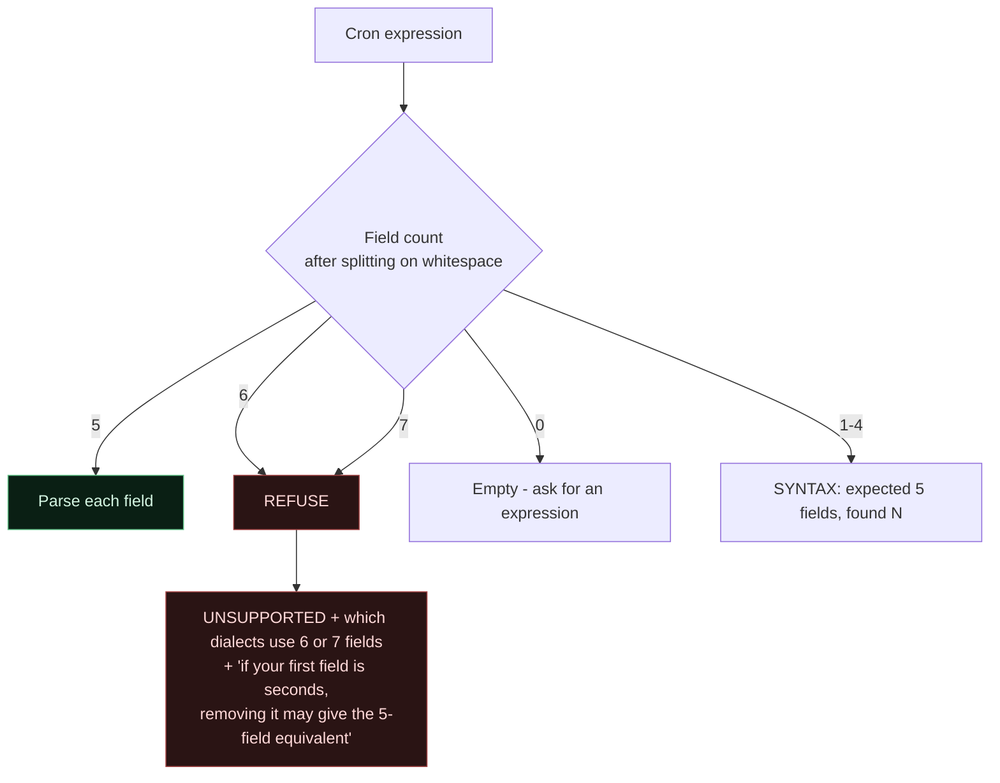

Note what is **not** on that diagram: there is no path from 6 or 7 fields to a parse. `refuseFieldCount` in `parser.ts` returns before `parseField` is ever called, and `tests/unit/cron/parser.test.ts` asserts that three different 6-field expressions all fail rather than being reinterpreted by dropping a field.

The refusal message is educational, not a dead end:

> **This expression has 6 fields. SyntaxLab supports the standard 5-field cron format — minute, hour, day-of-month, month, day-of-week.**
> Some schedulers (Quartz, Spring) put seconds first; others append a year. SyntaxLab does not guess between them, because they describe different schedules. If your first field is seconds, removing it may give the equivalent 5-field expression.

That last line converts a refusal into a next step without pretending to understand the input.

#### Macros, which are the one thing that *is* rewritten

A macro is expanded to its documented 5-field equivalent before the field count is taken, so `@weekly` and `0 0 * * 0` follow the identical path afterwards. That is a substitution from a fixed table, not an interpretation.

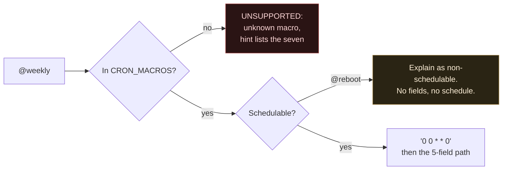

`@reboot` is the case that would be easy to get wrong. It is recognised, explained, and given a `NON_SCHEDULABLE_MACRO` warning — and it produces **zero fields**, because inventing five for it would imply a clock schedule it does not have.

#### Foreign-syntax detection — *built at M14*

Refusing on field count catches whole-expression dialect mismatches. Foreign *symbols* inside an otherwise 5-field expression are caught per field, and named rather than merely rejected.

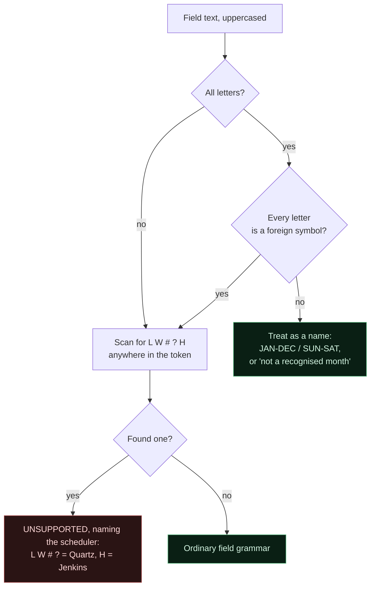

The two-branch shape at the top is not decoration; it is a bug fix with a regression test. Scanning every token for the letter `H` reported the misspelt month `SMARCH` as Jenkins syntax. Matching whole tokens instead then missed `LW` and `6#3`. The rule that holds both: a token made **entirely** of letters is foreign only when **every** letter is a foreign symbol; a token that mixes letters and digits is scanned character by character. Both cases are pinned in `tests/unit/cron/corpus.test.ts`.

### 4.3 Field parsing — *built at M14*

Each field is parsed independently against its own range table. Grammar per field: `field := term ("," term)*` where `term := "*" | value | range | term "/" step`.

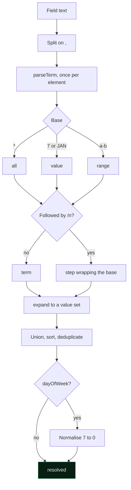

Two things that diagram is deliberate about. `terms` and `resolved` are **both** kept: `1,2,2,3` resolves to `[1,2,3]` while `terms` still records that four were written, because losing the duplicate would lose what the user typed. And day-of-week normalisation happens *after* expansion, so `0,7` collapses to a single Sunday rather than two.

Validation catches: out-of-range values, inverted ranges (`5-2` — rejected with a hint, since some implementations wrap and some error, so we refuse to guess), zero steps (which would never advance), more than one step in a term, empty list elements, and dialect-foreign characters, each mapped to the specific scheduler it comes from.

**Recovery is per field.** One bad field costs the user that field, not the whole analysis — the same posture as the regex parser (§2.5). `99 12 * * *` reports the minute error and still explains the hour.

#### Step bases, and the one place we picked a dialect

`*/n` and `a-b/n` mean the same thing everywhere. `n/m` — a step on a bare value — does not: some schedulers read it as "from n to the end of the field, every mth" and others reject it outright. SyntaxLab accepts it, applies the Vixie/cronie reading, **and says so in the warning text**:

> A step on a single value behaves differently between schedulers. This reading is "from that value to the end of the field, every nth", which is what Vixie cron and cronie do.

Expanding it to the base value alone — which is what the parser did until the M14 explanation review caught it — would have been a third reading that no scheduler implements. Between refusing and picking the dominant reading with the divergence named, picking is more useful; between picking silently and picking out loud, out loud is the only defensible one.

#### Limits

| Limit | Value | Why |
|---|---|---|
| `cron.input` | 1 000 characters | Checked before tokenising. A cron expression is not a document. |
| `cron.fields` | 5 | The dialect lock, as a number. |
| `cron.maxTokens` | 2 000 | Bounds the token list independently of the input check. |
| `cron.maxTermsPerField` | 200 | The slowest valid input in the performance table is a list at this limit, at 1.07–1.85 ms p99 across runs (`12_PERFORMANCE.md` §13). |

### 4.4 Next-run computation — **NOT BUILT.** M16

> M14 built the domain representation this needs and stopped there, by instruction: no future-occurrence generator, no recurrence engine. `CronAnalysis` carries no `nextRuns` field, and adding one is M16's work. The algorithm below is the design it will implement.

**Algorithm: field-by-field advance, not brute-force minute iteration.** Iterating minute-by-minute over five years is ~2.6 M iterations per requested run and is exactly what makes a worker look hung.

```
candidate = now truncated to the minute, +1 minute
loop (bounded by 5 years of candidates):
    if month  not in set -> advance to first day of next valid month, reset lower fields; continue
    if day    not matched (per DOM/DOW rule) -> advance one day, reset lower fields; continue
    if hour   not in set -> advance to next valid hour, reset lower; continue
    if minute not in set -> advance to next valid minute; continue
    -> candidate is a match
```

Each step jumps to the next plausible boundary, so a match is found in tens of iterations. The 5-year bound guarantees termination and yields the correct answer for genuinely unsatisfiable schedules: `0 0 30 2 *` reports **"This schedule will never run — February never has a 30th."**

Note that the resolved value sets M14 produces are exactly the inputs this needs: sorted, deduplicated, and validated in range on both sides of the worker boundary.

### 4.5 Timezone scope — reduced, deliberately — *represented at M14*

**V1.1 supports two timezone modes only: the browser's local timezone, and UTC.** Named IANA zones are deferred.

**Why the reduction.** Correct named-zone scheduling requires wall-clock arithmetic in an arbitrary zone, an inverse mapping from wall-clock time to instant (which the platform does not provide directly before `Temporal`), and correct handling of historical and future rule changes. It is achievable — offset probing is a well-established technique — but it needs a test matrix across zone types and a level of confidence that should be earned rather than assumed. Shipping named zones we have not tested to that standard would produce exactly the confidently-wrong-answer failure this feature is most exposed to.

**What V1.1 does provide, and it is not a token effort:**

| Requirement | Implementation |
|---|---|
| Show the active timezone | Always visible, never inferred silently. At M14 every analysis carries a `CronTimezoneContext` and the explanation has a `cron-timezone` section naming the mode; M15's panel header renders it. |
| Distinguish browser-local from an explicit choice | Two labelled modes: `Browser local (Europe/London)` and `UTC`. The resolved zone name is shown for browser-local so the user can see what the browser reported. |
| Never silently convert between zones | The mode travels with the request and is re-validated inside the worker. There is no hidden conversion step. |
| Label every generated time | **Invariant C-I1: no execution time is displayed without a timezone label.** A cron time without a zone is a confidently wrong answer. |
| Handle DST deliberately | See §4.6 |
| Document the semantics | The panel states which mode is active and what it means; the help dialog explains the limitation and why. |

**How the limitation is presented:** not as a missing feature, but as a stated scope. *"SyntaxLab shows schedules in your browser's timezone or in UTC. If your scheduler runs in a different timezone, the times below will not match it."* That sentence is more useful than a zone picker the user cannot fully trust.

**What M14 represents, exactly.** `resolveTimezone(mode)` produces a `CronTimezoneContext`:

| Field | `browserLocal` | `utc` |
|---|---|---|
| `mode` | `browserLocal` | `utc` |
| `ianaZone` | whatever `Intl.DateTimeFormat().resolvedOptions().timeZone` reports | `UTC` |
| `resolvedFrom` | `browserResolvedOptions` | `userSelection` |
| `currentOffsetMinutes` | the offset *now* | `0` |
| `observesDst` | whether the zone actually transitions this year, probed monthly | `false` |

`resolvedFrom` exists so the UI can say "your browser reported this" rather than "you chose this", which are different claims. `currentOffsetMinutes` is the offset at the moment of analysis and nothing more — it is not a rule set, and M14 does not pretend it is.

**The union is the lock.** `CronTimezoneMode` has two members. A named zone cannot leak in through the worker either: the payload validator checks the mode against those two strings rather than merely typing it as them, and `tests/unit/cron/semantics.test.ts` asserts that no analysis can produce a third mode.

**Upgrade path.** Named-zone support becomes a follow-up milestone **only when** the platform support and test strategy make it defensible — either via `Temporal` reaching baseline availability, or via an offset-probing implementation with the full zone-type test matrix in `13_TEST_PLAN.md`. Tracked as Q-09.

### 4.6 DST handling — *partly built at M14*

Even with only browser-local and UTC, DST is real: the browser's local zone has transitions.

**Built at M14:** a `DST_LOCAL_MODE` warning in browser-local mode **when the zone actually transitions**, and the corresponding note in UTC mode that UTC has no transitions and is therefore the easier mode to check a scheduler against. This is a *zone-level* caveat: it does not depend on a schedule's times, but it does depend on the zone.

It shipped for an afternoon as an unconditional browser-local warning, and the explanation review caught it: a reader in `Asia/Kolkata` was told their zone observes daylight-saving changes. It does not. `observesDst` now probes twelve monthly offsets and compares them — monthly resolution is enough because no real zone has run a saving period shorter than a month, and the question being asked is "caveat this zone at all", not "when exactly does it change". A false statement dressed as a caution is worse than no caution, because it teaches people to skip the warnings that are true.

**Not built — M16:** per-schedule anomaly detection, which needs the next-run computation of §4.4 before it has anything to detect.

| Case | Behaviour | Status |
|---|---|---|
| Browser-local mode selected, zone transitions | Warn that this zone observes DST changes | **built** |
| Browser-local mode selected, zone does not transition | Say so, and emit no warning | **built** |
| UTC mode selected | Note that UTC has no transitions | **built** |
| Spring forward — 02:30 does not exist | Report the run as `SKIPPED`, explain that schedulers differ (most skip; some run at 03:00) | M16 |
| Fall back — 01:30 occurs twice | Report `REPEATED`, list both instants with their offsets | M16 |

We document plainly that **different schedulers resolve DST differently**. We show what happens in wall-clock terms and warn; we do not claim to replicate any particular scheduler's DST policy. This warning is not removed by the reduced timezone scope — it is precisely why the scope was reduced.

### 4.7 The DOM/DOW rule — *built at M14*

Standard Vixie semantics: if **both** day-of-month and day-of-week are restricted, a day matches when **either** matches (OR), not both.

`0 0 1 * MON` = "midnight on the 1st of the month **and also** every Monday" — not "the 1st, if it's a Monday".

Approximately every developer reads this wrong. Therefore **whenever both fields are restricted, a warning is always emitted**, and the explanation spells out the OR reading in words. This is arguably the most valuable single output of the cron feature.

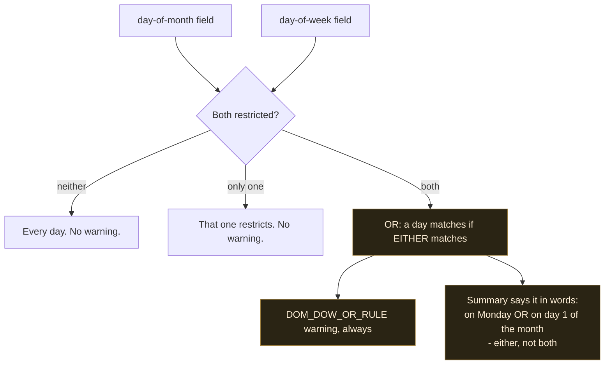

"Restricted" means *selects less than the whole field*, not *is not a literal asterisk*. `1-31` in day-of-month restricts nothing, so it does not trigger the rule — a distinction with its own regression test, because getting it wrong would fire the warning on schedules the rule does not apply to and train users to ignore it.

### 4.8 The pipeline, as built at M14

Four modules, each doing one thing, in `src/domain/cron/`:

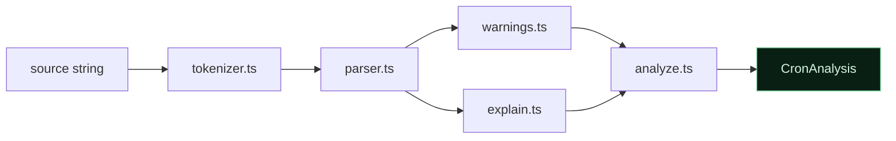

The tokenizer's contract is worth stating, because it is what makes source linking possible: it emits whitespace as tokens too, so **the token list covers the source with no gaps**. `tests/unit/cron/semantics.test.ts` asserts exactly that — each token starts where the previous one ended, and the last ends at `source.length`. Editor decorations that highlight a field need that property; a tokenizer that silently drops whitespace makes every span after the first one a guess.

The tokenizer is also structurally unable to fail to advance: every branch consumes at least one character, which discharges the termination obligation of §1.2 by construction rather than by a bound.

### 4.9 Explanation flow — *built at M14*

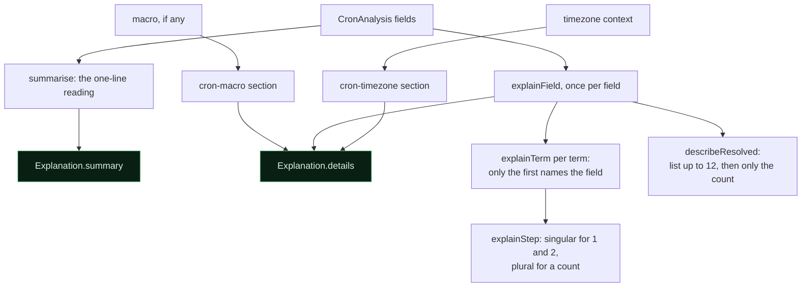

Every output is `ExplanationNode[]`. No HTML, no Markdown, and no sentence built by concatenating user text: anything the user typed goes in a `code` or `ref` node, which the renderer escapes (`05_SECURITY.md` §6).

The summary is the part that earns the feature. It resolves in this order, first match wins:

| Shape | Reads as |
|---|---|
| minute and hour both unrestricted | "every minute" |
| a single step over the whole minute field | "every 15 minutes", plus the hour window when hours are restricted |
| exactly one minute and one hour | "at 04:30" |
| one minute, many hours | "at `:30` past …" |
| many minutes | "N times an hour" |

followed by the day clause — where the OR rule is spelled out — and the month clause. A contiguous hour range reads as a window, "between 09:00 and 17:59", because that is checkable against a real scheduler and because it says out loud that `9-17` includes the whole of the 17:00 hour.

---

## 5. Explanation engine

### 5.1 Design

A set of pure functions `(node, context) => ExplanationNode[]`, dispatched on node type, composed bottom-up. No string templates containing user input; user text is always carried in a `code` or `ref` node.

```ts
function explainNode(node: RegexNode, ctx: ExplainContext): ExplanationNode[] {
  switch (node.type) {
    case 'Anchor':     return explainAnchor(node, ctx);
    case 'Quantifier': return explainQuantifier(node, ctx);
    // … exhaustive; TypeScript's never-check guarantees no node type is unhandled
  }
}
```

The exhaustiveness check matters: adding an AST node type causes a **compile error** in the explainer, so a new syntax feature can never ship silently unexplained.

### 5.2 Two registers of output

| Register | Purpose | Example for `[A-Z]{2,4}` |
|---|---|---|
| **Summary** | One paragraph, plain English, prose | "Two to four uppercase letters." |
| **Detail** | Per-token, precise, positioned | `[A-Z]` → "Character class: any single character from A to Z"; `{2,4}` → "Repeat the previous item 2 to 4 times, greedily" |

Summaries are composed from child summaries with joining rules ("then", "followed by", "or") rather than concatenated fragments — otherwise the output reads like a robot listing tokens, which is what every existing tool already does badly.

### 5.3 Context awareness

The same token means different things in different places. The explainer carries context:

| Token | Context | Explanation |
|---|---|---|
| `.` | Top level | "Any character except line breaks" |
| `.` | With `s` flag | "Any character, including line breaks" |
| `.` | Inside `[...]` | "A literal dot" |
| `^` | Start of pattern | "Start of the string" |
| `^` | With `m` flag | "Start of the string or of any line" |
| `^` | First char in `[...]` | "Negates the character class" |
| `-` | Between class members | "Range" |
| `-` | First/last in class | "A literal hyphen" |

Getting these right is the difference between a tool that teaches and a tool that misleads. Each row is a golden-file test case.

### 5.4 Testability

The engine is pure and framework-free, so its tests are trivially fast:

```ts
expect(explainRegex('^[A-Z][a-z]+$').summary).toEqual([
  { kind: 'text', value: 'Matches a string that starts with an uppercase letter, ' },
  { kind: 'text', value: 'followed by one or more lowercase letters, and nothing else.' },
]);
```

Golden files: **150+ regex, 100+ JSON, 100+ cron** cases. Golden output is reviewed by a human on change — a diff in explanation text is a product change, not an incidental one.

---

## 6. Input detection

Cheap, bounded heuristics only. **No parsing** — detection must never trigger expensive work on content the user has not committed to analysing.

**V1.0 detects two types: JSON and regex.** The cron branch is added in V1.1 and is shown commented below so the shape of the eventual function is clear.

```ts
function detectType(input: string): DetectionResult {
  const s = input.trim().slice(0, 1024);        // bounded sample
  if (!s) return { type: null, confidence: 0 };

  // JSON: structural first char + matching last char
  if (/^[{[]/.test(s) && /[}\]]$/.test(input.trim())) return { type: 'json', confidence: 0.9 };
  if (/^["\d\-]|^(true|false|null)$/.test(s))         return { type: 'json', confidence: 0.5 };

  // V1.1 — Cron: exactly 5 whitespace-separated fields of cron-legal characters, or a macro.
  //        Note the count is `=== 5`, not a 5–7 range: detection must not claim a
  //        6-field expression is cron when the parser will refuse it (§4.2).
  // const fields = s.split(/\s+/);
  // if (fields.length === 5 && fields.every(f => /^[\d*/,\-A-Za-z]+$/.test(f)) && /[\d*]/.test(s)) {
  //   return { type: 'cron', confidence: 0.85 };
  // }
  // if (/^@(annually|yearly|monthly|weekly|daily|midnight|hourly|reboot)$/i.test(s)) {
  //   return { type: 'cron', confidence: 0.95 };
  // }

  // Regex: metacharacter density
  if (/[\\^$.|?*+()[\]{}]/.test(s)) {
    const density = (s.match(/[\\^$.|?*+()[\]{}]/g)?.length ?? 0) / s.length;
    return { type: 'regex', confidence: Math.min(0.4 + density * 2, 0.8) };
  }
  return { type: null, confidence: 0 };
}
```

### 6.1 Known false positives and how the UX absorbs them

| Input | Detected (V1.0) | Reality | Mitigation |
|---|---|---|---|
| `[1,2,3]` | json (0.9) | Could be a regex character class | Correct call in most cases; override available |
| `"hello"` | json (0.5) | Probably just a string | Low confidence → suggestion shown, mode not switched |
| `a.b.c` | regex (low) | Could be a path | Low confidence → "Select a mode" state |
| `* * * * *` | regex (low, V1.0) | Cron — unsupported until V1.1 | Falls to a low-confidence regex suggestion; harmless. In V1.1 it becomes cron (0.85). |
| `{a,b}` | json (0.9) then fails | Regex quantifier-ish | JSON parse error is specific and the user overrides |

**Behaviour rules, non-negotiable:**
1. Detection **suggests**; it never silently switches an already-chosen mode.
2. Confidence < 0.6 → show "Unknown — select a mode", never guess.
3. The suggestion chip is dismissible and the dismissal sticks for the session.
4. On first paste into an empty editor with confidence ≥ 0.85, auto-selecting the mode *is* allowed, because there is nothing to disrupt. Any subsequent detection only suggests.

---

## 7. Complexity summary

| Operation | Time | Space | Bound |
|---|---|---|---|
| Regex tokenize | O(n) | O(n) | 10 KB pattern |
| Regex parse | O(n) | O(n), depth ≤ 100 | — |
| Regex explain | O(nodes) | O(nodes) | — |
| Regex **execute** | **Unbounded — engine-dependent** | Engine | **2 s wall clock, enforced by terminate()** |
| JSON scan | O(n) | O(1) streaming | 5 MB |
| JSON parse | O(n) | O(nodes), depth ≤ 500 | 500k nodes |
| JSON format | O(nodes) | O(n) | — |
| Cron parse *(V1.1)* | O(1) — bounded field count | O(1) | 1 KB |
| Cron next-run *(V1.1)* | O(runs × field jumps) | O(1) | 5-year search bound |
| Detection | O(1) — 1 KB sample | O(1) | — |

The one unbounded row is regex execution, which is exactly why it lives in a disposable thread.

---

## 8. Testing approach for parsers

### 8.1 Layers

| Layer | Method | What it can establish |
|---|---|---|
| Conformance corpus | JSONTestSuite for JSON; a curated ECMAScript construct corpus for regex | Agreement with a published, external definition of correctness |
| Golden fixtures | 150+ regex and 100+ JSON cases with human-reviewed explanation output | Explanation text is what we intend, and changes to it are deliberate |
| Differential | Compare our validity verdict against `new RegExp()` / `JSON.parse()` on every generated and corpus input | Disagreement with the platform is our bug. **The highest-value test in the suite.** |
| Property (`fast-check`) | Terminates within a step budget; never throws; spans in range and properly nested; parse→format→parse is idempotent for valid JSON | Behaviour holds across generated inputs, not just chosen ones |
| Regression fixtures | Every reported parser bug becomes a permanent named case | Bugs found once stay found |
| Performance | 1 MB JSON in a worker; 10 KB regex parse | No pathological slowdown |
| Security corpus | Pathological inputs from `13_TEST_PLAN.md` §7 | Hostile input is handled as designed |

### 8.1.1 Conformance findings from M3

Differential testing found four genuine ECMAScript conformance bugs on its
first runs. Each is now a permanent regression case, and each is a rule that a
hand-written parser gets wrong by default:

| Input | What we did | What the engine does |
|---|---|---|
| `\k<name>` with no named groups | rejected it | accepts it — Annex B makes `\k` an identity escape when the pattern contains no group names at all |
| `[a\-z]` under `/u` | rejected it | accepts it — `\-` is a valid `ClassEscape` inside a character class |
| `\01` under `/u` | accepted it | rejects it — a legacy octal escape, which `/u` forbids |
| `a(` empty group body | produced a span outside its parent | n/a — caught by the span-containment property, not by the engine |

The first three are the reason the differential suite exists: all three look
correct to a careful reader, and none would have been found by example-based
tests written from the same understanding that produced the bug.

### 8.2 What this establishes — and what it does not

The testing strategy is deliberately described in terms of **evidence**, not coverage of an unbounded space.

**We do not claim to test "all edge cases".** The input space for a regex parser is infinite, and any such claim would be unfalsifiable and therefore useless. What the layers above actually give us:

| Claim we can make | Basis |
|---|---|
| "Agrees with the platform on validity across the fuzz corpus" | Differential testing, with the corpus size stated in CI output |
| "Handles the published JSON conformance suite" | JSONTestSuite `y_*` / `n_*` / `i_*` results, reported explicitly |
| "Terminates on every input in the fuzz corpus" | Step-budget property assertion |
| "Produces the reviewed explanation for these 250+ cases" | Golden fixtures |
| "These specific pathological inputs are handled" | Named security corpus |

**Documented unsupported behaviour is part of the strategy, not a gap in it.** Where we deliberately do not support something — non-ECMAScript regex constructs (§2.0), non-5-field cron (§4.2), JSON5/JSONC syntax (§3.6), named timezones in V1.1 (§4.5) — there is a test asserting we **refuse clearly with the right message**, not a test asserting we handle it. Refusal is specified behaviour and is verified as such.

Full detail in `13_TEST_PLAN.md`.
