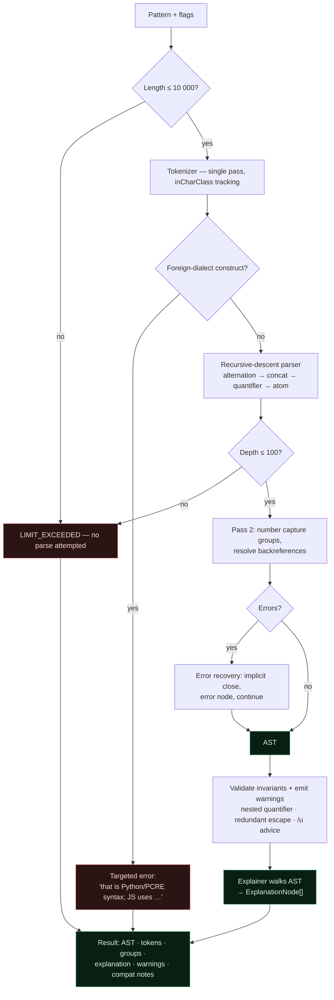
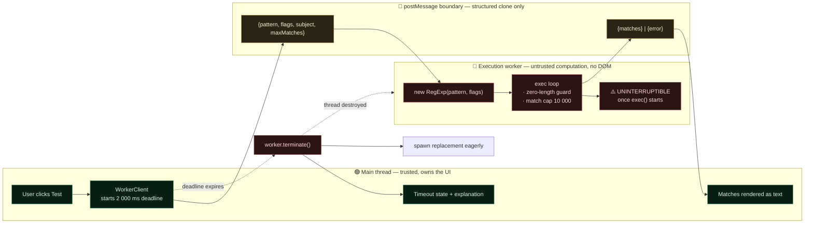
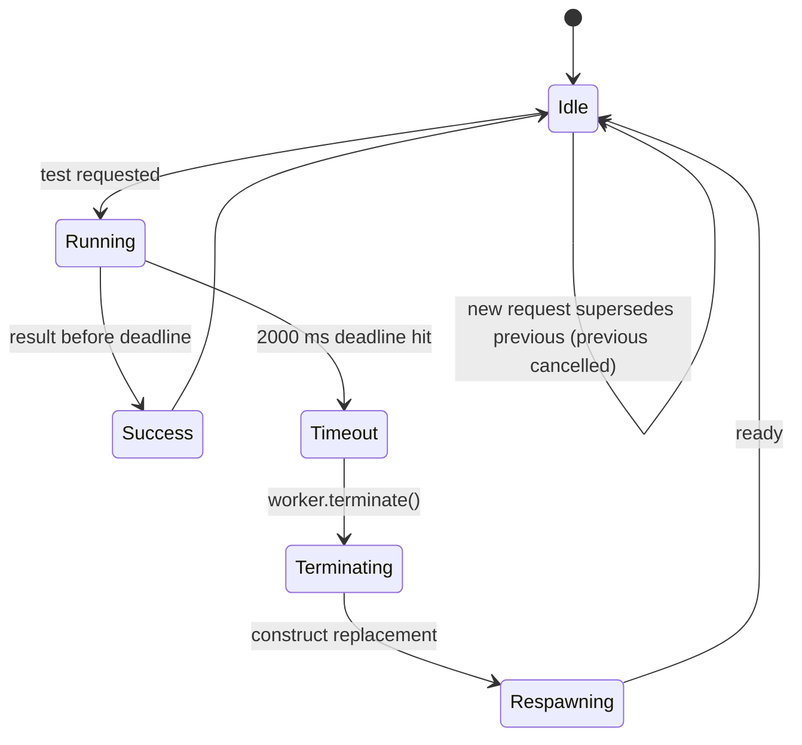
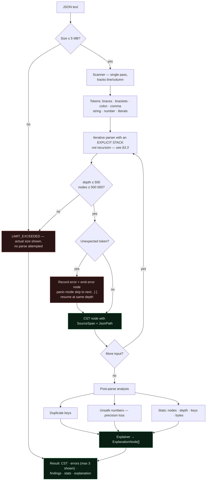
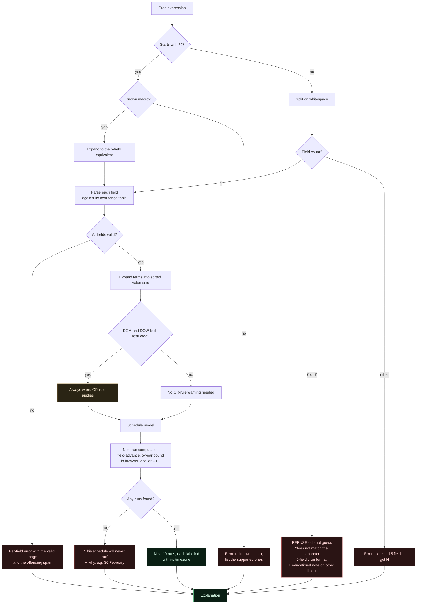

# 04 — Parser Architecture

**Project:** SyntaxLab
**Status:** Draft for human review
**Last updated:** 2026-08-17

---

> **Scope note (Phase 1.5).** **V1.0 implements the regex and JSON parsers only.** §5 (cron) is a **V1.1** specification and no cron code is written during V1.0. The three parsers are built in sequence, not in parallel — see `20_IMPLEMENTATION_PLAN.md`.

## 1. Shared design

All parsers follow the same shape, so a developer who learns one knows the others. **They are built in sequence — regex, then JSON, then (in V1.1) cron — never in parallel.** Building three parser stacks simultaneously would mean three unstable things at once and no working slice at any point.

```
input: string
   │
   ▼
┌──────────────┐   characters → tokens, each with a SourceSpan
│  Tokenizer   │   never throws; emits error tokens and continues
└──────┬───────┘
       ▼
┌──────────────┐   recursive descent (regex, cron) or explicit-stack
│    Parser    │   iteration (JSON); error recovery; Result<T, E>
└──────┬───────┘
       ▼
┌──────────────┐   AST / CST — plain, serialisable, positioned
│   Validate   │   post-parse invariant checks + warning generation
└──────┬───────┘
       ▼
┌──────────────┐   AST walk → ExplanationNode[]  (no string templating of user input)
│  Explainer   │
└──────────────┘
```

### 1.1 Non-negotiable properties

| # | Property | Why | How verified |
|---|---|---|---|
| P1 | **Total** — every string input produces a `Result`, never an uncaught throw | A crash in a worker means a blank panel and a lost analysis | 100k-case fuzz run in CI |
| P2 | **Terminating** — no input can cause an infinite loop | A spinning worker is indistinguishable from a hung app | Cursor-monotonicity assertion in dev builds; property test with step budget |
| P3 | **Bounded** — memory and node count are capped | A 5 MB deeply-nested document must not OOM the tab | Explicit `maxNodes` / `maxDepth` counters |
| P4 | **Positioned** — every node has a `SourceSpan` | Explanation↔input highlighting depends on it | Property test: spans nest correctly and stay in range |
| P5 | **Recovering** — one error does not abandon the parse | Partial understanding beats a blank screen | Golden-file tests with broken inputs |
| P6 | **Pure** — no I/O, no globals, no clock, no randomness | Testable under Node, runnable in a worker, deterministic | Lint boundary rules + deterministic golden tests |

### 1.2 Termination proof obligation

Each parser's main loop must satisfy: *every iteration either advances the cursor by ≥1, or exits*. This is asserted in development builds:

```ts
// dev-only guard compiled out of production
if (import.meta.env.DEV && cursor <= lastCursor) {
  throw new Error(`parser stalled at ${cursor}`);
}
```

This turns "we believe it terminates" into "a test fails loudly the moment it does not". It is the cheapest possible defence against the worst possible bug.

---

## 2. Regex parser

### 2.0 Flavour lock: ECMAScript only

**V1.0 parses, explains, and executes ECMAScript (JavaScript) regular expressions, and nothing else.** The tester runs the pattern through the browser's own `RegExp`, so any other claim would misrepresent what the user is seeing. Rationale and the user-visible surfacing are in `01_PRD.md` §7.

**Foreign-dialect detection.** The tokenizer recognises constructs that are valid in other engines but not in ECMAScript, and converts them into the most useful error in the product:

| Construct | Origin | Message |
|---|---|---|
| `(?P<name>…)` | Python | "`(?P<name>…)` is Python syntax. JavaScript uses `(?<name>…)`." |
| `(?P=name)` | Python | "Python back-reference syntax. JavaScript uses `\k<name>`." |
| `(?>…)` | PCRE, Java | "Atomic groups are not supported in JavaScript." |
| `a*+`, `a++`, `a?+` | PCRE, Java | "Possessive quantifiers are not supported in JavaScript." |
| `(?R)`, `(?1)` | PCRE | "Recursion is not supported in JavaScript." |
| `\A`, `\Z`, `\z` | PCRE, Python | "Use `^` and `$` (with the `m` flag if needed)." |
| `\h`, `\R`, `\K` | PCRE | "Not supported in JavaScript." |
| `(?#comment)` | PCRE | "Inline comments are not supported in JavaScript." |

This is a **recognition table, not a second parser.** It adds a small set of patterns to the existing error path; it does not introduce a dialect abstraction, a strategy interface, or any configuration surface. Building extensibility for a second flavour now would be speculative complexity — the AST and explainer simply do not *preclude* an explanation-only mode later (`01_PRD.md` §7.3).

### 2.1 Regex analysis flow



All of the above runs in the **analysis worker**. Execution against a test string is a separate path with a separate threat profile — §2.7.

### 2.2 Grammar (target: ECMAScript patterns)

```
Pattern      := Disjunction
Disjunction  := Alternative ("|" Alternative)*
Alternative  := Term*
Term         := Assertion | Atom Quantifier?
Assertion    := "^" | "$" | "\b" | "\B" | Lookaround
Lookaround   := "(?=" Disjunction ")" | "(?!" Disjunction ")"
              | "(?<=" Disjunction ")" | "(?<!" Disjunction ")"
Atom         := PatternCharacter | "." | AtomEscape | CharacterClass
              | "(" GroupSpecifier Disjunction ")" | "(?:" Disjunction ")"
Quantifier   := ("*" | "+" | "?" | "{" n ("," m?)? "}") "?"?
```

### 2.3 Tokenizer

Single left-to-right pass over UTF-16 code units, with surrogate-pair awareness when the `u`/`v` flag is set. Token kinds:

`Char` · `Dot` · `Anchor` · `GroupOpen` · `GroupClose` · `Alternate` · `ClassOpen` · `ClassClose` · `Quantifier` · `Escape` · `UnicodeProperty` · `Backreference` · `Invalid`

The tokenizer is **context-sensitive in exactly one place**: inside `[...]` most metacharacters lose their meaning. Rather than a full mode stack, the tokenizer tracks a boolean `inCharClass` — that is the entire complexity, and the JS grammar genuinely needs no more.

Ambiguities resolved per the ECMAScript spec, not per intuition:

| Input | Resolution |
|---|---|
| `{` not starting a valid quantifier | Literal `{` (Annex B web-compat), **except** under `/u` where it is a syntax error |
| `]` outside a class | Literal `]` (Annex B), error under `/u` |
| `\8` with fewer than 8 groups | Octal-ish legacy escape without `/u`; error with `/u` |
| `[a-\d]` | Error under `/u`; Annex B literal `-` otherwise |
| `\p{...}` without `/u` | Literal `p{...}` — and we emit `UNICODE_FLAG_ADVISED`, because this is a very common real bug |

**The rule:** where Annex B and strict-unicode disagree, we implement both and report which applies given the active flags. Explaining the pattern the user's engine will actually run is the whole point.

### 2.4 Parser

Recursive descent with explicit precedence: alternation (lowest) → concatenation → quantification → atom (highest).

Recursion depth is capped at **100 nested groups**. Beyond that we return `LIMIT_EXCEEDED` rather than risk a stack overflow — a thrown `RangeError` from a blown stack in a worker is much harder to present usefully than a deliberate limit.

**Two passes.** The first builds the tree. The second assigns capture-group numbers and resolves backreferences, because `\1(a)` is legal and forward references cannot be resolved in a single pass.

### 2.5 Error recovery

| Situation | Recovery |
|---|---|
| Unclosed group | Close implicitly at end-of-input, record error at the opening paren |
| Unclosed char class | Same; error at `[` |
| Quantifier with nothing to quantify (`*abc`) | Treat as literal under Annex B, error under `/u`, record the difference |
| Invalid escape | Emit `CharEscape` with `escape: 'invalid'`, keep parsing |
| Unbalanced `)` | Record error, skip the character, continue |

Recovery lets a user with one typo in a 200-character pattern still read the explanation for the other 199 characters.

### 2.6 Regex execution — separate from parsing

Parsing is safe (our code, provably terminating). **Execution is not** (the engine's code, uninterruptible). The exec worker is therefore deliberately minimal:

```ts
// exec.worker.ts — kept small on purpose: this thread will be killed regularly
self.onmessage = (e) => {
  const { id, pattern, flags, subject, maxMatches } = e.data;
  try {
    const re = new RegExp(pattern, flags);        // may throw SyntaxError — that's fine
    const matches = [];
    if (re.global || re.sticky) {
      let m, guard = 0;
      while ((m = re.exec(subject)) !== null) {
        matches.push(serialize(m));
        if (m[0] === '') re.lastIndex++;          // zero-length match: prevent infinite loop
        if (++guard >= maxMatches) break;
      }
    } else {
      const m = re.exec(subject);
      if (m) matches.push(serialize(m));
    }
    self.postMessage({ id, ok: true, matches, truncated: matches.length >= maxMatches });
  } catch (err) {
    self.postMessage({ id, ok: false, code: 'SYNTAX', message: String(err?.message ?? err) });
  }
};
```

Three details that are easy to get wrong and each cause a hang:

1. **Zero-length matches.** `/(?:)/g` against any string loops forever unless `lastIndex` is advanced manually. Guarded above.
2. **`lastIndex` statefulness.** A fresh `RegExp` is constructed per request; a reused object with `g` carries `lastIndex` between calls and returns wrong results.
3. **Match count cap.** `/a/g` against 1 M `a`s produces a million match objects. Capped, with `truncated: true` shown honestly in the UI.

**`new RegExp(userPattern)` is not `eval`.** The `RegExp` constructor compiles a pattern in the regex grammar; it cannot execute arbitrary JavaScript. This is stated explicitly here and in `05_SECURITY.md` §3 because it looks superficially similar to a dynamic-code sink and will otherwise be raised in every review.

### 2.7 Timeout mechanism and the execution security boundary

**The security boundary around regex execution**, which is the single most safety-critical flow in the product:



**Invariants this diagram encodes:**

1. **User regex never executes on the main thread.** If workers are unavailable, the tester is disabled — not relocated (`02_ARCHITECTURE.md` §4.5).
2. **`terminate()` is the only interrupt.** There is no cooperative cancellation, because `RegExp.exec` yields to nothing.
3. **Termination must not damage unrelated state.** This is why the execution worker is separate from the analysis worker: killing a combined worker would also discard parser state and any in-flight unrelated request.
4. **The replacement is spawned eagerly**, so the next test does not pay startup latency on top of a two-second wait.




The replacement worker is spawned **eagerly** after a termination, not lazily on the next request, so the user's next test does not pay worker-startup latency on top of having just waited two seconds.

### 2.8 ReDoS: what we actually claim

| Claim | True? |
|---|---|
| "The UI never freezes due to user regex" | ✅ Yes — execution is off the main thread and terminable |
| "We detect all dangerous patterns" | ❌ No — the warning heuristic has false negatives |
| "The regex is stopped after 2 s" | ✅ Yes — by thread termination |
| "The CPU stops burning immediately" | ✅ Yes — `terminate()` kills the thread |
| "SyntaxLab is safe to use with any pattern" | ⚠️ For *this tab*, yes. We warn that the same pattern in a Node server has no such protection — which is the actually valuable message. |

---

## 3. JSON parser

### 3.1 Why not `JSON.parse`

| Requirement | `JSON.parse` |
|---|---|
| Error line/column/caret | ❌ Message format is engine-specific and unstable across browsers |
| Multiple errors | ❌ Throws on the first |
| Source positions for tree↔editor linking | ❌ None |
| Duplicate-key detection | ❌ Silently keeps the last |
| Raw number text (precision-loss detection) | ❌ Already coerced to `number` |
| Key-order preservation with integer-like keys | ❌ V8 reorders `{"2":…,"1":…}` |
| Prototype-safe structure | ⚠️ Requires a reviver, easy to forget |

`JSON.parse` is used in exactly one place: as a **differential oracle in tests**. If our parser and `JSON.parse` disagree about validity, our parser is wrong.

### 3.2 JSON analysis flow



**Two design points visible in this flow.** The explicit stack (D) converts a stack-overflow crash into a clean `LIMIT_EXCEEDED`; and error recovery (G) means one missing comma still yields a usable tree for the rest of the document.

### 3.3 Scanner

Single pass, tracking line/column alongside the offset. Tokens: `{ } [ ] : ,` `String` `Number` `true` `false` `null` `EOF` `Invalid`.

String scanning handles: standard escapes, `\uXXXX` including surrogate pairs, **lone surrogates preserved rather than replaced**, and rejection of raw control characters below U+0020 (which RFC 8259 forbids and which almost every hand-built parser wrongly accepts).

Number scanning captures raw text and validates the grammar strictly: no leading `+`, no leading zeros (`01`), no bare `.5`, no trailing `5.`, no hex. Each rejection carries a message naming the specific rule.

### 3.4 Parser — iterative, not recursive

**This is the one place we deviate from recursive descent, and it is deliberate.** A 500-level-deep array (`[[[[...]]]]`) is 12 bytes of input per level; a recursive parser blows the stack at a few thousand levels, and a `RangeError` from stack exhaustion in a worker is unrecoverable-looking and impossible to attribute. An explicit stack makes depth a *number we control* and turns the failure into a clean `LIMIT_EXCEEDED` at exactly 500.

Counters enforced during parse: `depth <= 500`, `nodeCount <= 500_000`, input bytes `<= 5 MB`.

### 3.5 Error recovery

Panic-mode recovery: on an unexpected token, record the error, emit an `error` node, then skip forward to the next structurally meaningful token (`,` `}` `]`) at the current depth and resume. This yields the "one missing comma, everything else still explained" behaviour.

Errors are ranked and the first three are shown; a cascade of forty errors from one missing brace is noise.

### 3.6 Error messages

Generic parser messages are useless. Each error carries a specific, actionable hint:

| Input | Message | Hint |
|---|---|---|
| `{'a': 1}` | Strings must use double quotes | JSON does not allow single quotes. Replace `'` with `"`. |
| `{"a": 1,}` | Trailing comma before `}` | JSON forbids trailing commas (JSON5 and JavaScript allow them). |
| `{a: 1}` | Object keys must be quoted strings | Write `"a"` instead of `a`. |
| `// comment` | Comments are not valid JSON | Use JSONC/JSON5 if your tool supports it; strict JSON has no comments. |
| `{"a": undefined}` | `undefined` is not a JSON value | Use `null`. |
| `{"a": NaN}` | `NaN` and `Infinity` are not valid JSON | Use `null` or a string. |
| Unterminated string | String starting at line N is never closed | Check for a missing `"` or an unescaped `"` inside the value. |

### 3.7 Formatting

Prettify and minify operate **on the CST**, not by `JSON.stringify(JSON.parse(x))`. Round-tripping through JS values destroys raw number text (`1e5` → `100000`), reorders integer-like keys, and drops duplicates. Formatting from the CST is faithful and works on partially-invalid documents.

---

## 4. Cron parser — **V1.1**, standard 5-field only

> **This entire section is a V1.1 specification.** No cron code is written during V1.0. It is documented now so the V1.1 scope is locked and cannot creep.

### 4.1 Dialect lock *(decided in Phase 1.5)*

**SyntaxLab supports exactly one cron dialect: standard 5-field cron.**

| Position | Field | Range | Names |
|---|---|---|---|
| 1 | minute | 0–59 | — |
| 2 | hour | 0–23 | — |
| 3 | day-of-month | 1–31 | — |
| 4 | month | 1–12 | `JAN`–`DEC` |
| 5 | day-of-week | 0–7 (0 and 7 both Sunday) | `SUN`–`SAT` |

Supported syntax within a field: `*`, a value, a range `a-b`, a list `a,b,c`, and a step `*/n` or `a-b/n`. Supported macros: `@yearly`, `@annually`, `@monthly`, `@weekly`, `@daily`, `@midnight`, `@hourly`. `@reboot` is *recognised and explained* as non-schedulable rather than given a next-run time.

**Explicitly not supported in V1.1:**

| Not supported | Where it comes from |
|---|---|
| 6-field seconds-first expressions | Quartz, Spring, some Kubernetes tooling |
| 7-field expressions with a year | Quartz |
| `L` (last), `W` (nearest weekday), `#` (nth weekday), `?` (unspecified) | Quartz |
| `H` (hashed/scattered) | Jenkins |
| `rate(...)` / `cron(...)` wrappers | AWS EventBridge |
| Non-standard step bases like `5/10` | Various; behaviour differs per implementation |

### 4.2 Refusing to guess

**When the field count is not 5, SyntaxLab does not attempt a parse.** This is the most important behavioural rule in the cron feature.

The reasoning: a 6-field expression is ambiguous — `0 0 12 * * ?` is seconds-first Quartz, while a different 6-field convention appends a year. Guessing produces a *plausible, confidently wrong* schedule, and a wrong cron explanation causes real operational damage (`23_RISK_REGISTER.md` R-03). Refusing is strictly better than guessing.



The refusal message is educational, not a dead end:

> **This expression does not match SyntaxLab's supported 5-field cron format.**
> It has 6 fields. Some schedulers (Quartz, Spring) put **seconds** first; others append a **year**. SyntaxLab supports the standard 5-field format — minute, hour, day-of-month, month, day-of-week — and does not guess between the alternatives, because they produce different schedules.
> If your first field is seconds, removing it may give you the equivalent 5-field expression.

That last line converts a refusal into a next step without pretending to understand the input.

### 4.3 Field parsing

Each field is parsed independently against its own range table. Grammar per field: `field := term ("," term)*` where `term := "*" | value | range | term "/" step`.

Validation catches: out-of-range values, inverted ranges (`5-2` — rejected with a hint, since some implementations wrap and some error, so we refuse to guess), zero or negative steps, and dialect-foreign characters (`L`, `W`, `#`, `?`, `H`), each mapped to the specific scheduler it comes from.

### 4.4 Next-run computation

**Algorithm: field-by-field advance, not brute-force minute iteration.** Iterating minute-by-minute over five years is ~2.6 M iterations per requested run and is exactly what makes a worker look hung.

```
candidate = now truncated to the minute, +1 minute
loop (bounded by 5 years of candidates):
    if month  not in set -> advance to first day of next valid month, reset lower fields; continue
    if day    not matched (per DOM/DOW rule) -> advance one day, reset lower fields; continue
    if hour   not in set -> advance to next valid hour, reset lower; continue
    if minute not in set -> advance to next valid minute; continue
    -> candidate is a match
```

Each step jumps to the next plausible boundary, so a match is found in tens of iterations. The 5-year bound guarantees termination and yields the correct answer for genuinely unsatisfiable schedules: `0 0 30 2 *` reports **"This schedule will never run — February never has a 30th."**

### 4.5 Timezone scope — reduced, deliberately

**V1.1 supports two timezone modes only: the browser's local timezone, and UTC.** Named IANA zones are deferred.

**Why the reduction.** Correct named-zone scheduling requires wall-clock arithmetic in an arbitrary zone, an inverse mapping from wall-clock time to instant (which the platform does not provide directly before `Temporal`), and correct handling of historical and future rule changes. It is achievable — offset probing is a well-established technique — but it needs a test matrix across zone types and a level of confidence that should be earned rather than assumed. Shipping named zones we have not tested to that standard would produce exactly the confidently-wrong-answer failure this feature is most exposed to.

**What V1.1 does provide, and it is not a token effort:**

| Requirement | Implementation |
|---|---|
| Show the active timezone | Always visible, never inferred silently. The next-runs panel header names it. |
| Distinguish browser-local from an explicit choice | Two labelled modes: `Browser local (Europe/London)` and `UTC`. The resolved zone name is shown for browser-local so the user can see what the browser reported. |
| Never silently convert between zones | Times are computed in the selected mode and displayed in it. There is no hidden conversion step. |
| Label every generated time | **Invariant C-I1: no execution time is displayed without a timezone label.** A cron time without a zone is a confidently wrong answer. |
| Handle DST deliberately | See §4.6 |
| Document the semantics | The panel states which mode is active and what it means; the help dialog explains the limitation and why. |

**How the limitation is presented:** not as a missing feature, but as a stated scope. *"SyntaxLab shows schedules in your browser's timezone or in UTC. If your scheduler runs in a different timezone, the times below will not match it."* That sentence is more useful than a zone picker the user cannot fully trust.

**Upgrade path.** Named-zone support becomes a follow-up milestone **only when** the platform support and test strategy make it defensible — either via `Temporal` reaching baseline availability, or via an offset-probing implementation with the full zone-type test matrix in `13_TEST_PLAN.md`. Tracked as Q-09.

### 4.6 DST handling

Even with only browser-local and UTC, DST is real: the browser's local zone has transitions.

| Case | Behaviour | UI |
|---|---|---|
| Spring forward — 02:30 does not exist | Report the run as `SKIPPED`, explain that schedulers differ (most skip; some run at 03:00) | warning badge + explanation |
| Fall back — 01:30 occurs twice | Report `REPEATED`, list both instants with their offsets | warning badge |
| UTC mode | No transitions; stated explicitly as a reason to prefer UTC for verification | info note |

We document plainly that **different schedulers resolve DST differently**. We show what happens in wall-clock terms and warn; we do not claim to replicate any particular scheduler's DST policy. This warning is not removed by the reduced timezone scope — it is precisely why the scope was reduced.

### 4.7 The DOM/DOW rule

Standard Vixie semantics: if **both** day-of-month and day-of-week are restricted, a day matches when **either** matches (OR), not both.

`0 0 1 * MON` = "midnight on the 1st of the month **and also** every Monday" — not "the 1st, if it's a Monday".

Approximately every developer reads this wrong. Therefore **whenever both fields are restricted, a warning is always emitted**, and the explanation spells out the OR reading in words. This is arguably the most valuable single output of the cron feature.

---

## 5. Explanation engine

### 5.1 Design

A set of pure functions `(node, context) => ExplanationNode[]`, dispatched on node type, composed bottom-up. No string templates containing user input; user text is always carried in a `code` or `ref` node.

```ts
function explainNode(node: RegexNode, ctx: ExplainContext): ExplanationNode[] {
  switch (node.type) {
    case 'Anchor':     return explainAnchor(node, ctx);
    case 'Quantifier': return explainQuantifier(node, ctx);
    // … exhaustive; TypeScript's never-check guarantees no node type is unhandled
  }
}
```

The exhaustiveness check matters: adding an AST node type causes a **compile error** in the explainer, so a new syntax feature can never ship silently unexplained.

### 5.2 Two registers of output

| Register | Purpose | Example for `[A-Z]{2,4}` |
|---|---|---|
| **Summary** | One paragraph, plain English, prose | "Two to four uppercase letters." |
| **Detail** | Per-token, precise, positioned | `[A-Z]` → "Character class: any single character from A to Z"; `{2,4}` → "Repeat the previous item 2 to 4 times, greedily" |

Summaries are composed from child summaries with joining rules ("then", "followed by", "or") rather than concatenated fragments — otherwise the output reads like a robot listing tokens, which is what every existing tool already does badly.

### 5.3 Context awareness

The same token means different things in different places. The explainer carries context:

| Token | Context | Explanation |
|---|---|---|
| `.` | Top level | "Any character except line breaks" |
| `.` | With `s` flag | "Any character, including line breaks" |
| `.` | Inside `[...]` | "A literal dot" |
| `^` | Start of pattern | "Start of the string" |
| `^` | With `m` flag | "Start of the string or of any line" |
| `^` | First char in `[...]` | "Negates the character class" |
| `-` | Between class members | "Range" |
| `-` | First/last in class | "A literal hyphen" |

Getting these right is the difference between a tool that teaches and a tool that misleads. Each row is a golden-file test case.

### 5.4 Testability

The engine is pure and framework-free, so its tests are trivially fast:

```ts
expect(explainRegex('^[A-Z][a-z]+$').summary).toEqual([
  { kind: 'text', value: 'Matches a string that starts with an uppercase letter, ' },
  { kind: 'text', value: 'followed by one or more lowercase letters, and nothing else.' },
]);
```

Golden files: **150+ regex, 100+ JSON, 100+ cron** cases. Golden output is reviewed by a human on change — a diff in explanation text is a product change, not an incidental one.

---

## 6. Input detection

Cheap, bounded heuristics only. **No parsing** — detection must never trigger expensive work on content the user has not committed to analysing.

**V1.0 detects two types: JSON and regex.** The cron branch is added in V1.1 and is shown commented below so the shape of the eventual function is clear.

```ts
function detectType(input: string): DetectionResult {
  const s = input.trim().slice(0, 1024);        // bounded sample
  if (!s) return { type: null, confidence: 0 };

  // JSON: structural first char + matching last char
  if (/^[{[]/.test(s) && /[}\]]$/.test(input.trim())) return { type: 'json', confidence: 0.9 };
  if (/^["\d\-]|^(true|false|null)$/.test(s))         return { type: 'json', confidence: 0.5 };

  // V1.1 — Cron: exactly 5 whitespace-separated fields of cron-legal characters, or a macro.
  //        Note the count is `=== 5`, not a 5–7 range: detection must not claim a
  //        6-field expression is cron when the parser will refuse it (§4.2).
  // const fields = s.split(/\s+/);
  // if (fields.length === 5 && fields.every(f => /^[\d*/,\-A-Za-z]+$/.test(f)) && /[\d*]/.test(s)) {
  //   return { type: 'cron', confidence: 0.85 };
  // }
  // if (/^@(annually|yearly|monthly|weekly|daily|midnight|hourly|reboot)$/i.test(s)) {
  //   return { type: 'cron', confidence: 0.95 };
  // }

  // Regex: metacharacter density
  if (/[\\^$.|?*+()[\]{}]/.test(s)) {
    const density = (s.match(/[\\^$.|?*+()[\]{}]/g)?.length ?? 0) / s.length;
    return { type: 'regex', confidence: Math.min(0.4 + density * 2, 0.8) };
  }
  return { type: null, confidence: 0 };
}
```

### 6.1 Known false positives and how the UX absorbs them

| Input | Detected (V1.0) | Reality | Mitigation |
|---|---|---|---|
| `[1,2,3]` | json (0.9) | Could be a regex character class | Correct call in most cases; override available |
| `"hello"` | json (0.5) | Probably just a string | Low confidence → suggestion shown, mode not switched |
| `a.b.c` | regex (low) | Could be a path | Low confidence → "Select a mode" state |
| `* * * * *` | regex (low, V1.0) | Cron — unsupported until V1.1 | Falls to a low-confidence regex suggestion; harmless. In V1.1 it becomes cron (0.85). |
| `{a,b}` | json (0.9) then fails | Regex quantifier-ish | JSON parse error is specific and the user overrides |

**Behaviour rules, non-negotiable:**
1. Detection **suggests**; it never silently switches an already-chosen mode.
2. Confidence < 0.6 → show "Unknown — select a mode", never guess.
3. The suggestion chip is dismissible and the dismissal sticks for the session.
4. On first paste into an empty editor with confidence ≥ 0.85, auto-selecting the mode *is* allowed, because there is nothing to disrupt. Any subsequent detection only suggests.

---

## 7. Complexity summary

| Operation | Time | Space | Bound |
|---|---|---|---|
| Regex tokenize | O(n) | O(n) | 10 KB pattern |
| Regex parse | O(n) | O(n), depth ≤ 100 | — |
| Regex explain | O(nodes) | O(nodes) | — |
| Regex **execute** | **Unbounded — engine-dependent** | Engine | **2 s wall clock, enforced by terminate()** |
| JSON scan | O(n) | O(1) streaming | 5 MB |
| JSON parse | O(n) | O(nodes), depth ≤ 500 | 500k nodes |
| JSON format | O(nodes) | O(n) | — |
| Cron parse *(V1.1)* | O(1) — bounded field count | O(1) | 1 KB |
| Cron next-run *(V1.1)* | O(runs × field jumps) | O(1) | 5-year search bound |
| Detection | O(1) — 1 KB sample | O(1) | — |

The one unbounded row is regex execution, which is exactly why it lives in a disposable thread.

---

## 8. Testing approach for parsers

### 8.1 Layers

| Layer | Method | What it can establish |
|---|---|---|
| Conformance corpus | JSONTestSuite for JSON; a curated ECMAScript construct corpus for regex | Agreement with a published, external definition of correctness |
| Golden fixtures | 150+ regex and 100+ JSON cases with human-reviewed explanation output | Explanation text is what we intend, and changes to it are deliberate |
| Differential | Compare our validity verdict against `new RegExp()` / `JSON.parse()` on every generated and corpus input | Disagreement with the platform is our bug. **The highest-value test in the suite.** |
| Property (`fast-check`) | Terminates within a step budget; never throws; spans in range and properly nested; parse→format→parse is idempotent for valid JSON | Behaviour holds across generated inputs, not just chosen ones |
| Regression fixtures | Every reported parser bug becomes a permanent named case | Bugs found once stay found |
| Performance | 1 MB JSON in a worker; 10 KB regex parse | No pathological slowdown |
| Security corpus | Pathological inputs from `13_TEST_PLAN.md` §7 | Hostile input is handled as designed |

### 8.2 What this establishes — and what it does not

The testing strategy is deliberately described in terms of **evidence**, not coverage of an unbounded space.

**We do not claim to test "all edge cases".** The input space for a regex parser is infinite, and any such claim would be unfalsifiable and therefore useless. What the layers above actually give us:

| Claim we can make | Basis |
|---|---|
| "Agrees with the platform on validity across the fuzz corpus" | Differential testing, with the corpus size stated in CI output |
| "Handles the published JSON conformance suite" | JSONTestSuite `y_*` / `n_*` / `i_*` results, reported explicitly |
| "Terminates on every input in the fuzz corpus" | Step-budget property assertion |
| "Produces the reviewed explanation for these 250+ cases" | Golden fixtures |
| "These specific pathological inputs are handled" | Named security corpus |

**Documented unsupported behaviour is part of the strategy, not a gap in it.** Where we deliberately do not support something — non-ECMAScript regex constructs (§2.0), non-5-field cron (§4.2), JSON5/JSONC syntax (§3.6), named timezones in V1.1 (§4.5) — there is a test asserting we **refuse clearly with the right message**, not a test asserting we handle it. Refusal is specified behaviour and is verified as such.

Full detail in `13_TEST_PLAN.md`.
