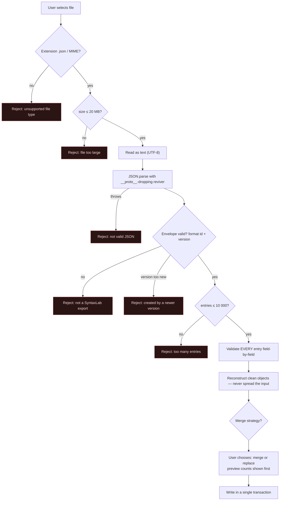
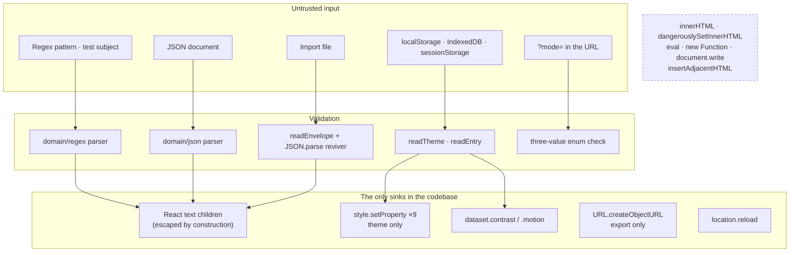
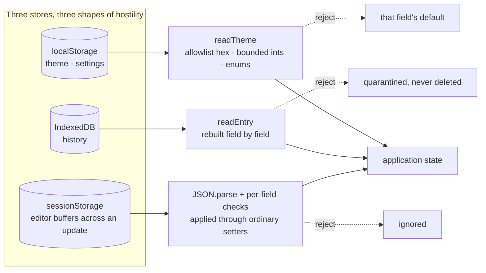
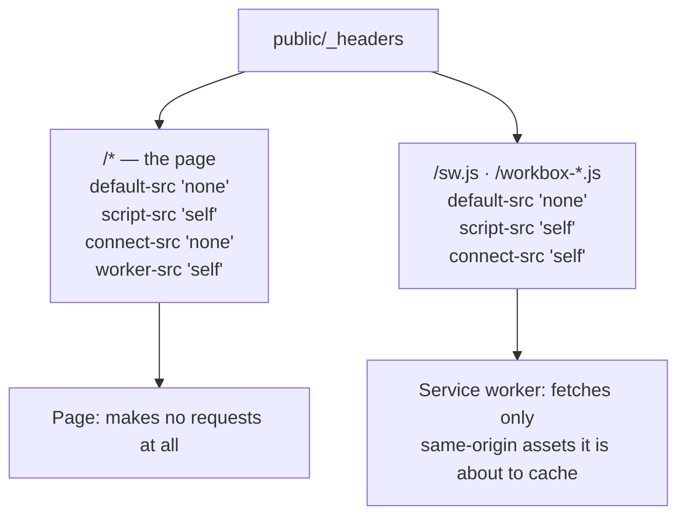

# 05 — Security

**Project:** SyntaxLab
**Status:** Draft for human review
**Last updated:** 2026-08-17

> This document states concrete mitigations, explicit assumptions, and residual risks.
> It does not contain the sentence "the app is secure", because that sentence carries no information.
> `14_THREAT_MODEL.md` holds the structured attacker/asset/boundary analysis. This document holds the controls.

> **Scope note (Phase 1.5).** V1.0 covers Regex + JSON. Cron is V1.1. **Share URLs are deferred to V1.1+** — §11 is retained as a specification for the deferred feature, not a V1.0 deliverable, which removes one untrusted input path from the V1.0 attack surface.

> **Language policy (Phase 1.5).** This document was revised to remove absolute security claims. Controls are described by what they *do*, not by what they make impossible. Defence-in-depth reduces risk; it does not constitute proof. Where a property genuinely is structural (e.g. "the codebase contains no HTML-string rendering path"), it is stated as a property of the implementation and paired with the enforcement that keeps it true.

---

## 1. Security posture summary

SyntaxLab is a static, client-only application. That eliminates whole categories of risk (no server to compromise, no database to inject into, no session to hijack, no authorisation to bypass) and concentrates the remaining risk in five places:

| # | Where the real risk is | Primary control |
|---|---|---|
| 1 | Rendering user content in the DOM | Structural: no HTML-string rendering path exists anywhere |
| 2 | Executing user-supplied regex | Thread isolation + termination |
| 3 | Reading attacker-controlled data from storage / URL / files | Validate-on-read at every boundary |
| 4 | Building JS objects from user JSON | Prototype-safe data structures |
| 5 | Our own dependency supply chain | Minimal set, pinned, audited, CSP-constrained |

**What being static does not fix:** XSS is still possible if we render HTML strings; a ReDoS still freezes a tab; a malicious dependency still runs with full origin access; prototype pollution is a client-side bug. "No backend" is not a security control by itself. It reduces surface; it does not grant immunity.

**How to read the claims in this document.** Each control is described by its mechanism and its limits. Controls compose into defence-in-depth: several independent layers each reduce the probability or impact of an attack. None of them, individually or together, is offered as a guarantee. Where this document says a control "blocks" something, it means the browser enforces that restriction as specified — subject to the assumptions in §16 and the browser behaving correctly.

---

## 2. Cross-site scripting (XSS)

### 2.1 The primary defence: no HTML-string rendering path

Every piece of user content that reaches the screen does so as a **React text child**, which React escapes. The application contains **zero** instances of:

- `dangerouslySetInnerHTML`
- `element.innerHTML` / `outerHTML` assignment
- `document.write`
- `insertAdjacentHTML`
- `DOMParser` on user content
- `Element.setAttribute` with an unvalidated attribute name

This is enforced by ESLint (`react/no-danger: error`, `no-restricted-properties` for `innerHTML`, `no-restricted-globals`) and by a CI grep that fails the build on any occurrence. It is not enforced by remembering.

The key enabler is ADR-011 in `02_ARCHITECTURE.md`: the explanation engine returns `ExplanationNode[]`, a typed tree, not a markdown/HTML string. **The application's analysis-output path therefore has no HTML sink** — user content becomes a text node, not markup. This is why we need no sanitiser dependency: sanitisers are for architectures that decided to render HTML and then had to make it safe.

**What this achieves, stated precisely.** It removes the sink that would otherwise be exercised on *every single analysis*, since explanations quote the user's own tokens. That is the highest-frequency injection opportunity in the product, and it is closed by construction rather than by filtering. It does not make XSS impossible in the application as a whole — see §2.4.

### 2.2 Sinks that still need attention

Not everything is a text node. These are the remaining sinks, each with a specific control:

| Sink | Risk | Control |
|---|---|---|
| CSS custom properties (theme) | CSS injection via `style.setProperty('--x', userValue)` | Strict allowlist validation: hex colours match `/^#[0-9a-fA-F]{6}$/`, numbers are clamped, enums are membership-checked. Nothing else is ever written. |
| `href` on any link | `javascript:` URLs | No user-controlled `href` exists in V1. If one is ever added, an explicit protocol allowlist (`https:`, `http:`, `mailto:`) is mandatory. |
| Downloaded file names (export) | Path traversal, misleading extensions | Filename is app-generated: `syntaxlab-history-<ISO date>.json`. Never user-controlled. |
| SVG rendering | SVG can carry script | All icons are static, inline, authored by us. **User content is never rendered as SVG.** |
| CodeMirror content | The editor renders user text | CM6 builds DOM via `textContent`, never HTML strings. Verified as part of the dependency review. |
| Clipboard write | Content is user-visible only | Plain text only; never `text/html` (which would let a payload travel into another app's rich-text field). |
| `document.title` | Reflection of user input | Not set from user content. |

### 2.3 Residual XSS risk

The architecture closes the main sink. These routes remain open in principle and are managed rather than eliminated:

| # | Residual route | Why it remains | Control |
|---|---|---|---|
| X-a | **A future feature renders HTML** — a markdown-formatted explanation, an embedded help article, a rich changelog | The rule is architectural, not enforced by physics; a future contributor can add a sink | Hard coding rule (below) + `react/no-danger` as an *error* + a CI grep + mandatory security review on any PR that touches rendering |
| X-b | **A third-party component writes markup internally** | CodeMirror and any future dependency build DOM themselves; we do not control their internals | Dependency review before adoption; CM6 verified to build DOM via `textContent`; lockfile diffs read on every change |
| X-c | **Unsafe DOM APIs used outside React** — a direct `insertAdjacentHTML`, an unvalidated `setAttribute`, a dynamically built `href` | Escape hatches exist in any codebase | `no-restricted-properties` lint bans; no user-controlled `href` in V1; protocol allowlist mandatory if one is ever added |
| X-d | **CSS-based injection via theme values** | Theme values are written to CSS custom properties | Strict hex/enum/range allowlist (§2.2); payload corpus in §7.6 |
| X-e | **The browser or an extension** — engine bugs, mXSS quirks, an extension injecting into the page | Outside our control | CSP as defence-in-depth; disclosed as RR-03; no defence claimed |
| X-f | **A compromised dependency injects markup directly** | It runs inside our origin | Minimal pinned audited dependency set; CSP limits what injected code can then load or reach |

**Hard coding rule, restated because it is what keeps §2.1 true over time:**

> `dangerouslySetInnerHTML` (and any equivalent HTML sink) must not be used without an explicit written justification and a security review recorded in the PR. It is an ESLint **error**, not a warning, and CI fails on any occurrence. There is no approved use in V1.0.

### 2.4 Testing

`13_TEST_PLAN.md` §7.1 includes a permanent payload corpus (`<script>`, ``, `javascript:`, `<svg/onload>`, unicode-escaped variants, mXSS-style broken-markup payloads) driven through *every* V1.0 input: regex pattern, test subject, JSON body and keys, history title, and imported file. (Cron fields join the corpus in V1.1; share URLs only if that feature ships.) Assertion: the payload appears as visible text and `window.__xssCanary` is never set.

---

## 3. Code-execution risks

### 3.1 Absolute prohibitions

Banned by lint, checked in CI, and grounds for rejecting a PR:

```
eval()                        new Function()
setTimeout('string')          setInterval('string')
import(userControlledString)  document.write()
```

### 3.2 `new RegExp()` — explicitly not a code-execution sink

The application calls `new RegExp(userPattern, userFlags)` in the execution worker. This looks like a dynamic-code sink and is not one:

- `RegExp` compiles a string in the **regular-expression grammar**, a different language from JavaScript.
- There is no construct in that grammar that invokes JS, reads variables, or accesses the DOM.
- The only realistic abuse is CPU consumption (ReDoS), which is addressed in §5.

It runs in a worker with no DOM access anyway, so even a hypothetical engine escape has a smaller blast radius than the same call on the main thread.

### 3.3 Worker source integrity

Workers are constructed from bundled, same-origin URLs produced at build time (`new Worker(new URL('./analysis.worker.ts', import.meta.url), { type: 'module' })`). No worker is ever constructed from a `blob:` URL built from a string, and no user content becomes worker source. CSP enforces `worker-src 'self'`.

---

## 4. Content Security Policy

### 4.1 Policy

Delivered via Cloudflare Pages `_headers` (a real response header, not a `<meta>` tag — `frame-ancestors` and `report-to` are ignored in meta):

```
Content-Security-Policy:
  default-src 'none';
  script-src 'self';
  style-src 'self' 'unsafe-inline';
  img-src 'self' data:;
  font-src 'self';
  connect-src 'none';
  worker-src 'self';
  manifest-src 'self';
  base-uri 'none';
  form-action 'none';
  frame-ancestors 'none';
  object-src 'none';
  upgrade-insecure-requests
```

### 4.2 Directive rationale

| Directive | Value | Why this value |
|---|---|---|
| `default-src` | `'none'` | Deny-by-default. Every allowed resource type is then enumerated deliberately. |
| `script-src` | `'self'` | No inline scripts, no CDNs, no `unsafe-eval`. **Vite must be configured to emit no inline bootstrap script.** |
| `connect-src` | **`'none'`** | The highest-value directive in this policy. See §4.2.1 for exactly what it does and does not do. |
| `img-src` | `'self' data:` | `data:` is needed for inline icons. No remote images means no pixel-tracking. |
| `font-src` | `'self'` | Self-hosted fonts only. A font CDN would break offline *and* leak an IP on every load. |
| `frame-ancestors` | `'none'` | No clickjacking; nobody frames a tool users paste secrets into. |
| `base-uri` / `form-action` / `object-src` | `'none'` | Closes base-tag hijacking, form exfiltration, and plugin injection. |

### 4.2.1 What `connect-src 'none'` actually provides

This directive carries a lot of weight in this architecture, so its meaning is stated precisely rather than rhetorically.

**What it does.** `connect-src 'none'` instructs the browser to block the script-initiated network APIs governed by that directive — `fetch()`, `XMLHttpRequest`, `WebSocket`, `EventSource`, and `navigator.sendBeacon()` — for every destination. Combined with the rest of a `default-src 'none'` policy (which also constrains `img-src`, `font-src`, `script-src`, and `manifest-src` to `'self'`/`data:`), it removes the ordinary network paths available to code running in the page. Since the application legitimately makes no requests of its own after load, setting it to `'none'` costs nothing and closes the channel a compromised dependency would most naturally reach for.

**What it does not do.** It is **not a proof that data cannot leave the browser**, and this document does not claim that. Specifically:

- CSP is a browser-enforced policy. It depends on the browser implementing and applying it correctly, which is an assumption (SA1), not a theorem.
- It governs the *page's* execution context. A **browser extension** with host permissions operates outside that boundary and can read and transmit anything on the page. No page-level control changes this (RR-03).
- Covert or side-channel routes are not addressed by it: navigation to an attacker URL, `window.open`, a user tricked into copying data out, timing channels, or an as-yet-unknown browser bug. Some of these are constrained by other directives (`form-action 'none'`, `base-uri 'none'`) and by `Referrer-Policy`; none is eliminated by `connect-src`.
- It does not prevent code from *corrupting* the UI, misleading the user, or reading local storage. It restricts where data can be sent by the standard APIs, not what code can do locally.

**Defensible summary, used consistently across the documentation:**

> `connect-src 'none'` blocks the application's normal network-communication mechanisms and the common script-initiated exfiltration channels (`fetch`, `XHR`, WebSocket, `EventSource`, `sendBeacon`), significantly reducing the network attack surface. It is defence-in-depth, not a proof of non-exfiltration.

The user-facing wording that follows from this is in §17.

### 4.3 The `style-src 'unsafe-inline'` concession — stated plainly

CodeMirror 6 injects stylesheets at runtime through `style-mod`, and the theme system writes CSS custom properties to `document.documentElement.style`. Both require `'unsafe-inline'` for styles. Hash-based `style-src` is not workable for dynamically generated rules.

**What this means:** an attacker who could already inject markup could also inject styles. CSS-based exfiltration of visible text (attribute selectors plus `background: url()`) is the classic follow-on, though `img-src 'self' data:` constrains the outbound leg of that specific technique.

**Why it is accepted here:** `'unsafe-inline'` for styles is most dangerous when paired with an HTML-injection vector, and per §2.1 the analysis-output path has no HTML sink. The concession is real, it is recorded as residual risk **RR-02**, and we describe the policy as *"strict, with a documented `style-src` exception"* rather than simply "strict".

**Alternatives considered:** CSP nonces (not available — static host, no per-request server to generate them); dropping CodeMirror (loses the core editing experience); a `style-src` hash allowlist (breaks on every theme change, since the values are user-chosen at runtime).

### 4.4 Additional response headers

```
X-Content-Type-Options: nosniff
Referrer-Policy: no-referrer
Permissions-Policy: geolocation=(), camera=(), microphone=(), payment=(),
                    usb=(), interest-cohort=(), browsing-topics=()
Cross-Origin-Opener-Policy: same-origin
Cross-Origin-Resource-Policy: same-origin
Cross-Origin-Embedder-Policy: require-corp
Strict-Transport-Security: max-age=31536000; includeSubDomains
X-Frame-Options: DENY
```

`Referrer-Policy: no-referrer` prevents this page from sending a `Referer` header when navigating away or requesting subresources. It is defence-in-depth against URL leakage generally. It is **not** the mechanism that keeps a URL fragment out of an HTTP request — that is a property of fragment handling itself. See §11.3, where the two are distinguished.

### 4.5 CSP verification

A Playwright test asserts the policy string on the production build, and a second test navigates the app while failing on any `securitypolicyviolation` event. Policy drift is a build failure, not a discovery.

---

## 5. Denial of service: ReDoS and pathological input

### 5.1 The threat

A user (or someone who sent them a share link) supplies a pattern like `(a+)+$` or `(x+x+)+y` and a subject string of 30–40 characters. Backtracking becomes exponential. On the main thread this freezes the tab permanently — no error, no recovery, force-quit.

### 5.2 Controls, in order of reliability

| # | Control | Reliability |
|---|---|---|
| 1 | **Execution in a dedicated worker** | ✅ Implemented and verified at M2 on three engines — the main thread is never the one blocked |
| 2 | **2 s deadline + `worker.terminate()`** | ✅ Implemented and verified at M2 on three engines. Thread destruction is the only interrupt JS regex offers, and it was proven against a thread that genuinely cannot yield |
| 3 | Eager respawn of the execution worker | Keeps the feature usable after a timeout |
| 4 | Test-subject length cap (1 MB) | Reduces the input side of the blowup |
| 5 | Match-count cap (10 000) | Prevents memory exhaustion from a million match objects |
| 6 | Static nested-quantifier warning | **Heuristic. Has false negatives. Never presented as a safety guarantee.** |

### 5.3 What we tell the user

On timeout:

> **Execution stopped after 2 seconds.**
> This pattern takes an extremely long time on this input — a sign of catastrophic backtracking. Your browser is fine; we stopped the work.
> ⚠️ The same pattern in a server (Node, Python, Java) has no such protection and could hang a production process.

That final line is the genuinely useful part. It converts a failure state into the tool's most valuable output.

### 5.4 Other resource-exhaustion vectors

| Vector | Control |
|---|---|
| Enormous JSON (100 MB paste) | 5 MB hard limit; over-limit inputs are refused before parsing, with the size shown |
| Deep nesting (`[[[[…]]]]` × 100 000) | Iterative parser + depth cap of 500 → clean `LIMIT_EXCEEDED`, never a stack overflow |
| Node-count explosion | 500 000-node cap |
| Huge history import | 20 MB file cap, 10 000-entry cap, streaming validation with early abort |
| Share-URL decompression bomb | Encoded length capped at 8 KB **before** decompression; decompressed output capped and aborted mid-stream if exceeded |
| Rapid re-analysis (key-repeat) | Debounce + supersede-in-flight-request; only the newest result is applied |
| Unicode expansion (`String.normalize` blowup) | No normalisation is applied to user content |
| IndexedDB flooding from a script | Entry cap (500) and a 50 MB soft budget; over-budget writes prune unpinned entries oldest-first |

---

## 6. Input validation and limits

Limits are defined **once** in `domain/shared/limits.ts` and enforced at **three independent layers**, because a limit checked in one place is a limit that a refactor will eventually bypass:

```mermaid
graph LR
    A["User input"] --> B["① Editor layer<br/>CodeMirror maxLength +<br/>paste interception"]
    B --> C["② Application layer<br/>use-case precondition"]
    C --> D["③ Worker layer<br/>re-validated on receipt"]
    D --> E["Parser"]
    style B fill:#0a1f14,stroke:#5fbf85
    style C fill:#0a1f14,stroke:#5fbf85
    style D fill:#0a1f14,stroke:#5fbf85
```



Layer ③ is the one that matters: **the worker never trusts its caller.** If a future bug lets an oversized payload past the UI, the parser still refuses it.

| Input | Limit | Reasoning |
|---|---|---|
| Regex pattern | 10 000 chars | Far beyond any real pattern; keeps parse time trivially bounded |
| Regex test subject | 1 000 000 chars | Large enough for real log samples; small enough that even linear scans stay fast |
| Regex execution | 2 000 ms | Long enough for legitimate heavy patterns on large subjects; short enough not to feel broken |
| Regex matches | 10 000 | Rendering more is pointless; UI truncates honestly |
| JSON input | 5 000 000 chars | Covers realistic API payloads; parse+tree stays within a few hundred ms in a worker |
| JSON depth | 500 | Real JSON is < 20 deep; 500 is generous and prevents pathological nesting |
| JSON nodes | 500 000 | Memory ceiling for the tree |
| Cron input | 1 000 chars | A cron expression is < 100 chars; anything larger is not cron |
| Share payload | 8 192 chars encoded | Below every browser/proxy URL limit, and caps the bomb surface |
| Import file | 20 MB / 10 000 entries | Above any legitimate export, below anything that hangs a parse |
| History entry input | 100 000 chars | Keeps IndexedDB usage sane; truncation is disclosed on restore |

---

## 7. Prototype pollution

### 7.1 Where it could occur

1. Parsing user JSON into JS objects (`__proto__`, `constructor`, `prototype` keys)
2. Importing a history/settings file and merging it into app state
3. Decoding share-URL state into an options object
4. Reading and spreading a settings object from `localStorage`

### 7.2 Controls

| Control | Detail |
|---|---|
| **CST uses arrays, not objects** — ✅ **built and tested at M5** | JSON object members are `{key, value}[]`. Attacker keys never become real object keys. This is the primary defence and it is structural. |
| `Object.create(null)` for any derived map | `toPlainValue()` and any lookup map are prototype-less. |
| Explicit dangerous-key rejection | `__proto__`, `constructor`, `prototype` are skipped when building plain values, and their presence is *reported to the user as a finding* — useful information, not just a silent block. |
| No recursive merge, anywhere | Imported and stored objects are **reconstructed field-by-field** through a validator, never `{...defaults, ...untrusted}`. Deep-merge utilities are banned by lint. |
| `Object.freeze` on shared defaults | Default settings/theme objects are frozen, so a pollution attempt cannot mutate them. |
| `JSON.parse` reviver where used | The few `JSON.parse` calls on untrusted text (import, localStorage) use a reviver that drops `__proto__`. |

### 7.3 Tests

Payloads `{"__proto__":{"polluted":true}}`, `{"constructor":{"prototype":{"polluted":true}}}`, and nested/array variants are fed through JSON parse, import, share decode, and preference load. Assertion after each: `({}).polluted === undefined` and `Object.prototype.polluted === undefined`.

---

## 8. Storage tampering and corruption

**Assumption: browser storage is attacker-writable.** The user can edit it in devtools; any script in the origin can rewrite it; another tab can leave a half-written transaction; disk corruption and browser bugs happen.

| Threat | Control |
|---|---|
| Malformed record shape | Validate every record on read against its schema; on failure the record is **quarantined** (flagged, excluded from the list, retained for export) rather than crashing the list or being deleted |
| Injected HTML in a stored title/input | Rendered as text (§2), so it is inert regardless of origin |
| Prototype-polluting record | Reconstructed field-by-field through the validator (§7) |
| Version confusion | `schemaVersion` on every record; unknown-higher versions are preserved and hidden, never destroyed |
| Corrupted database (open fails) | Catch, surface "history unavailable — the app still works", operate in memory-only mode, offer an explicit **Reset history** action. **Never auto-delete the user's data.** |
| Quota exceeded | Catch `QuotaExceededError`, prune unpinned oldest entries, retry once, then notify and disable auto-capture with a visible indicator |
| Another tab writing concurrently | IDB transactions + a `BroadcastChannel` invalidation ping so open tabs refresh their list |
| Storage disabled entirely (private mode, policy) | Feature-detect at startup; run fully in memory with a persistent "history is off" notice. The app never hard-fails on storage. |

---

## 9. Sensitive-content handling

### 9.1 The unavoidable problem

A JSON debugging tool receives, in practice: JWTs, API keys in headers dumps, PII, session tokens, internal hostnames, customer records. We cannot reliably detect these — regex-based secret detection has both false positives and false negatives, and a false "no secrets found" is worse than no check at all.

### 9.2 Controls

| Control | Detail |
|---|---|
| **The application transmits nothing** | It contains no code that sends user content, and `connect-src 'none'` blocks the standard script-initiated network channels, which substantially reduces the exfiltration surface available to a compromised dependency. Not a proof of non-exfiltration — see §4.2.1. |
| **First-run notice** *(decided in Phase 1.5)* | History auto-capture is **ON by default**, and the user is told so once, on first visit, before any analysis is saved. The notice states what is stored, that it stays on this device, and how to pause or clear it. Informed default beats a silent default. |
| **Pause history** | A prominent header toggle, mirrored in settings. When off, nothing is written to IndexedDB for the session. State is visible at a glance, never buried. |
| **No result persistence** | Only the input is stored; ASTs, matches, and explanations are recomputed |
| **Test strings not persisted** | The field most likely to hold production data is excluded from history by default |
| **No URL sharing in V1.0** | Sharing is clipboard-only, so no user content is ever encoded into a link by the application. If URL sharing ships in V1.1+, it requires an explicit confirmation with a content preview. |
| **Clear-all** | One action, confirmed, wipes IndexedDB plus preferences |
| **Per-entry delete** | Any single entry can be removed immediately, with a brief undo window. |
| **Honest documentation** | The README and in-app help state plainly: content is stored unencrypted in your browser; anyone with access to your machine or profile can read it. **Browser storage is device storage, not a password vault** — and it can also be evicted by the browser, so it is not a backup either. |

### 9.3 What we deliberately do not do

- **No client-side encryption of history.** Without a user password there is no key that an attacker with local access does not also have. Encrypting with a key stored next to the data is security theatre. If a password is ever added, it becomes a real feature with real UX (loss = data loss) — tracked as Q-10.
- **No secret scanning.** Unreliable, and a false negative creates unjustified confidence.

---

## 10. Import / export security

### 10.1 Export

- App-generated filename; user content never influences the path
- `application/json` blob, created and revoked locally via `URL.createObjectURL`
- A pre-export notice states the file is plaintext and may contain sensitive pasted content
- No hidden metadata beyond format version, timestamp, and entry count — no device or browser fingerprinting

### 10.2 Import — treat the file as fully hostile

Ordered pipeline; failure at any stage aborts with a specific message:



Per-entry validation: `id` is a UUID (regenerated if not), `type` is in the enum, `input` is a string within limits, timestamps are finite numbers in a sane range, `pinned` is a boolean, `tags` is an array of short strings, unknown fields are **dropped**. An invalid entry is skipped and counted in a summary; one bad row does not abort the import of 400 good ones.

**Never `{...defaults, ...importedEntry}`.** Field-by-field reconstruction only.

---

## 11. Sharing

### 11.1 V1.0 — clipboard only *(decided in Phase 1.5)*

**V1.0 ships no share-URL feature.** Sharing is performed by copying content to the clipboard: the input, the formatted output, the explanation text, or a JSON path.

**Why.** URL sharing is the largest additional attack surface in the product — an attacker-controlled input path that arrives via a click rather than a deliberate paste — and it was a "should" priority. See `01_PRD.md` §12 and ADR-008.

**Security properties of the V1.0 approach:** no new input path, no decoder, no decompressor, no version negotiation, no bomb surface, and no test suite for hostile links. The copy path is covered by §12.

### 11.2 Deferred specification — for V1.1+ only

Retained so the deferred work does not have to be re-derived. **None of this is built in V1.0.**

```
https://syntaxlab.app/#s=1.<base64url(deflate-raw(json))>
```

| Property | Value | Reason |
|---|---|---|
| Location | **Fragment, not query** | See §11.3 for the precise reason |
| Version prefix | `1.` | Forward compatibility with a clear message on unknown versions |
| Compression | `CompressionStream('deflate-raw')` when available | Native; no dependency. Falls back to plain base64url. |
| Size cap | 8 192 encoded chars, checked **before** decode | Under browser/proxy URL limits; caps decompression-bomb surface |
| Contents | Mode, input, flags. **Never** history, settings, or theme. | Minimum necessary |

Read pipeline (all steps mandatory if the feature ships):

1. Cap length **before** any decoding.
2. Reject an unknown version prefix with a clear message.
3. base64url-decode inside a `try/catch`.
4. Decompress with an output-size cap; abort mid-stream if exceeded.
5. `JSON.parse` with the `__proto__`-dropping reviver.
6. Validate the envelope schema strictly; drop unknown fields.
7. Re-apply all input limits — a share URL is exactly as untrusted as a paste.
8. **Load into the editor without analysing**, with a banner: *"Loaded from a shared link — review before analysing."* This prevents a link from triggering expensive work on click.
9. Replace the fragment via `history.replaceState` so a refresh does not re-trigger and the URL bar stops displaying the content.

### 11.3 Fragment behaviour and referrer policy — two separate controls

The Phase 1 draft conflated these. They are distinct mechanisms with distinct effects, and the distinction matters for reasoning about leakage.

**Fragment behaviour.** When a browser requests `https://example.com/page#state`, the fragment is **not included in the HTTP request**. The server receives `GET /page`. This is a property of how browsers construct requests from URLs, and it is why fragment-encoded state does not appear in server, CDN, or proxy access logs. A query string would appear in all of them.

**`Referrer-Policy: no-referrer`.** This header controls what *this page sends as the `Referer` header when the user navigates away or when a subresource is requested*. It is a worthwhile privacy and security header and we set it (§4.4). It is **not** the mechanism that keeps the fragment out of the request — the fragment is already excluded by fragment handling itself. (Separately, standard `Referer` behaviour already strips the fragment from referrer values, so `no-referrer` is defence-in-depth against referrer leakage generally, not a fragment-specific control.)

**What neither control addresses.** A URL containing user content still leaks by other routes:

| Route | Effect |
|---|---|
| Browser history and session restore | The full URL, fragment included, is stored on the device |
| Sync-enabled browsers | History may be synced to the vendor's account |
| The URL bar during screen sharing or over-the-shoulder viewing | Fully visible |
| Chat and mail clients that expand link previews | May fetch the URL; the fragment is not sent, but the visit is observable |
| The recipient | Has the content, permanently, and can forward it |
| Copy/paste into a ticket, wiki, or log | Persists wherever it lands |

Fragment placement narrows exposure to the client side. It does not make a shared link private.

### 11.4 Honest risk statement (applies if the feature ships)

A share URL would contain the user's content **encoded, not encrypted**. Anyone holding the link can read it. The share dialog must say so in plain words and preview exactly what is being embedded, and it must require deliberate confirmation.

---

## 12. Clipboard

| Direction | Control |
|---|---|
| **Copy** | Only the explicitly requested value, `text/plain` only. Never `text/html` — a payload landing in a rich-text editor elsewhere is someone else's XSS. Never auto-copy. |
| **Paste** | Treated exactly like typed input: size-limited, validated, rendered as text. Never auto-executed or auto-analysed above the size threshold. |
| **Permissions** | Uses the standard clipboard write path with a `document.execCommand` fallback; permission denial is a toast, not an error state. |
| **Read API** | `navigator.clipboard.readText()` is **not** used. The app never reads the clipboard without an explicit user paste gesture. |

---

## 13. Dependency and supply-chain security

### 13.1 Controls

| Control | Detail |
|---|---|
| Minimal set | Every dependency justified individually in `16_DEPENDENCIES.md`, with the "could a browser API do this?" question answered |
| Exact pinning | `package-lock.json` committed; `npm ci` in CI; no floating ranges in `dependencies` |
| Audit in CI | `npm audit --audit-level=high` fails the build |
| Automated updates | Dependabot/Renovate weekly, grouped, **never auto-merged** |
| Review before adding | New runtime dependency requires: maintenance check, licence check, bundle-cost measurement, transitive-tree inspection, and a note in the PR |
| Lockfile diff review | Any transitive change is read in review, not skimmed |
| Provenance | Prefer packages publishing npm provenance attestations |
| Build integrity | Deterministic build from a clean checkout; no postinstall scripts from runtime deps (`--ignore-scripts` where feasible) |
| **Runtime containment** | `connect-src 'none'` removes the standard network APIs a compromised dependency would use to phone home (`fetch`, `XHR`, WebSocket, `EventSource`, `sendBeacon`). This is the most valuable supply-chain control available to a static app, and it is why the CSP matters more here than in a typical SPA. It raises the cost of exfiltration substantially; it does not reduce it to zero (§4.2.1). |

### 13.2 Residual risk

A compromised dependency can still corrupt the DOM, read IndexedDB, and mislead the user. Under the CSP it has no ordinary network path out, so exfiltration would require a browser bug, a covert channel, or the user's environment (an extension, a proxy, a hostile local network). The risk is reduced, not removed. Recorded as **RR-01**.

---

## 14. Browser extensions

Extensions with host permissions can read and modify anything in the page, including everything the user pastes and everything in IndexedDB. **There is no defence available to a web page against this.** We do not claim one.

Our position: state it plainly in the privacy documentation. Users who need protection from their own extensions should use a clean profile — advice we will actually give in the README, since our audience can act on it.

---

## 15. Security testing

| Test class | Method | Where |
|---|---|---|
| XSS payload corpus | Every payload through every input; canary assertion | `tests/security/xss.spec.ts` |
| Prototype pollution | Payload corpus through JSON/import/share/prefs | `tests/security/proto.spec.ts` |
| ReDoS | Known catastrophic patterns; assert timeout state + main thread responsive throughout | `tests/security/redos.spec.ts` |
| Oversized input | At and over every limit; assert clean rejection, no crash | `tests/security/limits.spec.ts` |
| Corrupted storage | Pre-seed IndexedDB with malformed/hostile records; assert quarantine, not crash | `tests/security/storage.spec.ts` |
| Malicious import | Wrong type, bad version, bomb, pollution, 100k entries | `tests/security/import.spec.ts` |
| Hostile share URL | *(V1.1+ only — not applicable to V1.0)* Oversized, malformed, wrong version, bomb, pollution | `tests/security/share.spec.ts` |
| CSP enforcement | Assert header on production build; fail on any violation event | `tests/e2e/csp.spec.ts` |
| **Network silence** | Intercept all requests during a full session; assert zero after load | `tests/e2e/offline.spec.ts` |
| Static analysis | ESLint security rules, `no-danger`, banned-API grep | CI |
| Dependency audit | `npm audit` | CI |

### Manual review checkpoints

Automated tests do not find design flaws. Before release: a manual review against the OWASP client-side checklist, a devtools inspection of everything written to storage, and a `_headers` review. Recorded in `19_GIT_WORKFLOW.md` as a release gate.

---

## 16. Residual risks — accepted and disclosed

| ID | Risk | Why accepted | Disclosed where |
|---|---|---|---|
| RR-01 | Compromised dependency can corrupt UI and read local data | Unavoidable for any web app; CSP blocks exfiltration; minimal pinned audited set | README security note |
| RR-02 | `style-src 'unsafe-inline'` weakens CSP | Required by CodeMirror; no HTML-injection vector exists to pair with it | This doc §4.3 |
| RR-03 | Browser extensions can read everything | No web-page defence exists | README privacy note |
| RR-04 | Local history is unencrypted | No usable key without a password; encryption without one is theatre | In-app help + README |
| RR-05 | *(V1.1+)* Share URLs would expose content to anyone holding the link | Deferred out of V1.0; if it ships, explicit confirmation and preview | Share dialog |
| RR-06 | Static ReDoS warnings have false negatives | Heuristics are incomplete; termination is the real control | Warning copy |
| RR-07 | Custom parsers may contain correctness bugs | Mitigated by differential + fuzz testing; a wrong explanation is a correctness issue, not a breach | `23_RISK_REGISTER.md` R-01 |
| RR-08 | A user pastes secrets and forgets they are in history | Pause toggle, clear-all, no-results-stored, plain disclosure | In-app help |
| RR-09 | Timezone/DST results may differ from a specific scheduler | We show wall-clock semantics and warn; we do not claim parity | Cron panel note |

---

## 17. What we will and will not claim publicly

| ✅ Will say | ❌ Will not say | Why the second form is wrong |
|---|---|---|
| "Runs in your browser — the app doesn't send your input anywhere" | "Nothing can ever leave your browser" | Overstates what CSP proves (§4.2.1) |
| "The CSP blocks the standard network APIs, significantly reducing the exfiltration surface" | "Exfiltration is impossible" | CSP is browser-enforced policy, not proof |
| "Works offline after the first load" | "Never needs the internet" | Update checks do |
| "No account, no tracking, no analytics" | "Military-grade encryption" | We do no encryption at all |
| "Regex execution is time-limited, so the page stays responsive" | "Immune to ReDoS" | The tab is protected; the pattern is still dangerous elsewhere |
| "Explanations render as text, so analysis output isn't an HTML injection sink" | "XSS is impossible" | Other routes remain (§2.3) |
| "Supports ECMAScript (JavaScript) regex" | "Supports all regex flavours" | We execute one engine |
| *(V1.1)* "Supports standard 5-field cron" | "Compatible with every cron implementation" | We support one dialect and refuse the rest |
| "History is stored unencrypted in your browser" | (silence about it) | Users must be able to reason about their own risk |
| "Defence-in-depth reduces risk" | "Foolproof" / "guaranteed secure" / "100% private" | None of these are testable properties |

**Rule:** a claim that cannot be traced to a passing test in `13_TEST_PLAN.md` does not get published. Claiming an untested security property is itself a defect, and an unfalsifiable claim ("completely safe") is worse than a modest one because it cannot be verified or refuted by a user.


---

## M10 — the audit, in full

Every sink in the repository was enumerated rather than sampled. The scan
covered `src/`, `public/`, `scripts/` and `tests/`, not only the files M10
touched.

### The sinks that exist, and what reaches them



**`innerHTML`, `dangerouslySetInnerHTML`, `eval`, `new Function`,
`document.write` and `insertAdjacentHTML` do not appear anywhere in the
repository.** That is a grep result, not a policy statement.

### The regex-execution invariant, proved by imports

```mermaid
flowchart LR
    EXEC["domain/regex/execute.ts<br/>the only `new RegExp` in the codebase"]
    W["workers/exec.worker.ts"]
    M["main thread<br/>workspaceStore · MatchResults · viewModel · protocol"]

    W -->|"value import — runs it"| EXEC
    M -.->|"`import type` only<br/>erased at compile time"| EXEC
```

There is exactly one `new RegExp` on user input in the entire codebase. Every
main-thread reference to that module is an `import type`, which TypeScript
erases — so no main-thread code path can execute a user pattern even by
mistake. The invariant is enforced by the module graph rather than by
discipline.

Timeout → `terminate()` → respawn is exercised by 18 worker-lifecycle tests
across Chromium, Firefox and WebKit, all green.

**Not claimed:** that ReDoS is prevented. A pattern can still burn its full
budget. What is guaranteed is that it burns it off the main thread and is
killed.

### Persisted data



Cache Storage holds application assets only; a test types a distinctive string,
lets it reach history, then reads every text response in the cache back and
asserts the string does not appear.

### CSP, in two contexts



Reviewed at M10 and unchanged. No `unsafe-eval`, no new origins, no
`unsafe-inline` for scripts. The single `style-src 'unsafe-inline'` predates
M10 and remains recorded as residual risk RR-02, not a shortcut.

**Nothing was weakened to make a test pass.** The one CSP change in the
project's history — the service-worker block added at M9 — is a *narrower*
policy for a second execution context, and the page's policy is byte-for-byte
what it was.

---

## M12 — the release audit

Re-verified rather than assumed, on the shipped build. Nothing in this document
changed as a result; what follows is the evidence that it is still true.

| Check | Result |
|---|---|
| Execution sinks | **None.** `innerHTML`, `dangerouslySetInnerHTML`, `eval`, `new Function`, `document.write`, `insertAdjacentHTML` appear nowhere in `src/`, `public/`, `scripts/` or `tests/` |
| Dynamic `import()` / script injection | **None** — the sink an optimisation milestone is most likely to introduce, checked because M11 preceded this one |
| Network APIs | **None in `src/`** — no `fetch`, `XMLHttpRequest`, `WebSocket`, `EventSource`, `sendBeacon` |
| Third-party origins | **None** — no external fonts, scripts or images; system font stack |
| Page CSP | Compared **directive by directive** against `public/_headers`, by a test that reads the file rather than restating it |
| Service-worker CSP | Its own narrower policy, asserted: `default-src 'none'; script-src 'self'; connect-src 'self'`, with no style, image or font directive |
| `unsafe-eval` | Absent, asserted |
| CSP violations during use | **Zero**, watched for the life of all four user journeys — regex, JSON, history, theme, and offline |
| `npm audit --audit-level=low` | 0 vulnerabilities |

### Hostile input, through the real interface

| Payload | Outcome |
|---|---|
| Prototype pollution — `__proto__`, `constructor.prototype` | Nothing reaches `Object.prototype`; checked against the real prototype chain after rendering, not by inspecting the parser |
| XSS — ``, `<script>`, `javascript:` URLs | Rendered as text; zero injected elements, zero `javascript:` hrefs in `main` |
| Catastrophic backtracking | Bounded on every engine — the worker is destroyed at the deadline, or the engine optimises it and returns; both are accepted and the page stays usable |
| Malformed and future-schema history records | Set aside and reported, never deleted |
| Hostile theme values in `localStorage` | Rejected per field; the hostile value is never applied, including in the pre-paint window |

**One product change came out of this audit**, and it is an accessibility one
rather than a security one: three buttons shared the bare accessible name
"Dismiss". Each now says what it dismisses.
