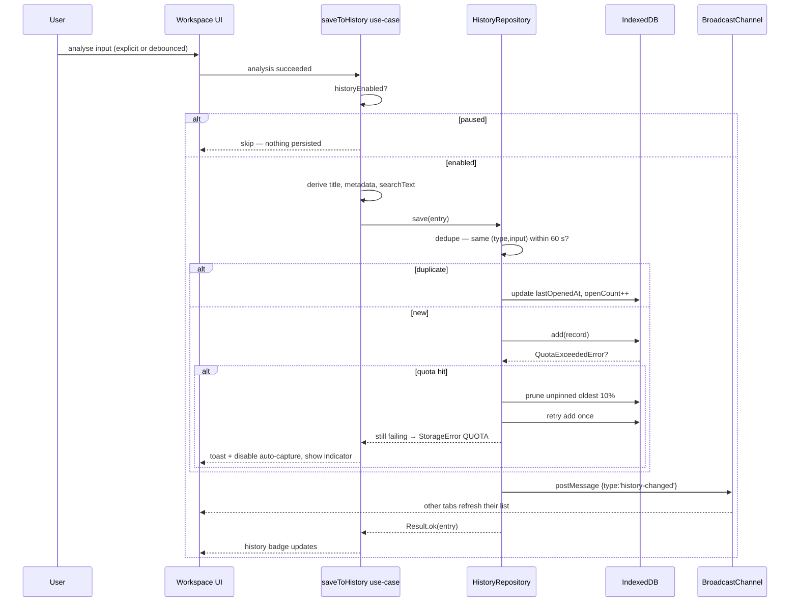
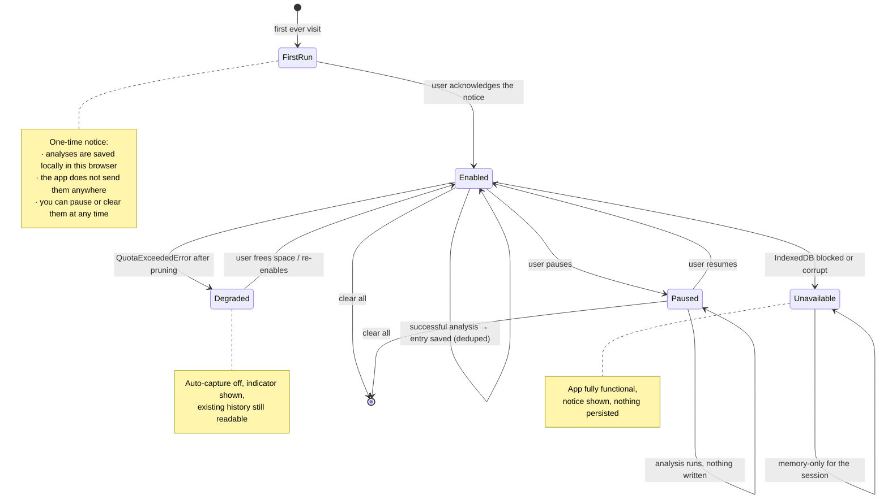

# 06 — Data Storage

**Project:** SyntaxLab
**Status:** Draft for human review
**Last updated:** 2026-08-17

---

> **Scope note (Phase 1.5).** History auto-capture is **ON by default**, introduced by a one-time first-run notice (§4.2). Cron entries appear from V1.1. Share URLs are deferred, so no share state is persisted or encoded.

## 1. Storage strategy

Three storage mechanisms, chosen by access pattern rather than habit.

| Mechanism | Contents | Size | Sync/async | Why this one |
|---|---|---|---|---|
| **IndexedDB** | History entries | ≤ 50 MB self-imposed | Async | Structured, indexed, queryable, large capacity. The only browser store that can search 500 records by type and timestamp without loading all of them. |
| **localStorage** | Theme, settings, schema markers | < 8 KB | **Sync** | Synchronous read before first paint. This is the entire reason it is used — an async theme read guarantees a flash of the wrong theme on every load. |
| **Cache Storage** | App shell, JS, CSS, fonts, icons | ~1–2 MB | Async | Service-worker-managed; the offline story. |

Not used: cookies (no server), `sessionStorage` (no requirement), OPFS (no file-shaped data), WebSQL (dead).

---

## 2. IndexedDB schema

**Database:** `syntaxlab` · **Version:** 1

### 2.1 Object store: `history`

```ts
{
  keyPath: 'id',            // crypto.randomUUID()
  autoIncrement: false,
}
```

| Index | Key path | Unique | Purpose |
|---|---|---|---|
| `by-created` | `createdAt` | no | Default reverse-chronological list |
| `by-opened` | `lastOpenedAt` | no | "Recently used" ordering |
| `by-type` | `type` | no | Filter by regex/json/cron |
| `by-type-created` | `['type','createdAt']` | no | Filtered list without a full scan — the compound index is what keeps filtering O(results) instead of O(all) |
| ~~`by-pinned`~~ | ~~`pinned`~~ | — | **Not created.** See below. |

**`by-pinned` cannot exist as specified.** `pinned` is a boolean, and IndexedDB
rejects booleans as keys: the index would be created successfully and then
silently contain no records at all, which is worse than not having it. Pinned
ordering and prune exemption are done in `queryEntries` and `selectForPruning`
instead. Storing `pinned` as `0 | 1` purely to make it indexable was rejected —
it would put a storage detail into the domain model to serve an index nothing
currently reads.

**The other four indices are created but not yet read.** The repository loads
the whole store — capped at 500 entries — and filters in memory, which measures
at 27 ms for a search across 500 records and 33 ms across 1 000. They are
declared now because adding an index later needs a version bump and an upgrade
path, and an unused index on a store this size costs nothing measurable.

**Record shape:** `HistoryEntry` as defined in `03_DOMAIN_MODEL.md` §6.

**Note on `searchText`:** a precomputed lowercased concatenation of title + input prefix (first 2 KB). IndexedDB has no full-text index; search is a cursor scan with an in-memory substring match over this field. At the 500-entry cap that is sub-millisecond, so no external search index is warranted. If the cap ever rises past a few thousand, revisit — noted in `12_PERFORMANCE.md`.

### 2.2 Object store: `meta`

```ts
{ keyPath: 'key' }   // { key: string, value: unknown }
```

| Key | Value | Purpose |
|---|---|---|
| `dbSchemaVersion` | number | Migration tracking independent of IDB's own version |
| `lastPrunedAt` | number | Rate-limits pruning work |
| `entryCount` | number | Cheap count without a full scan |
| `quarantine` | `QuarantinedRecord[]` | Records that failed validation, retained for export/debug — **implemented at M7**, bounded to the most recent 50 |

`dbSchemaVersion`, `lastPrunedAt` and `entryCount` are **not written at M7**.
Each exists to avoid a full scan, and the M7 repository does a full read at
startup by design, so all three would be state that can only fall out of sync
with the thing it is caching. They become worth writing if the cap rises far
enough to make the full read expensive.

### 2.3 Why two stores and not more

Everything else is either small enough for `localStorage` (preferences) or derived (analysis results, which are deliberately not persisted — see `03_DOMAIN_MODEL.md` §6.1).

---

## 3. Repository abstraction

The domain and application layers never touch `indexedDB` directly. They depend on an interface, which makes the whole storage layer swappable for an in-memory implementation in tests and in the storage-unavailable fallback path.

```ts
interface HistoryRepository {
  list(query: HistoryQuery): Promise<Result<HistoryPage, StorageError>>;
  get(id: string): Promise<Result<HistoryEntry | null, StorageError>>;
  save(entry: NewHistoryEntry): Promise<Result<HistoryEntry, StorageError>>;
  update(id: string, patch: HistoryPatch): Promise<Result<HistoryEntry, StorageError>>;
  delete(id: string): Promise<Result<void, StorageError>>;
  clear(): Promise<Result<void, StorageError>>;
  count(): Promise<Result<number, StorageError>>;
  exportAll(): Promise<Result<ExportEnvelope, StorageError>>;
  importAll(env: ExportEnvelope, mode: 'merge'|'replace'): Promise<Result<ImportReport, StorageError>>;
  getQuarantined(): Promise<Result<QuarantinedRecord[], StorageError>>;
}

interface HistoryQuery {
  type?: 'regex'|'json'|'cron';
  search?: string;
  pinnedOnly?: boolean;
  sort: 'created'|'opened';
  limit: number;          // page size, default 50
  cursor?: string;        // opaque continuation token
}

type StorageErrorCode =
  | 'UNAVAILABLE'    // IndexedDB blocked or absent
  | 'QUOTA'          // QuotaExceededError
  | 'CORRUPT'        // db failed to open or record unreadable
  | 'BLOCKED'        // upgrade blocked by another tab
  | 'VALIDATION'     // record failed schema validation
  | 'UNKNOWN';
```

Three implementations:

| Implementation | Used when |
|---|---|
| `IdbHistoryRepository` | Normal operation |
| `MemoryHistoryRepository` | Storage unavailable (private mode, policy, corruption) — the app stays fully functional for the session |
| `FakeHistoryRepository` | Unit tests, with fault injection for quota/corruption paths |

**Every method returns `Result`, never throws.** Storage failure is an expected condition in a browser, not an exception.

---

## 4. Local storage flow



### 4.1 History lifecycle



Entry-level lifecycle within the `Enabled` state: **created** → **reopened** (updates `lastOpenedAt`, `openCount`) → optionally **pinned** (exempt from pruning) or **renamed** → **deleted** by the user, **pruned** automatically if unpinned and old, or **evicted** by the browser under storage pressure.

### 4.2 First-run notice *(decided in Phase 1.5)*

Auto-capture is ON by default because the user explicitly asked the product to remember previous analyses. An opt-in default would fail that requirement, since most users never discover a feature they must first enable.

The privacy cost is paid down by telling the user once, at the only moment they are paying attention:

| Property | Value |
|---|---|
| When | First visit, before any analysis is saved |
| Frequency | Once. Acknowledgement stored in `settings.hasSeenHistoryNotice`. |
| Blocking? | Non-blocking. The user can start working immediately; it does not gate the app. |
| Content | Analyses are saved **locally in this browser**; the app does not send them anywhere; history can be paused, individually deleted, or cleared entirely; local storage is device storage, not a password vault, and the browser may evict it. |
| Actions | `Got it` · `Turn history off` (sets `historyEnabled: false` immediately) |
| Reachable later | Full text in the help dialog and in settings |

The `Turn history off` action in the notice matters: a user who reads the notice and is uncomfortable must be able to act on it in that moment, not be told where to find a setting later.

### 4.3 When entries are written

| Trigger | Written? |
|---|---|
| Every keystroke | ❌ Never |
| Debounced auto-analysis succeeding | ✅ Yes, debounced a further 2 s so a user typing through several valid states produces one entry |
| Explicit Analyze click | ✅ Yes, immediately — **implemented**: an explicit analyse is the user saying they are done, so there is no pause left to wait for |
| Analysis failing with a syntax error | ❌ No — a half-typed regex is not worth remembering |
| Restoring an existing entry | ✅ Updates `lastOpenedAt` and `openCount` only |
| History paused | ❌ Never |

The dedupe window plus the "successful analyses only" rule are what keep history a useful list rather than a keystroke log.

---

## 5. Preferences in localStorage

| Key | Contents |
|---|---|
| `syntaxlab.theme.v1` | `ThemePreferences` JSON |
| `syntaxlab.settings.v1` | `AppSettings` JSON |
| `syntaxlab.meta.v1` | `{ lastVersion, firstSeenAt }` |

Versioned key names, so a schema change can be introduced without a destructive in-place migration: the new version reads the old key, writes the new, and leaves the old for one release as a rollback path.

### 5.1 Pre-paint theme bootstrap

A small synchronous script in `index.html`, before the app bundle, reads the theme key and sets CSS custom properties on `<html>`. This eliminates the flash of default theme.

**It must be a same-origin script file, not an inline `<script>`**, because `script-src 'self'` forbids inline scripts and we are not weakening the CSP for a cosmetic fix. The bootstrap is a tiny separate file loaded with a blocking `<script src>` in `<head>`.

Bootstrap rules: wrapped in try/catch (a corrupt value must never prevent the app from loading), validates every value against the allowlist in `03_DOMAIN_MODEL.md` §7.1, and falls back to defaults silently.

### 5.2 Validation on read

Always. `localStorage` is attacker-writable and its values go into CSS. Detailed in `05_SECURITY.md` §2.2.

---

## 6. Quota management

### 6.1 Budget

| Layer | Budget |
|---|---|
| Hard entry cap | 500 entries |
| Per-entry input cap | 100 000 chars (truncated, flagged) |
| Soft total budget | 50 MB |
| Browser quota | Typically 10 MB–60% of free disk; **not knowable in advance** |

We do not rely on `navigator.storage.estimate()` for correctness — it is an estimate, is coarse in some browsers, and is deliberately fuzzed in others. It is used only to display a usage bar and to trigger early pruning.

**As built at M7:** the entry cap and the per-entry cap are enforced, and
`QuotaExceededError` drives pruning. The **soft 50 MB budget is not enforced**
and the estimate is shown but does not trigger anything. Pruning on a fuzzed
number would mean deleting a user's entries because of a figure the browser
declined to be precise about; `QuotaExceededError` is the one signal that is
not a guess, and it arrives in time to act on. The estimate is displayed in
the drawer, worded as approximate, because "how much is this using?" is a
reasonable question even when the answer is imprecise.

### 6.2 Pruning

Triggered on: entry count > 500, estimated usage > 50 MB, or a `QuotaExceededError`.

Order: unpinned entries only, oldest `lastOpenedAt` first, in a single transaction, 10% of entries at a time. **Pinned entries are never pruned.** If pruning cannot free space because everything is pinned, auto-capture is disabled with an explicit message rather than silently failing forever.

### 6.3 Failure handling

| Failure | User-visible behaviour |
|---|---|
| `QuotaExceededError` | Prune → retry once → **capture suspends** with the reason and an explicit *Resume saving* control in the drawer. Implemented at M7; the message is in the drawer rather than a toast, because there is no toast system and a message about storage belongs beside the storage. |
| IDB unavailable | Startup notice "History is unavailable in this browser mode. Everything else works." Memory repository takes over. |
| DB fails to open (corrupt) | Notice + memory mode + an explicit **Reset history database** action. **We never auto-delete.** Implemented at M7: the action appears only on a `CORRUPT` error, states that it discards what the database still holds, and is the single place in the feature that destroys data it cannot show the user first. |
| Upgrade blocked by another tab | "Close other SyntaxLab tabs to finish updating." Retry on `versionchange`. |
| Write fails mid-transaction | IDB transactions are atomic; the entry simply is not saved. Toast, no partial state. |

The rule across all of these: **a storage failure degrades history, never the application.** The current input in the editor is React state and survives every storage failure.

---

## 7. Migrations

### 7.1 IDB version upgrade

```ts
openDB('syntaxlab', DB_VERSION, {
  upgrade(db, oldVersion, newVersion, tx) {
    if (oldVersion < 1) { /* create stores + indices */ }
    // if (oldVersion < 2) { … additive changes only where possible … }
  },
  blocked()        { notifyUser('Close other SyntaxLab tabs to finish updating.'); },
  blocking()       { db.close(); notifyUser('A new version is ready — reload.'); },
  terminated()     { switchToMemoryRepository(); reportStorageError('CORRUPT'); },
});
```

### 7.2 Record-level migration

Independent of DB version, applied lazily on read:

```ts
const RECORD_MIGRATIONS: Record<number, (r: any) => any> = {
  1: (r) => r,
  // 2: (r) => ({ ...r, schemaVersion: 2, newField: default }),
};
```

Rules (restating `03_DOMAIN_MODEL.md` §8.2 because this is where they are implemented): pure, idempotent, total, fixture-tested. A migration that throws on one record quarantines that record and continues; it never aborts the upgrade.

### 7.3 Forward compatibility

A record whose `schemaVersion` exceeds what this build understands is **kept, hidden from the list, and reported** ("2 entries were created by a newer version and are hidden"). Old code destroying newer data is how users lose everything by opening a stale tab.

---

## 8. Export and import

### 8.1 Format

```jsonc
{
  "format": "syntaxlab-export",
  "formatVersion": 1,
  "generatedAt": "2026-08-17T10:30:00.000Z",
  "appVersion": "1.0.0",
  "entryCount": 42,
  "entries": [ /* HistoryEntry[] */ ],
  "preferences": { "theme": { /* … */ }, "settings": { /* … */ } }   // optional, user's choice
}
```

Plain UTF-8 JSON. Human-readable and inspectable on purpose — a privacy-first tool should not hand the user an opaque blob of their own data.

### 8.2 Export options

The user chooses: history only, preferences only, or both; and all entries or pinned only. A notice states the file is unencrypted plaintext.

### 8.3 Import

Full validation pipeline in `05_SECURITY.md` §10.2. Behaviour summary: merge or replace (user's choice, previewed with counts), duplicate `id`s resolved by keeping the newer `lastOpenedAt`, invalid entries skipped and counted, a report shown afterwards (`38 imported, 2 skipped, 1 updated`).

---

## 9. Retention and deletion

| Action | Effect |
|---|---|
| Delete one entry | Removed immediately; a 5-second undo toast holds it in memory before the transaction commits |
| Clear all | Confirmation dialog naming the count; wipes the `history` store |
| Clear everything | Also clears preferences and unregisters the service worker + caches — a genuine "leave no trace" action |
| Automatic pruning | Unpinned only, oldest-first, as in §6.2 |
| No time-based expiry | Entries are not deleted on a schedule. Silent time-based deletion of a user's own data would be surprising. |
| Browser-side eviction | Under storage pressure a browser may evict the origin. `navigator.storage.persist()` is requested **after the user creates their third entry** — asking on first load is a permission prompt with no earned context, and gets denied. |

### 9.1 Persistence is not a guarantee — and we must not imply it is

**We do not promise indefinite local persistence, in the UI or in the documentation.** Browser storage can disappear without the user or the application doing anything wrong:

| Cause | Notes |
|---|---|
| Storage-pressure eviction | Browsers evict origin data when the disk fills. `persist()` reduces but does not remove the risk, and the permission can be denied. |
| Safari / iOS ITP | Script-writable storage may be cleared after roughly seven days without interaction — a realistic loss scenario for an occasional-use developer tool. |
| User action | Clearing site data, clearing browsing data, using a private window, or using a different browser or profile. |
| Enterprise policy | Managed browsers may clear storage on exit. |
| Corruption | A failed database is recoverable only by reset. |

**Consequences for the product:**

1. **Export exists partly for this reason.** It is the only durable backup path available to a client-only application, and the help text says so.
2. **The wording is "saved in this browser", never "saved forever" or "your data is safe here".**
3. **History is a convenience, not a system of record.** No feature is designed on the assumption that an entry will still be there.
4. **The first-run notice mentions eviction** (§4.2), so the expectation is set before the user relies on it.

---

## 10. Multi-tab behaviour

| Concern | Handling |
|---|---|
| Concurrent writes | IDB transactions serialise them |
| Stale lists | `BroadcastChannel('syntaxlab')` publishes `history-changed`; open tabs refetch |
| Upgrade blocked | `blocking()` closes the old connection and prompts a reload |
| Preference divergence | `storage` events sync theme/settings across tabs live |
| Duplicate entries from two tabs | Dedupe is keyed on `(type, input)` within 60 s and applies regardless of origin tab |

---

## 11. Testing

> **Built at M7.** Where the implementation departs from this document, the
> departure is recorded inline above rather than by quietly editing the
> specification. In summary: `by-pinned` cannot exist (booleans are not IDB
> keys), three `meta` keys are not written because nothing reads them, the soft
> byte budget is not enforced, and `idb` was not adopted
> (`16_DEPENDENCIES.md` §2.3).


| Area | Test |
|---|---|
| CRUD | Round-trip every field; verify indices return correct ordering |
| Query | Filter by type, search, pinned; pagination cursors |
| Dedupe | Same input twice inside and outside the 60 s window |
| Quota | Inject `QuotaExceededError`; assert prune → retry → graceful disable |
| Corruption | Seed malformed records; assert quarantine, no crash, list still renders |
| Migration | Fixture files from every prior schema version; assert idempotence |
| Forward compat | Seed a `schemaVersion: 99` record; assert preserved and hidden |
| Unavailable | Stub `indexedDB` as undefined; assert memory mode and the notice |
| Multi-tab | Two contexts writing concurrently; assert consistency and invalidation |
| Import/export | Round-trip; hostile files per `05_SECURITY.md` §10.2 |
| Pre-paint theme | Assert no flash: computed background is correct on first paint |
