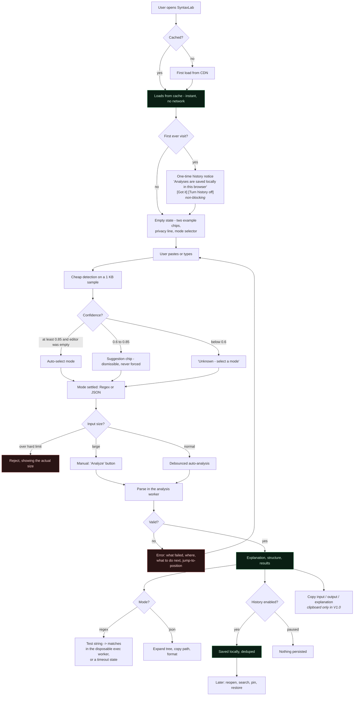
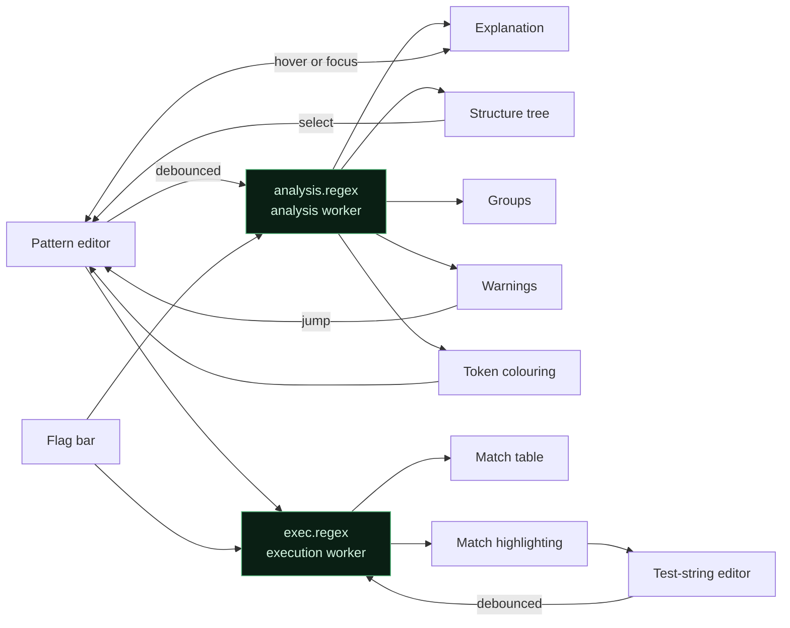
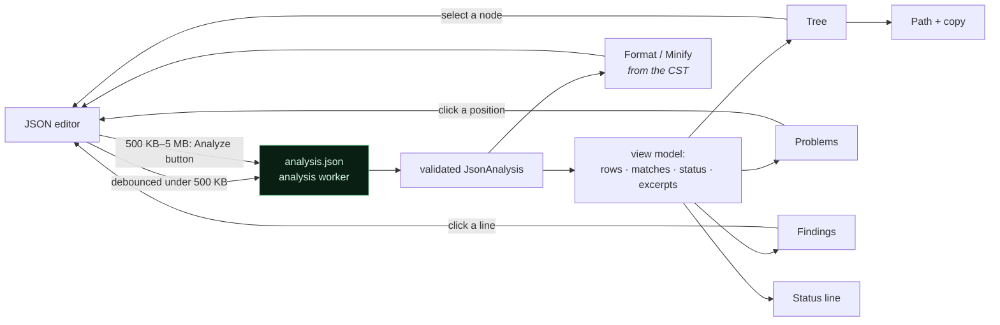

# 08 — UI / UX Specification

**Project:** SyntaxLab
**Status:** Draft for human review
**Last updated:** 2026-08-17

---

> **Scope note (Phase 1.5).** This specifies **V1.0: Regex + JSON**. Cron (§6.3) is **V1.1**. Share URLs are deferred — V1.0 shares via the clipboard. §2 explains how V1.0 reads as a complete product rather than a partial one.

## 1. Design intent

A precision instrument, not a dashboard. The interface should read as *quiet and dense* — the kind of tool a developer keeps pinned in a tab for a year.

**Explicitly avoided** (from the brief's quality bar, restated because these are the defaults every generated UI falls into): giant cards, meaningless statistics, fake analytics tiles, an unnecessary sidebar, gradients on everything, neon glow, ten shades of green, decorative animation.

**Pursued instead:** strong typography, precise spacing, clear hierarchy, generous editor surfaces, subtle motion tied to state changes only, excellent empty and error states.

The single visual flourish — the black-to-green gradient — appears in **at most four places** at default intensity: the header accent line, the active mode indicator, the primary button, and the active editor's focus ring (the full list is normative in `09_DESIGN_SYSTEM.md` §4.2). Restraint is what makes it read as premium rather than as a template.

---

## 2. V1.0 must read as complete, not partial

The release is staged (`01_PRD.md` §3), and the UX carries the whole burden of making that staging invisible. A user arriving at V1.0 should experience a finished tool for regex and JSON — not a three-mode app with a mode missing.

### 2.1 Rules

| Rule | Detail |
|---|---|
| **Two modes, presented as the set** | The selector is `[ Regex ][ JSON ]`. A two-segment control looks deliberate. A three-segment control with one greyed out looks broken, and users file it as a bug. |
| **No disabled cron affordance anywhere** | No greyed tab, no "Coming soon" tile, no placeholder panel, no teaser in the empty state. A disabled feature in the primary UI reads as an accident, not a roadmap. |
| **Cron is signposted once, honestly, off the main path** | One line in the help dialog under "What's next": *"Cron expression support is planned for V1.1."* That is the entire in-product mention. |
| **Product name matches scope** | V1.0 titles and metadata say **"SyntaxLab — Regex & JSON Explainer"**. The name broadens when cron ships. Promising cron in the title and not delivering it is the same defect as a disabled tab. |
| **Empty state offers two examples, not three** | Two chips, balanced layout, no gap where a third would go. |
| **Detection knows two types** | A pasted cron expression falls through to a low-confidence regex suggestion or the "Select a mode" state. It is never told "this looks like cron, but we can't do that yet" — that is a disabled feature wearing a disguise. |

### 2.2 What changes in V1.1

The selector gains a third segment, the empty state gains a third chip, the title broadens, detection gains the cron branch, and the help line moves from "planned" to a link. **No layout rework** — the two-column workspace, drawers, and status bar are unchanged, which is why the staging costs nothing structurally.

---

## 3. User flow



The three decision points that carry the most design weight are **D** (the user is told about history *before* anything is saved), **H** (detection suggests, never traps), and **M** (large input never silently triggers expensive work). All three exist to stop the tool doing something the user did not ask for.

---

## 4. Information architecture

One page. No routes. Everything else is a panel or an overlay.

```
┌──────────────────────────────────────────────────────────────────────┐
│ HEADER                                                               │
│ SyntaxLab  │ [ Regex ][ JSON ]  │  ⬤offline  ⏸history  🕐  🎨  ？    │
├──────────────────────────────────────────────────────────────────────┤
│ SUGGESTION BAR (conditional)                                         │
│ 💡 Looks like JSON — Switch to JSON mode          Dismiss ✕          │
├────────────────────────────────┬─────────────────────────────────────┤
│ INPUT PANE                     │ ANALYSIS PANE                       │
│                                │                                     │
│ ┌────────────────────────────┐ │ ┌─ Explanation ─────────────────┐  │
│ │ CodeMirror                 │ │ │ Plain-English summary          │  │
│ │                            │ │ │                                │  │
│ │                            │ │ │ Token breakdown / field table  │  │
│ └────────────────────────────┘ │ └────────────────────────────────┘  │
│ flags/options · char count     │ ┌─ Structure ───────────────────┐  │
│                                │ │ AST tree / JSON tree           │  │
│ ┌─ Tester (regex/json only) ─┐ │ └────────────────────────────────┘  │
│ │ test string / search        │ │ ┌─ Results ─────────────────────┐  │
│ └────────────────────────────┘ │ │ matches / next runs / errors   │  │
│                                │ └────────────────────────────────┘  │
├────────────────────────────────┴─────────────────────────────────────┤
│ STATUS BAR                                                           │
│ ✓ Valid · 3 groups · parsed in 4 ms        [Copy] [Clear]           │
└──────────────────────────────────────────────────────────────────────┘
```

Overlays: History drawer (right), Theme drawer (right), Help/shortcuts (centred dialog), first-run history notice (inline banner), Confirm dialogs. **No share dialog in V1.0.**

**No left sidebar.** Mode selection is two buttons in the header (three from V1.1). A sidebar for two options is furniture, not navigation.

---

## 5. Layout by breakpoint

| Breakpoint | Width | Layout |
|---|---|---|
| Desktop L | ≥ 1440 px | Two columns, 45 / 55 split, drawers overlay at 420 px |
| Desktop | 1024–1439 px | Two columns, 50 / 50, drawers 380 px |
| Tablet | 768–1023 px | Single column stacked: input above, analysis below; sticky action bar |
| Mobile | < 768 px | Tabbed: `[Input] [Explain] [Test]`; full-screen drawers; sticky bottom actions |

V1.0 navigation surfaces, in full: **Regex · JSON · History · Theme/Settings · Help.** That is the complete set.

The split is **resizable by drag** on desktop, persisted in settings, with a double-click reset. Developers reflexively drag panel dividers; not honouring that feels broken.

Mobile is deliberately a different interface, not a squeezed desktop one — per the brief, the product is desktop-primary and mobile must be *usable*, not equivalent.

---

## 6. Header

| Element | Behaviour |
|---|---|
| Wordmark | Static. Clicking resets to an empty workspace (with confirmation if there is unsaved input). |
| Mode selector | **Two-segment control in V1.0** (`Regex`, `JSON`); three from V1.1. Radio-group semantics: arrow keys move, `Enter`/`Space` selects. Active mode carries the gradient underline. |
| Offline chip | Visible only when offline. Calm, not alarming. |
| History-paused chip | Visible only when paused. `⏸ History off` — deliberately conspicuous, and clickable to resume. A user who forgets history is on has a false sense of privacy; a user who forgets it is off loses work they expected to keep. |
| History button | Opens the drawer. Badge shows entry count. |
| Theme button | Opens the theme drawer. |
| Help button | Opens the shortcuts and syntax reference dialog. |

---

## 7. Mode specifications

### 7.1 Regex

> **Built at M4.** What shipped differs from this specification in four places,
> each recorded here rather than left as a silent divergence:
>
> | Spec | Built | Why |
> |---|---|---|
> | Flag row of **seven** chips | **Eight** — `d g i m s u v y` | The spec's list predates `v`; the domain has supported all eight since M3, and omitting one from the UI would make it unreachable. `u` and `v` are mutually exclusive, and the toggle enforces that rather than letting the user build a combination the engine rejects. |
> | Matches highlighted inline with alternating tints | As specified, **except zero-length matches** | A mark decoration needs a non-empty range, and tinting one character would claim the match covered a character it did not. They appear in the match table labelled `empty match`. |
> | Match table shows "every group value" | Numbered and **named groups listed separately** | The engine exposes `match[n]` and `match.groups.name` as two independent views with no mapping between them. Reuniting them by comparing values is ambiguous whenever two groups capture the same text, so both are shown as the engine gives them. |
> | Truncated "at 10 000" | Three independent caps, each named when it fires | Match count alone does not bound memory: 10 000 matches of 2 000 characters would be 20 MB. Per-value clipping and a total output ceiling were added, and every truncation says which one stopped the scan. |
>
> The example picker, the permanent ECMAScript label, the character count, the
> AST tree, the group table and the warning list are all as specified. The
> resizable split (§5) and the mobile tab bar (§18) are **not** built — the
> panels stack instead; both are queued for M11.

**Input pane**
- CodeMirror with regex-aware highlighting (metacharacters, classes, groups, quantifiers each get a distinct hue from the token palette)
- Delimiters `/` `/` shown as static, non-editable adornments so the user knows exactly what is being parsed
- **A permanent `ECMAScript (JavaScript)` label on the pane header.** Not a tooltip, not dismissible. The tester runs the browser's own engine, and the user must never assume PCRE/Python/Go equivalence (`01_PRD.md` §7.2). Clicking it opens the help-dialog section listing the differences.
- Flag row: seven toggle chips `g i m s u y d`, each with a tooltip and an `aria-pressed` state
- Character count, turning amber at 80% of the limit
- Example dropdown: email, URL, ISO date, IPv4, semver, UUID, hex colour, phone — each loading a pattern *and* a representative test string


#### The regex workspace as built



The two-way arrow between the explanation and the pattern editor is the
feature that makes the tool feel like it understands the pattern: hovering or
focusing an explained construct highlights its exact span, and selecting one
moves the cursor there. Section titles carry spans, so this is real data
rather than a second parse.

Both worker calls are debounced by input size and both discard a response that
no longer describes what is on screen.

**Analysis pane**
- **Explanation** — one-paragraph summary, then a token table (`token · meaning · position`). Hovering a row highlights the corresponding span in the editor; hovering the editor highlights the row. This bidirectional link is the feature that makes the tool feel intelligent.
- **Structure** — collapsible AST tree, node type + summary per line, click to highlight the source span
- **Groups** — a table of number, name, and span for each capture group
- **Warnings** — amber rows with an explanation and a "learn more" expansion

**Tester**
- Multi-line test-string editor
- Matches highlighted inline with alternating tints so adjacent matches remain distinguishable
- Match table: index, matched text, start/end, and every group value
- States: no matches (neutral, not an error), truncated at 10 000, timed out, and pattern-invalid (tester disabled with the reason)

### 7.2 JSON

> **Built at M6.** The flow, and where it differs from this specification.



**Formatting reads the CST, never `JSON.stringify(JSON.parse(text))`.** That
round trip rewrites `1e5` as `100000`, reorders integer-like keys, and drops
duplicates — three things this product exists to show rather than hide.

| Spec | Built | Why |
|---|---|---|
| Tree virtualised "above 500 visible rows" | As specified — and **collapsed branches are never flattened at all** | The cheaper win comes first: a collapsed 500 000-node document costs one row, before virtualisation is involved. |
| "Expand-to-depth-N" | Built as the **default view** (depth 2) rather than a control | Two levels is what orients a reader; a control for it is furniture until someone asks. |
| Errors show "a caret excerpt of the offending line" | As specified, **windowed** | A minified document is one 4 000-character line, and the excerpt would have been the error message. |
| Stats as "a single compact line" | As specified | `Valid · 5 values · depth 2 · 2 keys · 17 bytes` |
| Search "filters the tree" | **Highlights and steps** rather than filtering | Filtering hides the context that makes a match meaningful. Matches are marked in place, counted, and stepped through with the ancestors expanded. |
| Duplicate keys | Every occurrence in the tree, each marked, each with its own jump target | The domain keeps them all; hiding them in the UI would undo that. |

**Not built:** the JSON toolbar's `Copy` for formatted output separately from
the editor's `Copy` (the editor holds the formatted text after Format, so one
control does both), and expand-to-depth as a user control.

### 7.2.1 Original specification

**Input pane**
- CodeMirror with JSON highlighting, bracket matching, code folding, and error squiggles at exact positions
- Toolbar: `Format` (2/4/tab), `Minify`, `Copy`
- Byte/character count with a limit indicator

**Analysis pane**
- **Errors first** when invalid: message, `line:column`, a caret excerpt of the offending line, and the actionable hint. Clicking jumps the cursor there.
- **Tree** — collapsible; each node shows key, type badge, value preview, and child count. Virtualised above 500 visible rows. Expand-all/collapse-all, and expand-to-depth-N.
- **Path** — the selected node's path in dot and bracket notation, each independently copyable
- **Stats** — a single compact line, not a grid of cards: `1,204 nodes · depth 7 · 340 keys · 82 KB`
- **Findings** — duplicate keys and unsafe numbers, each with a jump-to-location link

**Search** — filters the tree, highlights matches, `n`/`N` steps through them, and shows a result count.

### 7.3 Cron — **V1.1, not built in V1.0**

> Specified for V1.1. **Nothing in this subsection appears in the V1.0 interface**, not even disabled (§2.1).

**Input pane**
- Single-line editor with per-field colour coding that matches the breakdown table's colours — the colour is the mapping, so it must be paired with position labels for non-colour users
- **No dialect selector** — there is one supported dialect. A static label reads `Standard 5-field cron`. once the user has chosen
- Timezone selector with **two options only**: `Browser local (Europe/London)` and `UTC`. The resolved zone name is always shown for browser-local.
- Unsupported-dialect state: a 6- or 7-field expression produces the educational refusal from `04_PARSER_ARCHITECTURE.md` §4.2, not a parse attempt.
- Preset dropdown: every minute, hourly, daily 00:00, weekdays 09:00, weekly Monday, monthly 1st, quarterly, yearly

**Analysis pane**
- **Summary** — the plain-English reading, prominent and large. This is the answer the user came for; it gets the most visual weight on the page.
- **Field table** — name, raw value, resolved values (abbreviated when long: `0,15,30,45` vs `every 5 minutes`), and plain meaning
- **Next runs** — the next 10 with relative time ("in 4 hours"), absolute time, and **a zone label on every row without exception** (invariant C-I1). DST anomalies carry a badge. A standing note states that times are shown in the selected mode only, and will not match a scheduler running in a different timezone.
- **Warnings** — the DOM/DOW OR-rule warning is always shown when both fields are restricted, with the OR reading spelled out
- **Builder** — a disclosure panel with per-field controls that writes back to the expression, keeping the two representations synchronised in both directions

---

## 8. History drawer

```
┌─ History ────────────────────────── ✕ ─┐
│ 🔍 Search…                              │
│ [All][Regex][JSON][Cron]  [📌 Pinned]   │
├─────────────────────────────────────────┤
│ 📌 /^[A-Z][a-z]+$/                      │
│    regex · 3 groups · 2 days ago        │
│    ⟳ Restore   ✏️ Rename   🗑 Delete     │
├─────────────────────────────────────────┤
│    Every weekday at 09:00               │
│    cron · Europe/London · 5 hours ago   │
├─────────────────────────────────────────┤
│ … 48 more                               │
├─────────────────────────────────────────┤
│ [Export…] [Import…]        [Clear all]  │
└─────────────────────────────────────────┘
```

- Search filters as you type (debounced 150 ms) across title and input
- Pinned entries sort first within the current filter
- Row click restores; explicit buttons for rename/delete so restore is never ambiguous
- Delete shows a 5-second undo toast before committing
- Clear-all requires a confirmation naming the count
- Restoring while the editor holds unsaved content prompts first
- Empty states differ meaningfully: "No history yet — analyse something and it will appear here" vs "No results for 'xyz'" vs "History is paused — turn it on in the header"
- **History status is mirrored in settings**, not only in the header: current state (on/paused), entry count, approximate storage used, and the same pause, export, import, and clear-all actions. A user looking for "where is my data" should find the whole answer in one place.
- Storage-unavailable state explains the situation and confirms the rest of the app still works

### As built at M7 — where the interface differs from the sketch, and why

| # | Specification | As built | Reason |
|---|---|---|---|
| 1 | Filter chips `[All][Regex][JSON][Cron]` | `[All][Regex][JSON][Pinned]` | There is no cron in V1.0, and a chip for it would be the "disabled affordance" §2.1 rules out. Pinned is a chip rather than a separate toggle because it filters the same list the others do. |
| 2 | Search debounced 150 ms | **Not debounced** | Measured: 27 ms to search 500 entries, 33 ms at 1 000 (`12_PERFORMANCE.md` §10.8). A 150 ms delay would be the only latency in the interaction. Reinstate if the cap rises. |
| 3 | "Delete shows a 5-second undo toast **before committing**" | The delete commits immediately; undo re-adds through the validated import path | Deferring the write means a tab closed during the five seconds silently resurrects something the user deleted. Deleting now and offering the entry back is the same affordance with the opposite failure mode. |
| 4 | Undo as a toast | An inline bar at the foot of the drawer | There is no toast system, and a message about a row belongs in the list that row was in. |
| 5 | `⟳ Restore` button per row | The row itself opens; the explicit buttons are pin, rename and delete | The spec's own next line asks that restore never be ambiguous. Making the row the restore target and giving the *destructive* actions the explicit buttons achieves that with one fewer control per row. |
| 6 | "… 48 more" | "3 of 1,200 entries" | Says the same thing and also says what is on screen. |
| 7 | `Learn more ↗` on the first-run notice | Not present | It would link to the help dialog, which arrives at M10. A link to nothing is worse than no link. |
| 8 | Settings mirror | Lives in the drawer footer | SyntaxLab has no settings dialog until the theme work. The whole answer to "where is my data" is in one place, which is what the requirement asks for; it is simply the drawer. |

Everything else in §8 is built as specified, including the confirmation before
a restore replaces different editor content, the three distinct empty states,
and the storage-unavailable notice.

---

## 9. First-run history notice

Shown once, on first visit, **before any analysis is saved**. This is the UX half of the Phase 1.5 decision that auto-capture is ON by default (`06_DATA_STORAGE.md` §4.2).

```
┌─ inline banner, below the header ────────────────────────┐
│  SyntaxLab saves your analyses in this browser so you can    │
│  reopen them later. They stay on this device — the app       │
│  doesn't send them anywhere. You can pause or clear history  │
│  at any time.                                                │
│                                                              │
│  [ Got it ]   [ Turn history off ]        Learn more ↗       │
└────────────────────────────────────────────────────────┘
```

| Property | Value |
|---|---|
| Type | **Inline banner, not a modal.** It informs; it does not gate. A modal on first load is exactly the friction this product positions against. |
| Timing | Rendered with the empty state, before any input is analysed |
| Frequency | Once. `settings.hasSeenHistoryNotice` persists the acknowledgement. |
| Dismissal | `Got it` dismisses. `Turn history off` dismisses **and** sets `historyEnabled: false` immediately — a user who is uncomfortable must be able to act in that moment, not be told where to find a setting. |
| Accessibility | `role="status"`, focusable, announced once, dismissible by keyboard. Not a focus trap. |
| Later access | Full text lives in the help dialog and in settings |

**Wording rules:** say *"in this browser"*, never *"saved forever"* or *"your data is safe"*. Mention that the browser may clear storage. Do not use the word "privacy" as a reassurance — describe the behaviour and let the user judge.

**Built at M7**, with the wording rules enforced by a unit test rather than by
review alone: `tests/unit/history/viewModel.test.ts` asserts that the storage
copy contains no "never leave", "100% private", "secure" or "encrypted", and
that it does say where the data lives, that no server receives it, that anyone
with the browser profile can read it, and that the browser may clear it.

---

## 10. Theme drawer

```
┌─ Appearance ─────────────────────── ✕ ─┐
│ Presets                                 │
│ [Matrix][Emerald][Cyan][Amber][Mono]    │
├─────────────────────────────────────────┤
│ Gradient                                │
│ From  [■ #00ff88]   To  [■ #003d1f]     │
│ Angle    ●────────── 135°               │
│ Intensity ────●───── 40%                │
├─────────────────────────────────────────┤
│ Interface                               │
│ Accent   [■ #00ff88]                    │
│ Glow      ──●─────── 25%                │
│ Contrast  (•) Normal  ( ) High          │
│ Motion    (•) System  ( ) Off           │
│ Text size [ A− ][ A ][ A+ ]             │
├─────────────────────────────────────────┤
│ ⚠ Contrast check: 4.8:1 — passes AA     │
├─────────────────────────────────────────┤
│ [Reset to default]                      │
└─────────────────────────────────────────┘
```

- Live preview: every change applies immediately to the whole UI
- **Contrast checker**: computes the actual ratio of accent against surface and warns below 4.5:1. This is the control that stops the customisation feature from letting users build an unreadable interface — a real risk with a green-on-black theme and free colour choice.
- Reset is one click, no confirmation (it is trivially reversible by re-customising)
- Colour inputs are native `<input type="color">` plus a validated hex field. Native means zero bytes, full accessibility, and platform-correct behaviour on every OS.

---


### As built at M8 — where the drawer differs from the sketch, and why

| # | Specification | As built | Reason |
|---|---|---|---|
| 1 | `Angle ●────── 135°` slider | Four named directions: Diagonal, Reverse diagonal, Left to right, Top to bottom | The stored value is still `angleDeg`, a bounded integer, so the schema and the pre-paint bootstrap are unchanged. A continuous angle invites fiddling with a number nobody can name. |
| 2 | `Accent [■ #00ff88]` as its own control | Derived from the primary gradient colour | An amber gradient with a green focus ring is incoherent, and one fewer control is one fewer way to build an unreadable interface. |
| 3 | Preset names `Cyan`, `Amber` | `Deep Cyan`, `Amber Console` | Display names only; ids, colours, angles and intensities are exactly `09_DESIGN_SYSTEM.md` §4.3. |
| 4 | — | The contrast note also states the **passing** case | Silence is indistinguishable from the check not having run. §4.5 specifies "✓ Passes AA" and the guard was quiet there. |
| 5 | Theme drawer opened from a theme control | Opened from an **Appearance** button in the header | Names what it does rather than what it is. Its accessible name states the current theme, which the visible label cannot. |

Everything else in §10 is built as specified: presets, primary and secondary
colour, intensity, glow, contrast, motion, text size, reset, and the current
theme stated in the footer.

**Live preview, no save button.** Every change applies on the frame it is
made; persistence is debounced 250 ms behind it and flushed when the tab is
hidden. Reset applies and persists at once.


---

## 11. Keyboard shortcuts

| Shortcut | Action | Notes |
|---|---|---|
| `Ctrl/⌘ + Enter` | Analyse now | Works from any editor |
| `Ctrl/⌘ + K` | Command/mode switcher | V1.0: mode + history search. A full command palette is V1.2+. |
| `Ctrl/⌘ + Shift + C` | Copy primary result | Context-dependent: pattern, formatted JSON, or cron expression |
| `Ctrl/⌘ + H` | Toggle history drawer | |
| `Ctrl/⌘ + /` | Help and shortcuts | |
| `Ctrl/⌘ + 1 / 2` | Switch to Regex / JSON (`3` added for Cron in V1.1) | |
| `Escape` | Close the topmost overlay | Never closes anything if none is open |
| `Ctrl/⌘ + Shift + K` | Clear input | Confirms if content exists |
| `Alt + ↑ / ↓` | Previous / next history entry | |
| `F6` | Cycle major landmarks | Standard for complex apps; helps screen-reader users |

**Deliberately not overridden:** `Ctrl+F` (the browser's find is more useful than ours in most panes), `Ctrl+S`, `Ctrl+P`, `Ctrl+W`, `Ctrl+T`, `Ctrl+R`. Hijacking these is user-hostile and breaks accessibility conventions.

All shortcuts are listed in the help dialog and every one has an equivalent clickable control.

---

## 12. Accessibility

### 12.1 Requirements

| Area | Requirement |
|---|---|
| Contrast | ≥ 4.5:1 body text, ≥ 3:1 large text and UI boundaries, verified for default **and** enforced by the live checker for custom themes |
| Keyboard | Every action reachable; logical tab order; no traps except intentional modal focus traps |
| Focus | Visible 2 px ring with a 2 px offset, using a token that never falls below 3:1 against its background |
| Semantics | Real landmarks (`header`, `main`, `aside`, `footer`), one `h1`, hierarchical headings, `<button>` for buttons |
| Labels | Every control labelled; icon-only buttons carry `aria-label`; editors are labelled and described |
| Live regions | Analysis results announce via `aria-live="polite"`; errors via `role="alert"` |
| Dialogs | `role="dialog"` + `aria-modal`, focus moved in and restored out, `Escape` closes, background inert |
| Motion | `prefers-reduced-motion` respected; all non-essential animation removed, none required to convey state |
| Colour independence | Every status uses icon + text, never colour alone. Regex match highlighting adds an underline; cron field colours are paired with labels; JSON type badges are text. |
| Zoom | Usable at 200% zoom and at 320 px width without horizontal scrolling |
| Screen readers | Tested with NVDA/Firefox, VoiceOver/Safari, and JAWS if available |

### 12.2 Announcement policy

Naive `aria-live` on a live-updating analysis pane is unusable — it interrupts continuously as the user types.

Policy: announcements are **debounced 500 ms** and **summarised**, not verbose.

| Event | Announcement |
|---|---|
| Analysis succeeds | "Valid regex. 3 capture groups. Matches a string starting with an uppercase letter…" (summary only) |
| Analysis fails | "Invalid JSON at line 4, column 12: trailing comma before closing brace" |
| Timeout | "Execution stopped after 2 seconds. This pattern may cause catastrophic backtracking." |
| History saved | Not announced. Too frequent, low value. |
| Drawer opens | Handled by the dialog role and focus move |

### 12.3 CodeMirror accessibility

CM6 is significantly better than most editors here, but not free. Required work: an `aria-label` on each editor, `aria-describedby` pointing at the current error, a documented escape route from the tab trap (`Escape` then `Tab`, surfaced in help), and error markers exposed as text in the analysis pane rather than as colour-only squiggles.

Genuinely difficult to make perfect. If a code editor proves unusable with a screen reader in testing, the fallback is a plain `<textarea>` toggle in settings — logged as **Q-12**.

---

## 13. Empty states

| Context | Content |
|---|---|
| First visit, no input | Headline **"Paste a regex or some JSON."** Two example chips, one per mode, each loading a working example. A one-line statement: *"Runs in your browser — the app doesn't upload what you paste."* Plus the first-run history notice (§9). |
| Mode selected, empty | Mode-specific hint plus a syntax cheatsheet link |
| Analysis pane, empty | "Your explanation will appear here." Not a spinner. |
| History, empty | "No history yet — analyse something and it will appear here." |
| History search, no results | "No results for 'xyz'." + Clear search |
| Regex tester, no test string | "Enter a test string to see matches." |
| Regex tester, no matches | "No matches." Neutral styling — no matches is a valid, informative answer, not a failure. |

Empty states teach. They are the onboarding, which is why there is no separate onboarding flow.

---

## 14. Error states

Every error answers three questions: **what failed**, **where**, and **what to do next**.

| Error | Message | Recovery offered |
|---|---|---|
| Regex syntax | "Unmatched `(` at position 12" | Highlight position, jump link |
| Regex timeout | "Execution stopped after 2 seconds — this pattern may backtrack catastrophically." | Explanation, simplify hint, retry |
| JSON syntax | "Trailing comma before `}` at line 4, column 12" | Jump to position + the rule explanation |
| Cron syntax | "`70` is not valid for minutes (0–59)" | Field highlighted, valid range shown |
| Cron impossible | "This schedule will never run — February never has a 30th." | Explanation of why |
| Input too large | "Input is 8.2 MB; the limit is 5 MB." | Suggest truncating or splitting |
| Worker failed | "Analysis engine could not start. Reduced-safety mode is active with a smaller input limit." | Reload suggestion, explanation |
| Storage full | "History storage is full. Older entries were removed and auto-save is off." | Manage history, export |
| Storage unavailable | "History is unavailable in this browser mode. Everything else works normally." | Explanation only |
| Import invalid | Specific reason (wrong type / too large / bad version / not a SyntaxLab export) | Format documentation |
| *(V1.1)* Unsupported cron dialect | "This expression does not match SyntaxLab's supported 5-field cron format." | Explain the alternatives; suggest removing a seconds field |
| Unexpected crash | "Something went wrong in this panel." | Reset panel; other panels keep working |

**Never shown to users:** stack traces, error object dumps, internal identifiers, minified function names. Development builds show full detail in the console; production strips it.

---

## 15. Loading and progress

Most operations complete in single-digit milliseconds; a spinner in that window is visual noise that makes a fast app feel slow.

| Duration | Treatment |
|---|---|
| < 100 ms | Nothing |
| 100–500 ms | Subtle pulse on the analysis pane border |
| > 500 ms | Inline progress text with the operation named |
| Regex execution | Progress appears at 300 ms with a **Cancel** button; the button terminates the worker immediately |
| Large JSON parse | Progress with node count when it exceeds 500 ms |

Cancel is always available for anything that shows progress. A user who can stop the work never feels trapped.

---

## 16. Motion

Minimal and functional. Every animation must communicate a state change.

| Element | Motion | Duration |
|---|---|---|
| Drawer | Slide + fade | 200 ms, `ease-out` |
| Dialog | Fade + 4 px rise | 150 ms |
| Toast | Slide up, auto-dismiss 5 s | 200 ms |
| Mode switch | Gradient underline slides between segments | 180 ms |
| Tree expand | Height transition | 150 ms |
| Match highlight | Brief tint pulse on new results | 300 ms, once |
| Focus ring | Instant | 0 ms — never animate focus; it delays feedback for keyboard users |

Under `prefers-reduced-motion: reduce`, all of the above become instant. No parallax, no scroll-driven effects, no decorative loops, ever.

---

## 17. Copy tone

Direct, technical, no marketing voice, no exclamation marks, no emoji in product copy (icons are fine).

| ❌ Not this | ✅ This |
|---|---|
| "Oops! Something went wrong 😕" | "Unmatched `(` at position 12" |
| "Awesome! Your regex is valid!" | "Valid · 3 capture groups" |
| "We couldn't process your request" | "Input is 8.2 MB; the limit is 5 MB" |
| "Loading your amazing results…" | "Parsing…" |

Explanations are the one place where warmth is appropriate — they are teaching. "Matches two to four uppercase letters" reads better than "CharClass[A-Z] Quantifier{2,4}".

---

## 18. Responsive detail

**Tablet:** panels stack, the input pane is sticky at the top when scrolling the analysis, actions move to a sticky footer, and drawers become full-width sheets.

**Mobile:** tabs replace the two-column split; the editor gets a compact toolbar; the tree view drops to indent-only (no connector lines); tables become stacked key/value rows; the theme drawer becomes full-screen. Font size never drops below 16 px in inputs, because iOS zooms the viewport below that.

**Print:** an unglamorous but genuinely useful stylesheet — input plus explanation only, black on white, no chrome. Developers do paste explanations into documentation and tickets.

---

## M10 — the preset list, as built

Six presets. Matrix is the default and is the specified four-colour ramp;
Crimson Night is new.

| Preset | Primary | Secondary | Notes |
|---|---|---|---|
| **Matrix** *(default)* | `#00FF41` | `#0D0208` | Four stops: `#00FF41 → #008F11 → #003B00 → #0D0208` |
| **Crimson Night** | `#DC143C` | `#343434` | Accent derived to `#e34363`; the gradient keeps `#DC143C` |
| Emerald | `#10b981` | `#064e3b` | |
| Deep Cyan | `#22d3ee` | `#0e4f5c` | |
| Amber Console | `#fbbf24` | `#78350f` | |
| Mono | `#9aada3` | `#1f2a24` | |

The preset chip's swatch previews all four stops rather than the two ends, so
what the chip shows is what the theme applies.

Nothing else in §8 or §10 changed. The controls, the contrast note, the reset
and the settings mirror are as M8 built them.
