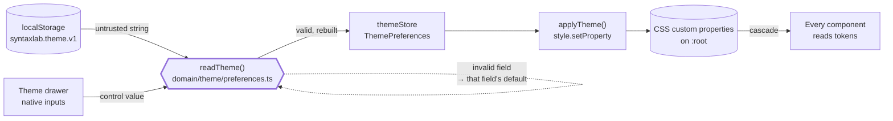
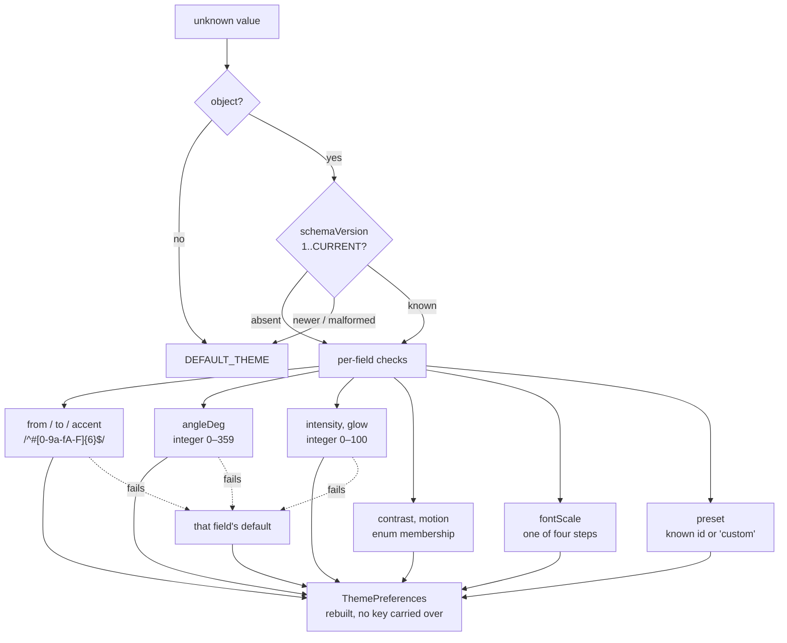
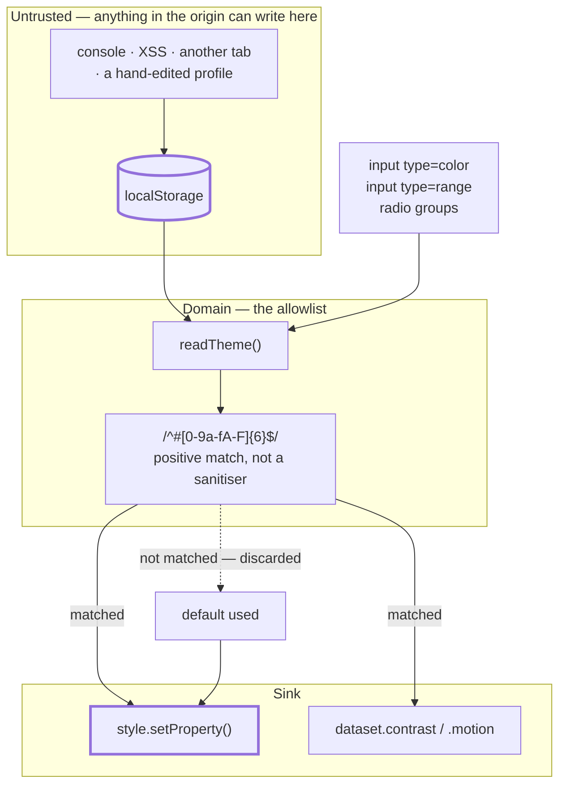
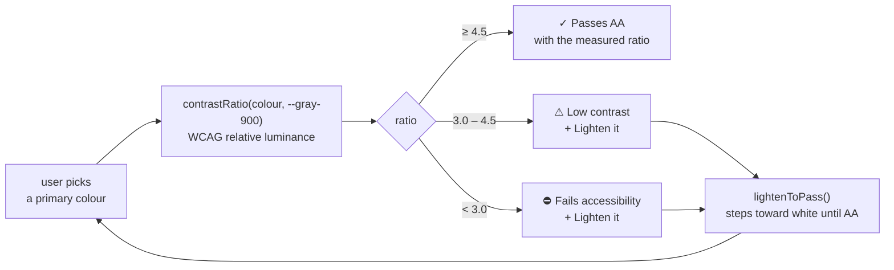

# 09 — Design System

**Project:** SyntaxLab
**Status:** Draft for human review
**Last updated:** 2026-08-17

---

> **Scope note (Phase 1.5).** The token system is release-independent. Cron-specific field colours are introduced with the cron UI in **V1.1**; nothing else here changes between releases.

## 1. Principles

1. **Tokens are the only source of truth.** No component contains a raw colour, spacing value, or font size. Enforced by stylelint.
2. **Three layers of tokens.** Primitive → semantic → component. Components consume semantic tokens; user customisation rewrites primitives; nothing breaks.
3. **Restraint is the aesthetic.** The gradient is a garnish, not the meal. Default intensity is low.
4. **Accessible by construction.** Every default pair meets WCAG AA, and user customisation is contrast-checked live.
5. **Dark by default, and only dark through V1.1.** A light theme is V1.2+ and undecided (Q-14). Shipping a half-considered light mode is worse than shipping none.

---

## 2. Token layers

```
┌──────────────────────────────────────────────────────────┐
│ ① PRIMITIVES   --green-500, --gray-900, --space-4        │
│    Raw values. Only the theme system writes these.       │
├──────────────────────────────────────────────────────────┤
│ ② SEMANTIC     --color-bg, --color-text, --color-accent  │
│    Meaning, not appearance. Components read these.       │
├──────────────────────────────────────────────────────────┤
│ ③ COMPONENT    --button-bg, --editor-gutter-bg           │
│    Only where a component needs a value not covered      │
│    by a semantic token. Always derived from ②.           │
└──────────────────────────────────────────────────────────┘
```

The payoff: user customisation writes to layer ① at runtime, and layers ② and ③ recompute automatically because they are defined in terms of ①. Zero component code participates in theming.

---

## 3. Colour

### 3.1 Primitives

```css
:root {
  /* Greens — six steps, deliberately not ten. The brief warns against
     "10 different shades of green" and it is the correct warning. */
  --green-100: #d4f5e2;
  --green-300: #6ee7a0;
  --green-500: #00ff88;   /* signature accent */
  --green-600: #00cc6a;
  --green-700: #059648;
  --green-900: #003d1f;

  /* Neutrals — near-black through off-white */
  --gray-950: #0a0e0c;    /* app background — green-tinted black, not pure #000 */
  --gray-900: #101613;    /* surface */
  --gray-800: #171f1b;    /* raised surface */
  --gray-700: #1f2a24;    /* borders */
  --gray-600: #2d3a33;    /* strong borders */
  --gray-500: #4a5a52;    /* disabled */
  --gray-400: #6b7d74;    /* muted text */
  --gray-300: #9aada3;    /* secondary text */
  --gray-100: #e8f0eb;    /* primary text */
  --white:    #f5faf7;

  /* Status — desaturated to sit in a dark UI without vibrating */
  --red-500:    #ff5c5c;
  --red-900:    #3d1414;
  --amber-500:  #ffb020;
  --amber-900:  #3d2a0a;
  --blue-500:   #4a9eff;
  --blue-900:   #0a1f3d;
}
```

**Why `#0a0e0c` and not `#000000`:** pure black against bright text causes halation and is genuinely fatiguing over a long session. A slightly green-tinted near-black keeps the hacker register while staying comfortable, and gives darker surfaces somewhere to go.

**Why six greens:** accent, hover, active, border, glow, and deep-gradient stop. Every one has a job. A seventh would not.

### 3.2 Semantic tokens

```css
:root {
  /* Surfaces */
  --color-bg:            var(--gray-950);
  --color-surface:       var(--gray-900);
  --color-surface-raised:var(--gray-800);
  --color-surface-sunken:#070a09;

  /* Text */
  --color-text:          var(--gray-100);
  --color-text-secondary:var(--gray-300);
  --color-text-muted:    var(--gray-400);
  --color-text-inverse:  var(--gray-950);

  /* Accent — the customisable axis */
  --color-accent:        var(--green-500);
  --color-accent-hover:  var(--green-300);
  --color-accent-active: var(--green-600);
  --color-accent-subtle: color-mix(in oklab, var(--color-accent) 12%, transparent);
  --color-accent-text:   var(--green-300);   /* accent legible as text on dark */

  /* Borders */
  --color-border:        var(--gray-700);
  --color-border-strong: var(--gray-600);
  --color-border-accent: color-mix(in oklab, var(--color-accent) 40%, transparent);

  /* Status */
  --color-success: var(--green-500);   --color-success-bg: color-mix(in oklab, var(--green-500) 10%, transparent);
  --color-error:   var(--red-500);     --color-error-bg:   var(--red-900);
  --color-warning: var(--amber-500);   --color-warning-bg: var(--amber-900);
  --color-info:    var(--blue-500);    --color-info-bg:    var(--blue-900);

  /* Focus — never falls below 3:1 on any surface */
  --color-focus: var(--green-300);
}
```

`color-mix()` in oklab does the derivation work. It is supported in all current evergreen browsers; a fallback `@supports not (color: color-mix(in oklab, red, blue))` block supplies static equivalents for older engines.

### 3.3 Syntax-highlighting palette

Distinct hues, all ≥ 4.5:1 against `--color-surface`, chosen to remain distinguishable under the most common colour-vision deficiencies (verified with a simulator — green/red pairs are avoided as the *only* distinction).

```css
:root {
  --syntax-keyword:  #ff7edb;
  --syntax-string:   var(--green-300);
  --syntax-number:   #ffb86c;
  --syntax-boolean:  #8be9fd;
  --syntax-null:     var(--gray-400);
  --syntax-key:      #8be9fd;
  --syntax-operator: var(--gray-100);
  --syntax-comment:  var(--gray-400);
  --syntax-error:    var(--red-500);

  /* Regex-specific */
  --syntax-rx-meta:       var(--green-500);
  --syntax-rx-class:      #ffb86c;
  --syntax-rx-group:      #8be9fd;
  --syntax-rx-quantifier: #ff7edb;
  --syntax-rx-anchor:     #bd93f9;
  --syntax-rx-escape:     var(--green-300);
}
```

Match highlighting uses a background tint **and** an underline, so colour is never the only signal.

### 3.4 Contrast audit (defaults)

| Pair | Ratio | WCAG |
|---|---|---|
| `--gray-100` on `--gray-950` | 15.8:1 | AAA |
| `--gray-300` on `--gray-950` | 8.2:1 | AAA |
| `--gray-400` on `--gray-950` | 4.9:1 | AA |
| `--green-500` on `--gray-950` | 12.4:1 | AAA |
| `--green-300` on `--gray-900` | 9.1:1 | AAA |
| `--red-500` on `--gray-950` | 5.4:1 | AA |
| `--amber-500` on `--gray-950` | 9.8:1 | AAA |
| `--gray-950` on `--green-500` (accent button) | 12.4:1 | AAA |

`--gray-500` is used **only** for disabled states, where WCAG does not require contrast, and disabled state is additionally conveyed by cursor and `aria-disabled`.

---

## 4. Gradient system

### 4.1 Tokens

```css
:root {
  --gradient-from:      var(--green-500);
  --gradient-to:        var(--green-900);
  --gradient-angle:     135deg;
  --gradient-intensity: 0.4;              /* 0–1 */

  --gradient-primary: linear-gradient(
    var(--gradient-angle),
    color-mix(in oklab, var(--gradient-from) calc(var(--gradient-intensity) * 100%), transparent),
    color-mix(in oklab, var(--gradient-to)   calc(var(--gradient-intensity) * 100%), transparent)
  );

  --gradient-subtle: linear-gradient(
    var(--gradient-angle),
    color-mix(in oklab, var(--gradient-from) calc(var(--gradient-intensity) * 25%), transparent),
    transparent
  );

  --glow-intensity: 0.25;
  --glow-accent: 0 0 calc(20px * var(--glow-intensity))
                 color-mix(in oklab, var(--color-accent) 30%, transparent);
}
```

Intensity multiplies alpha rather than swapping colours, so the customisation slider is a single continuous axis from invisible to bold, and it can never produce a broken-looking state.

### 4.2 Where the gradient may appear

Exactly four places at default intensity. This list is a hard rule, not a suggestion — the brief's "excessive gradients" warning is the most common way this aesthetic fails.

| Location | Treatment |
|---|---|
| Header bottom border | 1 px, `--gradient-primary` |
| Active mode indicator | 2 px underline |
| Primary button background | `--gradient-primary` at higher intensity |
| Focus ring on the active editor | `--gradient-subtle` outer glow |

Never on: card backgrounds, text, the page background, panel fills, or icons.

### 4.3 Presets

| Preset | From | To | Angle | Intensity |
|---|---|---|---|---|
| **Matrix** (default) | `#00ff88` | `#003d1f` | 135° | 0.40 |
| Emerald | `#10b981` | `#064e3b` | 120° | 0.35 |
| Cyan | `#22d3ee` | `#0e4f5c` | 145° | 0.35 |
| Amber | `#fbbf24` | `#78350f` | 130° | 0.30 |
| Mono | `#9aada3` | `#1f2a24` | 180° | 0.25 |

Mono exists for users who want the tool with no colour theatre at all. That option is part of the restraint, not a compromise of it.

### 4.4 Customisation mechanics

```ts
function applyTheme(t: ThemePreferences) {
  const r = document.documentElement.style;
  r.setProperty('--gradient-from',      t.gradient.from);        // validated hex
  r.setProperty('--gradient-to',        t.gradient.to);
  r.setProperty('--gradient-angle',     `${t.gradient.angleDeg}deg`);
  r.setProperty('--gradient-intensity', String(t.gradient.intensity / 100));
  r.setProperty('--color-accent',       t.accent);
  r.setProperty('--glow-intensity',     String(t.glowIntensity / 100));
  document.documentElement.dataset.contrast = t.contrastMode;
  document.documentElement.dataset.motion   = t.reducedMotion;
}
```

Eleven lines, no component involvement, no re-render. This is the entire justification for ADR-005 (plain CSS over a framework) and for the three-layer token structure.

**Every value is validated before this function is called** — see `03_DOMAIN_MODEL.md` §7.1 and `05_SECURITY.md` §2.2. `setProperty` with an unvalidated string is a CSS-injection sink.

### 4.5 Contrast guard

After each change, the theme drawer computes the WCAG ratio of `--color-accent` against `--color-surface`:

| Ratio | UI response |
|---|---|
| ≥ 4.5 | ✓ "Passes AA" |
| 3.0–4.5 | ⚠ "Low contrast — hard to read at small sizes" |
| < 3.0 | ⛔ "Fails accessibility — text using this colour will be hard to read" + a one-click "fix" that lightens to the nearest passing value |

We never *block* the choice — it is the user's tool. We make the consequence visible and the fix trivial.

---

## 5. Typography

```css
:root {
  --font-sans: 'Inter var', -apple-system, BlinkMacSystemFont, 'Segoe UI', system-ui, sans-serif;
  --font-mono: 'JetBrains Mono', ui-monospace, 'SF Mono', Menlo, Consolas, monospace;

  --text-xs:   0.75rem;   /* 12px — badges, labels */
  --text-sm:   0.8125rem; /* 13px — secondary, table body */
  --text-base: 0.875rem;  /* 14px — body. Developer-tool density. */
  --text-md:   1rem;      /* 16px — inputs (below this iOS zooms) */
  --text-lg:   1.125rem;  /* 18px — panel titles */
  --text-xl:   1.375rem;  /* 22px — the cron summary, the one big statement */
  --text-2xl:  1.75rem;   /* 28px — empty-state headline */

  --leading-tight:  1.25;
  --leading-normal: 1.5;
  --leading-relaxed:1.7;   /* explanation prose */

  --weight-normal: 400;
  --weight-medium: 500;
  --weight-semibold: 600;

  --tracking-tight: -0.01em;
  --tracking-wide:   0.02em;  /* uppercase labels only */
}
```

**Fonts:** two self-hosted, subsetted `woff2` families (Latin + common punctuation), ~40 KB total, both with system fallbacks. No CDN (see `07_PWA_OFFLINE.md` §7).

**Font scale setting** multiplies a root `--font-scale`; all sizes are `rem`-derived, so one variable scales the whole interface without touching a component.

**Monospace is used for:** all editors, code fragments inside explanations, JSON values, cron expressions, and match results. **Sans is used for:** everything that is prose.

---

## 6. Spacing, radius, elevation

```css
:root {
  --space-1: 0.25rem;  --space-2: 0.5rem;   --space-3: 0.75rem;
  --space-4: 1rem;     --space-5: 1.5rem;   --space-6: 2rem;
  --space-7: 3rem;     --space-8: 4rem;

  --radius-sm: 3px;    --radius-md: 5px;
  --radius-lg: 8px;    --radius-full: 9999px;

  /* Elevation in a dark UI comes mostly from borders and background steps.
     Shadows are near-invisible on near-black; over-shadowing is a common
     dark-mode mistake that just produces grey mud. */
  --shadow-sm: 0 1px 2px rgba(0,0,0,0.4);
  --shadow-md: 0 4px 12px rgba(0,0,0,0.5);
  --shadow-lg: 0 12px 32px rgba(0,0,0,0.6);
  --shadow-focus: 0 0 0 2px var(--color-bg), 0 0 0 4px var(--color-focus);
}
```

A 4 px base scale. Radii stay small — 3–8 px reads as technical; 16 px reads as consumer-friendly, which is the wrong register for this product.

---

## 7. Component tokens

```css
:root {
  --header-height: 52px;
  --statusbar-height: 32px;
  --drawer-width: 380px;
  --panel-gap: var(--space-3);

  --control-height-sm: 26px;
  --control-height-md: 32px;
  --control-height-lg: 38px;

  --editor-font-size: var(--text-base);
  --editor-line-height: 1.6;
  --editor-gutter-bg: var(--color-surface-sunken);
  --editor-selection: color-mix(in oklab, var(--color-accent) 22%, transparent);
  --editor-cursor: var(--color-accent);
  --editor-active-line: color-mix(in oklab, var(--color-accent) 5%, transparent);
}
```

Touch targets are ≥ 44 px on coarse pointers via a `@media (pointer: coarse)` override that raises `--control-height-*`. One media query, no component changes.

---

## 8. Theme modes

### 8.1 High contrast

```css
[data-contrast="high"] {
  --color-bg: #000000;
  --color-surface: #0a0a0a;
  --color-text: #ffffff;
  --color-text-secondary: #e0e0e0;
  --color-text-muted: #c0c0c0;
  --color-border: #666666;
  --color-border-strong: #999999;
  --gradient-intensity: 0.15;
  --glow-intensity: 0;
}
```

Also honours `prefers-contrast: more` automatically.

### 8.2 Reduced motion

```css
[data-motion="never"], 
@media (prefers-reduced-motion: reduce) {
  *, *::before, *::after {
    animation-duration: 0.01ms !important;
    animation-iteration-count: 1 !important;
    transition-duration: 0.01ms !important;
    scroll-behavior: auto !important;
  }
}
```

The blunt global override is correct here: no state in this app is conveyed *only* by motion, so removing all of it loses no information.

### 8.3 Light theme — V1.2+, undecided

Deferred deliberately. The token architecture supports it (swap the primitive layer under `[data-theme="light"]`), but a light theme needs its own contrast audit, its own syntax palette, and its own gradient treatment. Shipping a mechanical inversion would look bad and would undercut the "serious tool" positioning.

---

## 9. Rules for component authors

1. **Never write a literal colour, size, or spacing value.** Use a token. Stylelint fails the build otherwise.
2. **Prefer semantic over primitive tokens.** `--color-accent`, not `--green-500`.
3. **Add a component token only when no semantic token fits**, and derive it from a semantic one.
4. **Never write inline styles** except for genuinely dynamic geometry (a resizable panel's width). Never for colour.
5. **Test every component at both contrast modes and both motion settings.**
6. **Assume the accent may be any hue.** Do not write CSS that only looks right with green.
7. **New tokens require a design-system entry**, not just a declaration.

---

## 10. Iconography

Inline SVG, authored by us, ~20 icons, ~4 KB total, `currentColor`, 16 px and 20 px on a 24 px grid, `stroke-width: 1.5`.

**No icon library.** Lucide/Heroicons/Feather via a package pulls in a component wrapper and tree-shaking that works imperfectly, for twenty icons we can inline. This is a straightforward ladder call: the platform (SVG) covers it.

Every icon-only button has an `aria-label` and a tooltip. Icons never carry meaning alone.

---

## 11. M8 — the theme system as built

### 11.1 The pipeline

Four stages, and the boundary between the second and third is the one that
matters: nothing reaches a CSS custom property without having been rebuilt
field by field first.



**No component re-renders when the theme changes.** The drawer subscribes to
`themeStore` so its own controls can show current values; nothing else does.
A preset change is one `setProperty` burst and one style recalculation —
measured at **1.1 ms median** (`12_PERFORMANCE.md` §10.9).

### 11.2 Validation, field by field

`readTheme` is **total**: it has no failure mode and never throws. Each field
falls back independently, so one corrupt colour costs the user that colour
rather than the theme they had built.



Two decisions worth stating:

**Reject, never clamp.** `angleDeg: 100000` becomes the default 135, not 359.
Clamping invents a value the user never chose and hides that the data was
wrong. The pre-paint bootstrap follows the same rule, because a bootstrap that
clamped where the domain resets would paint one theme and then replace it.

**A theme from a newer build is discarded, not preserved.** This is the
opposite of the history rule (`06_DATA_STORAGE.md` §7.3), and deliberately so:
a theme is a preference the user can set again in four clicks, and showing
them an interface they cannot fix from inside the app is worse than showing
them the default.

### 11.3 The security boundary



**Every path goes through `readTheme`, including our own controls.**
`setTheme` revalidates rather than trusting its caller: an
`input[type="color"]` is guaranteed by specification to produce `#rrggbb`, but
that guarantee lives in a specification and not in this repository, and
`applyTheme` is an injection sink. Validating at one choke point makes the
invariant structural instead of something each future caller has to have read.

`red; background: url(https://attacker.example)` is not recognised as hostile
and stripped. It simply is not `#RRGGBB`, so it is discarded. That is the
whole mechanism, and it is why the list of payloads it stops is open-ended.

### 11.4 The contrast guard



**The choice is never blocked.** It is the user's tool; what we owe them is
the consequence stated plainly and a fix that costs one click. The passing
state is stated too — silence is indistinguishable from the check not having
run.

The background is `--gray-900`, the value `--color-surface` resolves to. The
domain cannot read CSS, so the constant is duplicated in
`domain/theme/preferences.ts`; a unit test reads `tokens.css` and asserts the
two agree, because a guard that reports a confident ratio against the wrong
background is worse than no guard.

### 11.5 What is customisable, and what is not

| Customisable | Fixed |
|---|---|
| Preset | Every semantic status colour — success, error, warning, info |
| Primary gradient colour | The focus ring token |
| Secondary gradient colour | Surfaces, borders, text colours |
| Direction (four named) | Spacing, radii, typography scale |
| Intensity (0–100) | Where the gradient may appear (§4.2) |
| Glow (0–100) | |
| Contrast, motion, text size | |

The accent is **derived from the primary colour**, not chosen separately. An
amber gradient with a green focus ring is incoherent, and one fewer control is
one fewer way to build an unreadable interface.

Status colours are deliberately not customisable. `05_SECURITY.md` and
`13_ACCESSIBILITY.md` both depend on an error being visibly an error; letting
that become a user preference would make an accessibility guarantee optional.

### 11.6 Deviations from §4 as specified

| Specified | As built | Why |
|---|---|---|
| Angle as a slider, 0–359 | Four named directions | The stored value is still `angleDeg`, a bounded integer, so the schema and the bootstrap are unchanged. A continuous angle control invites fiddling with a number nobody can name; four directions cover what the gradient is for. |
| Preset **Cyan**, **Amber** | **Deep Cyan**, **Amber Console** | Display names only. The ids, colours, angles and intensities are exactly §4.3. |
| Accent as its own control | Derived from the primary colour | See above. |
| `backgroundDarkness` in the model | Not implemented | Nothing reads it, and no token exists for it. Adding a control for a value with no effect would be theatre. |
| Self-hosted subsetted `woff2` (§5) | **System stacks only** | The font files are not in the repository and M8 did not add them — fetching typefaces was out of scope and the licensing needs deciding. `tokens.css` says so at the point of definition. Unchanged from M1; recorded here rather than left as a silent gap between §5 and the build. |
