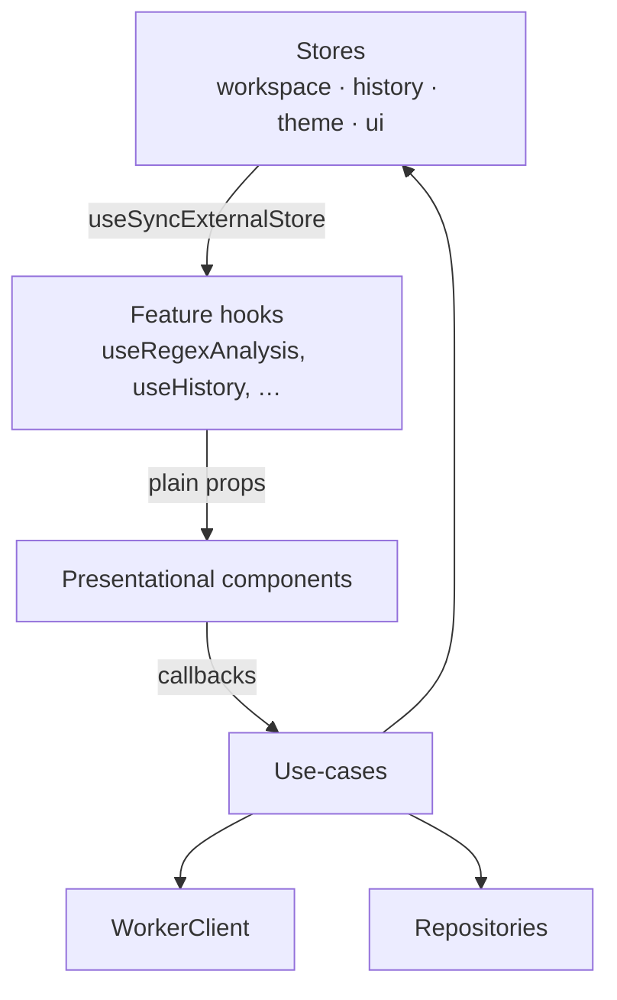

# 10 — Component Architecture

**Project:** SyntaxLab
**Status:** Draft for human review
**Last updated:** 2026-08-17

---

> **Scope note.** V1.0 builds the regex and JSON feature trees. **Cron components (§4.3) do not exist.** M14 built the cron *domain* only; `src/features/cron/` has not been created, and no component, route, mode-selector entry or lazy chunk references cron. That is a checked property, not an intention — see §4.3. The share dialog is removed from V1.0 with the deferred feature.

## 1. Principles

1. **Presentational by default.** Components render props. Data fetching, parsing, and persistence live in the application layer.
2. **One responsibility per component.** If a component's name needs "and", split it.
3. **Composition over configuration.** A `<Panel>` with children beats a `<Panel>` with fifteen boolean props.
4. **A soft 200-line ceiling.** Not dogma, but a component past it usually contains a second component.
5. **Feature-local by default.** A component is promoted to `components/` only when a *second* feature actually needs it. Speculative sharing produces the wrong abstraction.
6. **Every component is renderable in isolation** with props alone — which is what makes them testable without mounting the app.

---

## 2. Tree

> **Built at M1** (marked ✅). Everything else is scheduled to its milestone.
> The shell tree below is the current implementation, not an intention.

```
<App>                                   ✅ M1
└── <ErrorBoundary scope="app">         ✅ M1
    └── <AppShell>                      ✅ M1
        ├── <Header>                    ✅ M1
        │   ├── wordmark + tagline      ✅ M1
        │   └── <ModeSelector/>         ✅ M1  radiogroup, roving tabindex
        │
        ├── <WorkspacePlaceholder>      ✅ M1  real layout, no editor yet
        │   ├── <ErrorBoundary scope="input">     ✅ M1
        │   │   └── input pane + ECMAScript label ✅ M1
        │   └── <ErrorBoundary scope="analysis">  ✅ M1
        │       └── analysis pane                 ✅ M1
        │
        └── <StatusBar/>                ✅ M1  polite live region
```

### Built at M6

```
<Workspace>                              ✅ M4  mode switch
├── <RegexWorkspace/>                    ✅ M4
└── <JsonWorkspace>                      ✅ M6
    ├── <ErrorBoundary scope="input">
    │   └── <InputColumn>
    │       ├── Panel "JSON" → <CodeEditor showLineNumbers/>
    │       ├── <JsonToolbar/>       indent · format · minify
    │       ├── <JsonManualPrompt/>  conditional, over 500 KB
    │       ├── status line
    │       └── Panel "Problems" → <JsonErrors/>
    └── <ErrorBoundary scope="analysis">
        └── <TreeColumn>
            ├── Panel "Findings"  → <JsonFindings/>
            └── Panel "Structure"
                ├── <JsonSearch/>
                ├── <JsonSelected/>   path + copy
                └── <JsonTree/>       virtualised above 500 rows

<ModeSuggestion/>                        ✅ M6  conditional, between header and main
```

**`<JsonTree>` is feature-local rather than the shared `<TreeView>`**, and that
is a deviation with a reason rather than a shortcut. The two trees differ in
both ways that matter: the regex AST is a nested structure of a few dozen
rows, while the JSON tree is *pre-flattened* — so duplicate-key and
precision annotations are computed once, outside React — and can be hundreds
of thousands of rows. One component serving both would mean the regex tree
paying for virtualisation it never needs, or the JSON tree re-flattening on
every render. `Panel`, `Button`, `Badge`, `CopyButton`, `CodeEditor` and
`ErrorBoundary` are all shared as intended.

`<JsonPlaceholder>` was deleted; JSON is a real feature now.

### Built at M4

```
<App>
└── <ErrorBoundary scope="app">
    └── <AppShell>
        ├── <Header> → <ModeSelector/>          ✅ M1
        ├── <Workspace>                          ✅ M4  mode switch, not a router
        │   ├── <RegexWorkspace>                 ✅ M4
        │   │   ├── <ErrorBoundary scope="input">
        │   │   │   ├── Panel "Pattern"
        │   │   │   │   ├── <CodeEditor singleLine/>
        │   │   │   │   ├── <FlagBar/>          eight toggles
        │   │   │   │   └── <ExamplePicker/>    native select
        │   │   │   ├── Panel "Test string" → <CodeEditor/>
        │   │   │   └── Panel "Matches"    → <MatchResults/>
        │   │   └── <ErrorBoundary scope="analysis">
        │   │       ├── Panel "Explanation" → <ExplanationView/>
        │   │       ├── Panel "Warnings"   → <WarningList/>
        │   │       ├── Panel "Structure"  → <TreeView renderNode={AstRow}/>
        │   │       ├── Panel "Groups"     → <GroupTable/>
        │   │       ├── Panel "Tokens"     → <TokenTable/>
        │   │       └── Panel "Compatibility"
        │   └── <JsonPlaceholder/>               empty state until M6
        └── <StatusBar/>                         ✅ M1
```

Shared components added: `<CodeEditor>`, `<TreeView>`, `<Panel>`, `<Button>`,
`<Badge>`, `<CopyButton>`.

**`<ErrorBoundary>` moved from `app/` to `components/`.** The regex feature
wraps its own two columns, and the layer rules correctly stop a feature
importing from `app/`. The boundary is a shared component by nature, so moving
it was the honest fix rather than relaxing the rule.

**Not built, deliberately:** `<Drawer>`, `<Dialog>`, `<Tabs>`, `<Toggle>`,
`<Select>`, `<ColorInput>`, `<Slider>`, `<Toast>`, `<EmptyState>`,
`<ErrorState>`. Each belongs to a feature that does not exist yet, and a
primitive with no consumer is the wrong abstraction written early. The example
picker uses a plain native `<select>` for the same reason.

M3 added no components — it is domain and worker work only.

M2 added no components. It added `src/app/devWorkerHarness.ts`, which renders
nothing: it attaches a control surface to `window` under `import.meta.env.DEV`
so the E2E suite can drive real workers, and is dropped from production builds.

Header actions (history, theme, help) are **not** rendered at M1. They arrive
with the features they open (M7, M8, M10). Rendering them now as inert buttons
would be the disabled-affordance defect the UX spec rules out (§2.1) — a
control that does nothing reads as broken, not as pending.

### 2.1 Target tree


```
<App>
└── <ErrorBoundary scope="app">
    └── <AppShell>
        ├── <Header>
        │   ├── <Wordmark/>
        │   ├── <ModeSelector/>              radiogroup
        │   └── <HeaderActions>
        │       ├── <OfflineChip/>           conditional
        │       ├── <HistoryPausedChip/>     conditional
        │       ├── <IconButton icon="history"/>
        │       ├── <IconButton icon="theme"/>
        │       └── <IconButton icon="help"/>
        │
        ├── <UpdateBanner/>                  conditional
        ├── <DetectionSuggestion/>           conditional
        │
        ├── <Workspace>                      resizable split
        │   ├── <ErrorBoundary scope="input">
        │   │   └── <InputPane>
        │   │       ├── <RegexInput/> | <JsonInput/>        (<CronInput/> in V1.1)
        │   │       └── <InputFooter/>       char count, limit warning
        │   ├── <SplitHandle/>
        │   └── <ErrorBoundary scope="analysis">
        │       └── <AnalysisPane>
        │           └── <RegexAnalysis/> | <JsonAnalysis/>  (<CronAnalysis/> in V1.1)
        │
        ├── <StatusBar>
        │   ├── <ValidityIndicator/>
        │   ├── <AnalysisStats/>
        │   └── <ActionBar/>                 copy · clear
        │
        ├── <FirstRunHistoryNotice/>        conditional, once
        ├── <HistoryDrawer/>                 lazy
        ├── <ThemeDrawer/>                   lazy
        ├── <HelpDialog/>                    lazy
        └── <ToastRegion/>
```

### Error-boundary placement

Three boundaries, deliberately placed rather than sprinkled:

| Scope | Catches | Result |
|---|---|---|
| `app` | Anything escaping the others | Full-page recovery screen with a reset action |
| `input` | Editor crashes (a CM6 extension bug) | Input pane shows a recovery card; **analysis and history remain usable** |
| `analysis` | Rendering crashes (a malformed tree, an explanation bug) | Analysis pane shows a recovery card; **the user's input is preserved** |

The point of the two inner boundaries is that a crash never costs the user their input. That is the only thing in this app that cannot be recomputed.

---

## 3. Shared components

### 3.1 `<CodeEditor>` — the one CodeMirror wrapper

```ts
interface CodeEditorProps {
  value: string;
  onChange: (value: string) => void;
  language: 'regex' | 'json' | 'plain';
  placeholder?: string;
  readOnly?: boolean;
  maxLength: number;
  diagnostics?: Diagnostic[];        // squiggles from the parser
  highlights?: HighlightRange[];     // match highlighting / span linking
  ariaLabel: string;
  ariaDescribedBy?: string;
  onCursorChange?: (pos: number) => void;
}
```

**One wrapper, not several.** Every editor surface (regex pattern, regex test string, JSON — and the cron expression in V1.1) differs only in language extension and configuration. Near-identical wrappers would be several places to fix every CM6 quirk.

Responsibilities: create and destroy the `EditorView`, reconcile external value changes without fighting the user's cursor, apply diagnostics and highlights as decoration sets, apply theme tokens, enforce `maxLength` on paste and input, and expose the accessibility attributes.

Language modes are **lazy-imported** — the JSON language package loads only when JSON mode is first used.

The classic bug this wrapper must get right: an uncontrolled external `value` update that resets the cursor to position 0 on every keystroke. The wrapper compares the incoming value against the view's current document and dispatches a transaction only on a genuine difference.

### 3.2 `<TreeView>` — shared by JSON and regex AST

```ts
interface TreeViewProps<T> {
  nodes: T[];
  getKey: (n: T) => string;
  getChildren: (n: T) => T[] | undefined;
  renderNode: (n: T, state: NodeState) => ReactNode;
  expandedKeys: Set<string>;
  onToggle: (key: string) => void;
  onSelect?: (n: T) => void;
  virtualizeThreshold?: number;   // default 500 visible rows
}
```

Generic over node type; each feature supplies its own `renderNode`. Handles expansion state, keyboard navigation (`↑ ↓ ← → Home End`), `role="tree"` semantics, and virtualisation.

**Virtualisation is hand-rolled**, not `react-window`. The requirement is a single fixed-row-height vertical list — roughly 60 lines of "slice by scroll offset, pad with spacers". Pulling in a windowing library for one list is a rung-5 violation. If a variable-height or horizontal case ever appears, revisit.

### 3.3 Primitives

| Component | Notes |
|---|---|
| `<Button>` | Variants: primary, secondary, ghost, danger. Sizes: sm, md. Loading state disables and announces. |
| `<IconButton>` | Requires `label`; renders `aria-label` + tooltip. Type-level requirement, not convention. |
| `<Drawer>` | Focus trap, `Escape`, restore focus, `aria-modal`, background inert, slide animation |
| `<Dialog>` | As above, centred, with a required labelled heading |
| `<Tabs>` | Roving tabindex, `role="tablist"`, arrow-key navigation |
| `<Toggle>` | `role="switch"`, `aria-checked` |
| `<Select>` | Native `<select>` styled. Not a custom listbox — native gets keyboard, screen-reader, and mobile behaviour correct for free. |
| `<ColorInput>` | Native `<input type="color">` + validated hex text field |
| `<Slider>` | Native `<input type="range">` with a value label |
| `<Toast>` | `role="status"`, auto-dismiss, pauses on hover/focus |
| `<Panel>` | Titled section with optional collapse; the layout unit of the analysis pane |
| `<Badge>` | Type/status pills; always text, never colour-only |
| `<CopyButton>` | Copy + transient "Copied" confirmation + `aria-live` announcement |
| `<EmptyState>` | Icon, headline, description, optional actions |
| `<ErrorState>` | What failed, where, what next, recovery action |

Every primitive is a plain function component with no state beyond local UI concerns. `<Select>` and `<Slider>` being native is a deliberate rung-4 choice: the platform already solved them, and every custom reimplementation regresses accessibility.

---

## 4. Feature components

### 4.1 Regex

```
<RegexInput>
  ├── <CodeEditor language="regex"/>
  ├── <RegexFlagBar/>          seven toggles
  └── <RegexExamplePicker/>

<RegexAnalysis>
  ├── <Panel title="Explanation">
  │   ├── <ExplanationSummary/>
  │   └── <TokenTable/>          hover ↔ editor span link
  ├── <Panel title="Structure">
  │   └── <TreeView renderNode={RegexNodeRow}/>
  ├── <Panel title="Groups">
  │   └── <GroupTable/>
  ├── <WarningList/>
  └── <Panel title="Test">
      ├── <CodeEditor language="plain" ariaLabel="Test string"/>
      ├── <MatchHighlightOverlay/>
      └── <MatchTable/>          or <TimeoutState/> / <NoMatchesState/>
```

The hover-link between `<TokenTable>` and the editor is coordinated by a single `hoveredSpan` value in the feature's local state — not a global store, since nothing outside this feature needs it.

### 4.2 JSON

```
<JsonInput>
  ├── <CodeEditor language="json" diagnostics={errors}/>
  └── <JsonToolbar/>             format · minify · indent

<JsonAnalysis>
  ├── <JsonErrorReport/>         first, when invalid
  ├── <Panel title="Structure">
  │   ├── <JsonTreeToolbar/>     expand/collapse · search
  │   └── <TreeView renderNode={JsonNodeRow} virtualize/>
  ├── <JsonPathBar/>             selected node path + copy
  ├── <JsonStatsLine/>           one line, not a card grid
  └── <JsonFindings/>            duplicate keys · unsafe numbers
```

### 4.3 Cron — **still not built. M15.**

> **M14 changed nothing in this file's subject matter.** The cron domain runs in the analysis worker and is reachable only through `analysis.cron`. There is no `features/cron/` directory, no `<CronInput>`, no cron entry in the mode selector, and no cron detection result the UI can act on — `ModeSuggestion` filters detection down to the two modes that exist before it can reach `setMode`.
>
> The sketch below remains the M15 target.

```
<CronInput>
  ├── <CodeEditor language="plain"/>   field-coloured decorations
  ├── <CronDialectSelect/>
  ├── <CronTimezoneSelect/>
  └── <CronPresetPicker/>

<CronAnalysis>
  ├── <CronSummary/>             the large plain-English statement
  ├── <Panel title="Fields"><CronFieldTable/></Panel>
  ├── <Panel title="Next runs"><NextRunsList/></Panel>
  ├── <CronWarnings/>            DOM/DOW OR-rule, DST
  └── <Panel title="Builder" collapsible><CronBuilder/></Panel>
```

`<CronBuilder>` is the most stateful component in the app: it must stay bidirectionally synchronised with the text expression. Rule — **the expression string is the single source of truth**. The builder derives its control values from the parsed expression and, on change, writes a new expression string. It never holds independent state. This eliminates the entire class of "the builder and the text box disagree" bugs.

### 4.4 History and theme

```
<HistoryDrawer>
  ├── <HistorySearch/>
  ├── <HistoryFilters/>
  ├── <HistoryList>  └── <HistoryEntryRow/>*
  ├── <HistoryEmptyState/> | <StorageUnavailableState/>
  └── <HistoryActions/>      export · import · clear all

<ThemeDrawer>
  ├── <PresetGrid/>
  ├── <GradientControls/>
  ├── <InterfaceControls/>
  ├── <ContrastCheck/>
  └── <ResetButton/>
```

---

## 5. Data flow into components



**Only hooks read stores.** Presentational components receive props. This is what keeps them renderable in a test without any provider setup, and it makes the data dependencies of every component visible in its signature.

Feature hooks are the seam:

```ts
function useRegexAnalysis() {
  const input  = useWorkspaceStore(s => s.input);
  const flags  = useWorkspaceStore(s => s.regexFlags);
  const result = useWorkspaceStore(s => s.result);
  const status = useWorkspaceStore(s => s.status);
  return { input, flags, result, status, setInput, toggleFlag, analyze };
}
```

Selector-based subscriptions mean a component re-renders only when the slice it reads changes — the mechanism that keeps typing at 60 fps while an analysis pane is mounted.

---

## 6. Code splitting

| Chunk | Contents | Load trigger |
|---|---|---|
| `index` | Shell, header, stores, tokens, one editor | Initial |
| `regex` | Regex feature UI | Regex mode selected (default) |
| `json` | JSON feature UI + CM JSON language | JSON mode selected |
| `cron` *(M15)* | Cron feature UI | Cron mode selected. **No such chunk exists at M14** — there is no cron UI to split out. |
| `history` | History drawer | Drawer opened |
| `theme` | Theme drawer | Drawer opened |

| `help` | Help dialog | Help opened |
| `analysis.worker` | Domain parsers | First analysis |
| `exec.worker` | Regex execution | First regex test |

All lazy boundaries use `React.lazy` + `Suspense` with a skeleton matching the final layout — no layout shift.

**Prefetch policy:** on idle after first paint, prefetch the other mode's chunk (`json` when starting in regex, and vice versa) — mode switching should feel instant. Do **not** prefetch drawers; most sessions never open them.

---

## 7. Performance rules for components

1. `React.memo` **only where measured**. Blanket memoisation adds comparison cost and obscures real problems.
2. Stable callbacks (`useCallback`) for props passed to memoised children — otherwise the memo does nothing.
3. Selector subscriptions, never whole-store subscriptions.
4. Editor value is **uncontrolled inside CM6**; React holds a debounced mirror. A fully controlled 5 MB document through React state would drop every frame.
5. Lists over ~500 rows virtualise.
6. Keys are stable IDs, never array indices — index keys corrupt state on reorder, and the history list reorders on every pin.
7. No expensive work in render. Derivations are memoised or precomputed in the worker.

---

## 8. Testing components

| Layer | Approach |
|---|---|
| Primitives | React Testing Library: render, interact, assert accessible output |
| Feature components | Render with fixture props; no store, no mocks needed |
| Feature hooks | `renderHook` with a fake repository and a fake worker client |
| Integration | Full workspace with real stores and fakes for infrastructure |
| Accessibility | `axe-core` on every primitive and every primary view |
| Visual | Playwright screenshots of key states, default theme only (custom-theme snapshots are noise) |

Queries are by **role and accessible name**, never by test id or class. A test that cannot find a button by its accessible name has found a real accessibility bug.


---

## M7 — the history components, as built

```
Header
├── ModeSelector
└── HistoryControls            open + pause, both always visible
    └── HistoryDrawer
        ├── Notices            durability, suspension, errors, integrity counts
        ├── EntryRow ×N        open · pin · rename · delete
        │   └── RenameForm     replaces the row's open button in place
        ├── UndoBar            5 s, dismissible
        ├── HistoryTransfer    export · import
        └── ConfirmDialog      clear-all

AppShell
└── HistoryNotice              first-run banner, non-blocking
```

### Modal surfaces are the platform's

`Drawer` and `ConfirmDialog` are both a native `<dialog>` opened with
`showModal()`. That one call supplies the focus trap, Escape handling,
inertness of the rest of the page for assistive technology, the backdrop, and
focus restoration to whatever opened it. A hand-rolled modal is several hundred
lines reimplementing exactly that list, and it is the part nobody retests after
the first release.

Two details are not free and are handled explicitly:

- **Backdrop click** is attached with `addEventListener` on the element rather
  than a JSX `onClick`. A modal `<dialog>` fills the viewport, so a click whose
  target *is* the dialog element missed the panel — but expressing that as a
  click handler on a non-interactive element is what the a11y lint rules
  correctly object to. The listener form says the same thing without pretending
  a `<div>` is a button.
- **Children render only while open**, so the drawer's contents are not in the
  accessibility tree — and not focusable — when it is shut.

### Accessible names are given, not accumulated

An entry row contains a title, a badge, a metadata line and a timestamp. Left
alone, the row button's accessible name is all of that read as one sentence
before the user learns what the button does. Each row button therefore carries
an explicit `aria-label`: `Open /ab+c/g`, `Pin /ab+c/g`, `Delete /ab+c/g`. The
detail stays visible and readable; it is simply not the button's name.

This was found by an E2E test failing on a strict-mode locator violation — the
same ambiguity a screen-reader user would have heard.

### The view model holds the wording

`features/history/viewModel.ts` is pure and unit-tested, because the defects
this feature produces are sentences rather than crashes: "1 entries", a count
that says "0 more", or a privacy claim the architecture cannot enforce. Those
are testable only if they are not embedded in JSX.


---

## M8 — the theme components

```
Header
├── ModeSelector
├── HistoryControls
└── ThemeControls          the Appearance button + the three wiring effects
    └── ThemeDrawer        native <dialog>, via the shared Drawer primitive
        ├── Presets        five chips, role="radio" in a radiogroup
        ├── Gradient       colour × 2 · ContrastNote · direction · intensity
        │   └── ContrastNote   pass / low / fail, with a one-click fix
        └── Interface      glow · contrast · motion · text size
```

### The interaction

```mermaid
sequenceDiagram
    participant U as User
    participant D as ThemeDrawer
    participant A as themeStore actions
    participant V as readTheme
    participant R as :root style
    participant LS as localStorage

    U->>D: drag the intensity slider
    D->>A: updateGradient({ intensity })
    A->>V: readTheme(candidate)
    V-->>A: validated ThemePreferences
    A->>R: setProperty — synchronous
    Note over R: repaint this frame; no React render outside the drawer
    A->>A: debounce 250 ms
    A->>LS: setItem once, when the drag stops
    D->>D: re-renders (it subscribes, so its own controls track the value)
```

### Why the controls are native elements

`<input type="color">`, `<input type="range">` and real radio inputs. The
platform's colour picker is the one the user already knows, is keyboard
operable and screen-reader labelled with no work from us, and costs zero
bytes. A picker library would be several kilobytes to be worse at all three
(`16_DEPENDENCIES.md`).

The radio chips wrap a visually hidden `<input type="radio">` rather than
using `<button role="radio">`, because a native radio group gives arrow-key
navigation and a single tab stop for free — which is what a keyboard user
expects from a set of mutually exclusive options.

### The one inline style in the feature

The preset swatch. It has to show a colour that is deliberately *not* the
active theme, so it cannot come from a token. The value is a validated hex
from our own preset table and never user input, and the swatch is
`aria-hidden` with the preset name carrying the meaning.

---

## M11 — the splitter, and a heading level

### `components/primitives/Splitter.tsx`

A new primitive, used by both workspaces. It sits between the two `.column`
elements as a direct grid child and writes its position to a `--split` custom
property on its own parent — which is why it takes no callback and no value
prop: there is nothing for a parent to own.

That is unusual enough to state plainly: **the component reaches out to
`parentElement`.** The alternative is a value prop plus a change handler
threaded through two workspaces, and a re-render of both panels on every
pointer move. The coupling is one line, it is documented at the call site, and
the grid it writes to is the element it is a child of.

Both workspaces pass only a label, because the two panels they divide have
different names.

### `Panel` renders `h2`, not `h3`

Panels are the top-level sections of the workspace, directly under the page's
single `h1`. They were `h3`, which left a level-2 gap in the outline that
Lighthouse's `heading-order` audit found and a screen-reader user navigating by
heading would have hit. Panels are never nested, so one level is the whole
story.

### `MatchResults` renders a window, not a list

`MatchTable` holds `shown` state and renders `result.matches.slice(0, shown)`,
with a "Show 200 more" control below. The window resets when `result` changes —
holding position at row 400 of a previous result would be both wrong and slow.
It is local state rather than store state because nothing outside the table
cares how far the user has scrolled through it.
