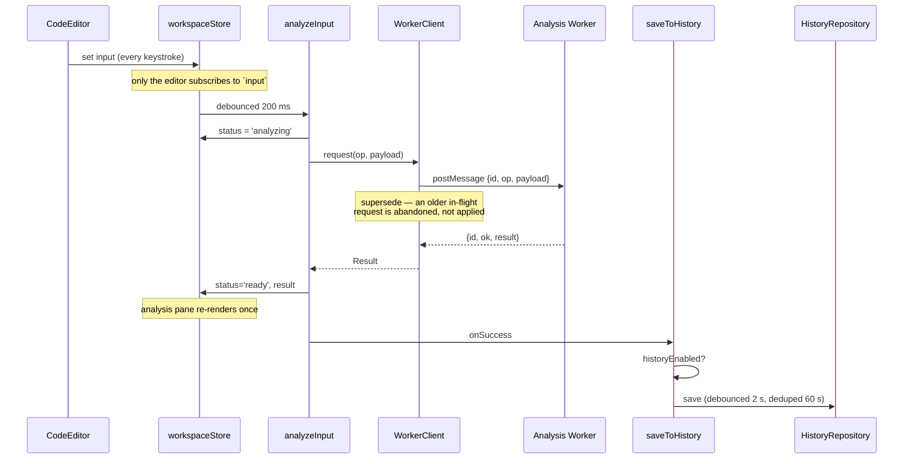

# 11 — State Management

**Project:** SyntaxLab
**Status:** Draft for human review
**Last updated:** 2026-08-17

---

> **Scope note (Phase 1.5).** V1.0 state covers regex and JSON. Cron fields in `workspaceStore` arrive in V1.1. No share state exists in V1.0.

## 1. A note on the brief's framing

The brief asks this document to define "server/cache/local state boundaries". **There is no server** (ADR-001), so there is no server state and no server cache. Rather than invent one to fill the section, the boundaries that actually exist in this application are:

| Boundary | Meaning here | Lives in |
|---|---|---|
| **Domain state** | The parsed result of an analysis: AST/CST, explanation, warnings. Produced by the domain layer in a worker; **never persisted**; recomputed from input. | `workspaceStore.result` |
| **UI state** | What the interface is currently showing: open drawers, expanded tree nodes, hovered spans, toasts, cursor position. Disposable. | React local state + `uiStore` |
| **Transient worker state** | In-flight request ids, deadline timers, worker readiness. Not application state at all — an infrastructure detail. ✅ Implemented at M2: `pending` map, per-request timers, and lifecycle status live entirely inside `WorkerClient` and are never mirrored into a store. | `WorkerClient` internals |
| **Persistent history** | Analysis inputs and metadata. Survives reload. | IndexedDB via `historyStore` |
| **Theme and settings** | Small preference data, read synchronously before first paint. | localStorage via `themeStore` / `settingsStore` |

These five are the boundaries that actually exist. The brief's "server/cache" framing presumes a backend; substituting the real boundaries is more useful than inventing one to fill the section.

This substitution is deliberate and is listed in `22_OPEN_QUESTIONS.md` §3 as a documented deviation.

---

## 2. Inventory

| State | Category | Home | Persisted | Why there |
|---|---|---|---|---|
| Editor text | Session | `workspaceStore` + CM6 internal | ❌ (except across an SW update) | Needs to survive mode switches and drawer opens |
| Current mode | Session | `workspaceStore` | ❌ | Ephemeral choice; `regex` or `json` in V1.0 |
| Regex flags | Session | `workspaceStore` | ⚠️ defaults in settings | Per-analysis, but the default is a preference |
| Analysis result | Derived | `workspaceStore` | ❌ | Recomputed in ms; storing it invites staleness. M3 measured a typical regex analysis at 0.02–0.06 ms, so recomputation is genuinely cheaper than cache invalidation. |
| Analysis status | Session | `workspaceStore` | ❌ | idle / parsing / ready / error / timeout |
| Cursor, selection | Ephemeral | CM6 | ❌ | Belongs to the editor |
| Tree expansion | Ephemeral | Component | ❌ | Resets per analysis, correctly |
| Hovered span | Ephemeral | Feature-local | ❌ | Nothing outside the feature needs it |
| Drawer open/closed | Session | `uiStore` | ❌ | Needs to be closable from a global `Escape` handler |
| Toasts | Session | `uiStore` | ❌ | |
| SW update available | Session | `uiStore` | ❌ | |
| Online/offline | Session | `uiStore` | ❌ | Mirrors a browser event |
| History list | Session cache of persistent | `historyStore` | ✅ IndexedDB | Cached in memory for list rendering; IDB is authoritative |
| History paused | Session + persistent | `settingsStore` | ✅ localStorage | Must survive reload or it is a privacy trap |
| First-run notice seen | Persistent | `settingsStore` | ✅ localStorage | Shown once; must not reappear |
| Theme | Persistent | `themeStore` | ✅ localStorage | Must be readable pre-paint |
| Settings | Persistent | `settingsStore` | ✅ localStorage | |
| Panel split ratio | Persistent | `settingsStore` | ✅ localStorage | Users expect layout to stick |
| Worker readiness | Session | `workerClient` internal | ❌ | Infrastructure detail, not app state |

---

## 3. The store implementation

```ts
type Listener = () => void;

export function createStore<T>(initial: T) {
  let state = initial;
  const listeners = new Set<Listener>();

  return {
    get: () => state,
    set(updater: T | ((prev: T) => T)) {
      const next = typeof updater === 'function'
        ? (updater as (p: T) => T)(state) : updater;
      if (Object.is(next, state)) return;
      state = next;
      listeners.forEach(l => l());
    },
    subscribe(l: Listener) { listeners.add(l); return () => { listeners.delete(l); }; },
  };
}

export function useStore<T, S>(store: Store<T>, selector: (s: T) => S): S {
  return useSyncExternalStore(store.subscribe, () => selector(store.get()), () => selector(store.get()));
}
```

About forty lines including types. It gives us: selector subscriptions, concurrent-safe reads via `useSyncExternalStore`, tearing protection, SSR-safe signature (unused, but free), and full usability from non-React code — which matters because the application layer must update state without touching React.

**Selector results must be referentially stable.** A selector returning a fresh object each call causes an infinite re-render loop. Rule: selectors return primitives or stable references; composites use `useMemo` at the call site or a shallow-equality wrapper. This is written down because it is the single failure mode of this pattern.

### 3.1 Why not a library — recorded honestly

| Option | Verdict |
|---|---|
| **Hand-rolled (chosen)** | Zero bytes, complete understanding, exactly the features we use |
| Zustand (~1.2 KB) | Genuinely good and about as small. If a reviewer prefers it, the swap is mechanical — the store interface is deliberately Zustand-shaped. Not adopted because 40 lines of ours does the same job. |
| Jotai / Recoil | Atomic model suits fine-grained derived graphs. Ours is coarse and shallow. |
| Redux Toolkit | Devtools and middleware are real benefits; ~13 KB and a large amount of ceremony for seven pieces of state is not warranted. |
| Context only | Every context consumer re-renders on any change. With an editor firing updates at typing speed this is measurably bad. |
| TanStack Query | Solves server-cache problems. There is no server. |

---

## 4. Stores

### 4.1 `workspaceStore`

```ts
interface WorkspaceState {
  mode: 'regex' | 'json';          // 'cron' added in V1.1
  detectedType: DetectionResult | null;
  suggestionDismissed: boolean;
  input: string;
  regexFlags: RegexFlags;
  testSubject: string;
  // V1.1: cronTimezone: TimezoneContext;   (dialect is fixed at standard5)
  status: 'idle' | 'analyzing' | 'ready' | 'error' | 'timeout';
  result: AnalysisResult | null;
  error: DomainError | null;
  execResult: MatchResult | null;
  execStatus: 'idle' | 'running' | 'ready' | 'timeout' | 'error';
  restoredFromId: string | null;
  isDirty: boolean;
}
```

The hot path. `input` changes on every keystroke, so **only the editor subscribes to it**; the analysis pane subscribes to `result` and `status`, which change at most once per debounce interval.

### 4.2 `historyStore`

```ts
interface HistoryState {
  entries: HistoryEntry[];        // current page
  total: number;
  query: HistoryQuery;
  loading: boolean;
  error: StorageError | null;
  storageAvailable: boolean;
  quotaWarning: boolean;
}
```

An in-memory projection of IndexedDB. IDB is authoritative; the store is a render cache. Refreshed on: drawer open, any write, and a `BroadcastChannel` message from another tab.

### 4.3 `themeStore` and `settingsStore`

Both write through to `localStorage` on change (debounced 300 ms), and both validate on read at startup. `themeStore` additionally calls `applyTheme()` on every change to push CSS custom properties.

### 4.4 `uiStore`

Drawers, dialogs, toasts, online status, update availability. Deliberately separate from `workspaceStore` so that opening a drawer does not notify subscribers of analysis state.

---

## 5. Data flow



### 5.1 Race handling

Every worker request carries a monotonically increasing id. When a response arrives whose id is not the newest for that operation, **it is discarded**. Without this, fast typing produces out-of-order responses and the pane flickers between stale and current results — a bug that is trivially avoided at design time and miserable to diagnose later.

---

## 6. Persistence

| Data | Store | Write timing |
|---|---|---|
| Theme | localStorage | Debounced 300 ms after change |
| Settings | localStorage | Immediately (rare, small) |
| Panel split | localStorage | Debounced 500 ms after drag end |
| History | IndexedDB | Debounced 2 s after a successful analysis; immediately on explicit save/rename/pin |
| Editor content | **Not persisted** | Except: written to `sessionStorage` immediately before an SW update reload, restored after |

### 6.1 Why editor content is not persisted

Tempting, and rejected. Persisting the editor buffer would mean the most sensitive live content (mid-paste production JSON) is written to disk continuously, outside the history-pause control. The pause toggle would then be a lie. Users who want persistence have history; users who want privacy get it.

Exception: the SW-update reload, where we save to `sessionStorage`, restore, and immediately delete the key. Bounded, purposeful, and cleared.

---

## 7. Hydration order

```
1. index.html loads
2. theme-bootstrap.js (blocking, same-origin, tiny)
     → read localStorage → validate → set CSS custom properties
     → no flash of default theme
3. App bundle loads
4. Stores initialise from validated localStorage
5. React renders — theme already correct
6. After paint:
     - register the service worker
     - open IndexedDB, load the first history page
     - spawn the analysis worker
     - show the first-run history notice if `hasSeenHistoryNotice` is false
7. Idle: prefetch the json/cron chunks
```

Nothing in steps 6–7 blocks first paint. Every one of them can fail without preventing the app from working.

---

## 8. Cross-tab synchronisation

| Data | Mechanism | Behaviour |
|---|---|---|
| History | `BroadcastChannel('syntaxlab')` | Other tabs refetch their page on `history-changed` |
| Theme | `storage` event | Applied live in all tabs |
| Settings | `storage` event | Applied live |
| Editor content | None | Independent per tab, by design — two tabs are two workspaces |
| First-run notice | `storage` event | Acknowledging in one tab suppresses it in the others |
| DB upgrade | IDB `versionchange` | Old tabs close their connection and prompt a reload |

---

## 9. Anti-patterns explicitly avoided

| Anti-pattern | Why it is banned here |
|---|---|
| Editor value as fully controlled React state | Re-renders the tree on every keystroke; unusable at document scale |
| A single god store | Every change notifies every subscriber |
| Storing derived data | Staleness bugs, and it duplicates sensitive content |
| Context for high-frequency values | No selector granularity |
| Persisting everything "just in case" | Privacy cost, quota cost, migration cost |
| `useEffect` chains for derivation | Derive during render or in the worker; effect chains produce extra renders and ordering bugs |
| Global state for feature-local UI | Hover state, expansion state, and scroll position stay local |
| Optimistic updates on storage writes | IDB is fast and local; showing a lie to save 3 ms is not a trade worth making |

---

## 10. Testing

| Area | Test |
|---|---|
| Store primitive | Subscribe/notify/unsubscribe; `Object.is` short-circuit; selector isolation |
| Selectors | Assert stable references; assert non-subscribed changes do not notify |
| Use-cases | Pure functions over fake stores + fake infrastructure |
| Race handling | Dispatch three overlapping requests; assert only the newest result is applied |
| Persistence | Change → reload → assert restored |
| Corrupt persistence | Poison `localStorage`; assert defaults and no crash |
| Cross-tab | Two contexts; assert propagation |
| Hydration | Assert no theme flash; assert app renders before IDB resolves |
