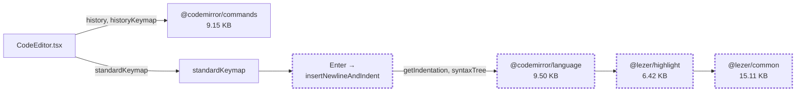
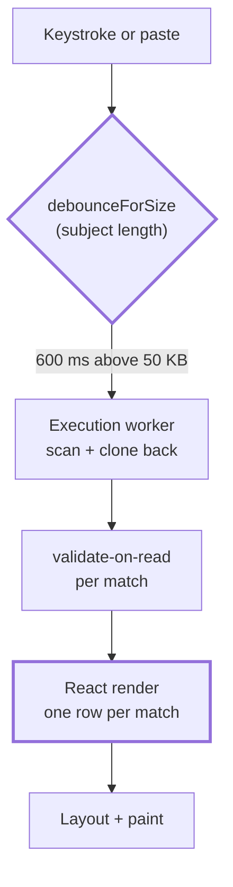

# 12 — Performance

**Project:** SyntaxLab
**Status:** Measured — §§10 and 12 carry real results
**Last updated:** 2026-08-21 (M11)

> **Two kinds of number live in this document, and they are never mixed.**
>
> §§1–9 are **budgets** (CI-enforced thresholds), **targets** (where we intend
> to sit) and **limits** (enforced constraints). They were written before the
> product existed and none of them is a measured result.
>
> **§10 and §12 are measurements**, and they are the only authority. §10 is the
> M1–M10 ledger; §12 is the M11 baseline and the changes made against it. The
> original note here said the first entry was "due at Milestone 1" — it
> arrived, and eleven milestones of results have followed.

---

## 1. Why performance is a feature here

The product competes with "open a browser tab and paste". If SyntaxLab is not faster than the alternative, it has no reason to exist. Slowness is not a polish issue for this product; it is a correctness-of-premise issue.

Second reason: this tool's inputs are user-supplied and can be adversarial. Performance work here overlaps directly with denial-of-service defence.

---

## 2. Budgets

> **Scope note.** V1.0 is Regex + JSON. The cron **domain** shipped at M14 and is measured in §11; there is no separate cron chunk, because there is no cron UI to lazy-load yet. Share/compression code is deferred, so it is not in the V1.0 budget.

### 2.1 How budgets are treated — read this before the numbers

The Phase 1 draft presented an estimated total of ~198 KB against a 200 KB budget as though that were headroom. **It is not.** Two kilobytes is measurement noise, and treating an estimate as a result is how budgets get quietly broken.

The revised planning stance:

| Term | Meaning |
|---|---|
| **Hard budget: 200 KB gz initial JS** | A CI failure threshold. Crossing it fails the build. It is the point at which we stop and think, not a target to approach. |
| **Target operating region: ≤ 170 KB gz** | Where the build should actually sit. This leaves real room for a feature, a fix, or a dependency bump without an emergency. |
| **Estimates** | Planning inputs only. They are not evidence and they never satisfy a criterion. |
| **Measurements** | The only authority. A production build measured with `rollup-plugin-visualizer` is the number that counts. |

**Nothing about the bundle is decided before it is measured.** Specifically, the Phase 1 note that we would "switch to Preact if the estimate is exceeded" is withdrawn as a plan: swapping a framework on the strength of an estimate would be optimising before observing.

### 2.2 The order of operations

```
build  ->  measure  ->  analyse  ->  optimise  ->  measure again
```

1. **Build.** Produce a real production bundle (first done at M1, then at every milestone).
2. **Measure.** Record actual gzipped sizes per chunk in §10.
3. **Analyse.** If over target, find out *what* is large and *why* — a treemap, not a guess. Common causes are unexpected: a barrel import pulling a whole package, a polyfill, a duplicated transitive dependency, a language mode imported eagerly.
4. **Optimise — smallest justified change first.** Escalation order:
   1. Fix accidental inclusion (barrel imports, eager imports that should be lazy, duplicate transitive versions)
   2. Split more aggressively / move something behind a lazy boundary
   3. Drop a feature-level dependency we can implement in less code (e.g. `@codemirror/search` in favour of searching the CST we already build)
   4. Reduce a feature's scope
   5. **Only then** consider a framework-level change such as Preact — and only with a measurement showing it is both necessary and sufficient
5. **Measure again.** An optimisation that is not re-measured did not happen.

**No dependency is removed before measuring.** "This package feels big" is not a reason; a treemap showing it costs 40 KB is.

### 2.3 Budget table

| Chunk | Hard budget (gz) | Target | Contents |
|---|---|---|---|
| Initial JS (entry + vendor + CM core) | **200 KB** | ≤ 170 KB | Shell, stores, one editor |
| CSS | 20 KB | ≤ 15 KB | Tokens + all component styles |
| Fonts | 45 KB | ≤ 40 KB | Two subsetted woff2 |
| `regex` chunk | 25 KB | — | |
| `json` chunk | 35 KB | — | Includes CM JSON language |
| `history` chunk | 15 KB | — | |
| `theme` chunk | 10 KB | — | |
| `analysis.worker` | 40 KB | — | Regex + JSON parsers and explainers (V1.0) |
| `exec.worker` | 3 KB | — | Deliberately tiny — it gets killed regularly |
| `cron` chunk *(M15)* | 30 KB | — | Still no chunk. The M14 domain rides in the worker bundle; its result validator adds ~2 KB to initial JS, because the main thread must validate what the worker sends. |
| **Total precache** | **2 MB** | ≤ 1.5 MB | Enforced by the PWA build step |

CI fails the build when a hard budget is exceeded, and reports a warning when a target is exceeded. A budget that is not enforced is a wish; a target that is not reported is ignored.

### 2.4 The known pressure point

CodeMirror is expected to dominate the initial bundle. That expectation is why the dependency list is short (`16_DEPENDENCIES.md`) and why every addition is measured against remaining headroom rather than against the hard budget.

**This is flagged as R-05 in `23_RISK_REGISTER.md` and its first real measurement is a Milestone 1 deliverable**, not a Milestone 13 discovery. Finding out at the end that the budget never fitted would be the expensive version of this problem.

### 2.5 Runtime targets

| Metric | Target | Rationale |
|---|---|---|
| First Contentful Paint (cold, Fast 3G, mid-tier laptop) | < 1.5 s | Lighthouse "good" threshold |
| Largest Contentful Paint | < 2.0 s | |
| Time to Interactive | < 2.5 s | |
| Cumulative Layout Shift | < 0.05 | Skeletons match final layout |
| Interaction to Next Paint | < 200 ms | Typing must never feel laggy |
| Warm load (SW cache) | < 300 ms to interactive | The common case |
| Keystroke → editor paint | < 16 ms | One frame |
| Analysis round trip (typical input) | < 100 ms | Debounce dominates perception |
| Analysis round trip (1 MB JSON) | < 500 ms | In-worker; UI stays responsive |
| Longest main-thread task | < 50 ms | Nothing blocks input handling |
| History list render (50 entries) | < 50 ms | |
| Theme change → repaint | < 50 ms | CSS-variable write, no re-render |

These are targets to be **verified by measurement**, not assumptions.

### 2.6 Lighthouse gates

Performance ≥ 95 · Accessibility ≥ 95 · Best Practices ≥ 95 · SEO ≥ 90 · PWA installable. Run against a production build in CI; a drop below gate fails the PR.

---

## 3. Rendering strategy

### 3.1 The keystroke path — the one that matters

Typing must never involve React re-rendering the analysis tree. The chain:

```
keystroke
  → CM6 updates its own document (internal, incremental, no React)
  → onChange writes to workspaceStore.input
  → ONLY the editor component subscribes to `input`  ← the critical constraint
  → debounce 200 ms
  → worker analysis
  → result written to store
  → analysis pane re-renders ONCE
```

If the analysis pane ever subscribes to `input`, typing performance collapses. This is enforced by a test that counts renders while typing 100 characters and asserts the analysis pane rendered ≤ 2 times.

### 3.2 Debouncing

Adaptive, because a fixed value is wrong at both ends of the size range:

| Input size | Debounce | Mode |
|---|---|---|
| < 1 KB | 150 ms | Auto |
| 1–50 KB | 300 ms | Auto |
| 50–500 KB | 600 ms | Auto |
| 500 KB–5 MB | — | **Manual** — an explicit Analyze button |
| > 5 MB | — | Rejected with a size message |

Above 500 KB, auto-analysis wastes work on every keystroke of a paste-and-edit cycle. An explicit button is both faster and more honest about what is happening.

Debounce is on the **trailing** edge with no leading call, and it is cancelled on unmount and on mode change.

### 3.3 Virtualisation — only where measured

| Surface | Virtualised? |
|---|---|
| JSON tree | ✅ above 500 visible rows |
| Regex AST tree | ❌ — realistic patterns produce tens of nodes |
| Match table | ✅ above 200 rows — **built at M11**, as progressive rendering rather than windowing; rows are not a uniform height (§12.3) |
| Token table | ❌ — bounded by pattern length |
| History list | ❌ — paginated at 50 |
| Next runs | ❌ — 10 rows |

Virtualising a 30-row list adds complexity, breaks `Ctrl+F`, and complicates screen-reader navigation for no gain.

### 3.4 Re-render discipline

- Selector subscriptions everywhere (`11_STATE_MANAGEMENT.md` §3)
- `React.memo` only on components proven expensive by profiling
- Stable keys (entry ids, not indices)
- No object/array literals in props of memoised children
- No expensive derivation in render — memoise or precompute in the worker

---

## 4. Worker strategy

Everything expensive is off the main thread:

| Work | Thread |
|---|---|
| Tokenising, parsing, explanation generation | Analysis worker |
| Regex execution | Execution worker |
| Cron analysis (parse, warn, explain) | Analysis worker |
| Cron next-run computation *(M16)* | Analysis worker |
| Detection heuristics | Main (bounded to a 1 KB sample — cheaper than the postMessage round trip) |
| JSON formatting | Analysis worker above 100 KB, main below |
| Tree rendering | Main (it is DOM work) |

### 4.1 Transfer cost is real

`postMessage` copies. A 5 MB string costs a structured clone in each direction and is not free.

Mitigations:
- Workers are started **once** and reused; startup is ~10–30 ms
- Only the input string goes in; only the compact result comes back
- The result is deliberately compact — no source text is echoed back, only spans into the original the main thread already holds
- The 5 MB input limit caps transfer cost
- Above 1 MB, transfer is measured and reported in dev builds; if it becomes the bottleneck, chunked transfer or `SharedArrayBuffer` is the next step (`SharedArrayBuffer` needs COOP/COEP, which we already set — see `05_SECURITY.md` §4.4)

### 4.2 Startup

Workers spawn **after first paint**, on idle, not during module initialisation. A worker constructed at import time delays interactivity for a capability the user may not need for several seconds.

---

## 5. Loading strategy

### 5.1 Critical path

```
index.html (≈2 KB)
  └─ theme-bootstrap.js (<1 KB, blocking — deliberately, to prevent a theme flash)
  └─ main.js  (preload)
  └─ main.css (preload)

After paint, on idle:
  - service worker registration
  - analysis worker spawn
  - IndexedDB open + first history page
  - prefetch json/cron chunks
```

The single blocking script is the theme bootstrap, and it is under 1 KB. A flash of the wrong theme on every load is a worse experience than 1 KB of blocking script.

### 5.2 Fonts

Self-hosted, subsetted, `woff2`, `font-display: swap`, preloaded, and precached. A system-font fallback stack is metric-matched closely enough that the swap does not cause a visible reflow.

### 5.3 Code splitting

Per `10_COMPONENT_ARCHITECTURE.md` §6. Rules: split at mode boundaries and overlay boundaries; do not split anything under 10 KB (the request overhead exceeds the saving); prefetch on idle only what is likely (modes), not what is speculative (drawers).

---

## 6. Large-input strategy

| Size | Behaviour |
|---|---|
| < 50 KB | Auto-analyse, full features, no warnings |
| 50–500 KB | Auto-analyse with a longer debounce; tree collapsed beyond depth 2 by default |
| 500 KB–2 MB | Manual analyse; a size notice; tree virtualised; search debounced further |
| 2–5 MB | Manual analyse; explicit warning that it may take a moment; progress indicator with Cancel |
| > 5 MB | Rejected before parsing, with the actual size shown |

Additional protections at scale: node cap (500k), depth cap (500), match cap (10k) — all from `05_SECURITY.md` §6.

---

## 7. Memory

| Concern | Control |
|---|---|
| Duplicate copies of a large document | One copy in CM6, one in the store, one transient in the worker. Never more. Explicitly not kept in history for large inputs (truncated at 100k chars). |
| AST retention | Only the current analysis is retained; the previous result is dropped on new input |
| Worker leaks | Message handlers are removed with their requests; the exec worker is destroyed on timeout |
| Event-listener leaks | All listeners registered in `useEffect` return a cleanup |
| CM6 lifecycle | `EditorView.destroy()` on unmount, always |
| History cache | One page (50 entries) in memory, not the whole store |
| Detached DOM | Verified by a heap snapshot before release: open/close each drawer 20 times and confirm node count returns to baseline |

---

## 8. Measurement plan

### 8.1 In CI, every PR

| Check | Tool | Gate |
|---|---|---|
| Bundle size per chunk | `rollup-plugin-visualizer` + a size script | Fails over budget |
| Lighthouse | Lighthouse CI on the production build | Fails below gate |
| Long tasks during a scripted session | Playwright + PerformanceObserver | Fails on any task > 50 ms |
| Parser microbenchmarks | Vitest bench | Fails on > 20% regression vs baseline |
| Render counts on the typing path | RTL + a render counter | Fails if the analysis pane re-renders while typing |

### 8.2 Manual, before release

- Chrome Performance profile of a full session on a throttled CPU (4× slowdown)
- Memory heap snapshots before and after heavy use
- Real-device test: mid-range Android, Safari on iOS, Firefox on desktop
- Offline warm-load timing
- 5 MB JSON end-to-end with the profiler open

### 8.3 What we deliberately do not do

**No Real User Monitoring, no performance beacons, no analytics.** `connect-src 'none'` forbids it and the privacy promise forbids it. We measure in CI and in the lab. This is a genuine trade: we will not learn about performance problems that only appear on hardware we do not own. Accepted, and recorded as **R-13** in `23_RISK_REGISTER.md`.

---

## 9. Performance checklist for every PR

```
[ ] No new dependency, or a new one with a measured size and a written justification
[ ] Bundle budgets still pass
[ ] No new blocking resource on the critical path
[ ] Expensive work runs in a worker
[ ] New lists over 500 rows are virtualised
[ ] Store subscriptions use selectors
[ ] No new work in a render path
[ ] Effects clean up
[ ] Large-input path considered
[ ] Lighthouse gates still pass
```

---

## 10. Measured results

**This is the authoritative record.** Nothing elsewhere in the documentation may claim a size or timing that is not recorded here.

### 10.1 M1 — application shell

Production build, `vite build`, gzipped. Measured 2026-08-18.

| Asset | Raw | **Gzipped** |
|---|---|---|
| `assets/index-*.js` | 148.41 KB | **47.05 KB** |
| `assets/index-*.css` | 12.79 KB | **3.30 KB** |
| `index.html` | 2.86 KB | 1.35 KB |
| `theme-bootstrap.js` | 2.71 KB | 1.25 KB |
| **Total deployed** | | **53.55 KB** |

| Budget | Measured | Target | Hard | Status |
|---|---|---|---|---|
| Initial JS | 48.30 KB | 170 KB | 200 KB | ✅ ok |
| CSS | 3.30 KB | 15 KB | 20 KB | ✅ ok |
| Total precache | 53.55 KB | 1.5 MB | 2 MB | ✅ ok |

### 10.2 What this measurement does NOT prove

> **Superseded at M4.** The gap this section describes is closed: §10.5
> records the CodeMirror-inclusive build. Kept because the reasoning is the
> point — a green budget check against an incomplete build is not evidence.

**It does not validate the 200 KB budget.** The M1 build contains React and the shell. It does **not** contain CodeMirror, which is expected to be the single largest dependency in the project and is installed at M4 where the editor is built (`16_DEPENDENCIES.md` §1.1).

Read plainly: **48 KB of the budget is spent and the largest item has not arrived.** The remaining headroom against the 170 KB target is roughly 122 KB, and the CodeMirror estimate is ~150 KB — which would exceed it.

**The budget-critical measurement is M4.** Reporting the M1 number as comfortable would be exactly the estimate-as-evidence error this section exists to prevent. Tracked as **R-05**.

### 10.3 M2 — worker infrastructure

Bundle impact is negligible: the workers are separate chunks, not part of the
initial payload.

| Asset | Raw | Gzipped |
|---|---|---|
| `assets/index-*.js` (initial, unchanged) | 148.41 KB | 47.05 KB |
| `assets/analysis.worker-*.js` | 1.44 KB | — |
| `assets/exec.worker-*.js` | 1.27 KB | — |
| **Total deployed** | | **54.78 KB** |

Worker timings, Chromium, dev server (unminified — production cold start will
be lower):

| Measurement | Value | Note |
|---|---|---|
| Cold start (first request incl. construction + module load) | **29 ms** | Paid once |
| Warm round trip, median of 20 | **< 0.1 ms** | |
| Warm round trip, max of 20 | **0.2 ms** | |
| Timeout detection and settle (2000 ms deadline) | **2011 ms** | 11 ms overhead |
| First request after respawn | **7 ms** | vs 29 ms cold — confirms the replacement was already warm |

The last row is the measurement that justifies eager respawn: a lazily created
replacement would have cost the user a further ~29 ms on top of the 2 s they
had just waited.

### 10.4 M3 — regex parser latency

Measured 2026-08-18, Node 22 under Vitest, median of 25 runs per case. These
are parse + explain only; nothing is executed.

| Case | Input | Median |
|---|---|---|
| Typical short — `^[A-Z][a-z]+$` | 13 ch | **0.022 ms** |
| Typical medium — password rule with lookaheads | 37 ch | **0.050 ms** |
| Typical long — email shape | 28 ch | **0.030 ms** |
| URL matcher | 38 ch | 0.054 ms |
| 100 capture groups | 300 ch | 0.625 ms |
| Large valid pattern | 1 000 ch | 0.410 ms |
| Large valid pattern | 5 000 ch | 1.268 ms |
| **At the 10 000-character limit** | 10 000 ch | **2.558 ms** |
| Large character class | 1 002 ch | 0.279 ms |
| Deep nesting, under the cap | 199 ch | 2.941 ms |
| Deep nesting, over the cap | 1 001 ch | 2.970 ms |
| **Malformed — 2 000 unclosed groups** | 2 000 ch | **3.763 ms** (worst observed) |
| Malformed — 2 000 backslashes | 2 000 ch | 0.417 ms |
| Malformed — 500 unclosed classes | 1 500 ch | 0.576 ms |
| Adversarial shape `(a+)+$` | 6 ch | 0.008 ms |
| **Mixed-corpus throughput** | — | **~117 000 analyses/sec** |

**Scaling is approximately linear** across the valid-input range: 1 000 ch →
0.41 ms, 5 000 ch → 1.27 ms, 10 000 ch → 2.56 ms. No superlinear blow-up
appears, which is the property that matters — a parser that itself backtracks
catastrophically would defeat the point of the whole architecture.

**Worst observed case is 3.8 ms**, on deliberately malformed input at the
practical size limit. That is far below the 100 ms round-trip target in §2.5
and imperceptible next to the 150–300 ms debounce, so parse latency is not a
factor in the typing path.

**Not measured here:** regex *execution*, which is M4 and is the only unbounded
operation in the product (§7 of `04_PARSER_ARCHITECTURE.md`).

### 10.5 M4 — the CodeMirror-inclusive build

**This is the budget-critical measurement.** §10.2 recorded that the M1 number
proved nothing about the budget because the largest dependency was absent. It
is present now.

| Asset | Raw | Gzipped |
|---|---|---|
| Entry chunk (`index.js`) | 467.81 KB | **148.79 KB** |
| Analysis worker chunk | 35.44 KB | 10.89 KB |
| Execution worker chunk | 3.94 KB | 1.61 KB |
| Theme bootstrap | 2.7 KB | 1.24 KB |
| CSS | 24.38 KB | 5.17 KB |
| HTML | 2.86 KB | 1.35 KB |
| **Counted as "initial JS"** | | **162.54 KB** |
| **Total precache** | | **169.66 KB** |

**Result: within the ≤170 KB target and 37 KB under the 200 KB hard budget.**
No optimisation was required, and none was performed — removing something on
the strength of an estimate is exactly what §2.3 forbids.

`check-size.mjs` charges every JS asset to "initial JS", including the two
worker chunks the browser fetches separately. That is deliberately
conservative: what a user actually downloads before the first paint is the
**148.79 KB** entry chunk.

#### Where the bytes are

Measured directly, by bundling and minifying exactly the imports each
dependency contributes:

| Contributor | Gzipped | Share of the entry chunk |
|---|---|---|
| **CodeMirror** (`state`, `view`, `commands`) | **88.03 KB** | 59% |
| React + React DOM | 44.48 KB | 30% |
| SyntaxLab application code | ~16.3 KB | 11% |

**CodeMirror cost 88 KB, not the ~150 KB `16_DEPENDENCIES.md` §2.2
estimated.** Two reasons: only three of the six anticipated packages were
installed, and the regex colouring is driven by our own tokenizer through the
shared decoration mechanism rather than by a CM6 language mode — so
`@codemirror/language` and `@lezer/highlight` are not needed at all. The
estimate was flagged at the time as "the number most likely to be wrong"; it
was, by 62 KB, in the direction that helps.

**Consequence for the budget:** the ~150 KB assumption that made R-05 a high
risk does not hold, and the headroom is real rather than hoped for.

#### Startup and first interaction

Chromium, production build, local preview server, median of three runs.

| Measurement | Value |
|---|---|
| First paint | 32–52 ms |
| First contentful paint | 96–100 ms |
| DOM content loaded | 46–50 ms |
| **First analysis** — keystroke → explanation on screen | **~247 ms** |
| Warm analysis — same, worker already running | ~217 ms |
| **First execution** — keystroke → matches on screen | **~266 ms** |
| Warm execution | ~217 ms |

Read these correctly. The analysis figures are dominated by the **150 ms
debounce** that is deliberately in the path (§3.2), plus up to 100 ms of
assertion-polling granularity in the measurement harness itself. The parser
takes 0.02–0.06 ms (§10.4) and the warm worker round trip is under 0.1 ms
(§10.3), so the compute is a rounding error inside a delay we chose.

The ~50 ms difference between first and warm execution is the disposable
worker's cold start, which matches the 29 ms measured directly at M2 plus
polling granularity. It is paid once per page load, and again after each
timeout — which is why the client respawns eagerly rather than lazily.

**Not measured:** a cold network load over a real connection, which is M9's
concern once the service worker exists, and interaction latency on a
low-powered device, which is M11.

### 10.6 M5 — JSON parser latency

Measured 2026-08-19, Node 22 under Vitest, median of 15 runs (7 for the large
cases). Parse, findings and explanation — the whole `analyzeJson` pipeline.

| Case | Input | Median | Worst observed |
|---|---|---|---|
| Short document | 25 ch | **0.080 ms** | 0.264 ms |
| Typical API response | 1.1 KB | **0.421 ms** | 0.638 ms |
| ~10 000 characters | 5.8 KB | **0.680 ms** | 2.401 ms |
| 100 KB of records | 67 KB | 5.10 ms | 10.46 ms |
| 1 MB of records | 687 KB | 61.4 ms | 78.8 ms |
| **At the 5 MB limit** | 4.9 MB | **~465 ms** | 540 ms |
| Large array of numbers | 289 KB | 35.3 ms | 48.4 ms |
| Many object properties (20 000) | 318 KB | 23.9 ms | 29.5 ms |
| Long single string | 500 KB | 5.16 ms | 7.14 ms |
| Long escaped string | 480 KB | 7.23 ms | 9.64 ms |
| Deep nesting at the 500 cap | 1 KB | 0.517 ms | 1.63 ms |
| Deep nesting far past the cap | 50 KB | 5.33 ms | 6.03 ms |
| Malformed — unclosed containers | 5 KB | 0.398 ms | 1.14 ms |
| Malformed — 50 000 junk characters | 50 KB | 14.6 ms | 23.2 ms |
| 2 000 duplicate keys | 12 KB | 1.12 ms | 3.16 ms |
| 5 000 precision-loss numbers | 85 KB | 4.13 ms | 7.73 ms |
| **Mixed-corpus throughput** | — | **~77 000 analyses/sec** | — |

**Scaling.** 67 KB → 5.1 ms and 687 KB → 61.4 ms is a 10.3× size increase for
a 12× time increase: effectively linear, with the small excess attributable to
allocation and collection rather than to the algorithm. Nothing here is
superlinear, which is the property that matters for a parser.

**Honest about the top of the range.** A document at the 5 MB limit takes
around half a second — above the 100 ms round-trip target in §2.5. Two things
make that acceptable rather than a defect, and both are pre-existing decisions
rather than post-hoc excuses:

1. `ANALYSIS_THRESHOLDS.manualAnalyzeBytes` is 500 KB, so a document that large
   already requires an explicit "Analyze" action rather than running on a
   debounce (§3.2). The user asked for it and is waiting for it.
2. It runs in the long-lived analysis worker, so the main thread stays
   responsive throughout (§15 of `08_UI_UX_SPEC.md` puts progress on screen
   past 500 ms).

**Where the cost sits.** Depth is the parameter to watch: every node carries a
`JsonPath`, built as `[...parentPath, segment]`, so a node at depth *d* costs
*d* segment copies. Real documents are under about twenty deep, where this is
noise. A pathological document that is both very deep and very wide would pay
for it — measured, not assumed, and bounded by the 500-level and 5 MB limits.
Not optimised, because no measurement asks for it (§2.3).

#### 10.6.1 The budget metric was corrected at M5

`check-size.mjs` summed **every** `.js` file under the label "Initial JS".
That was deliberately conservative at M1, when the worker chunks were 1 KB
stubs. By M5 the analysis worker carries two complete parsers, and the figure
had stopped being conservative and started being wrong: it named a load that
does not happen. Nothing fetches the analysis worker before first paint.

The combined figure reached **170.38 KB against a 170 KB target** at M5, which
is what prompted the look. Split into what the browser actually does:

| Measure | M5 | Target | Hard |
|---|---|---|---|
| **Initial JS** — entry chunk + theme bootstrap, before first paint | **150.82 KB** | 170 KB | 200 KB |
| **Worker chunks** — fetched on first analysis | **19.56 KB** | 80 KB | 120 KB |
| CSS | 5.17 KB | 15 KB | 20 KB |
| **Total precache** — the everything-at-once case, which the service worker will pull at M9 | **177.51 KB** | 1.5 MB | 2 MB |

**This is not the goalposts moving.** No budget was raised and nothing was
removed to make a number go green: the worker chunks are now budgeted
explicitly, where before they were unbudgeted and double-counted, and the
everything-at-once case was already measured by "Total precache" — which sits
at 12% of its target. The change makes the number that matters visible before
M6 adds the JSON feature and `@codemirror/lang-json` to the entry chunk.

The entry chunk itself grew by **0.79 KB** at M5, which is
`isValidJsonAnalysis` reaching the main thread. It has to: the main thread is
where a worker result is validated.

### 10.7 M6 — the JSON interface

Chromium, production build, local preview. M6 is a *rendering* milestone: the
parser was already off the main thread, so what these measure is whether the
UI can keep up with it.

| Measurement | Value |
|---|---|
| Small document (25 ch) — keystroke to tree | **278 ms** |
| 100 KB — keystroke to tree | **870 ms** |
| **One keystroke with 100 KB loaded** | **21 ms** |
| Expand all — 7 701 rows | **42 ms** |
| Search across the 100 KB tree | **12 ms** |
| Scroll the virtualised tree (10 wheel events) | 374 ms (~37 ms each) |
| Format (100 KB) | 46 ms |
| Minify (100 KB) | 80 ms |
| 1 MB — paste to manual prompt | **184 ms** (no parse attempted) |
| 1 MB — analyse on demand | **427 ms** |
| **Rows rendered out of 7 701** | **42** |

Read these correctly. The two "keystroke to tree" figures are dominated by the
**debounce**, which is 150 ms for a small document and 600 ms for a large one
(§3.2) — the parse itself is 0.08 ms and 5.1 ms respectively (§10.6). What the
numbers actually show is that nothing *else* is in the path.

**The row that matters most is the last one.** A fully expanded 100 KB document
is 7 701 rows and the DOM holds **42** of them. Virtualisation above 500 rows
is the second of two defences; the first is that collapsed branches are never
flattened at all, so a collapsed document of any size costs one row.

**Editing stays responsive with a large document loaded**: a keystroke is
21 ms, because the editor is uncontrolled inside CodeMirror and React holds a
debounced mirror (10_COMPONENT_ARCHITECTURE.md §7.4).

**Search reads the model, not the DOM** — 12 ms across a document whose
rendered rows are a few dozen. A DOM scrape would have been both slower and
wrong, since it would only have found what happened to be on screen.

**A 1 MB document does not parse on a keystroke at all.** Above
`manualAnalyzeBytes` (500 KB) the debounce is not armed; the paste costs
184 ms of editor work and then waits for the user. That is the documented
behaviour, not a performance workaround.

### 10.8 Measurement log

| Date | Milestone | Initial JS (gz) | CSS (gz) | Total (gz) | Notes |
|---|---|---|---|---|---|
| 2026-08-18 | M1 | 48.30 KB | 3.30 KB | 53.55 KB | Shell only. **No CodeMirror** — see §10.2 |
| 2026-08-18 | M2 | 49.52 KB | 3.30 KB | 54.78 KB | + worker chunks (separate, not initial) |
| 2026-08-19 | M6 | **158.12 KB** | 5.86 KB | 185.50 KB | + the JSON feature: +7.30 KB initial JS, worker chunks unchanged. |
| 2026-08-19 | M5 | **150.82 KB** | 5.17 KB | 177.51 KB | Initial JS +0.79 KB (the JSON result validator reaches the main thread); worker chunks 19.56 KB. **The metric changed here** — see §10.6.1. |
| 2026-08-18 | M4 | **162.54 KB** | 5.17 KB | 169.66 KB | **CodeMirror arrives.** Entry chunk 47.05 → 148.79 KB; CodeMirror is 88.03 KB of that, measured directly. Within the 170 KB target. |
| 2026-08-18 | M3 | 59.54 KB | 3.30 KB | 64.79 KB | Entry chunk **47.05 KB**, unchanged by M3. The +10.64 KB is the analysis-worker chunk, which now carries the regex domain (34.6 KB raw). `check-size.mjs` counts every JS asset toward "initial JS", so the worker chunks are charged to the budget even though the browser fetches them separately — deliberately conservative. |
| — | M4 | — | — | — | First budget-meaningful measurement |

---

## 11. Known performance risks

| Risk | Impact | Mitigation |
|---|---|---|
| CodeMirror consumes most of the initial budget | Limited headroom for everything else | Measure at M1; aggressive splitting; lazy language modes; hard dependency-review gate; escalation ladder in §2.2 |
| A 5 MB structured clone is slow on low-end devices | Perceived hang despite the worker | Measure; consider chunked transfer; the size limit caps the worst case |
| The JSON tree can produce hundreds of thousands of nodes | Memory pressure | Node cap, virtualisation, collapsed-by-default at depth |
| *(V1.1)* Timezone handling for cron | Adds to the cron chunk | V1.1 supports browser-local and UTC only, so no zone list is shipped at all |
| Font loading | FOUT | Metric-matched fallback, preload, `swap` |
| Worker startup on first analysis | ~30 ms one-off delay | Spawn on idle after first paint |


---

### 10.8 M7 — history at scale

Chromium, production build, local preview, median of three runs, via
`npm run measure:history` (`scripts/measure-history.mjs`). The database is
seeded with real records and read through the real code path.

| Entries | Open the drawer | Search |
|---|---|---|
| 0 | 48 ms | 6 ms |
| 100 | 82 ms | 14 ms |
| 500 *(the cap)* | 98 ms | 27 ms |
| 1 000 | 101 ms | 33 ms |

Budgets: 200 ms to open, 100 ms to search. Both are met with room to spare at
twice the cap.

**1 000 is measured although the cap is 500** because a store can exceed the
cap transiently — after an import, before the next save trims it — and that is
the slowest read the drawer can face.

**Why the full read is affordable.** The repository loads every record on first
use and filters in memory. The alternative, cursor-based paging over the
indices, would produce a second implementation of "what the list shows" that
can disagree with the first. The numbers above are what justifies not doing
that: the curve from 500 to 1 000 entries is 3 ms of open time. Revisit if the
cap rises past a few thousand — `06_DATA_STORAGE.md` §2.1 says the same.

**Bundle cost of the whole milestone: +11.17 KB gzipped** (158.12 → 169.29 KB
initial, and +1.09 KB CSS), for the domain, the repository, the store, the
drawer, transfer, and the two modal primitives. No dependency was added; `idb`
was planned and dropped (`16_DEPENDENCIES.md` §2.3).

Initial JS now sits **0.71 KB under the 170 KB target** and 31 KB under the hard
budget. That is tight enough to be worth stating plainly: M8 has very little
headroom before the target needs a deliberate decision rather than an
incidental one.


---

### 10.9 M8 — theme customisation

`npm run measure:theme` (`scripts/measure-theme.mjs`), Chromium, production
build.

| Measurement | Value | Budget |
|---|---|---|
| Theme switch (median of 20) | **1.1 ms** | P-13: under 50 ms |
| Theme switch (slowest of 20) | 2.3 ms | |
| First Contentful Paint, default theme | 36 ms | |
| First Contentful Paint, stored custom theme | 40 ms | no measurable flash cost |
| `localStorage` writes for a 21-step slider drag | **1** | not one per frame |

The switch figure includes the browser's style recalculation: the measurement
reads a computed value in a loop until it changes, which forces the work
rather than timing only our own call.

**Why it is 1.1 ms and not 30 ms.** Changing the theme writes eight custom
properties on `:root`. Nothing re-renders: the only React subscriber to
`themeStore` is the drawer itself, so the analysis panes, the editors and the
tree are untouched. This is the concrete payoff of ADR-005.

The drag figure is driven through real Playwright input rather than synthetic
events, because React tracks a controlled input's value itself and ignores a
directly assigned one — a hand-dispatched `input` event measures nothing. The
intensity is read back afterwards to prove the drag registered.

#### Bundle

| | M7 | M8 | Delta |
|---|---|---|---|
| Initial JS | 169.29 KB | **173.04 KB** | **+3.75 KB** |
| Worker chunks | 19.56 KB | 19.56 KB | — |
| CSS | 6.95 KB | 7.56 KB | +0.61 KB |
| Total precache | 197.75 KB | 202.10 KB | +4.35 KB |

**The 170 KB target is exceeded by 3.04 KB.** The 200 KB hard budget is met
with 27 KB to spare. Stated plainly rather than reported as a pass, and the
increase is entirely the theme feature — the domain model with five presets
and the WCAG contrast maths, the store, and the drawer.

Two things were tried before accepting it:

**Code-splitting the drawer with `React.lazy` — measured, and it made the
bundle larger.** It moved 1.59 KiB into its own chunk while the entry chunk
shrank by only 0.46 KiB, the difference going to lazy-load machinery and to
gzip having a smaller corpus to work with. Net **+1.11 KiB** for a deferred
fetch nobody was waiting on. Recorded so the experiment is not repeated.

**Dead weight removed.** The preset table carried a `description` string per
preset that nothing rendered.

#### The measured lead for M11

Bundle composition (rendered bytes, `npm run analyze`):

| Module | Rendered |
|---|---|
| `@codemirror/view` | 102.76 KB |
| `react-dom` | 42.24 KB |
| `@codemirror/state` | 33.51 KB |
| `src/features` | 31.00 KB |
| **`@lezer/common`** | **15.11 KB** |
| `src/domain` | 11.51 KB |
| **`@codemirror/language`** | **9.50 KB** |
| `@codemirror/commands` | 9.15 KB |
| **`@lezer/highlight`** | **6.42 KB** |

SyntaxLab installs **no CodeMirror language mode** — `@codemirror/lang-json`
was deliberately rejected at M6. The language and lezer packages are pulled in
transitively by three imports from `@codemirror/commands`: `history`,
`historyKeymap`, `standardKeymap`.

**Measured, by stubbing those three imports and rebuilding: initial JS drops
from 173.04 KB to 155.94 KB — a 17.04 KB saving.**

It was not taken at M8, and should not be taken casually: those three imports
provide undo/redo and the standard editing keymap. Removing them without a
replacement would be a serious regression in both editors. The work is to find
an equivalent that does not drag in a syntax-tree library — which is editor
surgery with regression risk across Regex and JSON, and belongs in M11 with
its own testing, not in a theme milestone.


---

### 10.10 M9 — the PWA layer

`npm run measure:pwa`, Chromium, production build served with production
headers.

| Measurement | Value |
|---|---|
| First visit, cold FCP (median of 5) | 115.0 ms |
| Warm FCP, served by the worker | **26.5 ms** |
| Offline FCP, network cut | **24.1 ms** |
| Time until a first visitor is offline-capable | 208 ms |
| First analysis after an offline reload, including worker boot | 6 ms |

The service worker makes a return visit **4× faster to first paint** than a
cold one, because nothing is fetched. Offline is marginally faster still —
there is not even a cache-revalidation round trip to skip.

#### Bundle and cache footprint, separately

These are different numbers and both matter: one is what a first visit
downloads, the other is what sits on disk afterwards.

| | M8 | M9 | Delta |
|---|---|---|---|
| Initial JS | 173.04 KB | **174.52 KB** | +1.48 KB |
| Worker chunks | 19.56 KB | 19.56 KB | — |
| Service worker | — | 5.93 KB | new |
| CSS | 7.56 KB | 7.73 KB | +0.17 KB |
| Icons + manifest | — | 15.81 KB | new |
| Total precache (gzipped transfer) | 197.75 KB | 226.00 KB | +28.25 KB |
| Precache on disk (uncompressed) | — | 663.97 KB | new |

**The PWA layer cost 1.48 KB of initial JS.** That is the registration module,
the store, the status components and the startup helpers. `workbox-window` was
deliberately not used — the plugin's registration helper would have added
several kilobytes for a lifecycle narrower than the one it offers.

#### A metric correction, the second of its kind

`sw.js` and `workbox-*.js` were initially counted as initial page JS, which
inflated the figure by 7.37 KB the moment the PWA landed while the entry chunk
did not grow at all. Neither is ever executed by the page: the worker is
registered after `load`, and the Workbox chunk is `importScripts`-ed inside the
worker's own context. They are now budgeted separately, exactly as worker
chunks were split out at M5 for the same reason — a figure that names a load
which does not happen is not conservative, it is wrong. Both remain inside
"Total precache", which is the honest everything-at-once number.


---

### 10.11 M10 — the hardening baseline

M10 is not a performance milestone; the number is recorded so a later one can
see what it inherited.

| | M9 | M10 | Delta |
|---|---|---|---|
| Initial JS | 174.52 KB | **174.81 KB** | +0.29 KB |
| CSS | 7.73 KB | 7.83 KB | +0.10 KB |
| Service worker | 5.93 KB | 5.93 KB | — |
| Total precache | 226.00 KB | 226.39 KB | +0.39 KB |

The theme change added a second preset and two gradient stops; the forced-colors
fix added one CSS rule. Everything else M10 produced is tests, which ship
nothing.

Still 4.81 KB over the 170 KB target and 25 KB under the hard budget. The
17.04 KB CodeMirror lead measured at M8 is untouched and remains the available
move when the editor risk is worth taking.

### 10.12 The M10 theme correction pass

| | M10 | After the pass | Delta |
|---|---|---|---|
| Initial JS | 174.81 KB | **175.05 KB** | +0.24 KB |
| CSS | 7.83 KB | 7.94 KB | +0.11 KB |
| Service worker | 5.93 KB | 5.93 KB | — |
| Total precache | 226.39 KB | 226.74 KB | +0.35 KB |

+0.24 KB of JS: two fields on the persisted theme (`family` and
`accentLegible`) and the enum validation that repairs them on read. +0.11 KB of
CSS: one family override block and the `@supports not (color-mix)` fallbacks.

**No dependency was added.** Every derived colour is `color-mix()`, which the
browser already implements, so the alternative — a colour library on the path
between persisted data and `setProperty` — was never needed. The two audit
scripts run at development time and ship nothing.

Still under the 200 KB hard budget with 25 KB to spare.

---

## 12. M11 — measure, identify, fix, measure again

M11 is the refinement milestone. Nothing here was changed on a hunch: every
item below started as a number, and the ones that turned out not to be problems
are recorded too, because "we looked and it was fine" is the more useful half
of a performance report.

### 12.1 The baseline

Production build, production headers, Chromium, median of five, before any M11
change. `node scripts/measure-m11.mjs`.

| | median | range |
|---|---|---|
| **Startup** — cold FCP / LCP / domInteractive | 117 / 117 / 50 ms | |
| Startup — warm (service worker) | 134 / 134 / 46 ms | |
| Startup — offline (network cut) | 117 / 117 / 49 ms | |
| Regex analysis — short | 217 ms | 203–235 |
| Regex analysis — medium, named groups | 222 ms | 205–232 |
| Regex analysis — large, 40 alternatives | 272 ms | 256–279 |
| Regex analysis — malformed | 216 ms | 205–220 |
| Regex analysis — 20-deep nesting | 232 ms | 223–236 |
| **Regex execution — 64 KB subject** | **1110 ms** | 1047–1130 |
| JSON — 98 KB | 75 ms | 66–83 |
| JSON — 488 KB | 129 ms | 119–132 |
| JSON — 977 KB | 194 ms | 141–206 |
| JSON tree — expand all (500 KB) | 87 ms | 68–285 |
| JSON — format (500 KB) | 76 ms | 59–132 |
| History drawer open | 31 ms | 26–111 |
| Theme switch | 43 ms | 28–57 |

Build: 3.2 s for `vite build`, 7.6 s including `tsc --noEmit`.

**One outlier.** Everything is under 300 ms except regex execution, which is
four times the next slowest thing on the list. That is where M11 went.

### 12.2 Bundle composition

`npm run analyze && node scripts/analyze-bundle.mjs` reports the treemap as
gzipped bytes per package, which is the shape a budget decision needs.

| Group | gz | Share |
|---|---|---|
| CodeMirror (view, state, language, commands, Lezer, style-mod) | 182.1 KB | **60%** |
| React (react, react-dom, scheduler) | 48.2 KB | 16% |
| Application code | ~74 KB | 24% |

CodeMirror dominates, and inside it one import chain was pure waste.



**One keybinding reached the entire Lezer stack.** SyntaxLab configures no
language at all — no parser, no `LanguageSupport`, no syntax tree; regex and
JSON are tokenised by the domain layer in a worker and painted through
`Decoration`. With no indent service to consult, `getIndentation` already falls
back to copying the current line's leading whitespace, which is exactly what
the exported `insertNewlineKeepIndent` does directly.

`src/components/editor/standardBindings.ts` rebuilds the keymap binding for
binding from the individual command exports, with Enter pointed at the
language-free newline. Everything else is still upstream's function: bidi, word
boundaries and grapheme clusters are the last things worth reimplementing.

| | Initial JS |
|---|---|
| M10 baseline | 175.05 KB |
| Ceiling — keymap dropped entirely | 160.56 KB |
| **Shipped — keymap rebuilt, all bindings kept** | **165.34 KB** |

**−9.71 KB, and under the 170 KB target for the first time since M4.** The
4.78 KB difference from the ceiling is the movement commands, which are kept.

**Where it stops.** 10.91 KB of the stack remains, held by `deleteCharBackward`
— it uses `getIndentUnit` so Backspace deletes back to a tab stop inside
indentation. Recovering the last 6.42 KB would mean reimplementing
grapheme-aware deletion, which is not a trade worth making.

**One behavioural loss.** With the cursor between an opening and closing
bracket, upstream inserts two breaks and leaves the cursor on an indented blank
line. The editor has no bracket auto-closing, so the cursor only lands there if
the user typed both, and the JSON workspace has a Format action. Pinned by four
keymap tests on Chromium and Firefox.

### 12.3 The regex execution outlier

1110 ms, against 300 ms for everything else. Decomposed rather than guessed at.



Two probes separated the terms. The same 200 KB subject with a pattern
matching once, then with one matching 12 800 times:

| | total | work behind the debounce |
|---|---|---|
| 1 match | 702 ms | ~102 ms |
| 12 800 matches | 1720 ms | ~1120 ms |

**A full second was the result volume alone.** A main-thread CPU profile
confirmed it: 45% idle, 33% V8 internals, and the application's own JavaScript
barely registering. The DOM was the cost — 10 000 matches became **130 002
nodes**.

Two cheaper hypotheses were tested first and both rejected:

| | wall | layout |
|---|---|---|
| auto table layout (as shipped) | 1555 ms | 351 ms |
| `table-layout: fixed` | 1519 ms | 278 ms |
| `content-visibility: auto` on rows | 1591 ms | 330 ms |

Neither moves wall time. Auto layout is not the problem, and Chromium ignores
containment inside a table. The expense is *creating* the nodes, so the fix is
to not create them.

The match table now renders 200 rows with a "Show 200 more" control that states
how far through the list you are. Every returned match stays reachable. A new
result resets the window.

| 200 KB subject, 12 800 matches | before | after |
|---|---|---|
| wall | 1629 ms | **755 ms** |
| layout | 349 ms | **15 ms** |
| style recalculation | 162 ms | **8 ms** |
| script | 149 ms | **27 ms** |
| DOM nodes | 130 002 | **2 684** |
| heap | +36 MB | **+10 MB** |

Work behind the debounce: ~1029 ms to ~155 ms.

**A virtualiser was not used and would not have fitted.** Match rows are not a
uniform height — a matched value runs to 2 000 characters and a capture list is
as long as the pattern has groups — so the fixed-row windowing the JSON tree
uses does not transfer. §3.3 has specified "match table: virtualised above 200
rows" since M1; this is that requirement met, by the means the data allows.

### 12.4 The debounce, verified rather than changed

With the render cost gone, the debounce is 600 of the remaining 755 ms — the
dominant term by a wide margin. It was left alone deliberately.

Measured work behind it is 67 ms at 1 KB and ~155 ms at 200 KB with 12 800
matches. A 600 ms trailing debounce on the largest tier is roughly four times
the work it is coalescing, which is the right order: the tier exists so that
typing a pattern against a large subject does not queue a scan per keystroke,
and an execution already in flight cannot be interrupted — only superseded
after the fact. Shortening it would trade CPU on a low-powered device, which
this milestone did not measure, for 200 ms on an action taken once.

The size-aware tiers §3.2 specifies are implemented and behaving as specified.

### 12.5 Large JSON, measured and left alone

§11 of the M11 brief asks for a hard look at large documents. It found nothing
to fix.

| Document | keystroke latency | tree rows in the DOM | heap |
|---|---|---|---|
| 98 KB | 5 ms (max 10) | 42 | 10 MB |
| 488 KB | 7 ms (max 9) | 42 | 35 MB |
| 977 KB | 9 ms (max 10) | 42 | 64 MB |

Typing stays inside a single frame at every size, and **the row count in the
document does not grow with the document** — the windowing in `JsonTree.tsx` is
doing exactly what it was built to do.

| Operation, 1 MB | |
|---|---|
| search | 19 ms median |
| collapse all | 114 ms, DOM drops to 1 row |
| minify | 79 ms |
| format | 76 ms |

Search does not scan the DOM, collapsed branches really are cheap, and analysis
remains off the main thread. No change was warranted and none was made.

### 12.6 React rendering, audited

Commit counts were taken on the production build by installing a minimal
`__REACT_DEVTOOLS_GLOBAL_HOOK__` before the bundle loads — no profiling build,
no change to the application.

| Interaction | Commits |
|---|---|
| 10 characters into the pattern | 13 |
| 10 characters into the test string | 14 |
| 10 characters into the JSON editor | 15 |
| Switch mode | 2 |
| Open the appearance drawer | 2 |
| **Change theme preset** | **1** |

Roughly one commit per keystroke plus one for the result, which is the floor
for a controlled editor. The theme claim in `09_DESIGN_SYSTEM.md` §11.1 — that
a theme change re-renders nothing outside the drawer — holds.

`ModeSuggestion` subscribes to the whole workspace store rather than to
selected fields. That is the anti-pattern `useStore`'s own documentation warns
about, and it is correct here: `suggestionFor(state)` reads six fields and does
no computation, the component returns `null` most of the time, and the store is
already the thing changing. **No `memo`, `useMemo` or `useCallback` was added
anywhere.** Nothing measured justified one.

### 12.7 Visual cost, audited

`09_DESIGN_SYSTEM.md` forbids most of what makes a dark interface expensive.
The audit confirms it held:

| | Count |
|---|---|
| `backdrop-filter` | **0** |
| `filter: blur()` | **0** |
| `@keyframes` | **0** |
| `box-shadow` | 1 |
| transitions | 5, all on `transform`, `background`, `background-color`, `border-color` |

The glow is a `box-shadow`, not a filter. The gradient is a CSS
`linear-gradient`. Nothing to simplify.

### 12.8 Layout shift

Found by the Lighthouse baseline and then measured directly with a
`layout-shift` observer rather than taken from a score.

The editor's minimum height lived only inside CodeMirror's theme, which applies
after the view mounts — until then the host is two borders tall and the column
below it moves. The same minimum is now declared on the host.

| CLS | before | after |
|---|---|---|
| first visit | 0.0394 | 0.0417 |
| **second visit** | **0.0257** | **0.0022** |

The warm load, which is the normal case for an installed PWA, is effectively
shift-free. First visit is unchanged because it is dominated by a 0.0394 shift
from the first-run history notice appearing above `main` — genuinely
once-per-user, and reserving space for it would cost every subsequent visitor a
permanent empty gap. Both figures were already inside the 0.1 "good" threshold.

### 12.9 Lighthouse baseline

Production build, production headers, Lighthouse 13.4.1 via `npx` — **not added
as a dependency**. Its defaults are a simulated mid-tier phone: 4x CPU slowdown
and roughly 1.6 Mbps. That is why its paint numbers are seconds where the
direct measurement in §12.1 is milliseconds; both are true of different
machines.

| | Baseline | After M11 |
|---|---|---|
| Performance | 73 | **78** |
| Accessibility | 98 | **100** |
| Best Practices | 100 | 100 |
| SEO | 91 | 91 |
| Cumulative Layout Shift | 0.145 | **0.071** |
| Total Blocking Time | 10 ms | 20 ms |
| First Contentful Paint | 3.8 s | 3.8 s |

Accessibility reached 100 by fixing a real defect: `Panel` titles were `h3`
directly under the page's single `h1`, leaving a level-2 gap that a screen
reader navigating by heading would hit. Panels are never nested and each is a
top-level section of the workspace, so they are `h2`.

Two audits still report and neither is a defect:

- **`valid-source-maps`** wants source maps the production build deliberately
  does not ship.
- **`robots-txt`** fails with `CSP violation`. The file is valid and served;
  Lighthouse's own fetch is blocked by the site's Content-Security-Policy. The
  policy was not widened for a scanner.

Lighthouse at or above 95 remains an M12 release gate, not an M11 requirement.

### 12.10 The budget after M11

| | M10 | After M11 | Delta |
|---|---|---|---|
| **Initial JS** | 175.05 KB | **166.16 KB** | **−8.89 KB** |
| Worker chunks | 19.56 KB | 19.56 KB | — |
| Service worker | 5.93 KB | 5.93 KB | — |
| CSS | 7.94 KB | 8.18 KB | +0.24 KB |
| Icons + manifest | 15.81 KB | 15.81 KB | — |
| Total precache | 226.74 KB | 218.08 KB | −8.66 KB |

Initial JS is **3.84 KB under the 170 KB target** and 33.8 KB under the 200 KB
hard limit — the first time it has been inside the target since CodeMirror
arrived at M4.

The keymap change alone took it to 165.34 KB. The splitter, the progressive
match list and the reserved editor height then added 0.82 KB of JS and 0.24 KB
of CSS between them, which the 9.71 KB saving paid for twelve times over.

**No dependency was added, changed or removed.** Five runtime, twenty-eight dev.

### 12.11 What is still the bottleneck

| Rank | Cost | Why it stays |
|---|---|---|
| 1 | **The 600 ms debounce** on a large test subject | Deliberate. §12.4. |
| 2 | **CodeMirror, 60% of the bundle** | The editor is the product. The 10.91 KB Lezer remnant is held by Backspace's indent-aware deletion. |
| 3 | **React, 16%** | No evidence for a Preact swap; the M11 brief rules it out without overwhelming evidence, and rendering was measured as not being the constraint. |
| 4 | First-visit CLS from the first-run notice | Once per user; reserving space would cost everyone else. |

**Not measured, and named rather than absorbed:** interaction latency on a real
low-powered device. Lighthouse's 4x CPU throttle is a simulation, not a phone.

---

## 13. M14 — cron analysis, measured

`npm run measure:cron`. Nine expressions, 2 000 runs each after 200 warmup runs, timed in process — there is no cron UI to drive, so a browser harness would measure the harness. Measured 2026-08-21 on the development machine; the numbers are a shape, not a device-independent claim.

### 13.1 The table

| Case | p50 | p99 | max | What it is |
|---|---|---|---|---|
| wildcard `* * * * *` | 0.010 ms | 0.051 ms | 0.401 ms | The largest expansion of the shortest input — 60+24+31+12+7 values |
| typical `*/15 9-17 * * 1-5` | 0.013 ms | 0.133 ms | 0.559 ms | The shape most schedules take |
| names `0 9-17 1,15 JAN-JUN MON-FRI` | 0.012 ms | 0.050 ms | 0.668 ms | Names in two fields |
| macro `@weekly` | 0.008 ms | 0.031 ms | 0.370 ms | Expanded to five fields, then the ordinary path |
| **wide list** (200 terms) | 0.661 ms | **1.066 ms** | 1.484 ms | The per-field limit — the slowest valid input the grammar allows |
| nested steps | 0.022 ms | 0.075 ms | 0.295 ms | A step on a range in every field |
| at the input limit (1 000 chars) | 0.000 ms | 0.000 ms | 0.188 ms | Refused on length, before tokenising |
| foreign dialect (6 fields) | 0.002 ms | 0.005 ms | 0.113 ms | Refused on field count, before any field is read |
| all errors `99 99 99 99 99` | 0.008 ms | 0.035 ms | 0.388 ms | Five failing fields, all recovered |
| typical, **browser-local** | 0.052 ms | 0.173 ms | 3.726 ms | The same expression through the local-timezone path |

### 13.2 What the numbers say

**The worst valid input stays comfortably inside a frame.** A 200-term list is the slowest thing the grammar permits, and the limit is what makes that true — without `maxTermsPerField` the cost is linear in a number the user chooses.

Re-measured before the pre-M15 release on a busier machine, the same case reported **1.85 ms p99** rather than 1.07 — roughly 9x inside a frame instead of 15x. Both runs are recorded because the spread is the honest answer: this is an in-process microbenchmark on a developer laptop, and the figure that matters is the order of magnitude, not the third decimal. Nothing here is close enough to 16 ms for the difference to change a decision.

**Browser-local costs about 4x UTC, and it is worth knowing why.** UTC resolves to a constant; browser-local asks `Intl` for the zone name and then probes twelve monthly offsets to decide whether that zone observes daylight saving (`04_PARSER_ARCHITECTURE.md` §4.6). 0.05 ms p50 against 0.013 ms is a real multiple of a number too small to matter — but the multiple is where a future regression would appear, so it is on the record rather than averaged away. The 3.7 ms max is a first-call `Intl` cost that the warmup does not fully absorb; the p99 is the honest figure for steady state.

**The two refusals are the fastest paths in the table**, which is the right shape and not an accident. An oversized expression is rejected on `source.length` before the tokenizer runs; a 6-field expression is rejected on the field count before `parseField` is called. A parser that did the work and then threw the result away would have the opposite profile, and would be a denial-of-service shape rather than a refusal.

**Stage breakdown** on the typical expression:

| Stage | p50 | p99 |
|---|---|---|
| tokenize | 0.001 ms | 0.001 ms |
| parse (includes tokenize) | 0.007 ms | 0.024 ms |
| analyze (parse + warnings + explain) | 0.011 ms | 0.032 ms |

Explanation is roughly a third of the cost and tokenising is nearly free. If a regression ever appears, that split says where to look first.

### 13.3 What was not optimised, and why

**Nothing.** Cron is two orders of magnitude smaller than the regex and JSON inputs the same pipeline already handles, and the slowest case is roughly an order of magnitude inside a frame across every run measured. Optimising it would be work with no measurable outcome, which is the definition of the thing this document exists to prevent.

The point of recording the numbers is not that they are impressive. It is that a later change which makes them untrue becomes visible rather than being assumed away.

### 13.4 Bundle impact

Initial JS moved from **165.34 KB** (after M11) to **167.44 KB** — 2.10 KB, against a 170 KB target and a 200 KB hard limit.

That 2 KB is the *validator*, not the parser. `isValidCronAnalysis` and the AST's field specs are imported by `protocol.ts`, which the main thread needs in order to check what the worker sends back; the tokenizer, parser and explainer stay in the worker bundle where they are used. Paying 2 KB on the main thread to avoid trusting a worker result by cast is the trade this project has already made twice, for regex and for JSON.


---

## 14. M15 — explicit analysis, measured

### 14.1 What the change was supposed to do

Remove worker traffic that nobody asked for. Before M15, typing a pattern
started a debounce that sent an `analysis.regex` request a few hundred
milliseconds after the last keystroke; a large JSON document did the same above
a size threshold, and below it on every pause.

### 14.2 Worker requests while typing

Measured by counting calls at the seam, with the worker replaced
(`tests/unit/regex/regexWorkspace.test.ts`, `tests/unit/cron/cronWorkspace.test.ts`):

| Action | Before | After |
|---|---|---|
| Type `a`, `ab`, `abc` and wait 5 s | 1 analysis request | **0** |
| Press Analyze once | 1 | 1 |
| Type three more characters, wait | 1 more | **0** |
| Press Analyze on unchanged text | 1 more | **0** — the control is disabled and the use-case refuses |

The saving is not the request itself; it is the parse, the explanation build
and the structured clone of the result, on every pause, for text the user had
not finished writing.

### 14.3 Bundle

| | |
|---|---|
| After M14 | 167.44 KB |
| **After M15** | **172.20 KB** — over the 170 KB target, inside the 200 KB hard limit |

The 4.75 KB is the cron workspace, its field table and the shared Analyze
control.

**Code-splitting the cron workspace was tried and measured, and made it
worse:** `React.lazy` on `CronWorkspace` produced **173.88 KB**, 1.69 KB
*larger*, because the lazy-loading machinery and the smaller gzip corpus cost
more than the extracted chunk saved. This is the second time that experiment
has been run in this project — the theme drawer was the first (§10.9) — and it
is recorded here for the same reason: so the next person does not repeat it.

**Accepted, over target, with the reason recorded.** The budget's own wording
is "over target but within the hard budget — investigate before it grows". It
was investigated. The remaining lever is the editor, which is 60% of the bundle
and an architectural change rather than a milestone patch (§12.9).

### 14.4 URL writes

A slider drag changes the theme dozens of times. The URL write is debounced at
250 ms and uses `replaceState`, so a drag produces **one** history entry
mutation when it settles rather than one per frame — asserted directly by
spying on `history.replaceState` and `history.pushState`
(`tests/unit/theme/themeStore.test.ts`).
