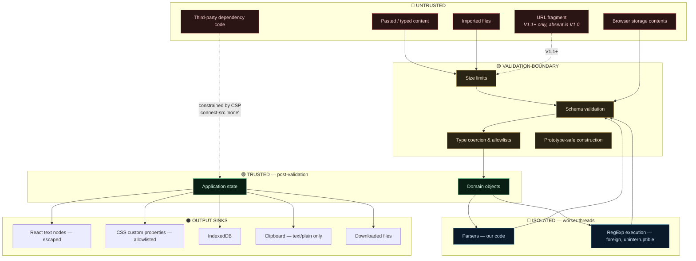
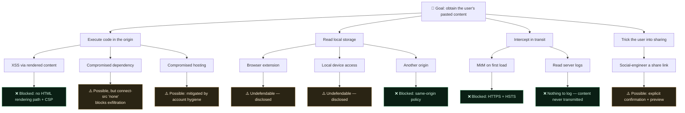

# 14 — Threat Model

**Project:** SyntaxLab
**Status:** Draft for human review
**Last updated:** 2026-08-17
**Method:** Asset-centric, with STRIDE applied per trust boundary.

> **Scope note (Phase 1.5).** This models **V1.0 (regex + JSON)**. Two attack paths from the Phase 1 model are **removed from V1.0** because their features were deferred: hostile share URLs (T2, B7, AC4, AC5) and cron-dialect misinterpretation. They are retained below, marked *(V1.1+)*, so they are not forgotten when the features return.

> `05_SECURITY.md` describes the controls. This document describes what we are defending against, what we are explicitly *not* defending against, and what is left over after the controls are applied.

---

## 1. Scope

**In scope:** the client-side application, its browser storage, its worker boundary, the data it accepts from files and URLs, its build and dependency supply chain, and its static hosting configuration.

**Out of scope:** the user's operating system, browser vulnerabilities, browser extensions (see §7 — we cannot defend against these and we say so), physical access to the device, and network-layer attacks against HTTPS itself.

---

## 2. Assets

| ID | Asset | Value to attacker | Value to user | Worst case |
|---|---|---|---|---|
| A1 | **Pasted content** (JSON payloads, regexes; cron from V1.1) | High — routinely contains JWTs, API keys, PII, internal hostnames | Very high — often production data | Exfiltration of a production secret |
| A2 | **Local history** | High — an accumulated archive of A1 | High | Bulk disclosure of everything the user analysed |
| A3 | Theme and settings | Low | Low | CSS injection → UI spoofing |
| A4 | **Application integrity** | High — control of the page means control of A1 and A2 | Critical | Persistent malicious code via the service worker |
| A5 | *(V1.1+)* Share URLs | Medium | Medium | Content disclosure to link holders. **Not an asset in V1.0** — the feature does not exist. |
| A6 | Export files | High — plaintext A2 | High | Disclosure if mishandled |
| A7 | **User attention / trust** | Medium | High | A wrong explanation causes a production bug (this is the most likely *real* harm) |
| A8 | Availability of the tab | Low | Medium | A frozen browser and lost work |

A7 deserves emphasis. The most probable damage this application causes is not a breach — it is a **confidently wrong explanation that the user acts on**. In V1.0 that means a regex explanation applied to the wrong engine (AC16 / RR-11); in V1.1 it means a wrong cron schedule (AC12 / RR-09). Correctness *is* a security property here, which is why refusing to answer is a designed behaviour rather than a gap.

---

## 3. Attackers

| ID | Attacker | Capability | Motivation | Likelihood |
|---|---|---|---|---|
| T1 | **Malicious content author** | Crafts JSON/regex the victim will paste (from a bug report, a Stack Overflow answer, a log sample) | XSS, DoS, misdirection | Medium |
| T2 | **Malicious link sender** *(V1.1+ only)* | Crafts a share URL | XSS, DoS, phishing via a trusted domain | **N/A in V1.0** — no URL state |
| T3 | **Malicious file author** | Crafts an "export" file for the victim to import | Pollution, DoS, data injection | Low |
| T4 | **Compromised dependency** | Arbitrary code in our origin | Exfiltration, credential theft, crypto-mining | **Low probability, catastrophic impact** |
| T5 | **Malicious browser extension** | Full page access | Exfiltration | Low, undefendable |
| T6 | **Local device access** | Reads browser profile | Access to A2, A6 | Low |
| T7 | **Curious user** | Devtools, edits storage | Testing limits, self-inflicted corruption | High |
| T8 | **Network attacker** | MitM on first load | Serve a malicious app | Very low (HTTPS + HSTS) |
| T9 | **Compromised hosting** | Cloudflare account or build pipeline takeover | Total control of A4 | Very low, catastrophic |

The realistic top three: **T1** (someone pastes something hostile), **T4** (supply chain), **T7** (users doing unexpected things). T5 and T6 are acknowledged and undefendable. T9 is mitigated by account hygiene rather than by code.

---

## 4. Trust boundaries

### Boundary crossings

| # | Crossing | Threats | Controls |
|---|---|---|---|
| B1 | Editor → application | Oversized input, hostile content | Size limits ×3 layers, no execution |
| B2 | Main thread → worker | Malformed payload, oversized transfer | Worker re-validates; never trusts its caller |
| B2′ | Main thread → worker | Unknown wire keys riding into the worker | **Payloads are reconstructed field by field at M4**, not only validated. The envelope was already rebuilt; the payload was passed through by reference, so the guarantee was half true. |
| B3 | Worker → main thread | Malformed response, id confusion | Envelope validation, id matching, unknown ops discarded, **and per-operation result validation added at M3** — a successful response is checked by value, not accepted on a TypeScript cast |
| B4 | IndexedDB → domain | Tampering, corruption, version confusion | Validate on read, quarantine failures, preserve unknown versions |
| B5 | localStorage → theme | **CSS injection** | Strict hex/enum/range allowlist |
| B6 | Imported file → state | Pollution, bombs, injection | Full pipeline (`05_SECURITY.md` §10.2) |
| B7 | ~~URL fragment → state~~ *(V1.1+)* | Pollution, bombs, injection, forced expensive work | **Not present in V1.0.** If the feature returns: cap before decode, validate, load without analysing |
| B8 | Domain → DOM | XSS | Structured explanation nodes; no HTML sink in the analysis-output path (`05_SECURITY.md` §2.1, residual routes §2.3) |
| B9 | Domain → clipboard | Rich-text payload injection into another app | `text/plain` only |
| B10 | Dependencies → everything | Supply-chain compromise | Minimal pinned audited set + `connect-src 'none'` |
| B11 | Network → app (first load) | MitM | HTTPS, HSTS, SRI where applicable |

---

## 5. STRIDE by boundary

### B1/B7/B6 — untrusted content entering the app

| STRIDE | Threat | Control | Residual |
|---|---|---|---|
| **S**poofing | A share URL impersonates a "trusted" saved analysis | Shared content is banner-marked and not auto-analysed | User may still trust the content |
| **T**ampering | Content crafted to corrupt app state | Validation + immutable domain objects | — |
| **R**epudiation | N/A — no accounts, no audit requirement | — | — |
| **I**nfo disclosure | Content crafted to make the app leak other data | `connect-src 'none'` blocks the standard channels; no cross-analysis data flow | Covert channels and extensions remain (§7) |
| **D**enial of service | ReDoS, size bombs, depth bombs | Worker isolation + termination + limits | A single analysis can be refused |
| **E**levation | Injected content executes as app code | No HTML-string rendering, no eval, CSP | Browser bugs, extensions, and the residual routes in `05_SECURITY.md` §2.3 |

### B8 — domain to DOM

| STRIDE | Threat | Control | Residual |
|---|---|---|---|
| Tampering | Injected markup alters the UI | React text nodes only; `react/no-danger` enforced | A dependency rendering unsafely — mitigated by dependency review |
| Elevation | Script injection | No HTML parse path; CSP `script-src 'self'` | Browser bug |
| Info disclosure | CSS-based exfiltration | `img-src 'self' data:`, `connect-src 'none'` block the outbound leg | Theoretical timing channels |

### B4/B5 — storage to app

| STRIDE | Threat | Control | Residual |
|---|---|---|---|
| Tampering | Storage rewritten with hostile records | Validate on read, quarantine | User can always corrupt their own data |
| Info disclosure | Another origin reads our storage | Same-origin policy | Extensions (T5) |
| DoS | Storage filled to prevent operation | Quota handling, prune, memory fallback | History degrades, app survives |
| Elevation | Polluting payload in a stored record | Field-by-field reconstruction | — |

### B10 — dependencies

| STRIDE | Threat | Control | Residual |
|---|---|---|---|
| Tampering | Malicious code in a package | Pinning, audit, review, minimal set | **RR-01** — real and unavoidable |
| Info disclosure | Dependency exfiltrates pasted content | `connect-src 'none'` removes the ordinary network paths — the most valuable control available here | Browser bug, covert channel, or an extension acting as a relay |
| Elevation | Dependency escalates within the origin | CSP, no eval | — |

---

## 6. Abuse cases

| # | Scenario | Impact | Controls | Residual |
|---|---|---|---|---|
| AC1 | Attacker posts a "helpful regex" that is catastrophically backtracking; a victim pastes it | Would freeze the tab | Worker isolation + 2 s termination | The user waits 2 s |
| AC2 | Attacker crafts JSON with `<script>` in keys and values | Would be XSS | Text-node rendering | None |
| AC3 | Attacker crafts JSON with `__proto__` payloads | Would be pollution | Array-based CST, prototype-safe construction | None |
| AC4 | *(V1.1+)* Share URL with a decompression bomb | Would hang the tab | **Not reachable in V1.0.** If the feature returns: pre-decode size cap, output cap, streaming abort | — |
| AC5 | *(V1.1+)* Share URL with a ReDoS pattern auto-running on open | Would freeze on click | **Not reachable in V1.0.** If the feature returns: load but never auto-analyse | — |
| AC6 | Attacker distributes a malicious "backup file" | Would inject or hang | Full import pipeline | User must be socially engineered into importing |
| AC7 | Victim pastes a JWT, forgets, someone later uses their machine | Disclosure | Pause toggle, clear-all, no result storage, plain disclosure | **RR-08 — real and accepted** |
| AC8 | *(V1.1+)* Victim shares a URL containing a secret without realising | Disclosure to link holders | **Not reachable in V1.0.** If the feature returns: explicit confirmation with a content preview | **RR-05** |
| AC9 | A dependency is backdoored | Total compromise of the origin | Pinning, audit, `connect-src 'none'` | **RR-01** |
| AC10 | Attacker with local access reads IndexedDB | Bulk disclosure of A2 | None (encryption without a key is theatre) | **RR-04 — accepted and disclosed** |
| AC11 | A user's extension exfiltrates everything | Total disclosure | None available | **RR-03 — disclosed** |
| AC12 | *(V1.1)* A wrong cron explanation causes a production misconfiguration | Real-world operational damage | Golden tests; **refusal to parse unsupported dialects**; reduced timezone scope; mandatory zone labels; OR-rule warning | **RR-09** |
| AC16 | **A user applies an ECMAScript result to a PCRE/Python engine** | Ships a subtly broken pattern with false confidence | Permanent non-dismissible flavour label; help-dialog divergence table; targeted errors on foreign syntax | **RR-11 — the most likely real harm in V1.0** |
| AC13 | Hosting account compromised; malicious build served | Total, and **persistent via the SW** | 2FA, restricted access, deploy-log review, SRI | Very low probability, catastrophic |
| AC14 | A malicious SW is cached and survives | Persistent compromise | Same-origin SW only; `worker-src 'self'`; documented reset path | Depends on AC13 |
| AC15 | User pastes 100 MB of JSON | Would hang | 5 MB limit checked before parsing | Clean rejection |

---

## 7. Explicitly undefendable

Stated plainly, because pretending otherwise is worse than admitting it.

| Threat | Why no defence exists |
|---|---|
| Browser extensions with host permissions | They run in the page context with full access. No web page can defend against this. Our advice: use a clean profile for sensitive work. |
| Local access to an unlocked device | Browser storage is readable by anyone with the profile. Client-side encryption without a user password provides no protection, since the key would sit next to the data. |
| Browser zero-days | Out of our control. |
| A user deliberately pasting a secret into a share URL | We warn and preview; we do not block. It is their tool and their data. |
| Compromise of the developer's machine or npm account | Mitigated by hygiene (2FA, hardware keys), not by application code. |

---

## 8. Attack-tree summary

The tree's shape is the argument for `connect-src 'none'`: it is the node that converts the two most dangerous branches (A2, A3) from "total compromise" into "compromise without exfiltration".

---

## 9. Security assumptions

Written down so they can be challenged, and so that a change in any of them triggers a re-review.

| # | Assumption | If false |
|---|---|---|
| SA1 | The browser correctly enforces CSP, same-origin, and worker isolation | Most controls degrade; unavoidable |
| SA2 | React escapes text children | XSS becomes possible; mitigated by React's maturity and our test suite |
| SA3 | `worker.terminate()` reliably stops a running regex | ReDoS defence fails; verified by test on every supported browser |
| SA4 | `RegExp` cannot execute arbitrary JS | Sandbox escape; would be a browser CVE |
| SA5 | IndexedDB is origin-isolated | Cross-origin storage access; browser bug |
| SA6 | Our dependencies are not currently backdoored | RR-01 materialises |
| SA7 | Cloudflare serves what we deployed | AC13 |
| SA8 | *(V1.1+)* The hash fragment is not included in HTTP requests | Share content would leak into logs. Not applicable in V1.0. |
| SA9 | Users understand "stored locally, unencrypted" | Users may over-trust; mitigated by plain wording |

---

## 10. Residual risk register

| ID | Risk | Likelihood | Impact | Status |
|---|---|---|---|---|
| RR-01 | Compromised dependency | Low | Critical | Accepted; exfiltration blocked by CSP |
| RR-02 | `style-src 'unsafe-inline'` | Certain | Low | Accepted; no HTML-injection vector to pair with it |
| RR-03 | Browser extensions | Medium | High | Accepted; disclosed |
| RR-04 | Unencrypted local history | Certain | Medium | Accepted; disclosed |
| RR-05 | *(V1.1+)* Share URLs would expose content to link holders | N/A in V1.0 | Medium | **Removed from V1.0 by deferral** |
| RR-06 | ReDoS heuristic false negatives | Certain | Low | Accepted; termination is the real control |
| RR-07 | Parser correctness bugs | Medium | Medium | Mitigated by differential + fuzz testing |
| RR-08 | Users forget secrets are in history | Medium | Medium | Accepted; pause toggle + clear-all |
| RR-09 | *(V1.1)* Cron/DST results differ from a specific scheduler | Medium | Medium | Accepted; documented, labelled, and scope-reduced to browser-local + UTC |
| RR-11 | Users apply an ECMAScript result to another regex engine | Medium | Medium | Accepted; permanent flavour label, help-table, targeted foreign-syntax errors |
| RR-10 | Hosting/build compromise | Very low | Critical | 2FA, access control, deploy review |

---

## 11. Review triggers

This model is re-reviewed when any of the following happens:

- A new dependency is added
- Any new input surface is introduced (a new import format, a new URL parameter, a `share_target`)
- The CSP is modified in any way
- A backend or network call is proposed — **this invalidates the entire model**
- **Share URLs are reinstated** — restores T2, B7, AC4, AC5, RR-05 and requires re-running this model
- **Cron ships (V1.1)** — adds a new input surface and AC12/RR-09 become live
- Telemetry or analytics is proposed
- A new storage mechanism is added
- A security issue is reported
- Annually, regardless
