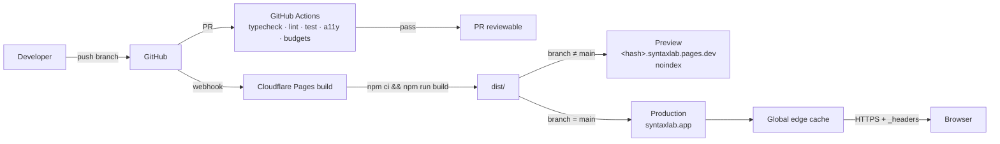

# 17 — Deployment

**Project:** SyntaxLab
**Status:** Draft for human review
**Last updated:** 2026-08-17

---

> **Scope note (Phase 1.5).** Deployment is unchanged by the staging decision. V1.0 and V1.1 deploy identically; V1.1 simply adds a chunk. The `<title>` and metadata differ per release (§11).

## 1. Target

**Cloudflare Pages**, static hosting, per the brief and the playbook.

| Requirement | Cloudflare Pages |
|---|---|
| Static assets | ✅ Its purpose |
| Global CDN | ✅ ~300 PoPs |
| Free HTTPS | ✅ Automatic |
| Custom headers (CSP) | ✅ `_headers` file |
| Preview deployments | ✅ Per branch/PR |
| Instant rollback | ✅ One click in the dashboard |
| Build from Git | ✅ |
| Cost at this scale | ✅ Free tier is more than sufficient |

**No Workers, no Functions, no KV, no D1, no R2.** The app is static. Adding any Cloudflare compute product would create a server where none is needed and would undermine the "nothing leaves your browser" claim, since a Worker sits in the request path by definition.

---

## 2. Architecture



---

## 3. Build

### 3.1 Configuration

| Setting | Value |
|---|---|
| Build command | `npm run build` |
| Output directory | `dist` |
| Node version | **22 LTS** (pinned via `.nvmrc` and `NODE_VERSION`) — see the note below |
| Install command | `npm ci` |
| Root directory | `/` |

**Note on the Node version (decided at M0, Phase 2).** The Phase 1 documentation
specified Node 20 LTS. Node 20 reached end-of-life in April 2026, so pinning to it
would mean building on an unsupported runtime that no longer receives security
patches. The toolchain is pinned to **Node 22 LTS** instead. This is recorded as
decision **D-07** in `22_OPEN_QUESTIONS.md` §1. No other document depended on the
version number, and no diagram changes.

### 3.2 Pipeline

```
npm ci                    exact lockfile install
  ↓
tsc --noEmit              typecheck
  ↓
eslint . && stylelint     lint
  ↓
vitest run                unit + integration + property + security
  ↓
vite build                production bundle
  ↓
size check                bundle budgets (12_PERFORMANCE.md §2.1)
  ↓
dist/
```

**Tests run in the deploy pipeline, not only in CI.** A green PR that goes stale between merge and deploy must not reach production untested.

### 3.3 Output

```
dist/
├── index.html
├── assets/
│   ├── index-<hash>.js       entry
│   ├── vendor-<hash>.js      react + codemirror
│   ├── regex-<hash>.js       lazy
│   ├── json-<hash>.js        lazy
│   ├── cron-<hash>.js        lazy
│   ├── history-<hash>.js     lazy
│   ├── theme-<hash>.js       lazy
│   ├── analysis.worker-<hash>.js
│   ├── exec.worker-<hash>.js
│   ├── index-<hash>.css
│   └── fonts/*.woff2
├── icons/
├── manifest.webmanifest
├── sw.js                     generated
├── workbox-<hash>.js
├── robots.txt
├── theme-bootstrap.js        tiny, unhashed, referenced from index.html
└── _headers
```

**Source maps are not deployed.** They are generated, uploaded to CI artefacts for debugging, and excluded from `dist`. Shipping them exposes the full source and, more practically, adds megabytes to the deploy.

---

## 4. Headers

`public/_headers`, copied verbatim into `dist`:

```
/*
  Content-Security-Policy: default-src 'none'; script-src 'self'; style-src 'self' 'unsafe-inline'; img-src 'self' data:; font-src 'self'; connect-src 'none'; worker-src 'self'; manifest-src 'self'; base-uri 'none'; form-action 'none'; frame-ancestors 'none'; object-src 'none'; upgrade-insecure-requests
  X-Content-Type-Options: nosniff
  X-Frame-Options: DENY
  Referrer-Policy: no-referrer
  Permissions-Policy: geolocation=(), camera=(), microphone=(), payment=(), usb=(), interest-cohort=(), browsing-topics=()
  Cross-Origin-Opener-Policy: same-origin
  Cross-Origin-Resource-Policy: same-origin
  Cross-Origin-Embedder-Policy: require-corp
  Strict-Transport-Security: max-age=31536000; includeSubDomains; preload

/assets/*
  Cache-Control: public, max-age=31536000, immutable

/index.html
  Cache-Control: public, max-age=0, must-revalidate

/sw.js
  Cache-Control: public, max-age=0, must-revalidate

/manifest.webmanifest
  Cache-Control: public, max-age=0, must-revalidate
```

### Caching rationale

| Path | Policy | Why |
|---|---|---|
| `/assets/*` | 1 year, immutable | Content-hashed filenames; a changed file gets a new URL |
| `/index.html` | No cache, revalidate | The entry point must never be stale, or users are pinned to an old build forever |
| `/sw.js` | No cache, revalidate | **Critical.** A cached service-worker script means updates never reach users. This is the single most common PWA deployment mistake. |
| `/manifest.webmanifest` | No cache | Small, and must reflect the current build |

`Strict-Transport-Security` includes `preload`, but submission to the preload list happens only after the domain has been stable in production for a while — HSTS preload is effectively irreversible.

---

## 5. Environments

| Environment | URL | Purpose | Indexed |
|---|---|---|---|
| Local | `localhost:5173` | Development | — |
| Preview | `<hash>.syntaxlab.pages.dev` | Per-PR review | ❌ `X-Robots-Tag: noindex` + `robots.txt` disallow |
| Production | `syntaxlab.app` | Live | ✅ |

Preview deployments must be noindexed, or Google indexes twenty copies of the app and the canonical domain suffers.

### 5.1 Environment variables

**V1 requires none at runtime.** No API keys, no endpoints, no secrets — a direct consequence of having no backend.

Build-time only:

| Variable | Purpose |
|---|---|
| `NODE_VERSION` | Pin the toolchain to Node 22 |
| `VITE_APP_VERSION` | Injected from `package.json` for the help dialog and export envelope |
| `VITE_BUILD_TIME` | Build timestamp, shown in diagnostics |
| `VITE_COMMIT_SHA` | Provided by Cloudflare (`CF_PAGES_COMMIT_SHA`) for support |

**None of these are secrets.** The environment strategy exists so that adding one later is a considered act: any future secret would imply a server, which would require re-running the threat model (`14_THREAT_MODEL.md` §11).

---

## 6. Domain and DNS

- Custom domain via Cloudflare DNS
- Universal SSL (automatic certificate)
- Always Use HTTPS: on
- Automatic HTTPS Rewrites: on
- Minimum TLS 1.2
- No Cloudflare feature that modifies HTML (Rocket Loader, Auto Minify, Email Obfuscation) — **these inject or rewrite scripts and will break the CSP.** Explicitly disabled and noted in the release checklist, because they are on by default in some plans and produce a maddening class of "works locally, broken in production" bug.

---

## 7. Release process

```
1. Feature branches merge into main via PR (all CI green)
2. main is always deployable
3. To release:
   a. Update CHANGELOG.md
   b. Bump version in package.json
   c. Tag: git tag -a v1.2.0 -m "…"
   d. Push tag → GitHub release
4. Cloudflare deploys main automatically
5. Post-deploy verification (§8)
6. If broken → rollback (§9)
```

Versioning is semver, with a project-specific reading:

| Bump | Meaning here |
|---|---|
| MAJOR | Breaking storage/export/share-format change |
| MINOR | New feature |
| PATCH | Fix, no user-visible behaviour change |

---

## 8. Post-deploy verification

Run against production after every release. **Not optional** — a broken service worker self-persists in users' browsers, which makes this the highest-value ten minutes in the process.

```
[ ] Site loads over HTTPS
[ ] All security headers present (curl -I, or securityheaders.com)
[ ] CSP has no violations (devtools console)
[ ] Zero network requests after load, other than SW update checks (Network tab)
[ ] Both modes work (three from V1.1)
[ ] The page title matches the shipped scope
[ ] Service worker registers and precaches
[ ] Offline: disable network, reload, verify full function
[ ] Update banner behaviour verified from the previous version
[ ] History persists across a reload
[ ] Theme persists with no flash
[ ] PWA installable (Lighthouse)
[ ] Lighthouse gates met on production
[ ] Mobile spot-check on a real device
[ ] Cloudflare HTML-modifying features still disabled
```

---

## 9. Rollback

| Method | When | Time |
|---|---|---|
| **Cloudflare dashboard rollback** | Any bad deploy | < 1 min |
| `git revert` + push | When the fix should be recorded in history | ~3 min |
| Emergency: redeploy the last known-good commit | Build pipeline broken | ~5 min |

### The service-worker caveat

A CDN rollback does not immediately reach users who already have a service worker installed. They keep serving the cached (broken) version until their next update check — up to an hour with the hourly check, or until they reload twice.

Mitigations:
1. The hourly `registration.update()` bounds the exposure window
2. The rolled-back build is a *new* SW version to clients, so it installs normally
3. An in-app **Reset app** action (unregister SW, clear caches, reload) exists in settings and is documented in the README

**The real mitigation is not shipping a broken SW.** Every release is verified offline on a preview deployment before promotion.

---

## 10. Monitoring

**There is no monitoring.** No RUM, no error reporting, no analytics — `connect-src 'none'` forbids it and the privacy promise forbids it.

What exists instead:

| Signal | Source |
|---|---|
| Uptime | Cloudflare's status; the CDN serving static files is not a realistic failure mode |
| Build failures | Cloudflare + GitHub Actions notifications |
| User-reported bugs | GitHub Issues, with a template asking for browser, version (shown in the help dialog), and steps |
| Pre-release quality | The full CI suite and manual checklist |

**Accepted consequence:** we will not know about a production error until a user reports it. For a static, offline-first tool with no server state, no accounts, and no transactions, that trade is reasonable. It is recorded as **R-13** in `23_RISK_REGISTER.md`, and the alternative (an error-reporting SDK that would need `connect-src` opened and would receive user content in stack traces) is worse for this product.

---

## 11. SEO and discoverability

Per the brief: no marketing site, no keyword stuffing.

In `index.html`:

```html
<title>SyntaxLab — Regex & JSON Explainer</title>
<meta name="description" content="Understand regular expressions and JSON. Plain-English explanations, live testing, and a syntax tree. Runs in your browser — the app doesn't upload what you paste.">
<link rel="canonical" href="https://syntaxlab.app/">
<meta property="og:title" content="SyntaxLab — Regex & JSON Explainer">
<meta property="og:description" content="…">
<meta property="og:image" content="https://syntaxlab.app/og-image.png">
<meta property="og:type" content="website">
<meta name="twitter:card" content="summary_large_image">
```

**The title must match the shipped scope** (acceptance criterion D-11). It broadens to "Regex, JSON & Cron Explainer" at V1.1 and not before — promising cron in metadata while not shipping it is the same defect as a disabled tab in the UI.

Plus: `robots.txt` allowing production and disallowing preview, a `WebApplication` JSON-LD block (accurate, minimal, no fake ratings), semantic headings with a single `h1`, and real content in the initial HTML (the empty state is server-independent static markup) so crawlers see something without executing JavaScript.

No sitemap — one page.

---

## 12. Cost

| Item | Cost |
|---|---|
| Cloudflare Pages | £0 (free tier: 500 builds/month, unlimited bandwidth) |
| Domain | ~£10/year |
| GitHub | £0 (public repo) |
| **Total** | **~£10/year** |

This is a direct consequence of the no-backend decision. Any proposal to add server infrastructure should be weighed against the fact that the current architecture costs approximately one pound per month and cannot be DDoSed in any meaningful way.

---

## 13. Alternatives considered

| Platform | Verdict |
|---|---|
| **Cloudflare Pages** | ✅ Chosen — brief-specified, excellent free tier, `_headers` support, instant rollback |
| Netlify | Equivalent capability; would work identically. Marginally more generous headers UI, less generous bandwidth. |
| Vercel | Excellent, but oriented around Next.js and serverless functions we do not want |
| GitHub Pages | Free, but **no custom headers** — cannot set the CSP, which is a hard requirement |
| Self-hosted | Server to maintain, for zero benefit |

GitHub Pages is disqualified specifically by the CSP requirement. That is worth noting because it is otherwise the obvious "simplest" choice, and the security model is what rules it out.
