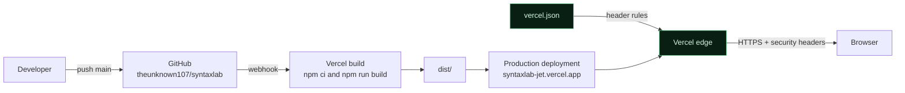
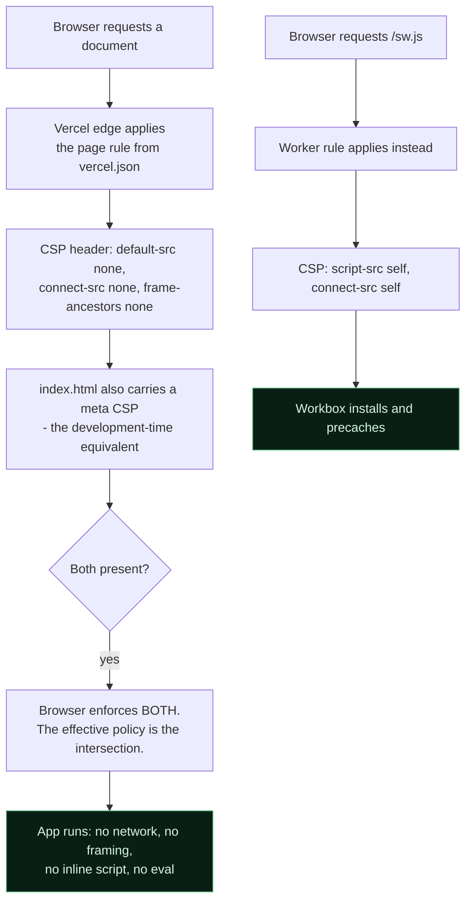
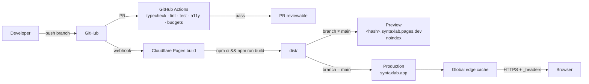
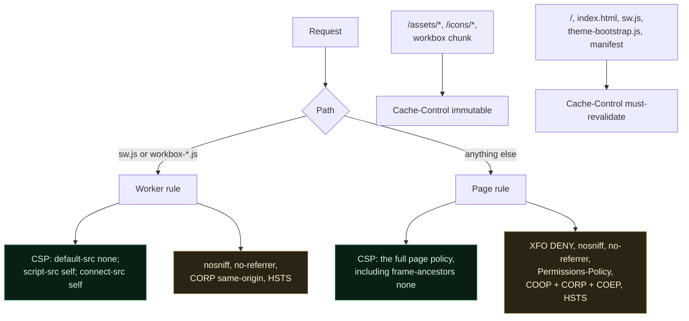

# 17 — Deployment

**Project:** SyntaxLab
**Status:** Partly superseded — see the note below
**Last updated:** 2026-08-21

---

> **Scope note (Phase 1.5).** Deployment is unchanged by the staging decision. V1.0 and V1.1 deploy identically; V1.1 simply adds a chunk. The `<title>` and metadata differ per release (§11).

## 1. Target

> **What is actually deployed.**
>
> SyntaxLab is hosted on **Vercel**, not Cloudflare Pages, at
> **https://syntaxlab-jet.vercel.app** — public, serving the application, and
> deploying automatically from `main` on `github.com/theunknown107/syntaxlab`.
>
> The Cloudflare plan below was written in Phase 1 and is kept because the
> **requirements** it sets out are provider-independent and still govern the
> build: a static bundle, a real CSP delivered as headers, immutable hashed
> assets, revalidated entry points, noindexed previews, and no HTML-rewriting
> features. What was Cloudflare-specific was the *mechanism*, and that has now
> been ported:
>
> | Cloudflare mechanism | On Vercel |
> |---|---|
> | `public/_headers` | **Deleted.** Vercel never read it. The policy now lives in `vercel.json`, §4. |
> | Pages build settings | Vercel project settings, wired to the GitHub repository |
> | Rocket Loader / Auto Minify / Email Obfuscation must be off | Not applicable; Vercel does not rewrite HTML by default |
>
> ### The header gap, and how it was closed
>
> `public/_headers` is Cloudflare's format. Vercel does not read it, so for the
> whole life of the public deployment the headers it declared were **not being
> sent**. Measured with `curl` against the live origin before the fix:
>
> | | Before | After |
> |---|---|---|
> | **CSP** — `default-src`, `script-src`, `style-src`, `img-src`, `font-src`, `connect-src`, `worker-src`, `manifest-src`, `base-uri`, `form-action`, `object-src` | ✅ enforced by the `<meta http-equiv>` tag in `index.html` | ✅ enforced as a **header**, meta tag retained as the development-time equivalent |
> | `frame-ancestors` | ❌ **missing** — ignored in a meta tag by specification, so it only ever worked as a header | ✅ `'none'` |
> | `X-Frame-Options` | ❌ missing | ✅ `DENY` |
> | `X-Content-Type-Options`, `Referrer-Policy`, `Permissions-Policy` | ❌ missing | ✅ |
> | `Cross-Origin-Opener-Policy` / `-Resource-Policy` / `-Embedder-Policy` | ❌ missing | ✅ |
> | `Strict-Transport-Security` | ✅ Vercel's own default, *stronger* than the project's | ✅ both; Vercel's default still applies at the edge |
> | Service-worker CSP on `/sw.js` | ❌ missing — harmless only because *no* policy applied, leaving the worker unrestricted | ✅ its own narrower policy, §4.2 |
> | Immutable caching of hashed assets | ❌ everything was `max-age=0, must-revalidate` | ✅ `/assets/*`, `/icons/*` and the Workbox chunk are immutable |
>
> **The substantive loss was clickjacking protection.** `frame-ancestors` and
> `X-Frame-Options` are both header-only, so neither was in force: the page
> could be framed by any origin. The script/style/connect policy that carries
> the privacy claim was intact throughout, via the meta tag.
>
> **Why the test suite did not catch it.** The gate existed and passed. It
> asserted the served headers against `public/_headers` — the file production
> ignored. A gate that compares a server to a configuration nobody deploys
> verifies the policy *as authored*, never *as served*. Both the gate and the
> local production server now read `vercel.json`, so the thing under test is
> the thing that ships.

**Cloudflare Pages**, static hosting, per the brief and the playbook — the
original plan, retained for its requirements rather than as a description of
current hosting.

| Requirement | Cloudflare Pages |
|---|---|
| Static assets | ✅ Its purpose |
| Global CDN | ✅ ~300 PoPs |
| Free HTTPS | ✅ Automatic |
| Custom headers (CSP) | ✅ `_headers` file *(the Vercel equivalent is `vercel.json`)* |
| Preview deployments | ✅ Per branch/PR |
| Instant rollback | ✅ One click in the dashboard |
| Build from Git | ✅ |
| Cost at this scale | ✅ Free tier is more than sufficient |

**No Workers, no Functions, no KV, no D1, no R2.** The app is static. Adding any Cloudflare compute product would create a server where none is needed and would undermine the "nothing leaves your browser" claim, since a Worker sits in the request path by definition.

---

## 2. Architecture

### 2.1 As deployed — GitHub to Vercel



There is no CI gate in front of this. Vercel builds whatever lands on `main`,
which means **the gates run locally before the push**, not after it — §7.

### 2.2 What the browser ends up trusting



The meta tag is deliberately **not weaker** than the header for `script-src`,
so the intersection costs nothing. It stays because it is what protects the
development server and any future host that has not been configured yet — the
exact failure this milestone had to fix.

### 2.3 The original Cloudflare plan

Kept because it is the requirement set the build still satisfies.



---

## 3. Build

### 3.1 Configuration

| Setting | Value |
|---|---|
| Build command | `npm run build` |
| Output directory | `dist` |
| Node version | **22 LTS** (pinned via `.nvmrc` and `NODE_VERSION`) — see the note below |
| Install command | `npm ci` |
| Root directory | `/` |

**Note on the Node version (decided at M0, Phase 2).** The Phase 1 documentation
specified Node 20 LTS. Node 20 reached end-of-life in April 2026, so pinning to it
would mean building on an unsupported runtime that no longer receives security
patches. The toolchain is pinned to **Node 22 LTS** instead. This is recorded as
decision **D-07** in `22_OPEN_QUESTIONS.md` §1. No other document depended on the
version number, and no diagram changes.

### 3.2 Pipeline

```
npm ci                    exact lockfile install
  ↓
tsc --noEmit              typecheck
  ↓
eslint . && stylelint     lint
  ↓
vitest run                unit + integration + property + security
  ↓
vite build                production bundle
  ↓
size check                bundle budgets (12_PERFORMANCE.md §2.1)
  ↓
dist/
```

**Tests run in the deploy pipeline, not only in CI.** A green PR that goes stale between merge and deploy must not reach production untested.

### 3.3 Output

```
dist/
├── index.html
├── assets/
│   ├── index-<hash>.js       entry
│   ├── vendor-<hash>.js      react + codemirror
│   ├── regex-<hash>.js       lazy
│   ├── json-<hash>.js        lazy
│   ├── cron-<hash>.js        lazy
│   ├── history-<hash>.js     lazy
│   ├── theme-<hash>.js       lazy
│   ├── analysis.worker-<hash>.js
│   ├── exec.worker-<hash>.js
│   ├── index-<hash>.css
│   └── fonts/*.woff2
├── icons/                    manifest icons: 192, 512, maskable 512
├── favicon.svg               tab icon, optically scaled
├── favicon.ico               16 · 32 · 48, PNG entries
├── apple-touch-icon.png      180, the full mark
├── manifest.webmanifest
├── sw.js                     generated
├── workbox-<hash>.js
├── robots.txt
└── theme-bootstrap.js        tiny, unhashed, referenced from index.html
```

**Source maps are not deployed.** They are generated, uploaded to CI artefacts for debugging, and excluded from `dist`. Shipping them exposes the full source and, more practically, adds megabytes to the deploy.

---

## 4. Headers

**Source of truth: `vercel.json`.** One file, read by three things — Vercel at
the edge, the local production server (`npm run serve:prod`), and the release
gate that asserts what a browser actually receives. There is no second copy to
drift.

### 4.1 The rules, and why they are shaped this way



The two CSP rules are **mutually exclusive by construction.** The page rule's
source is a negative lookahead:

```
/((?!sw\.js$)(?!workbox-[^/]*\.js$).*)
```

so no request ever matches both. That is deliberate and it is the load-bearing
detail: Vercel does not document what happens when two matching rules carry the
same header key, and the failure mode if it merged rather than overrode would
be a service worker that silently never activates. Rather than depend on an
undocumented precedence, the rules are written so precedence cannot apply.

The `Cache-Control` rules are kept in a separate key space from the CSP rules
for the same reason — a request may match a CSP rule and a caching rule, but
never two rules setting the same header.

### 4.2 The service-worker exception

**A worker's CSP comes from the headers on its own script, not from the page's.**
The site-wide policy sets `connect-src 'none'`, which is exactly right for a
page that makes no requests and fatal for the worker: Workbox precaches by
calling `fetch()` during install, so under that policy the worker silently
never activates and no asset is ever cached. Measured A/B on the real build at
M9.

The worker rule is **narrower, not looser**. It grants exactly two things —
`script-src 'self'` to `importScripts` its own Workbox chunk, and
`connect-src 'self'` to fetch the same-origin assets it is about to cache.
There is no style, image, font or frame in a service worker, and none is
allowed. The page policy is not weakened anywhere.

`/workbox-*.js` is covered by the same rule because `sw.js` imports it, so it
executes in that context and needs the same execution rules.

### 4.3 Caching rationale

| Path | Policy | Why |
|---|---|---|
| `/assets/*`, `/icons/*`, `/workbox-*.js` | 1 year, immutable | Content-hashed filenames; a changed file gets a new URL |
| `/`, `/index.html` | No cache, revalidate | The entry point must never be stale, or users are pinned to an old build forever |
| `/sw.js` | No cache, revalidate | **Critical.** A cached service-worker script means updates never reach users. This is the single most common PWA deployment mistake. |
| `/manifest.webmanifest`, `/theme-bootstrap.js` | No cache | Small, and must reflect the current build |

Before this was ported, Vercel served `public, max-age=0, must-revalidate` for
*everything*, hashed assets included — correct but wasteful, and not what the
policy said.

`Strict-Transport-Security` is declared as `max-age=31536000; includeSubDomains`
without `preload`. Vercel's edge additionally sends its own, longer HSTS. The
`preload` token was dropped from the project's own header because submission to
the preload list is effectively irreversible and has not been made.

---

## 5. Environments

> **The domain is a placeholder and nothing here is deployed yet.**
> `syntaxlab.app` is not registered, not purchased and not verified
> (`22_OPEN_QUESTIONS.md` D-07). It appears below as the illustrative canonical
> URL this plan is written against. The table is the intended shape of the
> environments, not a description of running infrastructure — as of the first
> public push there is none.

| Environment | URL | Purpose | Indexed |
|---|---|---|---|
| Local | `localhost:5173` | Development | — |
| Preview | `<hash>.syntaxlab.pages.dev` | Per-PR review | ❌ `X-Robots-Tag: noindex` + `robots.txt` disallow |
| Production | `syntaxlab.app` | Live | ✅ |

Preview deployments must be noindexed, or Google indexes twenty copies of the app and the canonical domain suffers.

### 5.1 Environment variables

**V1 requires none at runtime.** No API keys, no endpoints, no secrets — a direct consequence of having no backend.

Build-time only:

| Variable | Purpose |
|---|---|
| `NODE_VERSION` | Pin the toolchain to Node 22 |
| `VITE_APP_VERSION` | Injected from `package.json` for the help dialog and export envelope |
| `VITE_BUILD_TIME` | Build timestamp, shown in diagnostics |
| `VITE_COMMIT_SHA` | Provided by Cloudflare (`CF_PAGES_COMMIT_SHA`) for support |

**None of these are secrets.** The environment strategy exists so that adding one later is a considered act: any future secret would imply a server, which would require re-running the threat model (`14_THREAT_MODEL.md` §11).

---

## 6. Domain and DNS

- Custom domain via Cloudflare DNS
- Universal SSL (automatic certificate)
- Always Use HTTPS: on
- Automatic HTTPS Rewrites: on
- Minimum TLS 1.2
- No Cloudflare feature that modifies HTML (Rocket Loader, Auto Minify, Email Obfuscation) — **these inject or rewrite scripts and will break the CSP.** Explicitly disabled and noted in the release checklist, because they are on by default in some plans and produce a maddening class of "works locally, broken in production" bug.

---

## 7. Release process

```
1. Feature branches merge into main via PR (all CI green)
2. main is always deployable
3. To release:
   a. Update CHANGELOG.md
   b. Bump version in package.json
   c. Tag: git tag -a v1.2.0 -m "…"
   d. Push tag → GitHub release
4. Cloudflare deploys main automatically
5. Post-deploy verification (§8)
6. If broken → rollback (§9)
```

Versioning is semver, with a project-specific reading:

| Bump | Meaning here |
|---|---|
| MAJOR | Breaking storage/export/share-format change |
| MINOR | New feature |
| PATCH | Fix, no user-visible behaviour change |

---

## 8. Post-deploy verification

Run against production after every release. **Not optional** — a broken service worker self-persists in users' browsers, which makes this the highest-value ten minutes in the process.

```
[ ] Site loads over HTTPS
[ ] All security headers present (curl -I, or securityheaders.com)
[ ] CSP has no violations (devtools console)
[ ] Zero network requests after load, other than SW update checks (Network tab)
[ ] Both modes work (three from V1.1)
[ ] The page title matches the shipped scope
[ ] Service worker registers and precaches
[ ] Offline: disable network, reload, verify full function
[ ] Update banner behaviour verified from the previous version
[ ] History persists across a reload
[ ] Theme persists with no flash
[ ] PWA installable (Lighthouse)
[ ] Lighthouse gates met on production
[ ] Mobile spot-check on a real device
[ ] Cloudflare HTML-modifying features still disabled
```

---

## 9. Rollback

| Method | When | Time |
|---|---|---|
| **Cloudflare dashboard rollback** | Any bad deploy | < 1 min |
| `git revert` + push | When the fix should be recorded in history | ~3 min |
| Emergency: redeploy the last known-good commit | Build pipeline broken | ~5 min |

### The service-worker caveat

A CDN rollback does not immediately reach users who already have a service worker installed. They keep serving the cached (broken) version until their next update check — up to an hour with the hourly check, or until they reload twice.

Mitigations:
1. The hourly `registration.update()` bounds the exposure window
2. The rolled-back build is a *new* SW version to clients, so it installs normally
3. An in-app **Reset app** action (unregister SW, clear caches, reload) exists in settings and is documented in the README

**The real mitigation is not shipping a broken SW.** Every release is verified offline on a preview deployment before promotion.

---

## 10. Monitoring

**There is no monitoring.** No RUM, no error reporting, no analytics — `connect-src 'none'` forbids it and the privacy promise forbids it.

What exists instead:

| Signal | Source |
|---|---|
| Uptime | Cloudflare's status; the CDN serving static files is not a realistic failure mode |
| Build failures | Cloudflare + GitHub Actions notifications |
| User-reported bugs | GitHub Issues, with a template asking for browser, version (shown in the help dialog), and steps |
| Pre-release quality | The full CI suite and manual checklist |

**Accepted consequence:** we will not know about a production error until a user reports it. For a static, offline-first tool with no server state, no accounts, and no transactions, that trade is reasonable. It is recorded as **R-13** in `23_RISK_REGISTER.md`, and the alternative (an error-reporting SDK that would need `connect-src` opened and would receive user content in stack traces) is worse for this product.

---

## 11. SEO and discoverability

Per the brief: no marketing site, no keyword stuffing.

In `index.html`:

```html
<title>SyntaxLab — Regex & JSON Explainer</title>
<meta name="description" content="Understand regular expressions and JSON. Plain-English explanations, live testing, and a syntax tree. Runs in your browser — the app doesn't upload what you paste.">
<link rel="canonical" href="https://syntaxlab.app/">
<meta property="og:title" content="SyntaxLab — Regex & JSON Explainer">
<meta property="og:description" content="…">
<meta property="og:image" content="https://syntaxlab.app/og-image.png">
<meta property="og:type" content="website">
<meta name="twitter:card" content="summary_large_image">
```

**The title must match the shipped scope** (acceptance criterion D-11). It broadens to "Regex, JSON & Cron Explainer" at V1.1 and not before — promising cron in metadata while not shipping it is the same defect as a disabled tab in the UI.

Plus: `robots.txt` allowing production and disallowing preview, a `WebApplication` JSON-LD block (accurate, minimal, no fake ratings), semantic headings with a single `h1`, and real content in the initial HTML (the empty state is server-independent static markup) so crawlers see something without executing JavaScript.

No sitemap — one page.

---

## 12. Cost

| Item | Cost |
|---|---|
| Cloudflare Pages | £0 (free tier: 500 builds/month, unlimited bandwidth) |
| Domain | ~£10/year |
| GitHub | £0 (public repo) |
| **Total** | **~£10/year** |

This is a direct consequence of the no-backend decision. Any proposal to add server infrastructure should be weighed against the fact that the current architecture costs approximately one pound per month and cannot be DDoSed in any meaningful way.

---

## 13. Alternatives considered

| Platform | Verdict |
|---|---|
| **Cloudflare Pages** | ✅ Chosen — brief-specified, excellent free tier, `_headers` support, instant rollback |
| Netlify | Equivalent capability; would work identically. Marginally more generous headers UI, less generous bandwidth. |
| Vercel | Excellent, but oriented around Next.js and serverless functions we do not want |
| GitHub Pages | Free, but **no custom headers** — cannot set the CSP, which is a hard requirement |
| Self-hosted | Server to maintain, for zero benefit |

GitHub Pages is disqualified specifically by the CSP requirement. That is worth noting because it is otherwise the obvious "simplest" choice, and the security model is what rules it out.


---

## M9 — what deployment must now get right

### Headers

`public/_headers` gained three blocks. All three matter, and one is a
correctness requirement rather than an optimisation:

| Path | Header | Why |
|---|---|---|
| `/sw.js` | `Content-Security-Policy: default-src 'none'; script-src 'self'; connect-src 'self'` | **Required.** A worker takes its CSP from its own script's headers. Under the site-wide `connect-src 'none'` it cannot precache and silently never activates. |
| `/sw.js` | `Cache-Control: public, max-age=0, must-revalidate` | A cached service worker is an un-updatable application. |
| `/workbox-*.js` | Same CSP; `immutable` caching | `importScripts`-ed into the worker context. Content-hashed, so it may be cached forever. |
| `/manifest.webmanifest` | `max-age=0, must-revalidate` | |

Verifying this on a preview deployment before promotion is not optional. A
broken service worker is the most expensive bug class this application can
ship, because it self-persists across reloads — `07_PWA_OFFLINE.md` §4.4.

### Rollback

Unchanged from §4.4 and still correct: redeploy the previous build; clients
pick up the reverted worker on their next update check. There is no in-app
rollback, because a page cannot install an older worker.

---

## M12 — what was verified, and what M13 must still do

**Verified locally, against the real artefact.** `npm run serve:prod` parses
`public/_headers` and serves `dist/`, and a test compares what a browser
actually receives against what the file declares, directive by directive.

| | |
|---|---|
| Page CSP matches the declared policy | ✅ |
| Service worker served its own narrower CSP | ✅ |
| Eight non-CSP security headers | ✅ each asserted |
| `/assets/*` immutable, entry points `must-revalidate` | ✅ |
| Service worker activates, precaches, serves offline | ✅ |
| Update lifecycle | ✅ |

**One documented difference from production**, and only one:
`upgrade-insecure-requests` is dropped, because this origin is HTTP and WebKit
would rewrite every subresource to `https://localhost` where nothing is
listening. It is a no-op on the HTTPS production origin. The test asserts it is
the *only* difference.

### Still outstanding — M13

**A real Cloudflare Pages preview deployment has NOT been performed.** There is
no `CLOUDFLARE_API_TOKEN`, no `wrangler.toml` and no linked project in this
environment, and M12 does not claim otherwise.

M13 must, on a real preview URL:

1. ~~Confirm the `_headers` file is applied by Cloudflare as written~~ — **done differently.** The host is Vercel and the policy moved to `vercel.json` (§4); it is confirmed as served with `curl` against the live origin. The local
   server implements the format, which is not the same as Cloudflare doing so.
2. Confirm `upgrade-insecure-requests` behaves on a real HTTPS origin.
3. Install the app from the preview and use it offline.
4. Deploy a second build and walk the update lifecycle against it.
5. Confirm the HTML-modifying Cloudflare features listed in §12 are disabled —
   Rocket Loader, Auto Minify and Email Obfuscation all rewrite or inject
   script and will break the CSP. They are on by default on some plans.
