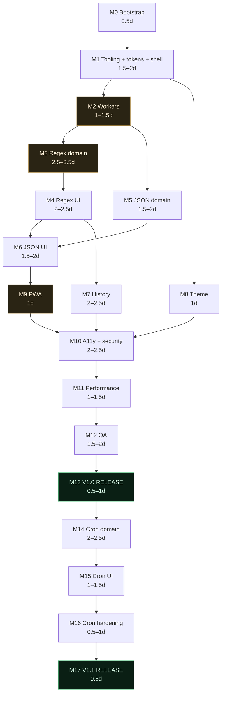

# 20 — Implementation Plan

**Project:** SyntaxLab
**Status:** Revised in Phase 1.5 — **Phase 2 is not authorised**
**Last updated:** 2026-08-17

---

## 1. Release structure

| Release | Milestones | Contents |
|---|---|---|
| **V1.0** | M0 – M13 | Regex · JSON · history · theme · PWA · accessibility · security · tests · performance · production build |
| **V1.1** | M14 – M17 | Cron: standard 5-field, browser-local + UTC |
| V1.2+ | — | Not planned in this document. Speculative features are recorded in `22_OPEN_QUESTIONS.md`, not scheduled here. |

**Estimates are ranges.** A single number implies a precision nobody has. Ranges assume one focused developer who has read this documentation package.

---

## 2. Sequencing principles

1. **Domain logic before UI.** Building the shell first produces three empty panels and a parser that turns out to need a different AST.
2. **Safety before features.** The worker boundary exists before anything runs inside it.
3. **Vertical slices, not horizontal layers.** Each milestone delivers something demonstrable.
4. **One parser at a time.** Regex is finished and tested before JSON begins; JSON before cron. Three simultaneous parser stacks means three unstable things and no working slice at any point.
5. **Accessibility and security are continuous.** Each milestone carries its own a11y and security acceptance items. M10 is the dedicated *audit*, not the first time either is considered.
6. **Measure early.** The first production build and bundle measurement happen at M1, not at M11.

---

## 3. V1.0 milestones

### M0 — Bootstrap planning *(0.5 day)*

**Objective:** resolve everything that would otherwise block or churn M1.

| Deliverable |
|---|
| Confirm the Phase 1.5 decisions are approved (`22_OPEN_QUESTIONS.md` §1) |
| Confirm repository visibility and licence (Q-16) |
| Confirm the product name and secure a domain, or explicitly defer to M13 (Q-07) |
| Node version pinned; toolchain versions chosen |
| Repository created with `.gitignore`, `.nvmrc`, `.editorconfig`, `LICENSE`, `SECURITY.md` stub |
| Branch protection configured per `19_GIT_WORKFLOW.md` §5 |

**Tests:** none — no code yet.
**Acceptance:** no open decision blocks M1.
**Risks:** none material.
**Definition of done:** the repository exists, is protected, and nothing in `22_OPEN_QUESTIONS.md` is marked "blocks V1".

---

### M1 — Tooling, design tokens, shell *(1.5–2 days)*

**Objective:** a running, styled, empty application with every quality gate already enforcing.

**Dependencies:** M0.

| # | Deliverable |
|---|---|
| 1.1 | Vite + React + TypeScript, `strict` config per `18_CODING_STANDARDS.md` §2.1 |
| 1.2 | ESLint (incl. `boundaries`, `react/no-danger`, banned-API rules), Stylelint, Prettier |
| 1.3 | Vitest + RTL + happy-dom; one passing smoke test |
| 1.4 | Playwright; one passing smoke test |
| 1.5 | GitHub Actions CI with every job from `13_TEST_PLAN.md` §11 |
| 1.6 | **`styles/tokens.css`** — the complete token system from `09_DESIGN_SYSTEM.md` |
| 1.7 | Reset + global CSS; self-hosted subsetted fonts |
| 1.8 | Directory structure per `02_ARCHITECTURE.md` §9 |
| 1.9 | `domain/shared/`: `Result`, `DomainError`, `SourceSpan`, `LIMITS` |
| 1.10 | `createStore` + `useStore` |
| 1.11 | `AppShell`, `Header`, two-segment `ModeSelector`, `StatusBar` — empty but styled |
| 1.12 | Three error boundaries per `10_COMPONENT_ARCHITECTURE.md` §2 |
| 1.13 | `public/_headers` with the full CSP |
| 1.14 | **First production build + bundle measurement recorded in `12_PERFORMANCE.md` §10** |

**Tests:** store primitive (subscribe/notify/selector isolation); smoke render; lint and typecheck gates active.

**Acceptance:** `npm run dev` shows a styled empty shell; CI green; Stylelint rejects a hard-coded colour; the CSP is present on a local preview; **a real bundle number exists**.

**Risks:** R-05 — the measurement may already be near budget. That is the point of measuring now.

**Definition of done:** all of the above, plus §10 of the performance doc contains a measured row.

---

### M2 — Worker infrastructure *(1–1.5 days)*

**Objective:** the async boundary exists before any parser is written against it.

**Dependencies:** M1.

| # | Deliverable |
|---|---|
| 2.1 | `workers/protocol.ts` — request/response types |
| 2.2 | `analysis.worker.ts` — dispatcher, payload re-validation, top-level error catching, stub result |
| 2.3 | `exec.worker.ts` — the minimal execution worker |
| 2.4 | `WorkerClient` — id correlation, deadline timers, supersede-in-flight, terminate-and-eager-respawn |
| 2.5 | Feature detection + main-thread fallback with the reduced-safety indicator (regex execution **disabled**, not relocated) |

**Tests:** round trip; timeout → terminate → respawn; superseded responses discarded; malformed payload rejected by the worker; `structuredClone` round-trip for every response type.

**Acceptance:** a deliberately infinite worker loop is terminated at the deadline, the replacement serves the next request, and the main thread handles a click throughout.

**Risks:** **R-10 — risk checkpoint.** If `terminate()` does not reliably stop a runaway loop on any target browser, the entire ReDoS defence needs rethinking. **Stop and escalate; do not proceed to M3.**

**Definition of done:** termination verified on Chromium, Firefox, and WebKit.

---

### M3 — Regex domain *(2.5–3.5 days)* — ✅ **COMPLETE**

**Objective:** regex parsing and explanation, fully tested, with no UI at all.

**Dependencies:** M2.

| # | Deliverable |
|---|---|
| 3.1 | `regex/tokenizer.ts` with the `inCharClass` context rule |
| 3.2 | `regex/ast.ts` — node types |
| 3.3 | `regex/parser.ts` — recursive descent, depth limit, error recovery |
| 3.4 | Pass 2: group numbering, backreference resolution |
| 3.5 | **Foreign-dialect recognition table** (`04_PARSER_ARCHITECTURE.md` §2.0) |
| 3.6 | `shared/explanation.ts` — `ExplanationNode` types |
| 3.7 | `regex/explain.ts` — exhaustive, context-aware node explainer |
| 3.8 | Warning detection; ECMAScript-level compatibility reporting |
| 3.9 | Wired into the analysis worker |
| 3.10 | **Golden corpus: 150+ patterns, human-reviewed** |
| 3.11 | **Property + differential tests** vs `new RegExp` |

**Tests:** unit per token/node/error type; golden files; property (terminates, never throws, spans valid); differential across the fuzz corpus.

**Acceptance:** ≥ 95% coverage on `domain/regex/`; zero crashes across the CI fuzz budget; differential agreement with the platform on every corpus input; golden output reviewed by a human.

**Risks:** **R-01 — risk checkpoint.** Persistent differential disagreement means adopting `regexpp` per `16_DEPENDENCIES.md` §6.

**Definition of done:** the parser is trustworthy enough to build UI on, evidenced by the test results above.

---

### M4 — Regex UI, explanation, testing *(2–2.5 days)* — ✅ **COMPLETE**

**Objective:** the first genuinely useful product.

**Dependencies:** M3.

| # | Deliverable |
|---|---|
| 4.1 | `CodeEditor` — the single shared CodeMirror wrapper, built once and correctly |
| 4.2 | Regex highlighting mode |
| 4.3 | `RegexInput`, flag bar, **permanent `ECMAScript (JavaScript)` label** |
| 4.4 | `ExplanationSummary` + `TokenTable` with bidirectional span hover |
| 4.5 | `TreeView` (shared, generic) + regex AST rendering |
| 4.6 | `GroupTable`, `WarningList` |
| 4.7 | Test-string editor, match highlighting, match table |
| 4.8 | Timeout / no-match / invalid / foreign-dialect states |
| 4.9 | Example picker |
| 4.10 | a11y: labels, live regions, keyboard, axe clean |
| 4.11 | Bundle re-measured |

**Tests:** component tests by role and accessible name; I1–I4; E2; E12; axe on the regex view; render-count assertion on the typing path.

**Acceptance:** a catastrophic pattern times out with the UI responsive; the ECMAScript label is present and non-dismissible; a Python-syntax paste produces the corrective hint; zero critical/serious axe violations.

**Risks:** R-04 (explanation quality) becomes visible here — **the first point at which external feedback is worth gathering.**

**Definition of done:** a developer could use this to understand a regex they did not write.

---

### M5 — JSON domain *(1.5–2 days)* — ✅ **COMPLETE**

**Objective:** JSON parsing, fully tested, no UI.

**Dependencies:** M2 (not M4 — the domain does not need the UI).

| # | Deliverable |
|---|---|
| 5.1 | `json/scanner.ts` — escapes, surrogate pairs, control-character rejection, strict number grammar |
| 5.2 | `json/parser.ts` — **iterative with an explicit stack**, depth/node limits, panic-mode recovery |
| 5.3 | Duplicate-key and unsafe-number detection |
| 5.4 | `json/format.ts` — prettify/minify **from the CST** |
| 5.5 | `json/explain.ts` |
| 5.6 | JSONTestSuite conformance + differential vs `JSON.parse` |

**Tests:** conformance corpus (`y_*` accepted, `n_*` rejected, `i_*` documented); property; prototype-pollution corpus; 500-deep nesting yields `LIMIT_EXCEEDED` rather than a stack overflow.

**Acceptance:** full JSONTestSuite pass; differential agreement; a 5 MB document parses in a worker within the performance target.

**Risks:** R-01. Fallback is `jsonc-parser`.

**Definition of done:** conformance results recorded in the PR.

---

### M6 — JSON UI, explanation, testing *(1.5–2 days)* — ✅ **COMPLETE**

**Dependencies:** M4 (reuses `CodeEditor`, `TreeView`), M5.

| # | Deliverable |
|---|---|
| 6.1 | `JsonInput` with error markers |
| 6.2 | Virtualised tree with type badges and child counts |
| 6.3 | Error report with jump-to-position |
| 6.4 | JSON path display + copy (dot and bracket) |
| 6.5 | Prettify / minify toolbar |
| 6.6 | Tree search — **hand-rolled over the CST first**; `@codemirror/search` only if that proves worse |
| 6.7 | Stats line, findings list (duplicates, unsafe numbers) |
| 6.8 | a11y pass; bundle re-measured |

**Tests:** I5–I7; E3; axe; virtualisation performance at 500+ rows.

**Acceptance:** error line/column exact; paths correct; tree usable at 5 MB.

**Definition of done:** 🚩 **V1.0 feature-complete for analysis.** The product is genuinely useful at this point.

---

### M7 — History and storage *(2–2.5 days)* — ✅ **COMPLETE**

**Dependencies:** M4 (needs analyses to store).

| # | Deliverable |
|---|---|
| 7.1 | `db.ts` — schema, indices, upgrade handler |
| 7.2 | `HistoryRepository` + memory and fake implementations |
| 7.3 | Validate-on-read, quarantine, record migrations |
| 7.4 | Quota handling: prune → retry → degrade with indicator |
| 7.5 | `saveToHistory` / `restoreEntry` with 60 s dedupe |
| 7.6 | `historyStore` + BroadcastChannel sync |
| 7.7 | History drawer: list, search, filter, pin, rename, delete + undo, clear-all |
| 7.8 | **Pause/resume control** in the header **and mirrored in settings** |
| 7.9 | **First-run notice** (`08_UI_UX_SPEC.md` §9) |
| 7.10 | Export / import with the full validation pipeline |
| 7.11 | Storage-unavailable and corruption states |

**Tests:** I10–I17, I22; security §7.5 and §7.7; E5; E10.

**Acceptance:** nothing is written while paused; the first-run notice appears once and its "Turn history off" works immediately; hostile imports are rejected with specific reasons; storage failure never breaks the app.

**Risks:** R-09 — this milestone is where the privacy model becomes real rather than documented.

**Definition of done:** every history acceptance criterion in `21_ACCEPTANCE_CRITERIA.md` §4 passes.

**Outcome:** met. All 28 criteria H-1 to H-28 pass, each with its evidence
recorded in that document. 7.1–7.11 are all built. The planned `idb` dependency
was **not** installed — `16_DEPENDENCIES.md` §2.3 records the reversal and what
would reverse it again.

---

### M8 — Theme customisation *(1 day)* — ✅ **COMPLETE**

**Dependencies:** M1.

| # | Deliverable |
|---|---|
| 8.1 | `themeStore` + strict validation + `applyTheme` |
| 8.2 | `theme-bootstrap.js` — pre-paint, same-origin file (not inline; CSP) |
| 8.3 | Theme drawer: presets, gradient controls (from, to, angle, intensity), accent, glow |
| 8.4 | Live contrast checker with one-click fix |
| 8.5 | High-contrast and reduced-motion modes; font scale |
| 8.6 | Reset to default |

**Tests:** E6; theme-injection corpus §7.6; corrupt-localStorage recovery; no-flash assertion.

**Acceptance:** no flash of default theme on reload; injection payloads rejected by the hex allowlist; contrast checker correct at boundaries.

**Definition of done:** all §5 theme criteria pass.

**Outcome:** met, with one criterion qualified. T-1 to T-14 pass; **T-15** (the
gradient in at most four places) is verified by visual review only, as
specified — there is no automated check. 8.1–8.6 are all built. No dependency
was added. The initial-JS target is exceeded by 3.04 KB, investigated and
accepted with the reasoning and the measured M11 lead in `12_PERFORMANCE.md`
§10.9.

---

### M9 — PWA and offline *(1 day)* — ✅ **COMPLETE**, with one item outstanding

**Dependencies:** M6 (needs the real chunk set).

| # | Deliverable |
|---|---|
| 9.1 | `vite-plugin-pwa`, `generateSW` + `prompt` mode |
| 9.2 | Manifest + generated icons |
| 9.3 | Registration after `load` |
| 9.4 | Update banner + state preservation across the update reload |
| 9.5 | Offline indicator |
| 9.6 | **Verify worker chunks are precached** |
| 9.7 | Precache size budget check in CI |

**Tests:** E7, E8, E9; offline analysis for both modes; assert no auto-reload.

**Acceptance:** with the network disabled after first load, both analyses and history work. Update checks failing offline is **not** a failure (`07_PWA_OFFLINE.md` §1.1).

**Risks:** **R-06 — risk checkpoint.** If offline does not work end to end, the core PWA claim fails. Stop and escalate.

**Definition of done:** offline verified on a preview deployment, not only locally.

**Outcome:** 9.1–9.7 are all built and O-1 to O-11 pass. Two qualifications,
both stated rather than absorbed:

- **O-12 (installability) is partial.** The manifest, icons, scope and worker
  are in place and asserted, but Lighthouse was not run and installability is
  browser-specific — Firefox desktop offers no install prompt at all.
- **The "preview deployment" half of this DoD is NOT met.** Offline is verified
  locally against the production build *served with the real production
  headers*, which is what caught the service-worker CSP defect. It has not been
  verified on a Cloudflare preview URL, because deploying is an outward-facing
  action outside this milestone's remit. It remains a release gate —
  `17_DEPLOYMENT.md` — and the header change M9 introduces is exactly the kind
  that must be confirmed there.

---

### M10 — Accessibility and security hardening *(2–2.5 days)* — ✅ **COMPLETE**, with three items outstanding

**Dependencies:** M7, M8, M9.

| # | Deliverable |
|---|---|
| 10.1 | Full axe sweep: all views, both contrast modes, 100% and 200% zoom |
| 10.2 | Screen-reader pass: NVDA/Firefox, VoiceOver/Safari |
| 10.3 | Live-region tuning — useful, not spammy |
| 10.4 | Focus management audit across drawers and dialogs |
| 10.5 | Keyboard-only journey for both modes |
| 10.6 | Colour-independence review (greyscale + CVD simulation) |
| 10.7 | **CodeMirror screen-reader decision (Q-12)** — textarea fallback if needed |
| 10.8 | Complete the security suite (`13_TEST_PLAN.md` §7) |
| 10.9 | CSP verification on a preview deployment |
| 10.10 | Manual devtools audit of everything written to storage |
| 10.11 | **Network-silence verification** |
| 10.12 | Dependency audit + licence check |
| 10.13 | **Verify every claim in `05_SECURITY.md` §17 maps to a passing test** |

**Acceptance:** zero critical/serious axe violations; a full analysis completable with a screen reader; every security test passes; no published claim lacks a test.

**Outcome.** The theme decision the product owner added to this milestone is
done: Matrix is the four specified colours exactly, Crimson Night exists with
its two, and both are pinned by tests. The audit and the accessibility work are
done. Three deliverables are **not**, and are named rather than absorbed:

| # | State |
|---|---|
| 10.2 | **NOT RUN.** No screen reader exists in this environment. The accessibility *tree* is audited instead, which is not the same thing. Release gate. |
| 10.7 | **Not decided.** Q-12 needs a screen reader to answer; it cannot be settled without 10.2. |
| 10.9 | **NOT RUN.** Same preview-deployment gate M9 left open — deploying is outside the milestone's remit. |

10.1, 10.3–10.6, 10.8, 10.10–10.13 are complete. 10.6's CVD half is a visual
review rather than a simulation.

**Definition of done:** both audits complete with no unaddressed findings.

---

### M11 — Performance measurement and optimisation *(1–1.5 days)* — ✅ **COMPLETE**, with two items outstanding

**Dependencies:** M10.

| # | Deliverable | State |
|---|---|---|
| 11.1 | Full bundle analysis; **measured numbers recorded in `12_PERFORMANCE.md`** | ✅ §12.1–12.2. `scripts/analyze-bundle.mjs` reports gzipped bytes per package. Recorded in §12, not §10 — §10 is the M1–M10 ledger. |
| 11.2 | If over target: apply the §2.2 ladder — smallest justified change first — then re-measure | ✅ Two cheaper hypotheses were measured and rejected before the change that worked. Initial JS 175.05 → 166.16 KB, **inside the 170 KB target**. |
| 11.3 | Lighthouse CI gates green | ⚠️ **Baseline recorded, not gated.** Performance 78, Accessibility 100, Best Practices 100, SEO 91 (§12.9). M11 deliberately did not chase a score; M12 ran it again, reached **Accessibility 100** by fixing two real defects, and accepted Performance 78 and SEO 91 with reasons — `25_RELEASE_READINESS.md` §8. |
| 11.4 | Long-task audit under 4× CPU throttling | ✅ Lighthouse's default profile *is* 4× CPU throttling: **Total Blocking Time 20 ms**, well under the 50 ms single-task bar. |
| 11.5 | Memory leak check (heap snapshots, 20 open/close cycles) | ✅ 20 cycles of both drawers plus mode switches, heap read after a forced collection. **Event listeners 268 → 268, zero growth**; nodes flat from cycle 5. Heap rose 1.91 MB but decelerating — +1.41, +0.24, +0.17, +0.09 MB per five cycles — which is warm-up, not a leak, whose signature is linear. |
| 11.6 | Real-device testing | ❌ **NOT RUN.** No physical device available. Emulated viewports at 360/390/414 px are not the same thing, and are not claimed to be. Carried to M12. |

**Acceptance:** every budget met **by measurement** ✅; no main-thread task > 50 ms ✅ (TBT 20 ms under 4× throttle); no memory growth ✅.

**Definition of done:** `12_PERFORMANCE.md` §12 is fully populated. ✅

---

### M12 — Integration, E2E, release QA *(1.5–2 days)* — ✅ **COMPLETE**, with three gates open

**Dependencies:** M11.

| # | Deliverable | State |
|---|---|---|
| 12.1 | Complete the E2E suite for V1.0 journeys | ✅ `release-qa.spec.ts` — four journeys against the production build under production headers |
| 12.2 | Cross-browser run: Chromium full, Firefox and WebKit critical path | ✅ **Exceeded** — all four targets run the *full* journey set. 674 passed, 0 failed, 11 skipped, twice consecutively |
| 12.3 | Full manual test checklist | ✅ Superseded by [`25_RELEASE_READINESS.md`](25_RELEASE_READINESS.md), which classifies every check as PASS / FAIL / NOT RUN / ACCEPTED RISK / ENVIRONMENT LIMITATION |
| 12.4 | README, SECURITY.md, CONTRIBUTING.md, CHANGELOG | ⚠️ **Partial.** `README.md` written at M12 as planned; `SECURITY.md` and `LICENSE` already existed. **`CONTRIBUTING.md` and `CHANGELOG.md` are not written** — a changelog before a first release has nothing to record, and contribution guidance has no remote to point at. Both belong with M13. |
| 12.5 | Screenshots and demo GIF from a real build | ❌ **Not included.** Captured and inspected for visual QA, not committed: a binary that goes stale on every visual change, in a repository with no remote to render it, costs more than it buys. M13, with the deployment it would depict. |
| 12.6 | Documentation reconciled with shipped behaviour | ✅ Including three corrections where earlier milestones had recorded the wrong cause |

**Acceptance:** every V1.0 criterion in `21_ACCEPTANCE_CRITERIA.md` is marked with what actually happened; three remain open and named.

**Definition of done:** met, with the three open gates stated rather than absorbed.

---

### M13 — V1.0 release *(0.5–1 day)*

| # | Deliverable |
|---|---|
| 13.1 | Domain, DNS, Cloudflare Pages project |
| 13.2 | Production deploy from a tagged commit |
| 13.3 | Post-deploy checklist (`17_DEPLOYMENT.md` §8) |
| 13.4 | Verify security headers and network silence in production |
| 13.5 | Verify PWA install and offline in production |
| 13.6 | Rollback rehearsed once, deliberately |

**Definition of done:** live, verified, rollback known to work.

**V1.0 total: 17–23 days** (13–18 excluding M10–M13 hardening, which is where honest projects overrun).

---

## 4. V1.1 milestones — Cron

Begins only after V1.0 ships. Scope is locked by `01_PRD.md` §8 and `04_PARSER_ARCHITECTURE.md` §4.

### M14 — Cron domain — ✅ **COMPLETE**, with the schedule executor moved to M16

The milestone was re-scoped at its start: **M14 is the domain representation, not the executor.** Next-run computation and per-schedule DST detection need a schedule engine, and building one alongside the parser would have put the project's highest-uncertainty work in the same milestone as its foundation. They move to M16, where the parser they depend on is already proven.

| # | Deliverable | Status |
|---|---|---|
| 14.1 | `cron/tokenizer.ts` + `cron/parser.ts` + `cron/ast.ts` — **standard 5-field only**, per-field range tables, names, macros | ✅ |
| 14.2 | **Field-count refusal path** — 6/7 fields produce the educational message, never a guess | ✅ 3 six-field expressions pinned as never reinterpreted |
| 14.3 | Foreign-syntax recognition (`L W # ? H`) mapped to the scheduler it comes from | ✅ including `LW`, `15W`, `6#3`; `SMARCH` correctly *not* matched |
| 14.4 | `cron/model.ts` + `cron/schedule.ts` — field-advance algorithm, 5-year bound | ➡️ **M16** |
| 14.5 | Browser-local and UTC — *representation* | ✅ two-member union, enforced on the wire. Computation is M16. |
| 14.6 | DST anomaly detection | ➡️ **M16** for per-schedule anomalies. A *zone-level* caveat ships at M14, and it probes the zone rather than assuming every browser-local zone transitions. |
| 14.7 | DOM/DOW OR-rule + always-on warning | ✅ |
| 14.8 | `cron/explain.ts` | ✅ plus `warnings.ts`, `analyze.ts`, `validate.ts` |
| 14.9 | Golden corpus: 100+ expressions | ⚠️ **59 hand-written expressions — 27 valid, 24 invalid, 8 foreign — producing 78 test cases. Not 100+.** Padding a corpus whose whole value is that a person read every entry would have made the number true and the corpus worse. |
| 14.10 | `analysis.cron` on the long-lived worker + exhaustive result validation | ✅ *(added — it was implied by the architecture but not listed)* |

**Tests:** 157 cases in `tests/unit/cron`, plus 22 at the worker boundary. Field boundaries; DOM/DOW; refusal tests for 6-field, 7-field, Quartz and Jenkins; 11 fast-check properties at 1 200 runs each with a fixed seed; the worker boundary. Leap years, DST skip/repeat and unsatisfiable-schedule termination move to M16 with the code they test.

**Acceptance:** no 6/7-field expression is ever parsed ✅; C-I1 holds at the level a UI-less milestone can hold it — every analysis carries a timezone section ✅; every DST case correctly labelled ➡️ M16.

**Defects found and fixed during M14:** `5/10` expanded to a value set no scheduler produces; four explanation-quality defects found by reading the output as a user; a missing `analysis.cron` payload validator that the typecheck gate should have caught and did not (see below).

**Found while doing M14, unrelated to cron:** `npm run typecheck` had never checked anything — it ran `tsc --noEmit` against a solution tsconfig with `"files": []`. Fixed, and the 25 latent type errors it was hiding were cleared.

**Risks:** **R-03 dropped from 12 to 8** at this checkpoint — see `23_RISK_REGISTER.md`.

---

### M15 — Cron UI *(1–1.5 days)*

| # | Deliverable |
|---|---|
| 15.1 | Third mode segment; detection gains the cron branch (`=== 5` fields, not a range) |
| 15.2 | `CronInput` with field colouring **paired with position labels** |
| 15.3 | Static `Standard 5-field cron` label; two-option timezone selector |
| 15.4 | `CronSummary` (the large statement), field table, next-runs list with per-row zone labels |
| 15.5 | Warnings: OR-rule, DST, unsupported-dialect refusal state |
| 15.6 | Preset picker; builder (expression string is the single source of truth) |
| 15.7 | Product name broadens; empty state gains a third chip; help line updated |

**Tests:** I8, I9; E4; axe on the cron view.

---

### M16 — Cron integration and hardening *(0.5–1 day)*

History supports cron entries; security corpus extended to cron fields; offline test covers three modes; bundle re-measured with the cron chunk.

---

### M17 — V1.1 release *(0.5 day)*

Full acceptance run including `21_ACCEPTANCE_CRITERIA.md` §11 (cron); deploy; post-deploy checklist.

**V1.1 total: 4–5.5 days.**

---

## 5. Dependency graph

Amber nodes are **risk checkpoints** (§6). M5 can run in parallel with M4 if a second developer is available; M8 is independent of everything after M1.

---

## 6. Risk checkpoints

| After | Checkpoint | If it fails |
|---|---|---|
| M1 | Measured bundle leaves workable headroom | Apply the `12_PERFORMANCE.md` §2.2 ladder now, while the codebase is small |
| **M2** | `worker.terminate()` reliably stops a runaway loop on all target browsers | **Stop and escalate.** The ReDoS defence is architectural. |
| M3 | Differential agreement with `new RegExp` across the fuzz corpus | Adopt `regexpp`; keep our explanation layer |
| M5 | JSONTestSuite passes fully | Adopt `jsonc-parser` |
| M6 | Bundle still within target with both modes | Escalation ladder |
| **M9** | Offline works end to end, including workers | **Stop and escalate.** The core PWA claim fails otherwise. |
| M10 | A screen-reader user can complete an analysis | Ship the textarea fallback (Q-12) |
| M14 ✅ | DST cases correct in the local zone | *Moved to M16 with the executor.* Contingency unchanged: restrict V1.1 to UTC only and document it. |

---

## 7. Scope reduction, in order

If V1.0 time runs short, cut in this order. Each cut is contained and requires no rework of what remains.

| Order | Cut | Saves | Cost |
|---|---|---|---|
| 1 | Cron builder — *already deferred to V1.1* | — | — |
| 2 | Share URLs — *already deferred* | — | — |
| 3 | JSON tree search (6.6) | 0.5 d | Browser find still works |
| 4 | Import/export (7.10) | 0.5 d | No backup path — but this is also the mitigation for storage eviction, so weigh it |
| 5 | Regex AST tree view (4.5) | 0.5 d | Token table still explains everything |
| 6 | Regex example library (4.9) | 0.25 d | Empty state still teaches |
| 7 | High-contrast mode (8.5, partial) | 0.25 d | **Only if** the a11y review says it is a preference, not a barrier |

**Never cut:** worker isolation, input limits, validation on read, the no-HTML-sink rule, error boundaries, the accessibility baseline, the first-run history notice, or the ECMAScript label. Those are what make the product defensible rather than merely present.

The two largest historical cuts — cron and share URLs — have already been made by the Phase 1.5 staging decision, which is precisely why this list is now short.

---

## 8. What Phase 2 must not do

- No backend, no database, no authentication, no AI API
- No dependency outside `16_DEPENDENCIES.md` §1.1 without the admission review
- No telemetry or analytics
- **No weakening of the CSP to make something work** — escalate instead
- No skipping tests to hit a date
- No "make it pretty" work while domain logic or security work remains open
- **No starting cron during V1.0**, however tempting it looks once the pattern is established
- No building extensibility for features that are not scheduled

---

## 9. Authorisation

**Phase 2 is not authorised.** This plan takes effect only after human review of the revised documentation package and an explicit instruction to begin implementation.

All four Phase 1 blocking questions are now resolved (`22_OPEN_QUESTIONS.md` §1). The remaining M0 items — repository visibility, licence, and product name — are administrative rather than architectural, and none of them blocks M1 from starting.

---

### M15 — Cron UI, explicit analysis, URL preferences — ✅ **COMPLETE**

Three deliverables, two of them approved UX changes that reach beyond cron.

| # | Deliverable | Status |
|---|---|---|
| 15.1 | Cron mode in the workspace, with editor, field breakdown, explanation, warnings and refusal messaging | ✅ |
| 15.2 | Timezone mode visible, two options, no named-zone selector | ✅ |
| 15.3 | Source linking from each field back to its text | ✅ |
| 15.4 | Explicit Analyze in all three modes; typing analyses nothing | ✅ |
| 15.5 | Draft and committed input separated; stale state visible | ✅ |
| 15.6 | Theme preferences moved from localStorage to validated URL parameters | ✅ |
| 15.7 | One-time localStorage migration, then the key is dropped | ✅ |
| 15.8 | Tests: 92 new cases across four suites | ✅ |
| 15.9 | Documentation and diagrams synchronised | ✅ |
| — | Next-run computation, schedule executor, named zones | ➡️ **M16**, untouched |
| — | Cron in history | ➡️ Deferred. `HistoryEntry` has no cron type, and half a record on disk is worse than none |

**Found and fixed on the way:** `Workspace` and `captureNow` both chose between
modes with a two-branch ternary, which is silently wrong for three. Adding cron
would have rendered JSON for cron mode and re-saved whatever JSON sat in the
other editor on every cron analysis. Both are exhaustive switches now.

**Measured, not assumed:** code-splitting the cron workspace made the bundle
*larger* (173.88 KB against 172.19 KB inline), the second time that experiment
has come out that way in this project.
